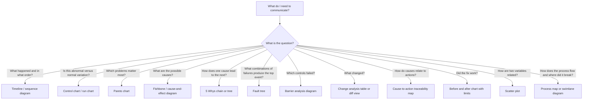
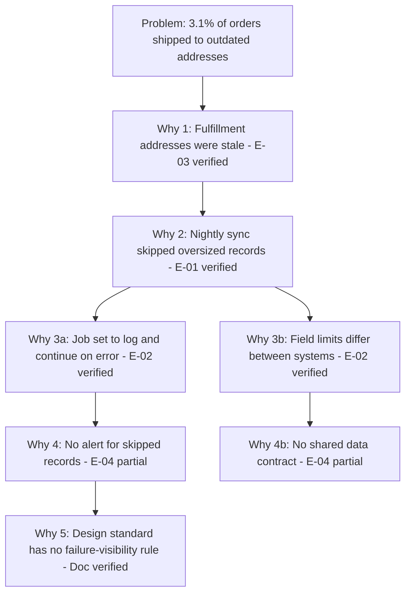
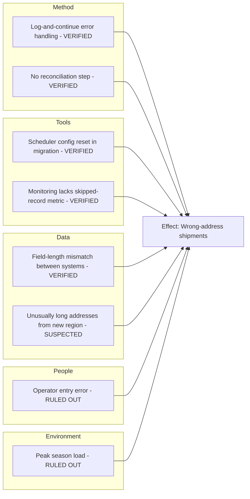
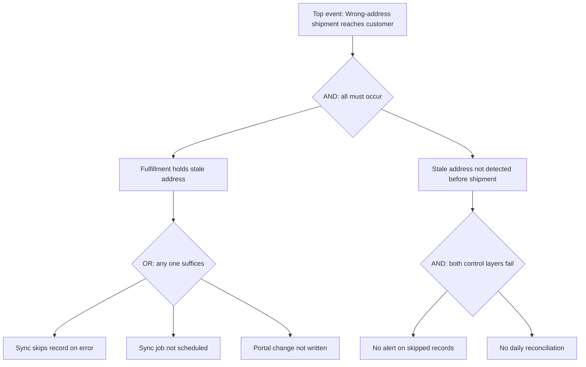
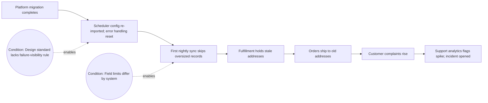
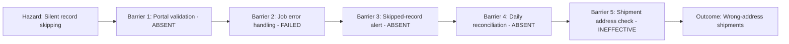
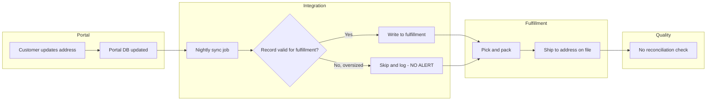
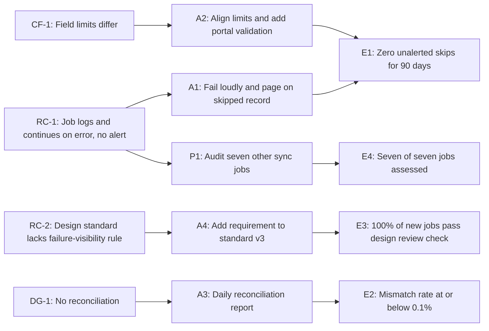
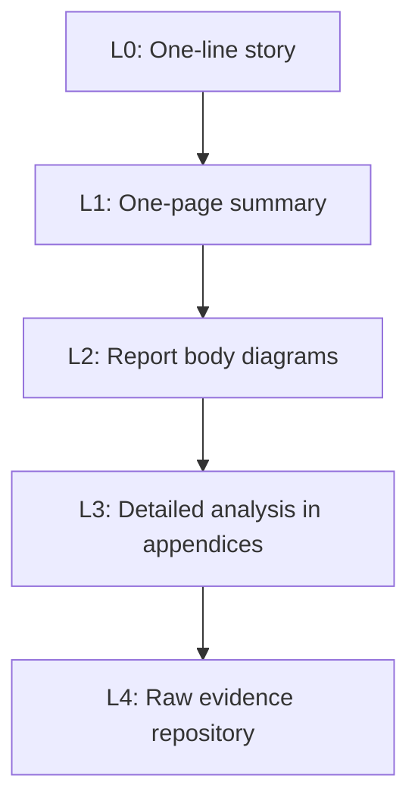

## Visual Communication of Causal Findings


### Overview

A Root Cause Analysis (RCA) is only as useful as its ability to be understood, challenged, and acted upon. Causal reasoning is inherently **relational**: events lead to conditions, conditions combine with failed controls, and outcomes emerge from many interacting factors. Prose handles chains poorly once they branch, converge, or span multiple time scales. Visual communication (diagrams, charts, tables, and structured layouts) makes the **structure of the causal argument visible**, so readers can inspect it, find gaps, and follow the logic from evidence to root cause to action.

Visuals serve several distinct functions in RCA work:

| Function | What the Visual Does | Typical Tool |
| --- | --- | --- |
| **Exploration** | Helps the team generate and organize hypotheses | Fishbone, affinity diagram, brainstorm map |
| **Reasoning** | Exposes the logical structure of the causal chain | 5 Whys tree, fault tree, causal factor chart |
| **Evidence** | Shows what the data actually say | Control chart, Pareto chart, timeline, scatter plot |
| **Persuasion and alignment** | Builds shared understanding among stakeholders | Executive summary graphic, annotated timeline |
| **Traceability** | Connects causes to actions and verification | Cause-to-action map, action tracker |
| **Verification** | Shows whether the fix worked | Before/after control chart, trend chart |
| **Learning** | Makes findings memorable and reusable | One-page summaries, pattern libraries |

**Key Points**

- A visual is an **argument**, not decoration. Every element should support a claim the reader must understand.
- Choose the visual based on the **question being answered** and the **audience**, not on familiarity or aesthetics.
- Visuals must remain **faithful to the evidence**: distinguish verified facts from hypotheses, and never imply certainty the analysis does not have.
- Causal diagrams show **association in structure**, but structure alone does not prove causation. Pair diagrams with evidence and verification.
- Accessibility, clarity, and consistency matter as much as content: a diagram nobody can read has no communicative value.

---

### Principles of Effective Causal Visualization

#### 1. Start with the Question and the Audience

| Audience | Typical Need | Appropriate Visual Depth |
| --- | --- | --- |
| **Executives / sponsors** | What happened, how bad, why, what are we doing, what do you need from me? | One-page summary; a simplified causal chain; a trend chart |
| **Investigation team** | Test and refine hypotheses | Detailed fishbone, fault tree, evidence-annotated 5 Whys |
| **Action owners** | What exactly must I change and why? | Cause-to-action map; process diagram with the change highlighted |
| **Auditors / regulators** | Is the analysis rigorous and traceable? | Evidence-linked causal chain; complete timeline; action-effectiveness charts |
| **Front-line staff** | What went wrong and what changes for me? | Simple process visual; before/after; plain-language chain |
| **Customers** | Do you understand the problem and will it be fixed? | Concise cause and corrective action summary; verification evidence |

#### 2. Show Structure, Evidence, and Confidence

A causal visual should let the reader distinguish:

| Element | Visual Encoding Options |
| --- | --- |
| **Verified cause** | Solid outline, filled node, evidence ID tag |
| **Hypothesis / unverified** | Dashed outline, hollow node, label such as "Unverified" |
| **Rejected hypothesis** | Struck through or grayed, with brief reason |
| **Contributing factor** | Distinct shape or color from the root cause |
| **Detection gap / failed barrier** | Marked barrier symbol or labeled box |
| **Direction of causation** | Arrows pointing from cause to effect, consistently |
| **Evidence linkage** | Evidence IDs (for example, [E-03]) on nodes or edges |

#### 3. Reduce Cognitive Load

- **One message per visual.** If a diagram tries to say three things, split it.
- **Limit elements.** A causal diagram with more than roughly 15 to 20 nodes usually needs to be decomposed into a summary and detail views.
- **Consistent direction.** Left-to-right or top-to-bottom, always in the same direction across the report.
- **Plain labels.** Use short, specific, noun-verb phrases: "Job skips oversized records," not "Anomalous behavior."
- **Remove chart junk.** Eliminate decorative gridlines, 3D effects, and redundant legends.

#### 4. Be Honest About Uncertainty

Visuals can create false authority. A clean, confident diagram may hide weak evidence. Counter this by:

- Marking confidence levels visibly
- Showing alternative hypotheses that were tested and excluded
- Labeling inference as **[Inference]** where reasoning outruns evidence
- Including sample size, time window, and data limitations on charts

#### 5. Design for Accessibility and Portability

| Consideration | Guidance |
| --- | --- |
| **Color independence** | Do not encode meaning by color alone; add shape, pattern, or text labels |
| **Contrast** | Ensure text is legible against backgrounds |
| **Text size** | Keep labels readable at the size they will be viewed or printed |
| **Alt text** | Provide a text description of each diagram's key message |
| **Text-first fallback** | Provide the causal chain as a numbered list or table as well, for screen readers and low-fidelity contexts |
| **Format** | Prefer text-based, version-controllable formats (Mermaid, SVG, plain tables) so diagrams can be diffed, reviewed, and regenerated |

---

### Matching Visuals to Questions



| Question | Best-Suited Visual | Notes |
| --- | --- | --- |
| What happened, in what order? | **Timeline** | Include detection and response milestones |
| Is the event a real signal? | **Control chart** | Shows special-cause vs. common-cause variation |
| Where should we focus? | **Pareto chart** | Reveals the vital few categories |
| What could have caused it? | **Fishbone (Ishikawa)** | Exploration; not proof |
| Why did it happen, step by step? | **5 Whys chain / tree** | Attach evidence to each level |
| How do failures combine? | **Fault tree** | Logic gates (AND/OR) show combinations |
| Why did safeguards not stop it? | **Barrier analysis** | Shows which layers failed or were absent |
| What changed before the event? | **Change analysis table** | Compare "before" (working) and "after" (failed) |
| How does the process really flow? | **Process map / swimlane** | Reveals handoffs and gaps |
| How do causes map to actions? | **Traceability map** | Prevents orphan actions and unaddressed causes |
| Did the action work? | **Before/after control chart** | Include baseline, limits, and implementation date |
| Are two factors related? | **Scatter plot** | Correlation is not causation; note this |

---

### Core Causal Visuals in Detail

#### 1. The 5 Whys Chain

The simplest causal visual is a linear chain. Its strengths are clarity and speed; its weaknesses are oversimplification and hidden branching.

**Good practice:**

- Present each "why" as a **node with an evidence tag**.
- Show **verified vs. unverified** status.
- Use a **tree** (not a single line) when a "why" has multiple valid answers.
- End the chain at an **actionable, system-level cause**, not a person.



**Presentation tips**

| Tip | Reason |
| --- | --- |
| Number the levels | Readers can refer to "Why 3" in discussion |
| Add a verification column when tabulating | Distinguishes evidence from assumption |
| Show branches | Real causes are often multiple |
| Stop the visual at the root cause and add a separate action panel | Keeps analysis and response distinct |

**Tabular equivalent** (useful as a companion or accessibility fallback):

| Level | Question | Answer | Evidence | Status |
| --- | --- | --- | --- | --- |
| Problem | What went wrong? | 3.1% wrong-address shipments | E-03 | Verified |
| Why 1 | Why? | Fulfillment addresses stale | E-03 | Verified |
| Why 2 | Why? | Sync skipped records | E-01 | Verified |
| Why 3 | Why? | Log-and-continue; field limit mismatch | E-02 | Verified |
| Why 4 | Why? | No alert; no shared data contract | E-04 | Partial |
| Why 5 | Why? | Design standard omits failure visibility | Standard v2 | Verified |

#### 2. Fishbone (Ishikawa) Diagram

The fishbone organizes **potential** causes into categories around a problem "head." It is primarily an **exploration and brainstorming** tool. It shows breadth, not proof.

Common category frameworks:

| Framework | Categories |
| --- | --- |
| **6Ms (manufacturing)** | Machine, Method, Material, Man (People), Measurement, Mother Nature (Environment) |
| **8Ps (service)** | Product, Price, Place, Promotion, People, Process, Physical evidence, Productivity |
| **Software/IT adaptation** | People, Process, Tools, Code, Data, Infrastructure, Environment, Dependencies |

**Guidance for communicating with a fishbone:**

- Mark causes as **verified**, **suspected**, or **ruled out** so the diagram does not read as a list of established causes.
- Keep each cause statement specific and testable.
- Use the fishbone to show the **breadth of search** (auditors like to see that alternatives were considered), then hand off to a chain, tree, or fault tree to show the **verified path**.
- Avoid overcrowding; for large analyses, produce a summary fishbone and detailed sub-diagrams.

Text-based rendering example (portable and diff-friendly):



#### 3. Fault Tree

A fault tree starts with an undesired **top event** and decomposes it using **logic gates** into the combinations of lower-level events that could produce it. It excels at showing **how multiple failures must combine** and at identifying **single points of failure**.

Key symbols (conceptually):

| Element | Meaning |
| --- | --- |
| **Top event** | The undesired outcome |
| **OR gate** | Any one input event is sufficient to cause the output |
| **AND gate** | All input events must occur to cause the output |
| **Basic event** | Lowest-level cause, not developed further |
| **Intermediate event** | Result of gate logic, further decomposed |



When failure probabilities are available and events are independent, the gates can be quantified:

$$P_{\text{AND}} = \prod_{i} P_i, \qquad P_{\text{OR}} = 1 - \prod_{i}\left(1 - P_i\right)$$

**Example**

If $P(\text{no alert}) = 0.9$ and $P(\text{no reconciliation}) = 0.8$ and they are independent, the detection layer fails with probability $0.9 \times 0.8 = 0.72$. Adding a third independent control that fails with probability $0.1$ would reduce this to $0.072$.

[Inference: Independence is often an optimistic assumption in real systems; common-cause failures (for example, one outage disabling several controls) can make actual probabilities higher than the product suggests.]

**Communication tips**

- Use fault trees to show **why multiple layers had to fail** and where redundancy is missing.
- Highlight **single-point failures** (an OR path with no barrier) since they are high-priority fix candidates.
- For non-technical audiences, present a simplified tree focused on the top-level structure.

#### 4. Causal Factor Chart / Event and Causal Factor Diagram

This chart sequences **events** (what happened) with **conditions** (states that enabled or affected them), arranged chronologically with causal arrows. It bridges the timeline and the causal analysis.

| Element | Convention |
| --- | --- |
| **Event** | Rectangle: an action or occurrence (verb phrase) |
| **Condition** | Oval: a state or circumstance (noun phrase) |
| **Primary sequence** | Horizontal line of events leading to the outcome |
| **Secondary sequences** | Branches feeding the primary sequence |
| **Presumptive items** | Dashed outline: inferred but not yet verified |



This form is especially effective for **incident narratives**, because it shows both the sequence and the latent conditions that made each step possible.

#### 5. Timeline Visuals

Timelines communicate sequence, duration, and response performance. Key enhancements make them analytical rather than merely descriptive:

| Enhancement | Purpose |
| --- | --- |
| **Onset, detection, containment, resolution markers** | Show TTD, TTC, and TTR at a glance |
| **Swimlanes by actor or system** | Reveal handoffs and communication gaps |
| **Decision points annotated with available information** | Support blame-free analysis of why decisions made sense |
| **Missed and missing signals flagged** | Highlight detection failures |
| **Change events overlaid** | Correlate deployments, migrations, and shifts with the onset |
| **Metric overlay** (for example, error rate) | Connect narrative to data |

Text timeline example:

| Time (UTC) | Lane | Event | Marker |
| --- | --- | --- | --- |
| 07-28 02:00 | Platform | Migration completes | **Change** |
| 08-01 03:00 | Sync job | First run skips oversized records | **Onset** |
| 08-07 09:30 | Support | First complaint (not linked) | Missed signal |
| 08-14 10:15 | Analytics | Spike flagged | **Detection** |
| 08-15 09:00 | Ops | Manual comparison begins | **Containment** |

Response intervals can be stated directly on the visual:

$$\text{TTD} = t_{\text{detect}} - t_{\text{onset}}, \qquad \text{TTC} = t_{\text{contain}} - t_{\text{detect}}$$

#### 6. Barrier (Defense-in-Depth) Diagram

Barrier analysis asks: **what controls should have prevented or detected this, and why did they not?** The visual shows layers of defense and the status of each.

| Barrier | Intended Function | Status | Reason |
| --- | --- | --- | --- |
| Input validation at portal | Prevent oversized payloads | **Absent** | Never implemented |
| Sync job error handling | Stop or alert on record failure | **Failed** | Configured to log-and-continue |
| Skipped-record alert | Detect silent failure | **Absent** | Not in design standard |
| Daily reconciliation | Detect mismatch before shipping | **Absent** | Not required |
| Shipping address verification | Last-line check | **Ineffective** | Verifies format, not currency |



The visual conveys at a glance that **all five layers** were absent or ineffective, and it suggests where to add strong barriers.

#### 7. Change Analysis Visual

Compare the **last known good state** with the **failed state** and list differences.

| Factor | Before (Working) | After (Failing) | Difference | Potential Effect |
| --- | --- | --- | --- | --- |
| Scheduler | Legacy scheduler with explicit job list | New platform scheduler | Platform change | Job settings re-imported |
| Error handling | Fail on error | Log and continue | Config default changed | Silent skipping |
| Field limit (fulfillment) | 255 characters | 255 characters | None | Not causal |
| Address source | Existing regions | Includes new region with long addresses | New data | More oversized records |
| Monitoring | Job failure alert | Job failure alert (skips not counted) | Metric gap | No alert |

The visual narrows the search to **differences**, making it easier to spot the most plausible causal changes.

#### 8. Process Map and Swimlane Diagrams

Process maps show **how work actually flows**, including handoffs, decisions, and controls. Overlaying the failure point turns the map into a causal visual.

Useful annotations:

- Mark where the **failure occurred** and where it **should have been caught**
- Distinguish **as designed** from **as operated**
- Show **manual steps, delays, and rework loops**
- Indicate **controls** (checks, alerts, approvals) and their status



#### 9. Statistical Visuals: Control Charts, Pareto, Scatter, and Run Charts

Data visuals ground the causal story in evidence.

| Chart | Role in Causal Communication | Cautions |
| --- | --- | --- |
| **Control chart** | Shows the event as a special-cause signal; shows whether the fix shifted the process | State baseline period and limits; do not overreact to points inside limits |
| **Run chart** | Simple time-ordered view when limits cannot yet be computed | Less rigorous than a control chart |
| **Pareto chart** | Focuses attention on the vital few categories | Categories should be defined consistently; frequency is not always severity |
| **Scatter plot** | Explores relationships between factors | Correlation is not causation; note confounding |
| **Histogram** | Shows distribution shape, spread, and specification fit | Use enough data; mind bin choices |
| **Stratified charts** | Split data by machine, shift, site, or version to localize the cause | Ensure strata are meaningful and adequately sized |
| **Before/after chart** | Demonstrates effectiveness of an action | Mark implementation date; show baseline and post-action limits |

**Control chart annotation guidance**

- Mark **implementation dates**, **concurrent changes**, and **known events** directly on the chart.
- Use the **center line and control limits** from a defined baseline; state the baseline period.
- Show **exposure** (sample sizes or volumes) so the reader can judge evidence strength.

For an individuals chart, the limits communicated to readers derive from:

$$\text{UCL}_X = \bar{x} + 2.66\,\overline{MR}, \qquad \text{LCL}_X = \bar{x} - 2.66\,\overline{MR}$$

For a Pareto chart, communicate both the individual and cumulative share:

$$\text{Cumulative share}_k = \frac{\sum_{i=1}^{k} n_i}{\sum_{i=1}^{m} n_i} \times 100\%$$

**Example**

| Category | Count | Share | Cumulative |
| --- | --- | --- | --- |
| Silent sync skip | 62 | 62% | 62% |
| Portal not saving change | 15 | 15% | 77% |
| Carrier handling | 12 | 12% | 89% |
| Customer typo | 8 | 8% | 97% |
| Other | 3 | 3% | 100% |

The first category accounts for 62% of cases, directing the analysis toward the sync mechanism.

#### 10. Cause-to-Action Traceability Map

A visual that links **root causes**, **actions**, and **effectiveness criteria** shows the reader that the response is complete and coherent, and exposes orphan actions or unaddressed causes.



This is one of the most valuable visuals for governance, because it demonstrates **traceability** from analysis through action to verification.

---

### Choosing Between Detail Levels: The Layered Communication Approach

Rather than one overloaded diagram, use **layers** of increasing detail, each self-contained.

| Layer | Content | Audience | Format |
| --- | --- | --- | --- |
| **L0: One-line story** | "Silent skipping of oversized records caused 3.1% wrong-address shipments; fixed by loud failure, validation, and reconciliation" | Everyone | Sentence and headline number |
| **L1: One-page summary** | Problem, impact chart, simplified causal chain, key actions, status | Executives, sponsors | Single page |
| **L2: Main-body diagrams** | Timeline, 5 Whys with evidence, barrier diagram, cause-to-action map | Team, managers, reviewers | Report body |
| **L3: Detailed analysis** | Full fault tree, complete fishbone, detailed process maps, statistical charts | Investigators, auditors | Appendices |
| **L4: Raw evidence** | Logs, data, photographs | Auditors, deep-dive analysts | Evidence repository |



Each layer should **link to the next** (by section reference or evidence ID) so a reader can drill down without losing context.

---

### The One-Page Causal Summary (A3-Style)

A widely used format condenses the RCA story onto one page. The structure below follows the common lean-practice pattern. Sections can be adapted.

| Panel | Content | Visual Element |
| --- | --- | --- |
| **Title and metadata** | Problem title, ID, owner, date | Header |
| **Background / problem** | What, where, when, how much | Baseline vs. event chart |
| **Current condition** | Process map with failure point | Annotated process map |
| **Analysis** | Verified causal chain | 5 Whys tree with evidence tags |
| **Root causes** | RC statements, contributing factors | Highlighted nodes |
| **Countermeasures** | Containment, corrective, and preventive actions | Cause-to-action map or table |
| **Plan** | Owners, dates, milestones | Simple Gantt or table |
| **Verification** | Effectiveness criteria and results | Before/after chart |
| **Follow-up** | Lessons and horizontal deployment | Short list |

**Key Points**

- The constraint of one page forces **prioritization**; only the most important evidence and logic survive.
- Use the one-pager as the **primary communication artifact** and keep the full report as the supporting record.

---

### Visual Design Guidelines

#### Diagram Conventions

| Convention | Guidance |
| --- | --- |
| **Direction** | Cause on the left or top; effect on the right or bottom (state the convention in a legend if it may be unclear) |
| **Arrows** | Always mean "causes" or "leads to"; do not reuse them for other relationships without a legend |
| **Node text** | Short, specific, and testable; avoid vague words |
| **Shape vocabulary** | Consistent across diagrams: events, conditions, barriers, and actions each get a distinct shape |
| **Status encoding** | Verified, suspected, rejected, and absent/failed states shown with both pattern and text label |
| **Legend** | Include if any symbol or style is non-obvious |
| **Evidence tags** | Short IDs on nodes and edges |
| **Titles** | Each diagram has a title stating its message ("Five layers of defense were absent or ineffective") |
| **Layout** | Minimize crossing lines; align related items; group by lane or category |
| **Scale** | Keep diagrams readable at the size they will be viewed |

#### Chart Conventions

| Convention | Guidance |
| --- | --- |
| **Axes** | Label with units; start bar charts at zero; avoid truncated axes that exaggerate effects |
| **Time order** | Always plot process data in time order |
| **Baseline and limits** | Show center line, control limits, and specification limits separately and labeled |
| **Annotations** | Mark implementation dates, concurrent changes, and known events |
| **Sample size** | State n or exposure |
| **Uncertainty** | Show intervals where sample sizes are small |
| **Comparisons** | Use the same scales when comparing before and after |
| **Color** | Use sparingly; ensure meaning survives grayscale printing |
| **Data-ink ratio** | Remove non-informative ink |

#### Common Misleading Practices to Avoid

| Practice | Problem |
| --- | --- |
| Truncated or dual axes that exaggerate change | Distorts magnitude |
| Cherry-picked time windows | Hides context and variation |
| Plotting single points as trends | Overinterprets noise |
| Implied causation from correlation in scatter plots | Confounding ignored |
| 3D or decorative charts | Impede accurate reading |
| Showing only successes after implementation | Selection bias |
| Omitting baseline variability | Prevents judgment of significance |
| Diagrams presenting hypotheses with the same visual weight as verified causes | Overstates certainty |
| Overly long causal chains with weak links hidden | False rigor |

---

### Representing Uncertainty and Evidence Strength

Causal claims vary in strength. Good visuals make that variation visible.

| Evidence Level | Meaning | Suggested Encoding |
| --- | --- | --- |
| **Verified (direct)** | Confirmed by reproduction, log correlation, or controlled test | Solid node; label "Verified" with evidence IDs |
| **Corroborated** | Supported by multiple independent sources | Solid node; "Corroborated" |
| **Plausible / inferred** | Consistent with evidence but not directly confirmed | Dashed node; "[Inference]" |
| **Unverified hypothesis** | Candidate cause not yet tested | Hollow or dotted node; "Unverified" |
| **Rejected** | Tested and excluded | Grayed or struck through with reason |
| **Unknown** | Evidence unavailable | Question mark node; describe what would resolve it |

A simple **confidence tag** on the root cause statement (High / Medium / Low with rationale) should accompany the diagram.

**Example legend** (text form):

- Solid box: verified with direct evidence [E-xx]
- Dashed box: inferred; verification pending
- Grayed, struck-through box: hypothesis tested and rejected
- Thick border: root cause
- Double border: barrier (failed or absent)

---

### Visual Communication for Different Reporting Contexts

| Context | Recommended Visuals | Notes |
| --- | --- | --- |
| **Executive briefing** | One-page summary; headline chart; simplified causal chain; action and status table | Lead with impact and decision needed |
| **Incident postmortem (software)** | Timeline with swimlanes; service dependency diagram; metric graphs; contributing-factor map | Emphasize blameless framing and detection/response metrics |
| **Customer 8D report** | Problem description photo or chart; containment status; fishbone; 5 Whys; corrective action table; verification chart | Follow customer template |
| **Regulatory submission** | Evidence-linked causal chain; complete timeline; CAPA traceability; effectiveness data | Emphasize rigor and traceability |
| **Frontline briefing / toolbox talk** | Simple annotated process picture; before/after; one key message | Plain language; minimal text |
| **Knowledge base / lessons learned** | Reusable pattern diagrams; general principle statements; tags | Searchable and generalizable |
| **Audit evidence** | Full analysis artifacts; evidence register; traceability map | Completeness over polish |

---

### Producing Diagrams as Code

Text-based diagram formats (Mermaid, Graphviz DOT, PlantUML, and hand-authored SVG) offer specific advantages for RCA documentation:

| Advantage | Explanation |
| --- | --- |
| **Version control** | Diagrams can be diffed, reviewed, and tracked alongside the report |
| **Consistency** | Shared styles and templates enforce conventions |
| **Editability** | Anyone with a text editor can revise without proprietary tools |
| **Reproducibility** | Diagrams can be regenerated from source or data |
| **Portability** | Text fallbacks work in plain-text, wiki, and Markdown environments |
| **Automation** | Charts can be generated directly from monitoring or CAPA data |

Trade-offs include less precise layout control and steeper learning for complex layouts. For high-stakes or highly polished deliverables, teams often draft in code and finalize in a drawing tool. [Inference: The best approach depends on team skills, tooling, and audience expectations.]

---

### Implementation Sketch: Generating a Before/After Control Chart Annotation Summary

The following Python example computes control limits from a baseline and produces annotated summary information suitable for placing on a chart: baseline limits, implementation marker, and signals in the post-action period. It outputs a text summary and can be extended to draw the chart.

**Example**

```python
import numpy as np

baseline = np.array([0.4, 0.5, 0.3, 0.4, 0.6, 0.4, 0.5, 0.3, 0.4, 0.5,
                     0.4, 0.3, 0.5, 0.4, 0.4])  # % wrong-address per day (baseline)
incident = np.array([3.1, 2.9, 3.4, 3.0])        # event period (excluded from baseline)
post = np.array([0.5, 0.4, 0.3, 0.4, 0.6, 0.2, 0.3, 0.4, 0.3, 0.5, 0.4, 0.9])

def imr_limits(x):
    mr = np.abs(np.diff(x))
    x_bar = x.mean()
    mr_bar = mr.mean()
    return x_bar, x_bar + 2.66 * mr_bar, x_bar - 2.66 * mr_bar

cl, ucl, lcl = imr_limits(baseline)

print(f"Baseline center line: {cl:.3f}%")
print(f"Baseline control limits: LCL={max(lcl, 0):.3f}%, UCL={ucl:.3f}%")

def signals(series, ucl, lcl, label):
    out = []
    for i, v in enumerate(series, start=1):
        if v > ucl or v < lcl:
            out.append((label, i, v))
    return out

print("\nSpecial-cause points (Rule 1) during incident:")
for lab, idx, val in signals(incident, ucl, lcl, "incident"):
    print(f"  {lab} day {idx}: {val:.2f}%  (beyond UCL)")

print("\nPost-action points beyond baseline limits:")
post_signals = signals(post, ucl, lcl, "post")
print("  none" if not post_signals else post_signals)

# Simple run test: 8 consecutive post points on the favorable side of the baseline center
favorable_run = 0
max_run = 0
for v in post:
    if v < cl:
        favorable_run += 1
        max_run = max(max_run, favorable_run)
    else:
        favorable_run = 0
print(f"\nLongest run below baseline center line in post-action period: {max_run}")
```

**Output**

```text
Baseline center line: 0.420%
Baseline control limits: LCL=0.000%, UCL=1.137%

Special-cause points (Rule 1) during incident:
  incident day 1: 3.10%  (beyond UCL)
  incident day 2: 2.90%  (beyond UCL)
  incident day 3: 3.40%  (beyond UCL)
  incident day 4: 3.00%  (beyond UCL)

Post-action points beyond baseline limits:
  none

Longest run below baseline center line in post-action period: 3
```

The summary provides the numbers to place on the chart: baseline center line and limits, the four incident points flagged, no post-action signals, and a short favorable run that does not yet meet a formal run rule. [Inference: The exact printed values depend on the sample data and rounding; the baseline mean of 0.42% and moving-range constants yield limits of about 1.14% under these assumptions.] This outcome should be communicated honestly on the chart: the process appears to have returned to baseline, but the evidence of a sustained *improvement beyond* baseline is not yet established.

---

### Worked Example: Turning a Text-Heavy Finding into a Clear Visual Story

**Example**

**Original prose finding (hard to follow):**

> The problem seems to have started after the migration, when the scheduler was changed and some configuration was reset. The job started skipping certain records that were too long for the fulfillment system, and because nothing alerted anyone and there was no reconciliation between systems, wrong addresses were used for shipments until complaints came in and someone looked at the analytics dashboard.

**Step 1: Extract structure**

| Element | Content |
| --- | --- |
| Trigger event | Platform migration reset error-handling configuration |
| Mechanism | Job skipped oversized records silently |
| Enabling conditions | Field-limit mismatch; no alert; no reconciliation |
| Outcome | Wrong-address shipments |
| Detection | Customer complaints; analytics dashboard, 13 days later |

**Step 2: Choose visuals**

| Message | Visual |
| --- | --- |
| The event is real and abnormal | p chart with baseline and limits |
| It began after the migration | Timeline with change marker |
| How the failure propagated | Causal factor chart |
| Why nothing stopped it | Barrier diagram |
| What we are doing about it | Cause-to-action map |

**Step 3: Assemble the layered story**

1. **Headline (L0):** "A silent error in a nightly sync caused 3.1% of orders to ship to old addresses for 13 days."
2. **Impact chart (L1):** p chart showing the jump from a 0.4% baseline to 3.1%, with the migration date marked.
3. **Causal chain (L1/L2):** Simplified 5 Whys with evidence tags.
4. **Barrier view (L2):** Five layers of defense, all absent or ineffective.
5. **Action map (L2):** Root causes linked to actions and effectiveness criteria.
6. **Details (L3):** Fault tree, full timeline, and data in appendices.

**Output**

The revised communication lets an executive grasp the essence in 30 seconds, gives reviewers a traceable chain, and provides auditors with the full evidence trail, all from the same underlying analysis.

**Conclusion**

The transformation did not add information; it **restructured** existing information so the argument becomes visible. The most impactful single visual in this case is the barrier diagram, because it reveals the systemic nature of the failure (five missing or ineffective safeguards) far more effectively than a paragraph of text.

---

### Reviewing Visuals for Quality

| Review Question | Pass Criterion |
| --- | --- |
| Does each visual convey one clear message, stated in its title? | Yes |
| Is the visual appropriate for its audience and purpose? | Yes |
| Are verified facts distinguished from hypotheses and inferences? | Yes |
| Are evidence IDs or references attached to key claims? | Yes |
| Are arrow semantics, shapes, and colors consistent and explained where necessary? | Yes |
| Does the causal chain end at a system-level, actionable cause? | Yes |
| Are charts honest (axes, baselines, windows, sample sizes, uncertainty)? | Yes |
| Are implementation dates and concurrent changes marked on data charts? | Yes |
| Is there a text alternative or description for accessibility? | Yes |
| Does meaning survive grayscale or color-vision differences? | Yes |
| Could a person not involved in the event understand it? | Yes |
| Are all root causes connected to actions and all actions to causes? | Yes |
| Is the level of detail matched to the layer (summary vs. appendix)? | Yes |
| Was the visual peer-reviewed for accuracy and clarity? | Yes |

---

### Common Pitfalls and Remedies

| Pitfall | Consequence | Remedy |
| --- | --- | --- |
| Diagram as decoration | Adds clutter without insight | Ensure each visual answers a specific question |
| Overloaded diagram | Unreadable; message lost | Split into layers; summarize and detail views |
| Treating a fishbone as proof of cause | Suspected causes read as established | Mark verified, suspected, and rejected; follow with tested causal chain |
| Single linear 5 Whys hiding branches | Missed contributing causes | Use tree form; show alternatives |
| No evidence linkage | Unverifiable claims | Evidence IDs on nodes; evidence register |
| Uniform visual weight for hypotheses and verified causes | False confidence | Encode evidence strength |
| Chart without baseline or limits | Cannot separate signal from noise | Show baseline, limits, and sample sizes |
| Cherry-picked windows or truncated axes | Misleading impression | Use consistent, honest scales and full context |
| Correlation shown as causation | Wrong conclusions | State confounders; use verification tests |
| Inconsistent conventions across a report | Confusion | Style guide and legend; templates |
| Colors carrying all meaning | Inaccessible | Add shape, labels, and patterns |
| Executive audience given the investigator's full diagram | Message lost | Provide a one-page summary |
| Root cause chain ending at a person | Blame and shallow fix | Extend to system conditions; reframe as conditions and controls |
| Diagram not updated when the analysis changes | Report contradicts itself | Version control; regenerate from source |
| Visuals without text fallback | Inaccessible and unsearchable | Provide tables, alt text, and captions |
| Missing traceability to actions | Orphan actions or unaddressed causes | Cause-to-action map |

---

### Best Practices Checklist

- Begin with the **question** and the **audience**; choose the visual accordingly.
- Use a **layered approach**: one-line story, one-page summary, body diagrams, appendix detail, raw evidence.
- Pair **structural diagrams** (5 Whys, fault tree, barrier, causal factor) with **data visuals** (control charts, Pareto, before/after) so structure and evidence reinforce each other.
- **Tag evidence** on nodes and edges, and visibly encode **verified, inferred, and rejected** status.
- Use a **consistent visual vocabulary** with a legend, and keep arrow semantics uniform.
- Keep diagrams **focused and legible**, with one message per visual and a title that states it.
- Show **baselines, limits, sample sizes, implementation dates, and concurrent changes** on data charts.
- Avoid **misleading scales, windows, and implied causation**.
- Include a **cause-to-action traceability map** to demonstrate completeness.
- Design for **accessibility**, with text alternatives, non-color encodings, and readable contrast.
- Prefer **text-based diagram sources** for version control, review, and reuse.
- Have visuals **peer-reviewed** by someone outside the event for clarity and accuracy.
- Maintain a **shared template and style guide** so visuals are comparable across investigations.

---

**Related Topics**

- Standard structure of an RCA report
- Building evidence-based timelines and swimlane diagrams
- Fishbone, fault tree, and barrier analysis techniques in depth
- Control charts and statistical graphics for before/after verification
- Pareto analysis and stratification for focusing investigations
- A3 and one-page problem-solving formats
- Presenting RCA findings to executives, customers, and regulators
- Data visualization integrity and avoiding misleading charts
- Diagram-as-code tooling (Mermaid, Graphviz, PlantUML, SVG) for RCA documentation
- Accessible design for technical documentation