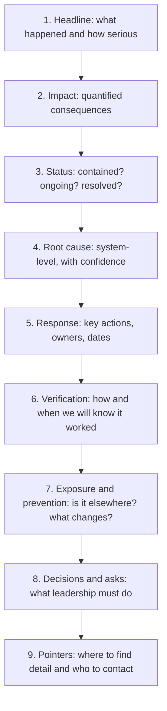
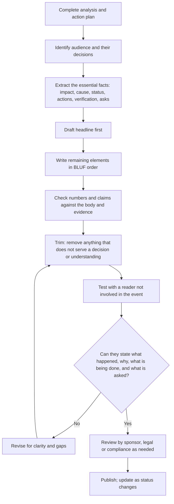

## Writing Executive Summaries for Leadership


### Overview

An executive summary is the part of a Root Cause Analysis (RCA) report that most leaders will actually read, and for many of them the only part. It is where an investigation either earns a decision, secures resources, and builds trust, or gets skimmed, misunderstood, and shelved. A rigorous analysis with a weak summary rarely changes what an organization does. A clear summary of a sound analysis directs attention, funding, and accountability to the things that prevent recurrence.

Leadership readers differ from investigators in what they need. Investigators need the full evidence chain. Leaders need to know, in a minute or two:

1. **What happened**, and how much it matters
2. **Why it happened**, in system terms rather than personal blame
3. **What is being done**, by whom, and by when
4. **Whether it will work**, and how anyone will know
5. **What is needed from them**, if anything

The executive summary must therefore **stand alone**: a reader who never opens the body of the report should still come away with an accurate, actionable understanding. At the same time, it must be **faithful**: it compresses the analysis without overstating certainty, hiding bad news, or smoothing over open questions.

**Key Points**

- The summary is a **decision-support document**, not a shortened diary of the investigation.
- Lead with **impact and conclusion** (the "bottom line up front"), then support it.
- State the **root cause at the system level**, in plain language, with an honest confidence level.
- Make **asks and decisions explicit**; leaders cannot act on what they must infer.
- Quantify wherever possible, and distinguish **verified facts** from **inferences**.
- Write it **last**, then test it on a reader who was not involved.
- Keep it **short** (typically one page), and let it point to the detail rather than reproduce it.

---

### The Leadership Reader: Understanding the Audience

Leaders read under time pressure, with many competing priorities, and often without technical depth in the specific domain. They also carry accountability for outcomes they did not personally observe. Effective summaries respect these conditions.

| Reader Trait | Implication for the Summary |
| --- | --- |
| **Limited time** | Front-load the conclusion; use short paragraphs and a scannable layout |
| **Non-specialist** | Define or avoid jargon; explain in terms of business or customer consequences |
| **Accountable for outcomes** | Be explicit about risk, exposure, and residual uncertainty |
| **Decision-oriented** | State what decision, resource, or unblocking is needed, and by when |
| **Portfolio thinking** | Show relative severity and how this fits with other risks |
| **Skeptical of spin** | Present bad news plainly; show evidence and confidence, not reassurance |
| **Externally exposed** | Anticipate questions from customers, regulators, boards, and media |
| **Forward-looking** | Emphasize prevention, verification, and what changes going forward |

#### Common Leadership Questions the Summary Must Answer

| Question | Where It Is Answered |
| --- | --- |
| How bad is it? | Impact statement (customers, safety, financial, regulatory, reputational) |
| Is it over? | Current status and containment |
| Could it happen again? | Root cause and preventive actions |
| Are we exposed elsewhere? | Extent-of-condition and horizontal deployment |
| Whose fault is it? | Reframed as system conditions and control gaps (blame-free) |
| What will it cost to fix? | Resource needs and trade-offs |
| When will it be fixed? | Milestones and dates |
| How will we know it worked? | Effectiveness criteria and review date |
| What do you need from me? | Decisions and asks |
| What do I say to customers or regulators? | Key messages and obligations |

**Key Points**

- If the summary cannot answer "how bad, is it over, could it recur, and what do you need," it is incomplete regardless of how polished it reads.
- Different leaders weigh these questions differently (finance, operations, legal, safety), so include the dimensions most likely to matter and quantify them.

---

### Core Principles

#### 1. Bottom Line Up Front (BLUF)

Put the most important information first. A leader who stops reading after two sentences should still know what happened, how serious it is, and whether it is under control.

| Weak Opening | Strong Opening |
| --- | --- |
| "On August 14, the support team noticed an increase in tickets and began looking into possible causes..." | "Between Aug 1 and Aug 14, 3.1% of orders (baseline 0.4%) shipped to outdated addresses, affecting about 1,400 customers. The cause is identified, the immediate risk is contained, and permanent fixes complete by Oct 23." |

#### 2. Stand Alone

Do not rely on the body for essential meaning. Avoid phrases like "as described in Section 4" for critical facts, and avoid undefined acronyms or internal system names.

#### 3. Quantify

Numbers make impact and progress concrete and comparable.

| Vague | Quantified |
| --- | --- |
| "A significant number of customers" | "About 1,400 orders (3.1% of volume vs. a 0.4% baseline)" |
| "Extended outage" | "40-minute outage affecting an estimated 18,000 users" |
| "Substantial cost" | "Estimated $212,000 in reshipment, refunds, and support effort" |
| "Soon" | "By Oct 23, with a 90-day effectiveness review ending Jan 21" |

#### 4. Distinguish Fact, Inference, and Uncertainty

Leaders make decisions on what they believe to be true. Be explicit about confidence.

| Statement Type | Wording Pattern |
| --- | --- |
| **Verified** | "Logs confirm that..." / "Testing reproduced the failure..." |
| **Supported** | "Evidence from two independent sources indicates..." |
| **Inferred** | "[Inference] The team believes... and will confirm by..." |
| **Unknown** | "We do not yet know whether... Resolution expected by..." |

#### 5. System-Level, Blame-Free Language

State causes as **conditions and control gaps**, not individual failings. This is both more accurate (most failures involve multiple system weaknesses) and more useful (it points to fixes that scale).

| Blame-Oriented | System-Oriented |
| --- | --- |
| "The engineer forgot to enable alerting" | "The design standard did not require failure alerting for batch jobs, so the job shipped without it" |
| "Operators ignored the checklist" | "The checklist step was not enforced by tooling and competed with line-rate targets" |
| "QA missed the defect" | "The test plan had no case for oversized records, and no downstream reconciliation existed to catch it" |

#### 6. Make Asks Explicit

If the report needs a decision, approval, funding, or an escalation to be resolved, say exactly what, from whom, and by when. Hidden asks are the most common reason summaries fail to produce action.

#### 7. Respect the Reader's Attention

Use short paragraphs, plain words, and a predictable layout. Every sentence should earn its place.

---

### Recommended Structure of an Executive Summary

A reliable structure maps to the questions leaders ask. It can be rendered as a compact block of prose, a labeled outline, or a one-page layout.



| Element | Purpose | Typical Length |
| --- | --- | --- |
| **Headline** | The one-sentence story | 1 to 2 sentences |
| **Impact** | Quantified consequences across relevant dimensions | 2 to 4 lines |
| **Status** | Where things stand right now | 1 to 2 lines |
| **Root cause** | Why it happened, in system terms, with confidence | 2 to 4 sentences |
| **Response** | Containment, corrective, and preventive actions | 3 to 6 bullets or a small table |
| **Verification** | Effectiveness criteria, monitoring window, review date | 1 to 3 lines |
| **Exposure and prevention** | Extent-of-condition and horizontal deployment | 1 to 3 lines |
| **Decisions and asks** | Explicit requests with owners and deadlines | 1 to 4 bullets |
| **References** | Report ID, owner, where to find more | 1 line |

[Inference: Total length of roughly 150 to 400 words, or one page, suits most organizations. Complex, high-severity events may justify up to two pages, but the first third of the page should still deliver the essentials.]

---

### Writing Each Element

#### 1. The Headline

The headline is a single sentence (or two) that conveys **what happened, how big, and the state of control**.

**Template:**

> Between [dates], [quantified deviation] occurred in [process/system], affecting [who/what]. The cause is [identified/under investigation], and [status of containment].

| Weak | Strong |
| --- | --- |
| "An RCA was performed on the recent order issue." | "From Aug 1 to 14, 3.1% of orders (vs. 0.4% baseline) shipped to outdated addresses. The cause is confirmed and contained; permanent fixes complete Oct 23." |
| "There was an outage due to database problems." | "On Sept 3, a database migration locked the orders table for 40 minutes, blocking checkout for about 18,000 users. Service is restored and the failure mode is now blocked in the deployment pipeline." |

#### 2. Impact

Cover the dimensions that matter to leaders, quantified where possible.

| Dimension | Example Phrasing |
| --- | --- |
| **Customers** | "About 1,400 orders affected; 212 complaints; 6 escalations to executives" |
| **Safety** | "No injuries. One near-miss with potential for moderate harm." |
| **Regulatory / compliance** | "No reportable event. Notification to the regulator is not required based on current assessment [confirm with Legal]." |
| **Financial** | "Direct cost estimated at $212,000; revenue impact under review" |
| **Operational** | "Support volume up 35% for two weeks" |
| **Reputational** | "Limited social media mentions; no press coverage to date" |
| **Data / security** | "No evidence of data exposure" (state basis and confidence) |

**Guidance:**

- Report **actuals and estimates separately**, and label estimates as such.
- If impact is still developing, say so and state when the next update is expected.
- Do not minimize or omit unfavorable impact; leaders and regulators lose trust quickly when impact is later revised upward.

Duration-weighted impact can help compare incidents:

$$\text{Customer-minutes impacted} = \sum_{i} \text{users}_i \times \text{minutes}_i$$

**Example**

An outage affecting 18,000 users for 40 minutes:

$$18{,}000 \times 40 = 720{,}000 \text{ customer-minutes}$$

#### 3. Status

State plainly where things stand:

| Status Type | Example |
| --- | --- |
| **Contained** | "Manual daily address comparison has prevented further wrong-address shipments since Aug 15." |
| **Resolved** | "Service fully restored at 14:52 UTC." |
| **Ongoing** | "Root cause is confirmed; permanent fix is in progress; interim controls are in place." |
| **Uncertain** | "Cause not yet confirmed; two hypotheses remain. Enhanced monitoring is active." |

Avoid status language that sounds reassuring without substance ("under control," "being addressed") unless followed by the specific controls in place.

#### 4. Root Cause

This is the most delicate paragraph. It must be **accurate, understandable, and system-level**.

**Template:**

> The root cause is [systemic condition], which allowed [failure mechanism], resulting in [effect]. Contributing factors were [X] and [Y]. Confidence in this conclusion is [high/medium/low], based on [verification method].

**Example**

> The root cause is that our integration design standard did not require batch jobs to alert on failed records. The nightly synchronization job was configured to log and continue on error, so oversized address records were silently skipped. Two factors contributed: mismatched field-length limits between systems and no reconciliation check before shipping. Confidence is high; the failure was reproduced and log evidence matches 98% of affected orders.

**Guidance:**

| Do | Avoid |
| --- | --- |
| Use plain language and business terms | Internal acronyms, code names, or unexplained technical detail |
| Name the **system condition** | Naming individuals or vague categories ("human error," "poor communication") |
| State confidence and basis | Overclaiming certainty or hedging everything |
| Include contributing factors briefly | Long causal chains; link to the body instead |
| Explain **why the safeguards did not catch it** | Stopping at the triggering event |

If the root cause is still uncertain, say so and describe what will resolve it:

> The leading hypothesis is [X] [Inference]. We will confirm or refute this by [test] by [date]. Until then, [interim controls] are in place.

#### 5. Response: Key Actions

Present the **most important actions**, grouped by type, with owners and dates. Do not reproduce the full action register.

| Type | Action | Owner | Date |
| --- | --- | --- | --- |
| **Containment** | Daily manual address comparison for open orders | Order Operations | In place since Aug 15 |
| **Corrective** | Make the sync job fail loudly and page on-call when records are skipped | Platform Engineering | Oct 9 |
| **Corrective** | Add portal input validation aligned to fulfillment limits | Portal Team | Oct 16 |
| **Corrective** | Add daily reconciliation report | Order Operations | Oct 23 |
| **Preventive** | Audit seven similar sync jobs for silent-skip behavior | Engineering | Nov 27 |

**Guidance:**

- Limit to the **top three to six** actions; refer to the report for the rest.
- Distinguish **temporary** (containment) from **permanent** (corrective and preventive) so leaders do not mistake a stopgap for a fix.
- Prefer **strong, system-level** actions and say so when relevant (for example, "automated block" rather than "reminder to staff").
- Show a **single named owner** per action.

#### 6. Verification and Effectiveness

Leaders want to know how success will be judged and when.

| Element | Example |
| --- | --- |
| **Criteria** | Wrong-address rate at or below 0.4% and stable; zero unalerted skipped records |
| **Baseline** | 3.1% during the event; 0.4% typical |
| **Window** | 90 consecutive days |
| **Reviewer** | Quality and Risk Lead (independent of implementation) |
| **Review date** | January 21 |

**Template:**

> Success will be measured by [outcome metric] over [window], reviewed independently on [date]. If criteria are not met, [reopen trigger/escalation].

This one element often distinguishes a mature RCA program from a weak one: it converts "we fixed it" into "here is how we will prove it."

#### 7. Exposure and Prevention

Show that the investigation looked beyond the single event.

> The same design gap could affect other scheduled jobs. Seven similar jobs will be audited by Nov 27; two have already been flagged for review. A new requirement for failure visibility will be added to the integration design standard by Nov 6.

If the assessment found **no** similar exposure elsewhere, say so; negative findings are reassuring evidence of thoroughness.

#### 8. Decisions and Asks

Be direct and specific.

| Weak | Strong |
| --- | --- |
| "Leadership support would be appreciated." | "Decision needed by Oct 1: approve $36,000 for automated interlock hardware; without it, manual inspection (about 30 labor hours per week) continues indefinitely." |
| "We may need additional resources." | "Request: reassign one platform engineer for three weeks to accelerate the pipeline check; otherwise delivery slips from Oct 9 to Nov 6." |

Frame asks with:

- **What** is needed
- **From whom**
- **By when**
- **Consequence** of not acting (cost, risk, delay)
- **Recommended option**, when choices exist

If no decision is required, say so explicitly ("No leadership decisions are required at this time"). This prevents leaders from wondering whether they missed something.

#### 9. References and Contacts

One line pointing to the full report ID, the report owner, and the sponsor, so readers can find detail and follow-up.

---

### A Complete Example

**Example**

> **Executive Summary: Wrong-Address Shipments (RCA-2026-0142)**
>
> **What happened.** Between Aug 1 and Aug 14, 3.1% of customer orders (baseline 0.4%) shipped to outdated addresses, affecting about 1,400 orders and generating 212 complaints. Estimated direct cost is $212,000 for reshipment, refunds, and support effort.
>
> **Status.** The immediate risk is contained. A daily manual address comparison has prevented further wrong-address shipments since Aug 15. Affected customers have been contacted and reshipped.
>
> **Why it happened.** Our integration design standard did not require batch jobs to alert on failed records. The nightly synchronization job was set to log and continue on error, so oversized address records were silently skipped. Contributing factors were mismatched field-length limits between the customer portal and the fulfillment system, and no reconciliation check before shipping. Confidence is high: the failure was reproduced, and log evidence matches 98% of affected orders. The problem went undetected for 13 days because no safeguard was designed to notice silent skipping.
>
> **What we are doing.**
>
> - Make the job fail loudly and page on-call when any record is skipped (Platform Engineering, Oct 9)
> - Align field limits and add portal validation (Portal Team, Oct 16)
> - Add a daily reconciliation report reviewed each morning (Order Operations, Oct 23)
> - Add a failure-visibility requirement to the integration design standard (Architecture, Nov 6)
> - Audit seven similar sync jobs for the same gap (Engineering, Nov 27)
>
> **How we will know it worked.** Success means a wrong-address rate at or below 0.4%, stable on the control chart, with zero unalerted skipped records over 90 days. An independent review is scheduled for Jan 21. The manual comparison will be retired only after these criteria are met.
>
> **Decisions needed.** None at this time. Two similar jobs flagged in the preliminary audit may require additional engineering time; we will confirm by Oct 15 whether a resourcing request is needed.
>
> **Details.** Full report: RCA-2026-0142. Owner: A. Nguyen. Sponsor: D. Alvarez.

**Conclusion**

This summary runs about 280 words. It opens with the impact, states status, gives a system-level cause with confidence, lists actions with owners and dates, defines success and verification, and explicitly says no decision is needed. A leader who reads only the first two paragraphs still knows what happened, how big it was, and that it is contained.

---

### Before-and-After Rewrites

| # | Weak Version | Stronger Version | What Changed |
| --- | --- | --- | --- |
| 1 | "A deep-dive RCA was completed with the cross-functional team and multiple stakeholders. Several contributing factors were identified across people, process, and technology." | "The failure occurred because our deployment pipeline had no check for database migrations that lock tables. Two other gaps let it reach production: the review template omitted lock analysis, and no runbook existed for rollback." | Replaces process description with findings; specific and system-level |
| 2 | "Human error was determined to be the root cause. The operator did not follow the procedure." | "The calibration step was skipped because it takes 12 minutes and conflicts with line-rate targets, and no interlock enforces it. We are redesigning the fixture and adjusting rate accounting so following the procedure is the easy path." | Moves from blame to system conditions and fix |
| 3 | "We expect the issue to be resolved soon and will continue to monitor." | "Permanent fixes complete by Oct 23. Success is a defect rate at or below 0.4% for 90 days, reviewed independently on Jan 21." | Replaces vague reassurance with dates and criteria |
| 4 | "Leadership support is requested for a number of items." | "We need one decision by Oct 1: approve $36,000 for the interlock. Without it, manual inspection continues at about 30 labor hours per week." | Explicit ask, deadline, and consequence |
| 5 | "Impact was minimal." | "No customer harm was identified. 14 orders were delayed by an average of 1.2 days; no revenue loss is expected. We have not yet confirmed whether one enterprise account was affected; result due Friday." | Quantified, honest, and states what is unknown |
| 6 | "The system experienced anomalous behavior." | "The job silently skipped records it could not process." | Plain language |

---

### Handling Difficult Situations

#### Bad News

| Situation | Guidance |
| --- | --- |
| **Severe impact** | State it first and plainly; do not bury it in the middle |
| **Cause involves leadership decisions or priorities** | Describe the decision context factually (for example, "the design review process did not require...") without accusation; leaders respect candor and are better positioned to fix systemic causes |
| **Impact larger than first reported** | Say so, explain what changed, and state the current confidence in the numbers |
| **Prior warnings were missed** | Include as a finding about signal handling and prioritization, not as blame |
| **Recurrence of an earlier incident** | State it directly, link to the prior case, and explain why the earlier fix was insufficient |

#### Uncertainty

| Situation | Guidance |
| --- | --- |
| **Root cause not yet confirmed** | Present the leading hypothesis labeled as such, the test that will confirm it, the date, and the interim controls |
| **Impact still developing** | Give current best estimate, a range if useful, and the next update time |
| **Competing explanations** | Summarize the leading options briefly and say which evidence would decide |
| **Data gaps** | Name them and explain how they affect confidence |

**Example**

> We do not yet know whether the second failure mode contributed. Two hypotheses remain [Inference]. A controlled test on Oct 5 will distinguish them. Until then, enhanced monitoring and manual verification stay in place.

#### Legal, Regulatory, and Sensitive Content

| Concern | Guidance |
| --- | --- |
| **Legal exposure** | Coordinate wording with Legal and Compliance; do not speculate on liability |
| **Regulatory notification** | State whether notification is required, who decided, and the basis; do not guess |
| **Personal data** | Avoid names or identifying details unless essential; follow privacy and confidentiality rules |
| **Privileged or restricted content** | Mark and distribute appropriately; consider a separate restricted appendix |
| **External statements** | Provide leadership with approved key messages and clearly separate them from internal analysis |

[Inference: Handling requirements vary by jurisdiction, industry, and contract. Follow your organization's legal and compliance procedures.]

---

### Tailoring the Summary to Context

| Context | Emphasis | Format Notes |
| --- | --- | --- |
| **Software / IT incident** | Customer impact, duration, detection and response times, contributing factors, follow-up actions | Include TTD, TTC, and recovery time; reference service-level objectives or error budget if relevant |
| **Manufacturing / quality** | Customer or safety impact, containment (sorted stock, shipments), root cause, corrective actions, verification (for example, capability) | Customer-specific timelines and formats may apply |
| **Healthcare / regulated** | Patient impact, reporting obligations, systemic causes, action strength, monitoring | Follow regulatory and accreditation expectations |
| **Safety / process industry** | Hazard, consequence, barriers that failed, management-system causes, recommendations | Emphasize risk reduction and residual risk |
| **Repeat problem / chronic issue** | History, cost of continued recurrence, why prior fixes failed, what is different now | Highlight escalation and resourcing needs |
| **Board-level briefing** | Enterprise risk, control environment, oversight, assurance | Even shorter; risk framing and assurance over technical detail |
| **Customer-facing summary** | Understanding of the problem, corrective actions, assurance of prevention | Remove internal-only detail; keep honest and specific |

Different **timing stages** call for different content:

| Stage | Summary Focus |
| --- | --- |
| **Initial notification** | What is known, impact so far, containment, next update time; avoid premature root cause claims |
| **Interim update** | Confirmed findings, preliminary causes (labeled), actions underway, revised impact |
| **Final report** | Verified root cause, complete action plan, verification plan |
| **Effectiveness update** | Results against criteria, closure decision, lessons and horizontal deployment |

---

### Layout and Formatting for Scannability

Leaders often scan. Use structure that supports it.

| Technique | Benefit |
| --- | --- |
| **Bold lead-ins** ("What happened," "Why," "Decisions needed") | Fast navigation |
| **Short paragraphs** (two to four sentences) | Reduces density |
| **A small table** for actions, owners, and dates | Compact and comparable |
| **A single headline chart** (impact vs. baseline, or before/after) | Conveys magnitude at a glance |
| **Consistent order** across all summaries | Readers learn where to look |
| **White space** | Improves readability |
| **Plain, active voice** | Clarity and accountability |
| **Highlighted decision box** | Ensures asks are not missed |

#### The One Chart Rule

If including a chart, choose the one that best supports the headline, typically a time-ordered chart with a baseline and the event marked.

$$\text{Relative increase} = \frac{p_{\text{event}} - p_{\text{baseline}}}{p_{\text{baseline}}} \times 100\%$$

**Example**

Event rate 3.1% vs. baseline 0.4%:

$$\frac{3.1 - 0.4}{0.4} \times 100\% = 675\%$$

A headline of "roughly 7.75 times the normal rate" often communicates more intuitively than the percentage. Choose the framing your audience finds clearest, and state the baseline.

Guidance for the chart: label axes and units, mark the event and implementation dates, show the baseline, keep it uncluttered, and ensure it is readable in grayscale.

---

### Language and Tone

| Principle | Guidance |
| --- | --- |
| **Plain language** | Prefer common words; define necessary technical terms once |
| **Active voice** | "The job skipped records" rather than "Records were skipped" (unless the actor is truly unknown) |
| **Precision over adjectives** | Replace "significant," "major," and "minor" with numbers |
| **Confident but calibrated** | Assert what is known; label what is inferred |
| **Blame-free** | Describe conditions and controls; avoid naming individuals as causes |
| **Neutral and factual** | Avoid drama, defensiveness, or excessive reassurance |
| **Consistent terminology** | One term per concept throughout |
| **Avoid hedging clutter** | Use uncertainty labels where they matter, not on every sentence |
| **Avoid weasel phrases** | "Mistakes were made," "issues were experienced," and similar constructions hide agency and information |

| Avoid | Prefer |
| --- | --- |
| "Leverage," "synergize," "holistic" | Concrete verbs and nouns |
| "Unfortunately" as a sentence opener | State the fact |
| "It was determined that" | "We found that" |
| "Root cause: process failure" | Name the specific process condition |
| "Going forward, we will be more vigilant" | The specific control or design change |
| "Lessons learned" without content | State the lesson |

---

### Writing Process



| Step | Practice |
| --- | --- |
| **Write last** | Compose after the analysis and actions are final, so the summary reflects settled content |
| **Start with the asks and the headline** | These anchor everything else |
| **Reconcile with the body** | Every number and claim must match the report; inconsistencies destroy credibility |
| **Cut ruthlessly** | Remove process narrative, minor findings, and detail that does not change a decision |
| **Test on a naive reader** | Ask them to restate the story and the ask in their own words |
| **Review for tone and blame** | Read as a skeptical executive and as an affected team member |
| **Legal and compliance review** | For sensitive, regulated, or externally visible events |
| **Version and date** | Leaders need to know which version is current; note the "as of" date |
| **Update when facts change** | Revise, and flag material changes |

---

### Quality Checklist

| Check | Pass Criterion |
| --- | --- |
| **BLUF** | The first two sentences convey what happened, how serious, and current control |
| **Stands alone** | Understandable without opening the report |
| **Quantified** | Impact, timing, and progress use numbers and dates |
| **Accurate** | All figures and claims match the report and evidence |
| **Honest about uncertainty** | Inferences and unknowns are labeled, with resolution plans |
| **System-level cause** | Root cause names conditions and control gaps, not individuals |
| **Confidence stated** | Confidence level and basis given |
| **Containment vs. permanent fixes distinguished** | Temporary measures not presented as cures |
| **Owners and dates** | Key actions have single owners and calendar dates |
| **Verification defined** | Effectiveness criteria, window, and review date stated |
| **Extent-of-condition addressed** | Exposure elsewhere and preventive actions covered |
| **Asks explicit** | Decisions, resources, and deadlines stated, or "no decision needed" |
| **Length appropriate** | Typically one page; scannable |
| **Plain language** | Jargon defined or removed |
| **Blame-free tone** | Neutral, factual, system-focused |
| **Naive-reader test passed** | An uninvolved reader can restate the story and the ask |
| **Sensitive content reviewed** | Legal, privacy, and confidentiality considerations addressed |
| **Version and date** | Marked and current |

---

### Templates

#### Standard Executive Summary Template

```markdown
### Executive Summary: <Title> (<Report ID>)

**What happened.** <Dates, quantified deviation, who/what affected, baseline for comparison.>

**Impact.** <Customers | Safety | Regulatory | Financial | Operational | Reputational — quantified; label estimates.>

**Status.** <Contained / resolved / ongoing — with the specific controls in place.>

**Why it happened.** <System-level root cause; contributing factors; why safeguards did not catch it. Confidence: High/Medium/Low, basis.>

**What we are doing.**
| Type | Action | Owner | Date |
|---|---|---|---|
| Containment | | | |
| Corrective | | | |
| Preventive | | | |

**How we will know it worked.** <Criteria, baseline, window, independent reviewer, review date.>

**Exposure elsewhere.** <Extent-of-condition results and preventive actions.>

**Decisions needed.** <What, from whom, by when, consequence of inaction, recommended option — or "None at this time.">

**Details.** <Report ID, owner, sponsor, link to full report. As of: YYYY-MM-DD.>
```

#### Initial Notification (Early-Stage) Template

```markdown
### Incident Notification: <Title> (<ID>) — As of <date/time, time zone>

**What we know.** <Facts confirmed so far; quantified where possible.>

**What we do not know yet.** <Open questions and when we expect answers.>

**Impact so far.** <Who/what is affected; estimates labeled.>

**Immediate actions.** <Containment in place; owners.>

**Next update.** <Time of next update and what it will contain.>

**Asks.** <Any immediate decisions or support needed — or "None at this time.">
```

#### Effectiveness Update Template

```markdown
### Effectiveness Update: <Title> (<Report ID>) — As of <date>

**Result.** <Criteria met / partially met / not met, stated up front.>

**Evidence.** <Outcome metric vs. baseline and target; window; exposure; chart reference.>

**Concurrent changes and caveats.** <Anything that affects interpretation.>

**Decision.** <Close / extend monitoring / refine / reopen, with rationale.>

**Follow-up.** <Standardization, containment retirement, surveillance, lessons learned.>

**Asks.** <Any remaining decisions — or "None.">
```

---

### Implementation Sketch: Summary Completeness and Readability Checks

A small Python script can flag structural gaps and common weaknesses in a draft summary (missing elements, vague quantifiers, blame language, no dates). It cannot judge accuracy or insight, but it catches recurring drafting problems before human review.

**Example**

```python
import re

REQUIRED_ELEMENTS = {
    "what happened": r"what happened",
    "impact": r"impact",
    "status": r"status",
    "root cause": r"(why it happened|root cause)",
    "actions": r"(what we are doing|actions)",
    "verification": r"(how we will know|effectiveness|verification)",
    "decisions/asks": r"(decisions? needed|asks?)",
}

VAGUE_TERMS = ["significant", "substantial", "minor", "major", "soon",
               "asap", "several", "a number of", "under control",
               "being addressed", "going forward"]

BLAME_TERMS = ["human error", "operator error", "negligence", "careless",
               "failed to follow", "forgot", "should have known"]

def check_summary(text: str, max_words: int = 400) -> list[str]:
    issues = []
    lower = text.lower()

    for name, pattern in REQUIRED_ELEMENTS.items():
        if not re.search(pattern, lower):
            issues.append(f"Missing element: {name}.")

    words = len(re.findall(r"\b\w+\b", text))
    if words > max_words:
        issues.append(f"Length {words} words exceeds target of {max_words}.")

    for term in VAGUE_TERMS:
        if term in lower:
            issues.append(f"Vague wording: '{term}' (replace with a number or date).")

    for term in BLAME_TERMS:
        if term in lower:
            issues.append(f"Blame-oriented wording: '{term}' (reframe as system condition).")

    if not re.search(r"\d", text):
        issues.append("No numbers found; quantify impact and timing.")
    if not re.search(r"(20\d{2}|jan|feb|mar|apr|may|jun|jul|aug|sep|oct|nov|dec)", lower):
        issues.append("No dates found; add dates for actions and reviews.")

    return issues


draft = """
What happened. A significant number of orders shipped to the wrong address.
Status. The issue is under control and being addressed.
Root cause. Human error: the operator failed to follow the procedure.
What we are doing. We will be more vigilant going forward.
"""

for issue in check_summary(draft):
    print("-", issue)
```

**Output**

```text
- Missing element: impact.
- Missing element: verification.
- Missing element: decisions/asks.
- Vague wording: 'significant' (replace with a number or date).
- Vague wording: 'under control' (replace with a number or date).
- Vague wording: 'being addressed' (replace with a number or date).
- Vague wording: 'going forward' (replace with a number or date).
- Blame-oriented wording: 'human error' (reframe as system condition).
- Blame-oriented wording: 'failed to follow' (reframe as system condition).
- No numbers found; quantify impact and timing.
- No dates found; add dates for actions and reviews.
```

The checker is a **drafting aid**. It does not verify facts, confirm that numbers match the report, or assess whether the root cause is truly systemic; those judgments need human review. Keyword rules also produce false positives and negatives (for example, "major" may be legitimate in some contexts), so treat findings as prompts, not verdicts. [Inference: Production tooling might integrate with the CAPA system to pre-populate figures and owners, reducing transcription errors between the summary and the report.]

---

### Common Pitfalls and Remedies

| Pitfall | Consequence | Remedy |
| --- | --- | --- |
| **Burying the lead** | Leaders miss the point | Bottom line up front |
| **Process narrative instead of findings** | Reads as a diary; no takeaway | Report conclusions, not the investigation journey |
| **Jargon and acronyms** | Non-specialists disengage or misunderstand | Plain language; define terms once |
| **Vague quantifiers** | Impact and progress unclear | Numbers, dates, baselines |
| **Hidden or implied asks** | No decision; delay | State asks, deadlines, and consequences explicitly |
| **Blame language** | Defensiveness; weak fixes; suppressed reporting | System-level, blame-free wording |
| **Stopping at "human error"** | Systemic causes persist | Extend to conditions and controls |
| **Presenting containment as the fix** | False assurance; recurrence | Separate temporary and permanent actions |
| **Overstated certainty** | Trust loss when revised | Label inference; state confidence and basis |
| **Understated bad news** | Later revisions damage credibility | Present impact plainly; update promptly |
| **Excessive length** | Not read | One page; move detail to the body |
| **Inconsistency with the report** | Undermines credibility | Reconcile every number and claim |
| **No verification plan** | Leaders cannot tell if the fix worked | Include criteria, window, reviewer, date |
| **Ignoring extent-of-condition** | Leaders unaware of exposure elsewhere | State scope of review and results |
| **Stale summary** | Decisions on outdated information | Date it; update when facts change |
| **Writing before the analysis is settled** | Rework and contradictions | Write last; label preliminary items |
| **Over-polished reassurance** | Skeptical readers discount it | Plain facts, evidence, and honest caveats |
| **Missing "no decision needed" statement** | Readers wonder what they missed | State it explicitly |

---

### Best Practices Checklist

- **Lead with the bottom line**: what happened, how serious, and current status.
- Write the summary **last**, and keep it to about **one page**.
- **Quantify** impact, timing, cost, and progress; show baselines.
- State the **root cause as a system condition** in plain language, with a stated **confidence level**.
- Clearly **distinguish containment from permanent fixes**, and list the **top actions with single owners and dates**.
- Define **how and when success will be verified**, by whom, against which criteria.
- Report **extent-of-condition** and preventive actions.
- Make **asks explicit**, with deadlines and consequences, or state that **none are needed**.
- Label **inferences and unknowns**, and say when they will be resolved.
- Use **blame-free, plain, active language** and avoid jargon and vague quantifiers.
- **Reconcile** every figure and claim with the full report and evidence.
- **Test with an uninvolved reader** and review for tone, legal, and confidentiality concerns.
- **Date and version** the summary, and **update** it as material facts change.
- Use **consistent templates** so leaders learn where to find information across incidents.

---

**Related Topics**

- Standard structure of an RCA report
- Visual communication of causal findings
- Writing clear problem statements and quantifying impact
- Presenting RCA findings in executive briefings and steering meetings
- Blameless writing and just-culture language
- Communicating uncertainty and confidence in technical findings
- Stakeholder and customer communication during incidents
- A3 and one-page problem-solving formats
- Tracking and reporting action status and effectiveness to leadership
- Board-level reporting on risk, quality, and reliability