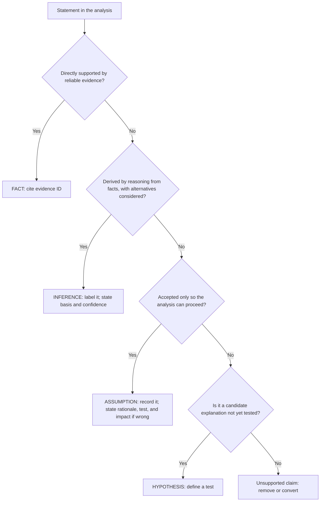
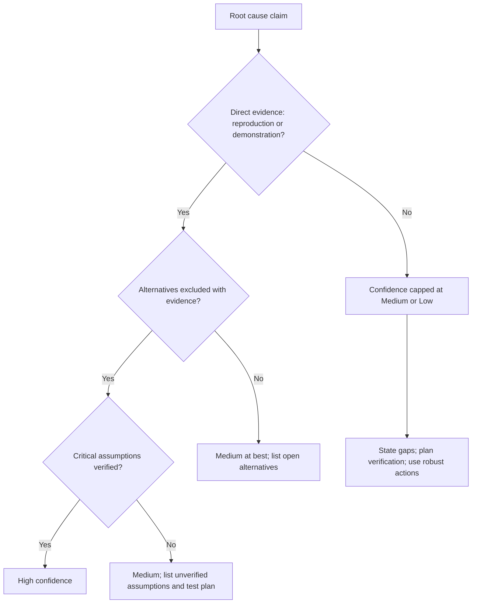
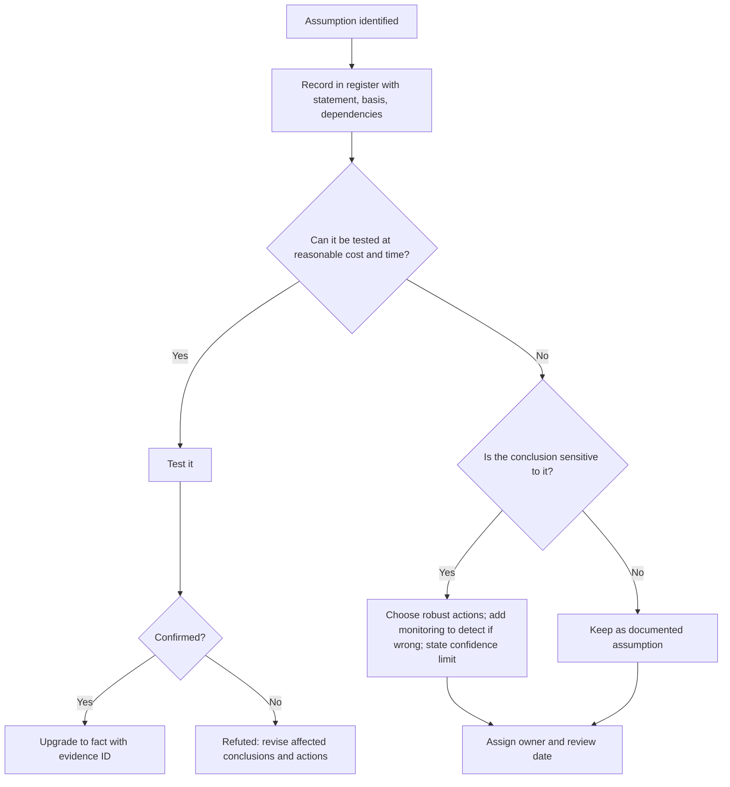
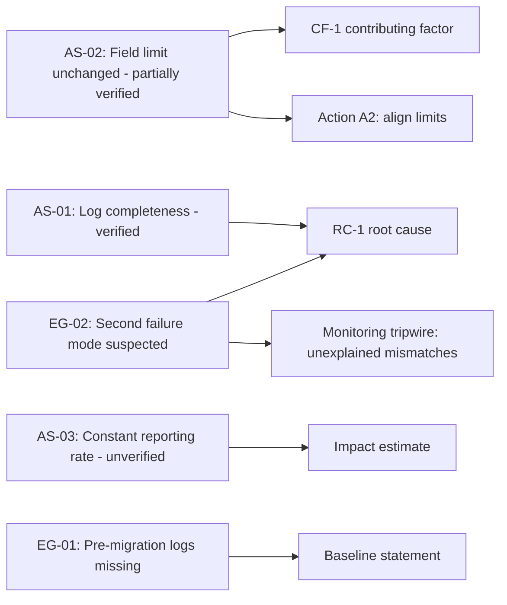

## Documenting Assumptions and Evidence Gaps


### Overview

Every Root Cause Analysis (RCA) rests on a mixture of **what was observed** and **what was assumed**. Logs are missing, witnesses disagree, the failed part was discarded before anyone thought to keep it, a system was reconfigured before its prior state was captured, and the team still has to reach a conclusion and act. The question is not whether an investigation contains assumptions and gaps (all of them do), but whether those assumptions and gaps are **visible, bounded, and managed** or **hidden inside confident-sounding conclusions**.

Documenting assumptions and evidence gaps is the discipline of making the limits of the analysis explicit. It converts an RCA from "here is what we believe" into "here is what we believe, here is what it depends on, here is what we could not verify, and here is how we will find out." This serves several purposes:

| Purpose | What Documentation Provides |
| --- | --- |
| **Honesty** | The report does not claim more certainty than the evidence supports |
| **Decision quality** | Leaders and action owners know which conclusions are firm and which are provisional |
| **Reviewability** | Reviewers and auditors can challenge specific assumptions instead of guessing what the team took for granted |
| **Risk management** | Actions can be chosen to be robust to uncertainty, and residual risk can be formally accepted |
| **Learning** | Gaps become improvement requests (better logging, retention, instrumentation) rather than recurring blind spots |
| **Recovery from error** | If new evidence contradicts an assumption, the affected conclusions and actions are easy to identify and revisit |
| **Protection against bias** | Writing assumptions down exposes anchoring, confirmation bias, and hindsight bias |

**Key Points**

- An **assumption** is a statement treated as true without direct verification. An **evidence gap** is information that would be needed to test or support a claim but is unavailable, incomplete, or unreliable.
- Undocumented assumptions are the most dangerous kind: they are invisible to reviewers and cannot be tested.
- Documentation should be **specific and actionable**: what is assumed, why, what depends on it, how it could be tested, and what happens if it is wrong.
- Gaps and assumptions should influence **root cause confidence**, **action selection**, **effectiveness monitoring**, and **residual-risk decisions**.
- Acknowledging uncertainty is a mark of **rigor**, not weakness; the failure mode is false certainty.
- This documentation must remain **blame-free**: a gap in evidence is usually a system property (retention limits, missing instrumentation), not an investigator's failing.

---

### Core Concepts and Definitions

| Term | Definition | Example |
| --- | --- | --- |
| **Fact (verified observation)** | A statement directly supported by reliable evidence | "The sync job log shows 412 records skipped on 2026-08-01" |
| **Inference** | A conclusion drawn from facts through reasoning | "The skipped records were the cause of stale addresses (98% of mismatches match skipped IDs)" |
| **Assumption** | A statement accepted as true without direct verification, in order to proceed | "The log retention policy did not delete earlier skip events" |
| **Hypothesis** | A candidate explanation that can be tested | "The migration reset the error-handling setting" |
| **Evidence gap** | Missing, incomplete, unreliable, or inaccessible information relevant to a claim | "Logs before 2026-07-25 were purged by retention rules" |
| **Uncertainty** | The degree to which a claim could be wrong given the evidence | "Medium confidence in Cause B" |
| **Limitation** | A constraint on the analysis (time, access, scope, tools) | "Vendor code was not available for inspection" |
| **Constraint** | An externally imposed boundary | "Investigation had to conclude within 10 business days per customer contract" |
| **Dependency** | A conclusion or action whose validity relies on a specific assumption or evidence item | "Action A2 assumes field-length limits are the same in all regions" |
| **Residual uncertainty** | Uncertainty that remains after the analysis is complete | "Whether an unrelated second failure mode exists is not excluded" |

#### Facts, Inferences, and Assumptions: Where the Boundaries Lie



These categories are frequently confused in practice. Common failure patterns:

| Pattern | Problem | Remedy |
| --- | --- | --- |
| **Assumption written as fact** | "The job ran on schedule" (no log checked) | Convert to assumption or find the evidence |
| **Inference written as fact** | "The migration caused the failure" (only temporal correlation) | Label as inference; show the supporting test |
| **Implicit assumption** | Analysis silently relies on "the configuration hasn't changed since" | Surface and record it |
| **Hypothesis treated as conclusion** | First plausible cause adopted | Test and document alternatives |
| **Gap treated as absence of a problem** | "No errors found" when logs were not retained | Distinguish "not observed" from "not observable" |

**Key Points**

- **Absence of evidence is not evidence of absence.** "No alert fired" and "no alert existed" and "alerts were not recorded" are three different statements.
- The distinction between "we checked and it was not there" and "we could not check" is essential and frequently lost in summaries.

---

### Why Assumptions and Gaps Arise

Understanding the origins helps teams anticipate and mitigate them.

| Source | Description | Typical Examples |
| --- | --- | --- |
| **Time pressure** | The investigation must conclude before all evidence can be collected | Contractual deadline; customer waiting |
| **Evidence perishability** | Data or physical evidence disappears | Log rotation, overwritten buffers, restarted systems, discarded parts, cleaned equipment |
| **Missing instrumentation** | The system never recorded the relevant data | No metric for skipped records; no sensor for a parameter |
| **Retention limits** | Data was legitimately deleted under policy | Logs retained 30 days; video overwritten weekly |
| **Access limitations** | Evidence exists but cannot be reached | Third-party systems, vendor proprietary code, legal hold, privacy rules |
| **Reproduction difficulty** | The failure cannot be safely or economically recreated | Production-only conditions; rare event; safety risk |
| **Witness limitations** | Human recall is imperfect, incomplete, or influenced | Memory decay, hindsight bias, fear of blame |
| **Measurement error** | Instruments or metrics are unreliable | Uncalibrated gauge; changed metric definition |
| **Scope boundaries** | Some areas were deliberately excluded | "Carrier delivery excluded from scope" |
| **Complexity** | Too many interacting factors to isolate | Multi-factor intermittent failures |
| **Prior undocumented change** | The baseline state is not known | No configuration history |
| **Cognitive bias** | Team fills gaps with expectation | Anchoring on the first hypothesis |

---

### Categories of Assumptions

Classifying assumptions helps decide how much attention each deserves.

| Category | Description | Example | Typical Risk |
| --- | --- | --- | --- |
| **Data assumptions** | Data is accurate, complete, and representative | "The error log captures all skipped records" | Hidden gaps distort analysis |
| **Process assumptions** | The process operated as designed | "Operators followed the documented procedure" | As-designed vs. as-operated gap |
| **Configuration / state assumptions** | System state at the time of the event is known | "The scheduler configuration matched the export taken later" | State drift after the event |
| **Causal assumptions** | A particular mechanism links two events | "Skipped records caused the address mismatches" | Confounding or alternative mechanisms |
| **Independence assumptions** | Events or controls fail independently | "The alert and reconciliation controls are independent" | Common-cause failures |
| **Stationarity assumptions** | Conditions before and after are comparable | "Baseline period is representative of normal operation" | Seasonality, mix changes |
| **Measurement assumptions** | Metrics measure what they claim | "Complaint count reflects true incident rate" | Reporting bias |
| **Scope assumptions** | Excluded areas are not relevant | "Carrier handling did not contribute" | Missed contributors |
| **Statistical assumptions** | Data satisfy the requirements of the method | "Points are independent and approximately normal" | Invalid limits or tests |
| **Human factors assumptions** | Assumptions about intent, knowledge, and behavior | "Operators understood the alert meaning" | Misdiagnosed human performance |
| **Environmental assumptions** | External conditions were normal | "No unusual load or weather on the day" | Missed environmental contributor |
| **Future-state assumptions** | The corrective action will operate as intended | "The new check will not be bypassed" | Action decay |
| **Resource assumptions** | People, budget, and time will be available | "The vendor will deliver the sensor by Oct 1" | Schedule slip |

---

### Categories of Evidence Gaps

| Gap Type | Description | Example | Typical Handling |
| --- | --- | --- | --- |
| **Missing data** | Data was never captured | No metric on skipped records | Infer from other sources; add instrumentation |
| **Lost data** | Data existed but was deleted or overwritten | Logs purged by retention | Reconstruct from backups, alternate systems |
| **Inaccessible evidence** | Exists but cannot be obtained | Vendor black-box firmware | Request; use surrogate tests; document limitation |
| **Unreliable evidence** | Available but of doubtful quality | Timestamps with clock skew | Cross-validate; quantify uncertainty |
| **Incomplete evidence** | Partial coverage | Logs for only 3 of 5 servers | State coverage; test representativeness |
| **Conflicting evidence** | Sources disagree | Two witnesses give different sequences | Identify differences; seek tie-breaker evidence |
| **Unrepeatable evidence** | Cannot be recreated | One-time environmental condition | Rely on reconstruction; label inference |
| **Untested hypotheses** | Plausible cause without a test | Second failure mode suspected | Plan test; add monitoring |
| **Baseline gap** | No pre-event reference | No historical configuration | Estimate; use comparators |
| **Sample-size gap** | Too little data for a statistical claim | Only 3 events observed | Report uncertainty; avoid over-interpretation |
| **Witness gap** | Key people unavailable | Engineer left the company | Use documents; interview successors; note limitation |
| **Chain-of-custody gap** | Evidence handling not documented | Part passed through several hands | Note effect on evidentiary weight |

**Key Points**

- Each gap should be recorded with its **cause** (why is it missing?) and its **effect** (which claims does it weaken?).
- Distinguish gaps that **could have been closed but were not** (a process failing) from gaps that **could not be closed** (a genuine constraint).

---

### The Assumptions and Gaps Register

A **register** is the central tool: a structured, versioned list that travels with the RCA. It makes assumptions and gaps auditable and trackable.

#### Assumption Register Fields

| Field | Purpose | Example |
| --- | --- | --- |
| **ID** | Unique reference | AS-03 |
| **Statement** | Clear, testable assertion | "Fulfillment field limit was 255 characters for the entire event period" |
| **Category** | Type of assumption | Configuration / state |
| **Where it is used** | Sections, conclusions, and actions that depend on it | Root cause RC-1; Action A2 |
| **Rationale / basis** | Why it was accepted | Vendor documentation; no change tickets found |
| **Verification status** | Unverified / partially verified / verified / refuted | Partially verified |
| **How it could be tested** | Method and required evidence | Compare configuration snapshots; query vendor changelog |
| **Impact if false** | Which conclusions change and how | RC-1 contributing factor would change; A2 rescoped |
| **Sensitivity** | How much the conclusion depends on it | High |
| **Owner** | Person responsible for testing or monitoring | Integration Engineer |
| **Due date** | When verification is expected | 2026-10-05 |
| **Status / outcome** | Open, confirmed, refuted; date and evidence | Open |

#### Evidence Gap Register Fields

| Field | Purpose | Example |
| --- | --- | --- |
| **ID** | Unique reference | EG-02 |
| **Description** | What information is missing | "Fulfillment-system logs before 2026-07-25" |
| **Cause of gap** | Why it is unavailable | Log retention limit of 30 days |
| **Claims affected** | Findings weakened by the gap | Baseline behavior before migration |
| **Severity of effect** | Low / medium / high on conclusions | Medium |
| **Mitigation used** | How the team compensated | Configuration history and change tickets used as proxies |
| **Residual uncertainty** | What remains uncertain | Cannot exclude an earlier undetected skip pattern |
| **Recovery options** | Possible ways to close the gap | Request backup restore; vendor archive |
| **Owner / due date** | Accountability | Platform Manager / 2026-10-10 |
| **Systemic fix** | Improvement to prevent the same gap in future | Extend log retention for integration jobs to 180 days |
| **Status** | Open, mitigated, closed, accepted | Mitigated |

#### Example Combined Register (Excerpt)

| ID | Type | Statement / Description | Used In | Status | Impact if Wrong | Owner | Due |
| --- | --- | --- | --- | --- | --- | --- | --- |
| AS-01 | Assumption | Skipped-record log entries are complete for the incident window | RC-1 evidence | Verified (log integrity check) | Root cause confidence would fall | Integration Eng. | Done |
| AS-02 | Assumption | Field limit unchanged across the migration | CF-1; A2 | Partially verified | A2 scope would change | Platform Mgr | 2026-10-05 |
| AS-03 | Assumption | Complaint counts reflect a constant reporting rate | Impact estimate | Unverified | Impact under- or over-estimated | Support Lead | 2026-10-08 |
| EG-01 | Gap | Fulfillment logs before 2026-07-25 unavailable | Baseline statement | Mitigated | Pre-migration behavior uncertain | Platform Mgr | 2026-10-10 |
| EG-02 | Gap | Second failure mode suspected; no reproduction yet | RC confidence | Open | Additional cause may exist | Quality Eng. | 2026-10-12 |
| EG-03 | Gap | Vendor firmware not inspectable | CF-2 | Accepted (risk) | Cannot exclude vendor defect | Supplier Quality | Review 2027-01 |

**Key Points**

- The register should be **created early** (at investigation kickoff) and **updated continuously**, not reconstructed at the end.
- Entries should be **specific enough to test**. "Data may be incomplete" is a worry; "Logs for servers 4 and 5 are missing 2026-08-03 to 2026-08-06" is a documented gap.
- Assign **owners and dates**; unowned assumptions never get tested.

---

### Assessing Significance: Which Assumptions and Gaps Matter Most

Not every assumption deserves equal attention. Prioritize by how much a wrong assumption would change conclusions or decisions.

#### Two-Factor Prioritization

|  | **Low Sensitivity** (conclusions barely depend on it) | **High Sensitivity** (conclusions hinge on it) |
| --- | --- | --- |
| **High confidence it is true** | Record; no action | Record; verify cheaply if possible; note dependency |
| **Low confidence it is true** | Record; monitor | **Priority: test before acting or select actions robust to it** |

A quantitative flavor, useful for triage, treats significance as a product:

$$\text{Significance} = P(\text{assumption false}) \times \text{Impact if false}$$

where impact is scored (for example, 1 to 5) by how many conclusions and actions would change.

**Example**

| Item | $P(\text{false})$ | Impact | Significance | Priority |
| --- | --- | --- | --- | --- |
| AS-02 field limit unchanged | 0.3 | 4 | 1.2 | High |
| AS-03 constant reporting rate | 0.4 | 2 | 0.8 | Medium |
| AS-01 log completeness | 0.05 | 5 | 0.25 | Low (already verified) |

[Inference: Probability values here are subjective judgments, not measurements; use them to order effort, not to imply precision.]

#### Effect on Root Cause Confidence

Root cause statements should carry an explicit **confidence level** that reflects the assumptions and gaps beneath them.

| Confidence | Meaning | Typical Basis |
| --- | --- | --- |
| **High** | Multiple independent lines of evidence; cause reproduced or directly demonstrated; alternatives excluded; few or minor assumptions | Reproduction test plus log correlation plus configuration comparison |
| **Medium** | Strong evidence but with untested assumptions or partial gaps; alternatives largely but not fully excluded | Log correlation and timeline consistent; one key assumption unverified |
| **Low** | Plausible explanation with limited evidence; significant gaps; competing hypotheses remain | Temporal correlation only; evidence unavailable |



---

### Where and How to Document Within an RCA

Assumptions and gaps belong in several places, each serving a different reader.

| Location | Content | Reader |
| --- | --- | --- |
| **Scope and methodology section** | Overall limitations, constraints, and data sources; summary of major assumptions | Reviewers, auditors |
| **Evidence register** | Reliability notes and coverage for each evidence item | Investigators, auditors |
| **Analysis section (inline)** | Assumption and inference labels attached to specific claims | Anyone following the reasoning |
| **Root cause statement** | Confidence level and the assumptions it depends on | Decision-makers |
| **Assumptions and gaps register (appendix)** | Complete structured list with owners and status | Investigators, action owners, auditors |
| **Action plan** | Which actions depend on which assumptions; robust alternatives | Action owners |
| **Effectiveness plan** | Monitoring designed to detect if an assumption was wrong | Reviewers |
| **Executive summary** | Confidence, key uncertainties, and what would change the conclusion | Leadership |
| **Lessons learned** | Systemic fixes to close recurring gaps | Organization |

#### Inline Labeling Conventions

Use short, consistent tags so readers can distinguish claim types at a glance.

| Label | Use |
| --- | --- |
| **[Fact, E-03]** | Directly supported by cited evidence |
| **[Inference]** | Derived by reasoning; basis stated |
| **[Assumption AS-02]** | Accepted without verification; cross-referenced to the register |
| **[Unverified]** | Claim not yet tested |
| **[Gap EG-01]** | Affected by a documented evidence gap |
| **[Speculation]** | Offered for completeness; low support |

Apply labels **only where they matter**. Excessive tagging obscures the text; a report where every sentence is hedged is as unhelpful as one where nothing is.

**Example**

> The job skipped 412 records on Aug 1 **[Fact, E-01]**. The skips account for 98% of address mismatches **[Fact, E-03]**. We conclude the skipping caused the mismatches **[Inference: strong temporal and record-level correlation; alternative mechanisms excluded per Table 8]**. This assumes the fulfillment field limit was unchanged throughout **[Assumption AS-02, partially verified]**. Fulfillment logs before Jul 25 are unavailable **[Gap EG-01]**, so behavior before the migration is reconstructed from change records rather than observed.

---

### Documenting Assumptions: Practical Guidance

#### Writing a Good Assumption Statement

| Attribute | Guidance | Weak | Strong |
| --- | --- | --- | --- |
| **Specific** | State exactly what is assumed | "Systems were working normally" | "The scheduler executed all other nightly jobs on schedule during Jul 28 to Aug 14" |
| **Testable** | Framed so it could be confirmed or refuted | "Operators were trained" | "All three shift operators had completed the current procedure training per HR records" |
| **Bounded** | Scope in time and system | "Field limits are the same" | "Field limits were 255 characters in both systems from Jul 1 to Aug 14" |
| **Linked** | Refers to what depends on it | (none) | "Used in RC-1 and Action A2" |
| **Justified** | Basis stated | "It is probably fine" | "Vendor documentation and absence of change tickets" |

#### Surfacing Hidden Assumptions

Teams rarely list assumptions spontaneously. Techniques to draw them out:

| Technique | How It Works |
| --- | --- |
| **"What would have to be true?"** | For each conclusion, list the conditions that must hold |
| **Reverse each causal link** | Ask, "If this link were false, what else could explain the effect?" |
| **Pre-mortem on the RCA** | Imagine the conclusion turns out wrong a year from now; what was the likely reason? |
| **Devil's advocate / red team** | Assign someone to challenge each key claim |
| **Independent reviewer** | Someone outside the team reads and lists what is being taken for granted |
| **"How do we know?" for every sentence** | Trace to evidence or mark as assumption |
| **Compare as-designed vs. as-operated** | Identify where design documents substitute for observation |
| **Review data provenance** | For each dataset, ask how it was collected, filtered, and could be biased |
| **Check the timeline for gaps** | Unexplained intervals often conceal assumed activity |
| **Cognitive-bias checklist** | Anchoring, confirmation, hindsight, availability, outcome bias |

#### Handling Assumptions During the Investigation



**Key Points**

- Prefer **testing** to merely documenting whenever the cost is reasonable.
- When testing is impractical, design **actions and monitoring that remain valid if the assumption is wrong**.
- Revisit the register at each major milestone and before closure.

---

### Documenting Evidence Gaps: Practical Guidance

#### Writing a Good Gap Statement

A useful gap entry states **what is missing**, **why**, **what it affects**, and **what was done about it**.

| Weak | Strong |
| --- | --- |
| "Some logs are missing." | "Fulfillment-system logs from Jul 20 to Jul 24 are unavailable (30-day retention); this prevents direct observation of behavior immediately before the migration. Change records and configuration exports were used as proxies." |
| "We could not reproduce the issue." | "Reproduction was attempted in staging using 500 synthetic oversized records; the skip behavior was reproduced only when error handling was set to log-and-continue. Production-scale timing effects were not reproduced." |
| "Witness unavailable." | "The engineer who configured the original job left the company in 2025; intent behind the error-handling default is inferred from code comments and design documents." |

#### Distinguishing the Kinds of "We Don't Know"

| Statement | Meaning |
| --- | --- |
| "We checked and found nothing." | Search performed with adequate coverage; result negative (state the search scope) |
| "We could not check." | Evidence unavailable; result unknown |
| "We did not check." | Not investigated; may be relevant (state why) |
| "It cannot be checked." | Fundamentally unobservable; residual uncertainty permanent |

A frequent reporting failure is collapsing all four into "no evidence of a problem." Preserve the distinction.

#### Mitigating Gaps

| Mitigation | Description | Example |
| --- | --- | --- |
| **Proxy evidence** | Use related data that would reflect the missing information | Use change tickets and configuration history when logs are missing |
| **Triangulation** | Combine independent partial sources | Combine support tickets, warehouse scans, and DB snapshots |
| **Reconstruction** | Rebuild the missing state from known rules | Recompute the expected state from code and inputs |
| **Reproduction / simulation** | Recreate the event in a controlled environment | Staging test with synthetic data |
| **Bounding** | Establish limits on what the missing data could show | "At most 6% of records could have been affected" |
| **Sensitivity analysis** | Test whether conclusions change across plausible values of the missing quantity | Vary the assumed baseline rate |
| **Recovery attempts** | Backups, archives, vendor requests, forensic recovery | Restore from backup |
| **Additional data collection going forward** | Instrument now to observe future occurrences | Add skipped-record metrics |
| **Independent expert review** | External perspective on residual uncertainty | Vendor engineer review |

**Sensitivity analysis example**

Suppose the impact estimate depends on an uncertain reporting rate $r$ (the fraction of affected customers who complained). With 212 complaints:

$$\text{Estimated affected customers} = \frac{212}{r}$$

| Assumed reporting rate $r$ | Estimated affected |
| --- | --- |
| 0.20 | 1,060 |
| 0.15 | 1,413 |
| 0.10 | 2,120 |

A range of about 1,060 to 2,120 is more honest than a single number. The report can present "approximately 1,400 (range 1,060 to 2,120, depending on reporting rate)" and note that the assumption was not verified. Independent evidence (for example, the sync skip logs directly counting affected records) may later narrow the range. [Inference: Reporting rates for complaints vary widely by context and are often unknown; treat these scenarios as illustrative.]

---

### Assumptions in Statistical and Quantitative Analysis

Quantitative methods carry their own assumptions, which should be stated alongside results.

| Method | Key Assumptions | What to Document |
| --- | --- | --- |
| **Control charts** | Baseline period is stable and representative; observations are approximately independent; measurement system is adequate | Baseline dates; any special causes removed and why; autocorrelation check |
| **Capability indices ($C_p$, $C_{pk}$)** | Process stable; approximately normal (or appropriate transformation); adequate sample size | Stability evidence; normality assessment; $n$ |
| **Two-sample tests** | Independence; approximate normality (t-test) or adequate counts (proportion test); no major confounding | Sampling method; checks performed |
| **Rate comparisons** | Comparable exposure definitions; stable reporting | Exposure measure; reporting changes |
| **Pareto analysis** | Categories consistently defined; data representative | Category definitions; period covered |
| **Regression / correlation** | Linearity, independence, absence of strong confounding | Confounders considered; limits on causal claims |
| **Probability calculations in fault trees** | Independent basic events; accurate failure probabilities | Independence justification; source of probabilities |

For example, when combining independent control failures in a fault tree:

$$P_{\text{AND}} = \prod_i P_i$$

this formula is only valid under independence. If two controls share a common cause (for example, both depend on the same monitoring service), the true joint failure probability can be substantially higher, so the report should state the independence assumption explicitly and, where possible, how it was checked. [Inference: Independence is often an optimistic simplification; common-cause failure analysis may be warranted for critical systems.]

**Key Points**

- Report **sample sizes, time windows, and data sources** alongside every statistical result.
- Where data are **autocorrelated** or **non-normal**, say so and describe the method used to handle it.
- Do not present a statistically significant result as a causal finding without addressing confounding.

---

### Linking Assumptions and Gaps to Actions and Verification

Uncertainty should shape the response, not merely be recorded.

#### Robust Action Selection

When key assumptions are unverified, prefer actions that **perform acceptably whether or not the assumption holds**.

| Situation | Robust Approach |
| --- | --- |
| Root cause confidence is medium | Implement the strongest reversible action now; add monitoring to test the hypothesis; keep enhanced containment |
| Two competing causes remain | Take actions addressing both if cost permits; use the effectiveness data to discriminate |
| Unverified assumption about a shared limit | Design the fix to validate against both plausible values |
| Data gap prevents baseline estimation | Establish a new baseline going forward before judging effectiveness |
| Cause may be one of several in a class | Choose a structural fix that eliminates the class |

#### Assumption-Driven Monitoring

Effectiveness monitoring should include **tripwires** that would reveal an assumption was wrong.

| Assumption | Tripwire |
| --- | --- |
| "The skip mechanism is the only cause of stale addresses" | Any mismatch not associated with a skipped record triggers investigation |
| "Field limits are identical in all regions" | Validation rejection rates by region; any region with unusual rates flagged |
| "Complaint counts approximate incident rate" | Independent reconciliation report compared against complaints |
| "The new alert will be acted on" | Time-to-acknowledge metric for alerts |

#### Dependency Mapping

Track which actions and conclusions depend on which assumptions, so a refuted assumption triggers a targeted review.



If AS-02 is refuted, the map immediately shows that CF-1 and Action A2 need revisiting.

#### Formal Risk Acceptance

Some gaps cannot or will not be closed. Where residual uncertainty could matter, record a **risk acceptance** with:

- The specific uncertainty accepted
- Rationale (cost, feasibility, low consequence)
- Approver and authority level
- Expiration or review date
- Conditions that would trigger reconsideration

Silent acceptance by inaction is not a valid substitute for documented acceptance.

---

### Presenting Assumptions and Gaps to Different Audiences

| Audience | What They Need | Presentation |
| --- | --- | --- |
| **Executives** | Overall confidence, key uncertainties that could change the decision, what is being done about them | One or two sentences in the executive summary; confidence level; explicit note if a decision depends on an uncertain point |
| **Action owners** | Which assumptions their action depends on and what to watch for | Action-level notes and tripwires |
| **Reviewers / auditors** | Complete register, evidence reliability, rationale | Appendix register plus inline labels |
| **Customers / regulators** | Honest statement of what is established and what is not, and how residual risk is controlled | Concise limitations section; risk controls |
| **Front-line staff** | Plain explanation of what is still being verified and what to report | Simple briefing; channels for feedback |

**Example executive summary phrasing**

> Confidence in the root cause is high. One assumption remains unverified: that field limits were unchanged across all regions. We will confirm this by Oct 5. If it proves false, the portal validation fix (A2) will be widened to additional regions; the other actions are unaffected.

> Fulfillment-system logs from before July 25 were unavailable, so we could not directly observe behavior before the migration. We relied on change records instead. This does not affect the conclusion about the cause of the August incident, but it limits what we can say about earlier periods.

**Key Points**

- State what **would change the decision** if the uncertainty resolved differently. Leaders can then judge whether to wait or act.
- Avoid burying material uncertainty in an appendix while presenting confident conclusions in the summary.

---

### Worked Example: Documenting Assumptions and Gaps in an Incident RCA

**Example**

**Context:** A batch of 1,200 housings shows cracks; the returned parts are analyzed. Investigators suspect inconsistent cooling time in the molding process.

**Step 1: Identify what is established**

| ID | Statement | Status | Basis |
| --- | --- | --- | --- |
| F-1 | 38 of 400 sampled units from lot L-2207 have cracks | Fact | Inspection records E-01 |
| F-2 | Cooling time for L-2207 varied from 12 to 21 seconds | Fact | Controller log E-02 |
| F-3 | Parts molded with cooling under 15 s show brittle fracture surfaces | Fact | Lab analysis E-04 |

**Step 2: Surface assumptions**

| ID | Assumption | Used In | Verification Status | Impact if False |
| --- | --- | --- | --- | --- |
| AS-01 | Controller cooling-time log reflects actual mold cooling | RC-1 | Partially verified (one cross-check with thermocouple) | Root cause would need re-evaluation |
| AS-02 | Resin lot L-2207 met material specification | Exclusion of material cause | Unverified (certificate of analysis received but no incoming test) | Material could be a contributing cause |
| AS-03 | Sampled 400 units are representative of the lot | Estimate of lot defect rate | Unverified (sampling was by convenience, not random) | Defect rate estimate biased |
| AS-04 | Operators did not manually override cooling time | Exclusion of deliberate change | Partially verified (no override flags in controller; interviews consistent) | Cause would shift to behavior and incentives |

**Step 3: Document evidence gaps**

| ID | Gap | Cause | Effect | Mitigation |
| --- | --- | --- | --- | --- |
| EG-01 | No mold-cavity temperature data | Sensor not installed | Cannot directly link temperature history to cooling time | Use thermocouple spot checks and controller data as proxies |
| EG-02 | Retained resin sample for L-2207 not kept | Retention practice not followed | Cannot test material directly | Retest retained samples from adjacent lots; request supplier data |
| EG-03 | 60% of defect reports lack lot traceability | Legacy labeling | Lot-level attribution is uncertain | Use serial-number ranges where available; bound estimate |

**Step 4: Assess confidence and sensitivity**

| Claim | Confidence | Reasoning |
| --- | --- | --- |
| Short cooling time contributed to brittle failure | **Medium to high** | Direct fracture evidence (F-3) and correlation with controller data; AS-01 partly verified |
| Cooling time was the **only** contributor | **Low to medium** | AS-02 unverified; EG-02 prevents material exclusion |
| Lot defect rate is about 9.5% | **Low** | AS-03 (convenience sample); EG-03 |

The observed sample proportion is:

$$\hat{p} = \frac{38}{400} = 0.095$$

Because the sample was not random, this proportion is a **descriptive statistic of the sample, not a reliable estimate for the lot**, and the report says so.

**Step 5: Choose robust actions**

| Action | Rationale in Light of Uncertainty |
| --- | --- |
| Lock the cooling-time parameter and auto-reject deviations | Effective if cooling time is a cause, and inexpensive to implement even if it turns out to be only one of several |
| Add incoming melt-index test and retain a sample per lot | Directly closes EG-02 and tests AS-02 going forward |
| Install cavity-temperature sensor | Closes EG-01 and improves the evidence base |
| Extend 100% crack inspection (containment) until effectiveness data are in | Protects the customer given medium confidence and unresolved alternatives |

**Step 6: Add tripwires to effectiveness monitoring**

| Tripwire | Purpose |
| --- | --- |
| Any cracked unit produced with in-spec cooling time | Would indicate a second cause; reopen analysis |
| Melt-index deviations flagged at incoming test | Tests material contribution (AS-02) |
| Cavity temperature vs. cooling time correlation review at 30 days | Tests AS-01 |

**Step 7: Executive summary wording**

> Short and inconsistent cooling time is a confirmed contributor to the cracks (medium-to-high confidence). We cannot yet exclude a material contribution because no resin sample was retained; we are adding retention and incoming testing to resolve this. The 9.5% figure applies only to the units we inspected and should not be read as the lot defect rate. Containment (100% inspection) stays in place until 90 days of monitoring confirm the fix, with a specific check for any cracks that occur despite in-spec cooling.

**Output**

The report does not claim that cooling time is the sole cause, does not overstate the defect rate, converts each gap into a concrete improvement (sensor, retained samples, traceability), and designs actions and monitoring to be valid whether or not the unverified assumptions hold.

**Conclusion**

The value of the documentation is that a reader can see **exactly** which parts of the story are firm, which are provisional, and how the response protects against being wrong. If a later test shows the resin lot was out of specification, the register immediately identifies which conclusions and actions to revisit.

---

### Cognitive Biases That Create Hidden Assumptions

Awareness of common biases helps teams recognize where undocumented assumptions are likely to hide.

| Bias | How It Creates Hidden Assumptions | Countermeasure |
| --- | --- | --- |
| **Anchoring** | The first explanation shapes what is investigated | Generate multiple hypotheses early; assign someone to argue alternatives |
| **Confirmation bias** | Evidence supporting the favored cause is sought; contrary evidence discounted | Predefine what would disprove each hypothesis; document rejected alternatives |
| **Hindsight bias** | Outcomes seem obvious in retrospect; earlier decisions look careless | Reconstruct what information was available at each decision point |
| **Availability bias** | Recent or vivid incidents dominate reasoning | Use data; check base rates |
| **Outcome bias** | Judging decisions by results rather than reasoning | Evaluate decision quality separately from outcome |
| **Fundamental attribution error** | Attributing failure to individuals rather than situations | Look for system conditions; use blame-free structure |
| **Overconfidence** | Certainty exceeds evidence | State confidence explicitly; independent review |
| **Groupthink** | Team converges without dissent | Structured devil's advocacy; independent facilitator |
| **Sunk cost** | Reluctance to revise a conclusion after investing effort | Version history; normalize revision |
| **Authority bias** | Senior opinion treated as evidence | Distinguish opinion from data; anonymous input where helpful |
| **Narrative fallacy** | A coherent story is preferred over messy uncertainty | Explicitly list unexplained observations |
| **Survivorship bias** | Only observed failures are considered | Consider what is not visible (near misses, silent failures) |

---

### Implementation Sketch: Assumption and Gap Register with Consistency Checks

A small Python script can maintain a register and flag structural problems, such as high-sensitivity assumptions with no test plan, gaps without owners, conclusions that depend on refuted assumptions, and unreviewed items past their due date.

**Example**

```python
from dataclasses import dataclass, field
from datetime import date
from typing import Optional

@dataclass
class Assumption:
    aid: str
    statement: str
    status: str                 # "unverified", "partial", "verified", "refuted"
    sensitivity: str            # "low", "medium", "high"
    used_in: list = field(default_factory=list)
    test_plan: Optional[str] = None
    owner: Optional[str] = None
    due: Optional[date] = None

@dataclass
class Gap:
    gid: str
    description: str
    affected_claims: list = field(default_factory=list)
    mitigation: Optional[str] = None
    owner: Optional[str] = None
    accepted_by: Optional[str] = None   # risk acceptance approver
    status: str = "open"                # open, mitigated, closed, accepted


def audit_register(assumptions, gaps, today):
    findings = []

    for a in assumptions:
        if a.status in ("unverified", "partial") and a.sensitivity == "high":
            if not a.test_plan:
                findings.append(f"{a.aid}: high-sensitivity assumption with no test plan.")
            if not a.owner or not a.due:
                findings.append(f"{a.aid}: needs owner and due date.")
        if a.due and a.due < today and a.status in ("unverified", "partial"):
            findings.append(f"{a.aid}: verification overdue since {a.due}.")
        if a.status == "refuted" and a.used_in:
            findings.append(
                f"{a.aid}: REFUTED; revisit dependent items: {', '.join(a.used_in)}."
            )
        if not a.used_in:
            findings.append(f"{a.aid}: not linked to any conclusion or action (orphan).")

    for g in gaps:
        if g.status == "open" and not g.mitigation:
            findings.append(f"{g.gid}: open gap with no mitigation.")
        if g.status == "open" and not g.owner:
            findings.append(f"{g.gid}: open gap with no owner.")
        if g.status == "accepted" and not g.accepted_by:
            findings.append(f"{g.gid}: accepted without a recorded approver.")
        if not g.affected_claims:
            findings.append(f"{g.gid}: does not state which claims it affects.")

    return findings


assumptions = [
    Assumption("AS-01", "Controller cooling log reflects actual cooling", "partial",
               "high", ["RC-1"], None, None, None),
    Assumption("AS-02", "Resin lot met specification", "unverified", "high",
               ["Exclusion of material cause"], "Retest retained adjacent-lot samples",
               "Quality Eng.", date(2026, 9, 10)),
    Assumption("AS-03", "Sample representative of lot", "refuted", "medium",
               ["Lot defect-rate estimate"]),
]

gaps = [
    Gap("EG-01", "No cavity-temperature data", ["RC-1 linkage"], None, None),
    Gap("EG-02", "No retained resin sample", ["Material exclusion"],
        "Retest adjacent lots", "Supplier Quality", accepted_by=None, status="accepted"),
]

for f in audit_register(assumptions, gaps, today=date(2026, 9, 24)):
    print("-", f)
```

**Output**

```text
- AS-01: high-sensitivity assumption with no test plan.
- AS-01: needs owner and due date.
- AS-02: verification overdue since 2026-09-10.
- AS-03: REFUTED; revisit dependent items: Lot defect-rate estimate.
- EG-01: open gap with no mitigation.
- EG-01: open gap with no owner.
- EG-02: accepted without a recorded approver.
```

The script demonstrates **structural hygiene checks**: it cannot decide whether an assumption is reasonable or a gap is significant, only whether the register is complete and actionable. Real systems would integrate the register with the CAPA tracker and notify owners automatically. [Inference: Automated checks help prevent items from being forgotten, but judgment about materiality still requires human review.]

---

### Templates

#### Assumptions and Evidence Gaps Register (Markdown)

```markdown
### Assumptions Register

| ID | Statement | Category | Used In | Basis | Status | Sensitivity | How to Test | Impact if False | Owner | Due |
|----|-----------|----------|---------|-------|--------|-------------|-------------|-----------------|-------|-----|
| AS-01 | | | | | Unverified / Partial / Verified / Refuted | Low / Med / High | | | | |

### Evidence Gaps Register

| ID | Missing Information | Cause | Claims Affected | Severity | Mitigation Used | Residual Uncertainty | Recovery Options | Systemic Fix | Owner | Status |
|----|---------------------|-------|-----------------|----------|-----------------|----------------------|------------------|--------------|-------|--------|
| EG-01 | | | | | | | | | | Open / Mitigated / Closed / Accepted |

### Risk Acceptances

| ID | Uncertainty Accepted | Rationale | Approver | Date | Review / Expiry | Reconsideration Triggers |
|----|----------------------|-----------|----------|------|-----------------|--------------------------|
```

#### Limitations and Confidence Section (for the Report Body)

```markdown
### Limitations and Confidence

**Overall confidence in root cause:** High / Medium / Low
**Basis:** <evidence types, reproduction, independent corroboration>

**Key assumptions the conclusion depends on:**
1. <AS-xx: statement; status; what changes if false>
2. ...

**Material evidence gaps:**
1. <EG-xx: what is missing; why; effect; mitigation; residual uncertainty>
2. ...

**What would change the conclusion:** <specific findings that would alter root cause or actions>

**Actions and monitoring designed to be robust to uncertainty:** <tripwires, reversible steps, added instrumentation>

**Open verification items:** <owners and dates>
```

---

### Review Checklist

| Check | Pass Criterion |
| --- | --- |
| **Register exists** | Assumptions and gaps are recorded in a structured, versioned register |
| **Fact/inference/assumption separation** | Claims are labeled consistently; assumptions are not presented as facts |
| **Specific and testable** | Each assumption and gap is stated precisely, with scope |
| **Dependencies mapped** | Each entry lists the conclusions and actions that depend on it |
| **Sensitivity assessed** | High-impact assumptions are prioritized |
| **Testing attempted where feasible** | Verification performed or a documented reason for not doing so |
| **"Could not check" vs. "checked, not found"** | Distinction preserved throughout |
| **Confidence stated** | Root cause confidence level with basis |
| **Robust actions** | Actions and monitoring account for unverified assumptions |
| **Tripwires defined** | Effectiveness plan includes signals that would reveal a wrong assumption |
| **Owners and dates** | Every open item has an accountable owner and due date |
| **Gaps converted to improvements** | Systemic fixes (retention, instrumentation, traceability) proposed |
| **Risk acceptance documented** | Residual uncertainty formally accepted by an authorized approver where applicable |
| **Executive summary honest** | Material uncertainties and decision sensitivities stated |
| **Blame-free** | Gaps described as system properties, not investigator failings |
| **Independent review** | A reviewer outside the team challenged the assumptions |
| **Kept current** | Register updated through closure and after new evidence |

---

### Common Pitfalls and Remedies

| Pitfall | Consequence | Remedy |
| --- | --- | --- |
| Assumptions left implicit | Reviewers cannot challenge them; errors persist | Explicit register; "what would have to be true?" exercises |
| Gaps omitted to keep the report tidy | False confidence; loss of trust when discovered | Report gaps and their effect on conclusions |
| "No evidence of X" used to mean "X did not occur" | Misleading conclusions | Distinguish checked, could not check, did not check |
| Everything hedged | Report is unusable; no clear conclusions | Label only material uncertainty; state firm findings firmly |
| Register created at the end | Retroactive and incomplete | Start at kickoff; update continuously |
| Assumptions documented but never tested or owned | They become permanent unverified beliefs | Owners, dates, tripwires |
| Ignoring assumptions when choosing actions | Fragile fixes | Choose robust or reversible actions; add monitoring |
| Overconfident root cause statements | Recurrence when hidden causes remain | State confidence; list open alternatives |
| Statistical results presented without assumptions | Misapplied methods; invalid conclusions | State sample size, independence, stability, and method checks |
| Treating a convenience sample as representative | Biased estimates | State sampling method; avoid extrapolation |
| Blaming individuals for evidence loss | Concealment; fewer honest gap reports | Analyze why evidence was lost (retention, instrumentation, process) |
| Gaps never converted to improvements | Same blind spots in the next investigation | Systemic fixes tracked as preventive actions |
| Residual uncertainty accepted silently | Hidden risk | Formal, time-limited, approved risk acceptance |
| Not updating the report when an assumption is refuted | Contradictory or stale record | Version control; revision notes; targeted review of dependents |
| Excessive precision on uncertain numbers | False authority | Report ranges and state the basis |

---

### Best Practices Checklist

- **Start the assumptions and gaps register at investigation kickoff** and maintain it through closure.
- **Separate facts, inferences, assumptions, and hypotheses** in the text, and label them consistently where they matter.
- **State each assumption and gap specifically**, with scope, basis, dependencies, and impact if wrong.
- **Preserve the distinction** between "checked and not found," "could not check," and "did not check."
- **Prioritize by sensitivity and likelihood**, and test the assumptions the conclusions hinge on.
- **Mitigate gaps** with proxies, triangulation, reconstruction, reproduction, bounding, and sensitivity analysis, and report residual uncertainty.
- **State confidence levels** for root cause claims, tied to the strength of evidence and the status of key assumptions.
- **Design actions and monitoring to be robust**, including tripwires that would reveal a wrong assumption.
- **Record formal, time-limited risk acceptance** for uncertainty that will not be resolved.
- **Communicate material uncertainty honestly** in the executive summary, including what would change the decision.
- **Convert evidence gaps into systemic improvements** such as retention, instrumentation, traceability, and evidence preservation.
- **Use independent review and bias countermeasures** to surface hidden assumptions.
- **Keep the tone blame-free**, treating gaps as properties of systems and processes.
- **Update the register and dependent conclusions** whenever evidence changes, and record the revision.

---

**Related Topics**

- Standard structure of an RCA report
- Writing executive summaries for leadership
- Evidence collection, preservation, and chain of custody
- Verifying root causes with tests and experiments
- Communicating uncertainty and confidence in technical findings
- Cognitive biases in investigation and how to counter them
- Sensitivity analysis and bounding methods for incomplete data
- Risk acceptance and residual risk management
- Designing instrumentation and retention for future investigations
- Independent review, red-teaming, and challenge sessions for RCA