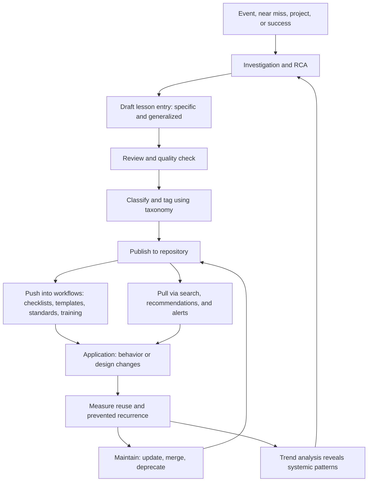
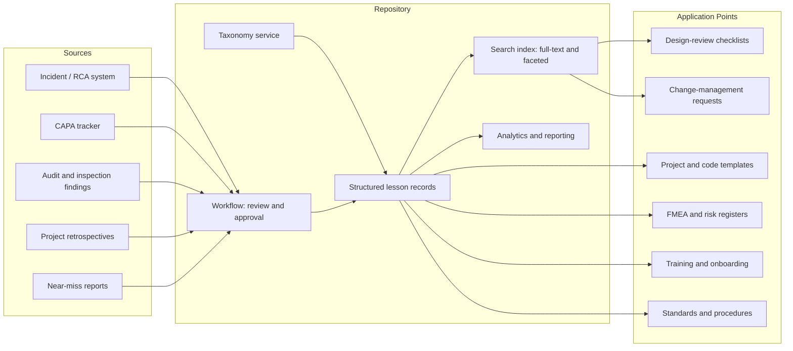
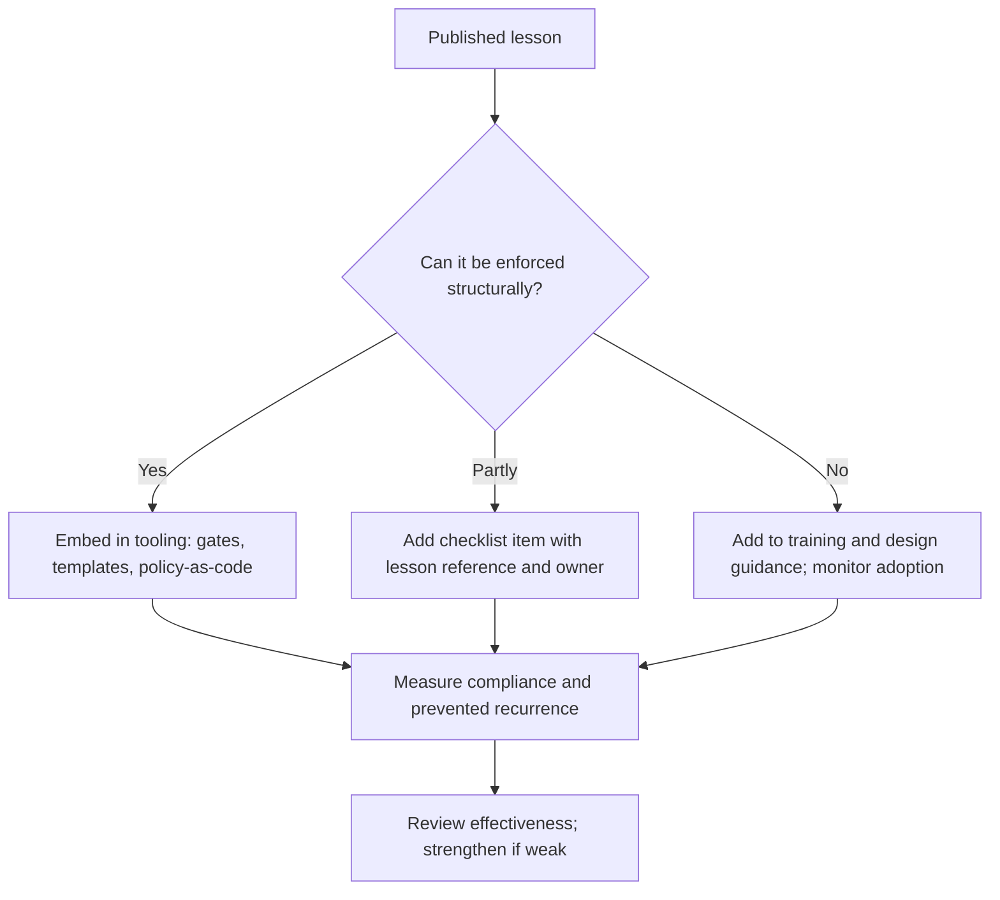
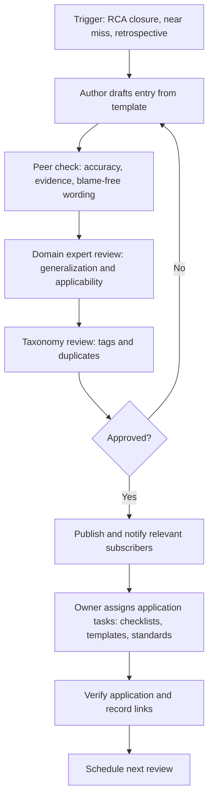

## Creating Lessons Learned Repositories


### Overview

A lessons learned repository is the organizational memory of what investigations discovered. Root Cause Analysis (RCA) generates knowledge at high cost: a team reconstructs a timeline, tests hypotheses, verifies causes, and designs fixes. If that knowledge stays inside a single report, it helps exactly one process on exactly one occasion. A well-designed repository turns each investigation into a reusable asset, so that the next design review, change request, launch checklist, or new hire benefits from what the last failure taught.

The central problem is well known: most organizations **capture** lessons but do not **learn** from them. Reports are filed in folders no one searches, written in language only the authors understand, and never connected to the moments when the knowledge would have mattered. A repository succeeds or fails on three properties:

| Property | Question | Failure Mode |
| --- | --- | --- |
| **Capture quality** | Are lessons specific, generalized, evidence-based, and actionable? | Vague entries ("improve communication") that teach nothing |
| **Findability** | Can the right person locate the right lesson at the right time? | Lessons buried in unsearchable attachments and inconsistent vocabulary |
| **Application** | Does the lesson actually change designs, procedures, checklists, and decisions? | A library that is admired but never consulted |

The third property is the decisive one. A lesson is **learned** only when behavior, design, or standards change. Documentation without application is archiving.

**Key Points**

- A repository is a **system**, not a folder: it includes a data model, taxonomy, workflow, governance, integration points, and metrics.
- Each entry should record both the **specific fix** and the **generalized principle** that transfers to other contexts.
- **Push** mechanisms (embedding lessons in checklists, templates, and reviews) matter more than **pull** mechanisms (search), because people rarely search for problems they do not know they have.
- Quality control, ownership, and maintenance are essential; a stale or unreliable repository is quickly abandoned.
- The repository must operate within a **blame-free, just culture**, or contributors will sanitize entries and the most valuable lessons will never be written.
- Success is measured by **reuse and prevented recurrence**, not by the number of entries.

---

### Purposes and Scope

#### What a Lessons Learned Repository Is For

| Purpose | Example Use |
| --- | --- |
| **Prevent recurrence elsewhere** | A pipeline check discovered after one outage is inherited by every service |
| **Inform design and planning** | Architects consult failure patterns when defining a new integration standard |
| **Accelerate investigations** | Investigators search prior cases for similar failure modes and proven verification tests |
| **Support risk assessment** | FMEA teams draw on real failure history to score occurrence and detection |
| **Onboard and train** | New engineers study representative cases |
| **Demonstrate due diligence** | Auditors and regulators see systematic capture and use of learning |
| **Detect systemic patterns** | Trend analysis reveals repeated cause categories across unrelated incidents |
| **Preserve tacit knowledge** | Insight from departing experts is recorded before it leaves |

#### What Belongs in the Repository

| Include | Exclude or Handle Separately |
| --- | --- |
| Verified root causes and contributing factors | Unverified speculation presented as fact |
| Generalized principles and design rules | Personal blame, performance judgments, or disciplinary detail |
| Effective detection, response, and recovery practices | Raw evidence bulk (link to the case file instead) |
| Verification methods that worked (tests, experiments) | Sensitive personal data, privileged legal analysis, or security-restricted specifics (store with controlled access) |
| Near misses and "where we got lucky" | Duplicate copies of full reports |
| Effectiveness results (did the fix work?) | Obsolete or superseded guidance without a deprecation marker |
| Extent-of-condition findings, including negative results |  |
| Links to related cases, standards, and actions |  |

#### Scope Decisions

| Decision | Options | Considerations |
| --- | --- | --- |
| **Breadth** | Single team, department, site, enterprise, or industry-shared | Wider scope increases reuse but demands stronger taxonomy and governance |
| **Event types** | Incidents only, or also near misses, audits, projects, launches, and successes | Including near misses and successes increases learning volume and reduces blame association |
| **Severity threshold** | All events, or only above a defined severity or novelty | Too low floods the repository; too high loses valuable minor lessons |
| **Access** | Open to all, role-based, or tiered by sensitivity | Balance discoverability against confidentiality and regulatory constraints |
| **Time horizon** | Permanent, or reviewed and retired periodically | Guidance can become obsolete as technology changes |

---

### The Learning Lifecycle

A repository is one component of a larger cycle that runs from event to changed behavior.



| Stage | Purpose | Key Output |
| --- | --- | --- |
| **Capture** | Record the lesson while memory and evidence are fresh | Draft entry |
| **Validate** | Confirm accuracy, evidence, and generalizability | Reviewed entry |
| **Classify** | Make it findable and analyzable | Tags and metadata |
| **Publish** | Make it accessible | Repository record |
| **Disseminate** | Reach people who need it | Notifications, briefings, embedded controls |
| **Apply** | Change design, process, standards, or behavior | Updated artifacts and decisions |
| **Verify reuse** | Confirm the lesson is being used | Usage and outcome data |
| **Maintain** | Keep content accurate and relevant | Updates, merges, deprecations |
| **Analyze** | Find patterns across entries | Trend reports and systemic actions |

---

### Anatomy of a High-Quality Lesson Entry

A lesson entry is a compact, standardized record. Its power comes from **structure** (which enables search and analysis) and **generalization** (which enables transfer).

#### Recommended Data Model

| Field Group | Field | Purpose | Example |
| --- | --- | --- | --- |
| **Identity** | **Lesson ID** | Unique, stable reference | LL-2026-0311 |
|  | **Title** | Concise, descriptive, blame-free | "Batch jobs must fail loudly on record errors" |
|  | **Status** | Draft, in review, published, superseded, deprecated | Published |
|  | **Version and dates** | Created, last reviewed, next review | v1.2; reviewed 2026-11-01 |
|  | **Author, owner, reviewer** | Accountability | A. Nguyen; owner: Architecture Lead |
| **Context** | **Source case(s)** | Links to RCA, incident, CAPA | RCA-2026-0142; CAPA-2026-0142 |
|  | **Event summary** | Two to four sentences | 3.1% of orders shipped to outdated addresses after silent record skipping |
|  | **Domain / process / system** | Where it applies | Integration; order fulfillment |
|  | **Lifecycle phase** | Design, build, test, deploy, operate, maintain, retire | Design; operate |
|  | **Severity / impact class** | Consequence level | High |
| **Insight** | **Root cause(s) and contributing factors** | Verified causes, system-level | Standard lacked failure-visibility requirement |
|  | **What worked** | Effective practices | Log correlation isolated the failure within hours |
|  | **What did not** | Missed signals, ineffective steps | Complaints not correlated with system events for 13 days |
|  | **Where we got lucky** | Mitigating circumstances not to be relied upon | Affected orders were low-value |
| **Transferable knowledge** | **Generalized principle** | Reusable rule beyond the case | "Automated jobs must fail loudly and alert; silent skipping is prohibited" |
|  | **Recommendation / required practice** | What to do | Add failure-alerting requirement to job design standard |
|  | **Applicability conditions** | When it applies and when it does not | Batch or scheduled jobs that process records; not interactive requests |
|  | **Anti-pattern** | What to avoid | "Log and continue" without a counter or alert |
|  | **Verification method** | How to confirm the lesson is implemented | Seeded-failure test; pipeline policy check |
| **Evidence** | **Confidence level** | Strength of evidence | High (reproduced) |
|  | **Assumptions and gaps** | Known uncertainty | Field-limit constancy across regions partially verified |
|  | **Effectiveness result** | Did the fix work? | Rate returned to 0.4% baseline; 0 unalerted skips in 90 days |
| **Linkage** | **Related lessons and standards** | Cross-references | LL-2025-0207; Integration Design Standard v3 |
|  | **Actions created** | Standards, templates, checklists updated because of this lesson | Checklist item CL-14; pipeline template v2.3 |
| **Retrieval** | **Tags / taxonomy terms** | Findability and trend analysis | failure-mode: silent-failure; cause-category: missing-alert |
|  | **Keywords and synonyms** | Search coverage | "skipped records," "swallowed error," "log and continue" |
| **Governance** | **Access level** | Confidentiality handling | Internal |
|  | **Review cadence** | Freshness control | Annual |

**Key Points**

- Not every field is needed for every entry. Define a **minimum viable entry** and scale detail to severity and reuse potential.
- The **generalized principle** is the most valuable field and the one most often omitted or written poorly.
- Include **applicability conditions** so readers can tell when a lesson does not apply; overgeneralized lessons breed rejection.

#### Specific Fix vs. Generalized Principle

| Level | Question | Example |
| --- | --- | --- |
| **Specific (local)** | What did we change in this system? | "Set nightly sync job to fail loudly and page on-call when any record is skipped." |
| **Class (pattern)** | What type of failure is this? | "Silent data loss in scheduled batch jobs." |
| **Principle (transferable)** | What rule prevents this class everywhere? | "Any automated process that can drop or defer work must make that visible through an alert or counter." |
| **Structural (embedded)** | Where is the rule enforced? | "Shared pipeline template blocks jobs lacking a failure-visibility check." |

Write entries at **all four levels**. Local detail supports verification; the principle supports reuse; the structural link supports enforcement.

#### Writing Quality

| Weak Entry | Strong Entry |
| --- | --- |
| "Communication was poor." | "The migration checklist did not require confirmation that scheduled-job configurations were included in the import manifest, so the sync job's error handling reverted to defaults. Add a job-inventory reconciliation step to every platform migration checklist." |
| "Operators should be more careful." | "The calibration step took 12 minutes and conflicted with line-rate targets, and no interlock enforced it, so it was routinely skipped. Design procedures so the compliant path is also the fastest path, and enforce critical steps with tooling." |
| "Test more." | "The test plan had no case for oversized records because requirements did not specify maximum lengths. Derive boundary-value tests from every field-length constraint in the data contract." |

---

### Designing the Taxonomy

A taxonomy is the controlled vocabulary that makes entries findable and analyzable. Without it, the same failure appears under a dozen different names and patterns remain invisible.

#### Multi-Facet Classification

Use several independent facets rather than a single deep hierarchy. Users search from different starting points (a technology, a process step, a failure symptom, a cause type).

| Facet | Purpose | Example Values |
| --- | --- | --- |
| **Domain / business area** | Who is affected | Manufacturing; software platform; supply chain; clinical operations |
| **Process or system** | Where it happened | Order fulfillment; database migration; label station |
| **Lifecycle phase** | When in the lifecycle | Requirements; design; build; test; deploy; operate; maintain |
| **Failure mode** | How it failed | Silent failure; data loss; timeout; contamination; dimensional drift |
| **Cause category** | Why (system level) | Missing control; inadequate validation; ambiguous requirement; design gap; change-management gap; resourcing conflict; incentive conflict |
| **Detection gap** | Why it was not caught earlier | No alert; no reconciliation; insufficient test coverage |
| **Control type** | Which barrier failed or was added | Prevention; detection; mitigation; recovery |
| **Action strength** | Strength of the fix | Strong; intermediate; weak |
| **Severity / impact** | Consequence class | Low; medium; high; critical |
| **Technology / equipment** | Specific technologies | Scheduler; message queue; injection molding machine |
| **Organizational factor** | Human and organizational contributors | Handoff; workload; training; production pressure |
| **Regulatory / standard reference** | Compliance linkage | Requirement identifiers |

#### Taxonomy Design Principles

| Principle | Guidance |
| --- | --- |
| **Controlled vocabulary** | Use defined terms with definitions; avoid free-form tags for core facets |
| **Synonyms and aliases** | Map variants to a preferred term ("swallowed error," "silent skip," "log-and-continue") |
| **MECE where possible** | Categories mutually exclusive and collectively exhaustive within a facet |
| **Depth limit** | Two or three levels is usually enough; deeper hierarchies are hard to apply consistently |
| **System-level cause categories** | Avoid categories such as "human error" that halt analysis prematurely |
| **Allow multiple tags** | Real events have several causes and lessons |
| **Stable identifiers** | Term IDs persist when labels are renamed |
| **Governance** | A named owner approves new terms and retires unused ones |
| **Evolution** | Review the taxonomy periodically against actual usage and search logs |
| **Blend of controlled and free tags** | Controlled core facets plus limited free keywords for emerging topics |

[Inference: Existing frameworks (for example, industry cause-classification schemes, human factors taxonomies, and service-management categories) can seed a taxonomy, but most organizations adapt them to local vocabulary. Choose an approach that people will actually apply consistently.]

**Key Points**

- Taxonomy quality determines **trend-analysis quality**. If cause categories are applied inconsistently, aggregate statistics mislead.
- Pilot the taxonomy on 20 to 30 real cases and measure **inter-rater agreement** (do two people classify the same case the same way?) before rolling it out.

An agreement measure such as Cohen's kappa can quantify consistency between two classifiers:

$$\kappa = \frac{p_o - p_e}{1 - p_e}$$

where $p_o$ is observed agreement and $p_e$ is agreement expected by chance. Higher values indicate more consistent classification. [Inference: Commonly cited interpretation bands treat values above roughly 0.6 as substantial agreement, but appropriate thresholds depend on context.]

---

### Repository Architecture and Platform Options

#### Functional Requirements

| Requirement | Description |
| --- | --- |
| **Structured records** | Enforce the data model and required fields |
| **Full-text and faceted search** | Search text plus filter by taxonomy facets |
| **Linking** | Cross-reference lessons, cases, actions, standards, risks, and assets |
| **Version control and audit trail** | Track changes, reviews, and approvals |
| **Workflow** | Draft, review, approve, publish, review-due, deprecate |
| **Access control** | Role-based permissions and sensitivity tiers |
| **Notifications** | Alerts for new lessons relevant to a user's area; review reminders to owners |
| **Integration** | Connections to incident, CAPA, ticketing, design-review, and change systems |
| **Analytics** | Dashboards for usage, coverage, and pattern trends |
| **Export and reporting** | Reports for management review and audits |
| **Accessibility** | Usable on the devices and in the contexts where people work |
| **Attachment handling** | Link to evidence stores rather than duplicating |

#### Platform Options

| Option | Strengths | Limitations | Suitable For |
| --- | --- | --- | --- |
| **Wiki / knowledge base** | Easy authoring, linking, and search; low cost | Weak structure enforcement; drift without governance | Small to mid-sized teams |
| **Structured database / CAPA or quality system module** | Enforced fields; workflow; audit trail; integrates with CAPA | Can be rigid and cumbersome to author | Regulated environments; large programs |
| **Ticketing or incident-management tool with a lessons module** | Close to incident workflows | Search and taxonomy may be limited | IT and operations teams |
| **Document repository (shared drive, document management)** | Familiar and simple | Poor findability; no structure; hard to analyze | Minimal starting point (limited long-term value) |
| **Purpose-built knowledge management platform** | Rich search, recommendations, and analytics | Cost; adoption effort | Enterprise programs |
| **Git-based Markdown repository ("docs as code")** | Version control, review workflow, diffs, automation | Requires technical comfort; less friendly for non-technical contributors | Engineering-heavy organizations |
| **Hybrid (structured records + wiki narrative + search layer)** | Balances structure and readability | Integration complexity | Many mature programs |

**Selection criteria:** user population and skills, regulatory requirements, integration needs, expected volume, search quality, cost, and maintenance capacity. [Inference: Tool choice matters less than governance and integration; a modest tool used with discipline outperforms a sophisticated one that nobody maintains.]

#### Reference Architecture



Key integration points that turn a library into a working system:

| Integration | Effect |
| --- | --- |
| **RCA closure gate** | A case cannot close until a lesson entry is drafted or a waiver is recorded |
| **Design-review checklist generation** | Checklist items are generated from lessons tagged to the relevant domain and lifecycle phase |
| **Change-request tooling** | When a change touches a tagged system, relevant lessons are surfaced automatically |
| **Project templates** | New projects inherit controls and prompts derived from lessons |
| **Risk register / FMEA** | Failure modes link to real cases, improving occurrence and detection ratings |
| **Onboarding paths** | Role-specific lesson reading lists |
| **Incident triage** | Similar-case suggestions appear when a new incident is opened |

---

### Push and Pull: Getting Lessons Used

#### The Pull Problem

Search-based repositories depend on users knowing they have a problem worth searching for. People usually do not search for failure modes they have never considered. Pull mechanisms are necessary but not sufficient.

| Pull Mechanism | Purpose |
| --- | --- |
| **Good search with synonyms and facets** | Investigators and designers find relevant cases |
| **"Similar cases" suggestions** | Surface related lessons when opening an incident or change |
| **Browsable pattern libraries** | Learning by exploring common failure classes |
| **Subscriptions and alerts** | Notify teams when lessons appear in their domain |

#### Push Mechanisms: Embedding in Workflow

| Push Mechanism | How It Works |
| --- | --- |
| **Checklists** | Convert lessons into review items ("Does every batch job alert on skipped records?") |
| **Templates and scaffolding** | Bake protections into starting points (pipeline templates, design docs, procedures) |
| **Automated controls** | Policy-as-code, linters, and gates that enforce lessons without human recall |
| **Standards and procedures** | Update controlled documents; link back to the lesson |
| **Design reviews and gate reviews** | Require explicit consideration of relevant lessons |
| **Training and onboarding** | Use cases and principles in curricula |
| **Regular forums** | Reliability reviews, quality forums, and safety briefings featuring recent lessons |
| **Pre-mortems and FMEA** | Seed risk brainstorming with real failure history |
| **Just-in-time prompts** | Surface relevant lessons at the moment of decision (for example, when scheduling a migration) |

The strongest form of push is **structural enforcement**, consistent with the action strength hierarchy:

| Strength | Lesson Application | Example |
| --- | --- | --- |
| **Strong** | Enforced by design or automation | Pipeline blocks jobs lacking failure alerts |
| **Intermediate** | Forced prompts and checklists | Mandatory checklist field with lesson reference |
| **Weak** | Awareness only | Email announcement or one-time training |

[Inference: Awareness measures alone tend to decay quickly; pairing them with embedded controls is more durable.]



---

### Capture Process: Making Contribution Easy and Reliable

#### When to Capture

| Trigger | Timing |
| --- | --- |
| **RCA closure** | Mandatory step; lesson entry drafted before closure |
| **Near miss** | Shortly after the event; lower barriers encourage reporting |
| **Project or release retrospective** | At milestones and completion |
| **Audit or inspection findings** | After findings are analyzed |
| **Successful practices** | When something worked unusually well |
| **Personnel transitions** | Structured knowledge capture before experts depart |
| **Periodic reviews** | Quarterly scans for uncaptured learning |

#### Contribution Workflow



#### Making Contribution Frictionless

| Barrier | Countermeasure |
| --- | --- |
| **Time cost** | Pre-populate fields from the RCA report; use a short template; allow a "minimum viable" entry for low-severity events |
| **Uncertainty about what to write** | Provide guidance, examples, and prompts ("What would you tell a team starting a similar project?") |
| **Fear of blame** | Just-culture framing; anonymized or system-focused wording; leadership modeling |
| **No perceived value** | Show reuse and prevented recurrence; recognize contributors |
| **Competing priorities** | Make lesson capture a defined step in closure workflows with allocated time |
| **Tool complexity** | Simple forms; integration with tools people already use |
| **Unclear ownership** | Assign an author and an owner for each lesson |
| **Perfectionism** | Allow draft status and iterative improvement |

#### Facilitated Capture Techniques

| Technique | Description |
| --- | --- |
| **After-action review (AAR)** | Short structured discussion: what was intended, what happened, why the difference, what to sustain or improve |
| **Retrospective / post-incident review** | Facilitated session using timeline and causal analysis |
| **Structured interviews** | Capture expert knowledge with guided questions |
| **Storytelling / narrative case format** | Concise stories with a clear takeaway; more memorable than tables |
| **Pre-mortem** | Prospective analysis that complements retrospective lessons |
| **Cross-team learning reviews** | Present lessons to teams facing similar risks |

---

### Quality Assurance for Entries

A repository's credibility depends on entry quality. Apply lightweight review before publication.

| Review Criterion | Pass Condition |
| --- | --- |
| **Accuracy** | Facts match the RCA and evidence; numbers reconciled |
| **Evidence-based** | Claims cite evidence or are labeled as inference or assumption |
| **System-level cause** | Root cause names conditions and control gaps, not individuals |
| **Generalized** | A transferable principle is stated, with applicability conditions |
| **Actionable** | Specific recommendations and verification methods are provided |
| **Blame-free** | Neutral, factual, system-focused language |
| **Effectiveness stated** | Result of the fix is recorded, or a plan and date to record it |
| **Uncertainty honest** | Confidence and gaps stated |
| **Classified** | Tags applied from controlled vocabulary; duplicates checked |
| **Linked** | Related lessons, standards, and actions cross-referenced |
| **Readable** | Plain language; concise; jargon defined |
| **Appropriately restricted** | Sensitive content handled with correct access level |

Suggested quality scoring (for internal review, not punitive use):

| Dimension | Weight | Scale |
| --- | --- | --- |
| Specificity and clarity | 20% | 0 to 5 |
| Generalization quality | 25% | 0 to 5 |
| Evidence and confidence | 20% | 0 to 5 |
| Actionability | 20% | 0 to 5 |
| Classification and linkage | 15% | 0 to 5 |

$$\text{Quality score} = \sum_{i} w_i \cdot s_i$$

[Inference: Scoring rubrics are useful for calibrating reviewers and coaching authors, but should not become a bureaucratic barrier that suppresses contributions.]

---

### Governance, Ownership, and Maintenance

A repository without governance decays. Duplicate entries accumulate, outdated guidance persists, and users lose trust.

#### Roles

| Role | Responsibilities |
| --- | --- |
| **Program owner / sponsor** | Provides authority and resources; reports on program value to leadership |
| **Repository manager (curator)** | Maintains the system, taxonomy, and quality; runs reviews and merges duplicates |
| **Domain stewards** | Own lessons within a domain; ensure accuracy and application; review periodically |
| **Authors** | Draft entries; respond to review feedback |
| **Reviewers** | Assess quality and generalization |
| **Taxonomy owner** | Approves vocabulary changes |
| **Application owners** | Embed lessons into checklists, templates, and standards |
| **Consumers** | Use, comment on, and correct lessons |

#### Lifecycle States and Maintenance

| State | Meaning | Rules |
| --- | --- | --- |
| **Draft** | Under authorship | Not visible broadly |
| **In review** | Under quality and domain review | Time-boxed |
| **Published** | Approved and active | Review date assigned |
| **Under revision** | Being updated due to new evidence or changed context | Flag visible to users |
| **Superseded** | Replaced by a newer lesson | Link to the replacement |
| **Deprecated** | No longer applicable | Reason recorded; retained for history |
| **Archived** | Retained for records, excluded from default search | Per retention policy |

#### Maintenance Practices

| Practice | Purpose |
| --- | --- |
| **Scheduled reviews** | Each lesson has an owner and review date (for example, annually) |
| **Duplicate detection and merging** | Consolidate near-identical lessons into a stronger single entry |
| **Refresh on change** | When a technology, standard, or process changes, review linked lessons |
| **Effectiveness updates** | Add long-term results and recurrence information |
| **Feedback mechanism** | Users flag errors, request clarification, or report that a lesson helped |
| **Retirement of obsolete content** | Mark deprecated guidance so it is not applied wrongly |
| **Taxonomy review** | Adjust vocabulary based on search logs and classification agreement |
| **Health audits** | Periodic sampling for quality, links, and orphan entries |

**Key Points**

- Assign each lesson an **owner**, not just an author; authors move on, owners maintain.
- **Deprecate rather than delete** so history is preserved and the reason for change is clear.
- Tie repository health metrics to management review.

---

### Culture: Making It Safe and Valuable to Contribute

Even a perfect system fails if people fear consequences or see no benefit.

| Cultural Factor | Practice |
| --- | --- |
| **Just culture** | Distinguish human error, at-risk behavior, and reckless behavior; focus lessons on system conditions |
| **Leadership modeling** | Leaders contribute their own lessons and reference the repository in decisions |
| **Recognition** | Acknowledge contributors and teams whose lessons prevented recurrence |
| **Psychological safety** | Encourage reporting of near misses and mistakes; respond to reports with curiosity, not punishment |
| **Time allocation** | Provide dedicated time for capture and review |
| **Visible impact** | Publicize examples where a lesson prevented a problem |
| **Include successes** | Capture what went well to balance failure focus |
| **Cross-boundary sharing** | Reward sharing across teams and sites, not just within them |
| **Non-punitive use of data** | Use repository metrics for improvement, not individual evaluation |

**Anti-patterns to avoid**

| Anti-Pattern | Effect |
| --- | --- |
| Using lessons as evidence in performance reviews | Suppresses honest entries |
| Requiring lessons but not reading them | Compliance theater |
| Rewarding volume of entries | Low-quality, duplicated content |
| Naming individuals in causes | Defensiveness and sanitized reports |
| Leadership ignoring the repository in decisions | Signals it does not matter |

---

### Metrics: Measuring Whether Learning Is Happening

Measure application and outcomes, not just accumulation.

| Metric | Definition | Interpretation |
| --- | --- | --- |
| **Capture rate** | Closed RCAs with a published lesson ÷ closed RCAs | Process compliance |
| **Time to publish** | Median days from RCA closure to publication | Timeliness of capture |
| **Quality score distribution** | Review scores across entries | Content quality trend |
| **Search success rate** | Searches ending in a viewed or used lesson ÷ searches | Findability |
| **Zero-result search rate** | Searches with no results ÷ searches | Vocabulary or coverage gaps |
| **Reuse rate** | Lessons referenced in design reviews, changes, or investigations ÷ lessons published | Application |
| **Lesson-to-control conversion** | Lessons that resulted in an embedded checklist, template, or automated control ÷ lessons published | Structural application |
| **Coverage of high-risk areas** | Proportion of critical processes with relevant lessons linked | Where knowledge is thin |
| **Repeat-cause rate** | Incidents whose cause category matches a prior lesson ÷ total incidents | Whether learning prevents recurrence |
| **Recurrence rate after lesson publication** | Recurrence of the same failure mode in areas covered by a lesson | Effectiveness of deployment |
| **Staleness** | Lessons past their review date ÷ published lessons | Maintenance health |
| **Duplicate rate** | Near-duplicate entries ÷ entries | Governance quality |
| **User satisfaction / usefulness rating** | Feedback scores | Perceived value |
| **Time saved in investigations** | Reduction in time to identify root cause when similar lessons exist | Value realization |

$$\text{Lesson-to-control conversion} = \frac{\text{Lessons with an embedded control}}{\text{Lessons published}} \times 100\%$$


$$\text{Repeat-cause rate} = \frac{\text{Incidents matching a cause category with a prior lesson}}{\text{Total incidents}} \times 100\%$$

**Interpretation notes**

- A **high repeat-cause rate** despite many published lessons indicates a **push/application failure**, not a capture failure.
- A **rising zero-result search rate** points to taxonomy or coverage gaps.
- A **low conversion rate** suggests lessons remain awareness-only.
- Plot these on control charts to distinguish genuine change from normal variation before reacting. [Inference: Any single metric can mislead; interpret them together.]

---

### Trend Analysis: Finding Systemic Patterns

A structured repository enables analysis that individual reports cannot.

| Analysis | Question | Method |
| --- | --- | --- |
| **Cause-category Pareto** | Which system-level causes recur most? | Pareto chart on cause-category tags |
| **Failure-mode trends** | Are certain failure modes rising or falling? | Time-ordered counts with control chart |
| **Lifecycle-phase distribution** | Where do failures originate (design, deploy, operate)? | Cross-tab of cause category by phase |
| **Detection-gap patterns** | What detection weaknesses recur? | Frequency of detection-gap tags |
| **Action-strength analysis** | Do weak actions correlate with recurrence? | Compare recurrence by action-strength tag |
| **Co-occurrence analysis** | Which causes appear together? | Association across tags |
| **Domain hotspots** | Which areas generate the most learning? | Counts by domain, normalized for volume and exposure |
| **Time-to-detect trends** | Is detection improving? | TTD by period |

Pareto cumulative share for cause categories:

$$\text{Cumulative share}_k = \frac{\sum_{i=1}^{k} n_i}{\sum_{i=1}^{m} n_i} \times 100\%$$

**Example**

| Cause Category | Lessons | Share | Cumulative |
| --- | --- | --- | --- |
| Missing detection or alerting | 18 | 30% | 30% |
| Change-management gap | 14 | 23% | 53% |
| Ambiguous or missing requirement | 11 | 18% | 71% |
| Resourcing or incentive conflict | 9 | 15% | 86% |
| Other | 8 | 14% | 100% |

If missing detection accounts for 30% of lessons, a **single structural intervention** (for example, a mandatory observability review in design gates) may prevent a large fraction of future incidents. This is the payoff of a structured repository: it converts individual lessons into **portfolio-level priorities**.

[Inference: Frequency is not the same as severity; combine counts with impact weighting when prioritizing systemic actions. Small counts also produce noisy patterns, so treat trends cautiously and check for special-cause signals before drawing conclusions.]

---

### Handling Sensitive and Restricted Information

Lessons often involve confidential, security-sensitive, personal, or legally sensitive details.

| Concern | Approach |
| --- | --- |
| **Personal data** | Exclude names and identifying details; refer to roles |
| **Security vulnerabilities** | Store technical exploit details in restricted systems; publish the general principle in the broader repository |
| **Legal privilege / litigation hold** | Coordinate with Legal; separate privileged analysis from shareable lessons |
| **Customer or partner confidentiality** | Sanitize identifying information; respect contract terms |
| **Regulated data** | Follow applicable privacy and record-retention requirements |
| **Competitive or proprietary detail** | Use access tiers; abstract the lesson |
| **Cross-organization sharing** | Sanitize and obtain approvals before sharing externally or across corporate boundaries |

A common pattern is a **two-tier record**: a **public-within-organization** lesson with the generalized principle and sanitized context, linked to a **restricted** case file with full detail.

[Inference: Requirements vary by jurisdiction, industry, and contract. Confirm handling rules with legal, privacy, and security functions.]

---

### Templates

#### Lesson Entry Template (Markdown)

```markdown
### LL-YYYY-NNNN: <Concise, blame-free title>

- **Status / version / dates:**
- **Author / owner / reviewer:**
- **Source case(s):** <RCA, incident, CAPA IDs>
- **Domain / process / lifecycle phase:**
- **Severity class:**
- **Access level:**

**Event summary.** <Two to four sentences; quantified.>

**Root cause(s) and contributing factors.** <System-level; confidence level and basis.>

**What worked.** <Effective detection, response, recovery.>

**What did not work.** <Missed signals, ineffective steps.>

**Where we got lucky.** <Mitigating circumstances not to be relied upon.>

**Generalized principle.** <Reusable rule beyond this case.>

**Recommendation / required practice.** <Specific action others should take.>

**Applicability.** <Where this applies and where it does not.>

**Anti-pattern.** <What to avoid.>

**How to verify implementation.** <Test, audit, or automated check.>

**Effectiveness result.** <Outcome vs. baseline, or plan and date.>

**Assumptions and evidence gaps.** <Known uncertainty.>

**Where applied.** <Checklists, templates, standards, controls updated because of this lesson.>

**Related lessons / standards / actions.** <Links.>

**Tags.** failure-mode: ; cause-category: ; detection-gap: ; lifecycle-phase: ; technology: ; keywords:
```

#### Minimum Viable Entry (Low-Severity Events)

```markdown
### LL-YYYY-NNNN: <Title>

- **Source:** <ID>  **Domain:**  **Severity:** Low
- **What happened (1-2 sentences):**
- **System-level cause:**
- **Principle / recommendation (1-2 sentences):**
- **Where applied:**
- **Tags:**
```

#### Repository Charter Outline

| Section | Content |
| --- | --- |
| **Purpose and scope** | Why the repository exists; what it includes and excludes |
| **Roles and responsibilities** | Sponsor, curator, stewards, authors, reviewers |
| **Capture triggers and thresholds** | When entries are required |
| **Entry standards** | Template, quality criteria, language guidelines |
| **Taxonomy and tagging rules** | Facets, definitions, governance |
| **Workflow** | Draft, review, approve, publish, review, deprecate |
| **Integration requirements** | Closure gates, checklists, templates |
| **Access and confidentiality** | Tiers and handling rules |
| **Metrics and reporting** | Measures and review cadence |
| **Culture commitments** | Just-culture statement and non-punitive use of data |

---

### Implementation Sketch: Searching, Recommending, and Auditing Lessons

A compact Python example shows three core behaviors: faceted filtering with synonym expansion, a simple relevance-ranked "similar lessons" lookup, and an audit for stale or incomplete entries.

**Example**

```python
from dataclasses import dataclass, field
from datetime import date
import re

SYNONYMS = {
    "silent skip": ["swallowed error", "log and continue", "skipped records"],
    "alert": ["notification", "page", "alarm"],
}

@dataclass
class Lesson:
    lid: str
    title: str
    principle: str
    tags: dict                      # facet -> list of values
    next_review: date
    owner: str | None = None
    applied_in: list = field(default_factory=list)   # controls/checklists updated
    text: str = ""


def expand(query: str) -> set[str]:
    terms = set(re.findall(r"\w+", query.lower()))
    for key, alts in SYNONYMS.items():
        if key in query.lower():
            for a in alts:
                terms |= set(re.findall(r"\w+", a.lower()))
    return terms


def search(lessons, query, facet_filter=None):
    q = expand(query)
    results = []
    for l in lessons:
        if facet_filter:
            if any(v not in l.tags.get(f, []) for f, v in facet_filter.items()):
                continue
        doc_terms = set(re.findall(r"\w+", (l.title + " " + l.principle + " " + l.text).lower()))
        tag_terms = {t.lower() for vals in l.tags.values() for t in vals}
        score = len(q & doc_terms) + 2 * len(q & tag_terms)   # weight tag matches higher
        if score > 0:
            results.append((score, l))
    return [l for _, l in sorted(results, key=lambda x: -x[0])]


def audit(lessons, today):
    findings = []
    for l in lessons:
        if l.next_review < today:
            findings.append(f"{l.lid}: review overdue since {l.next_review}.")
        if not l.owner:
            findings.append(f"{l.lid}: no owner assigned.")
        if not l.applied_in:
            findings.append(f"{l.lid}: not linked to any embedded control (awareness-only).")
        if "cause-category" not in l.tags:
            findings.append(f"{l.lid}: missing cause-category tag.")
    return findings


lessons = [
    Lesson("LL-2026-0311", "Batch jobs must fail loudly on record errors",
           "Any automated process that can drop work must make that visible",
           {"cause-category": ["missing-alert"], "domain": ["integration"]},
           date(2027, 9, 1), "Architecture Lead", ["Pipeline template v2.3"],
           "Nightly sync used log and continue and skipped records silently"),
    Lesson("LL-2025-0207", "Derive boundary tests from field-length constraints",
           "Every data-contract limit needs a boundary-value test",
           {"cause-category": ["inadequate-validation"], "domain": ["integration"]},
           date(2026, 6, 1), None, [], ""),
]

hits = search(lessons, "silent skip in scheduled job", {"domain": "integration"} and None)
print("Search results:")
for l in hits:
    print(" -", l.lid, l.title)

print("\nAudit findings:")
for f in audit(lessons, date(2026, 9, 24)):
    print(" -", f)
```

**Output**

```text
Search results:
 - LL-2026-0311 Batch jobs must fail loudly on record errors

Audit findings:
 - LL-2025-0207: review overdue since 2026-06-01.
 - LL-2025-0207: no owner assigned.
 - LL-2025-0207: not linked to any embedded control (awareness-only).
```

The sketch demonstrates **synonym-aware retrieval** and **hygiene auditing** of the repository itself. Real platforms would use a proper search engine, richer ranking, and workflow-driven reminders. The audit surfaces the most common failure pattern: lessons with no owner and no embedded control that quietly become shelfware. [Inference: Production implementations typically integrate search and audit with the incident, CAPA, and change systems so lessons are surfaced automatically at the point of need.]

---

### Rollout Strategy

| Phase | Activities | Success Indicators |
| --- | --- | --- |
| **1. Define** | Set purpose, scope, and charter; identify sponsor and curator; choose a platform | Sponsor commitment; agreed scope |
| **2. Design** | Build data model, template, and taxonomy; define workflow and access | Pilot-ready structure |
| **3. Seed** | Convert 20 to 50 high-value past RCAs into quality entries; test the taxonomy | Entries reviewed; classification agreement acceptable |
| **4. Pilot** | Launch with one or two teams; integrate with RCA closure and one design-review checklist | Contributions flowing; feedback collected |
| **5. Integrate** | Connect to CAPA, incident, change, and design-review workflows; generate checklists | Lessons appearing at decision points |
| **6. Scale** | Extend to more domains; train authors and reviewers; publicize successes | Growing reuse; declining repeat causes |
| **7. Sustain** | Run reviews, audits, metrics, and taxonomy updates; report to management | Stable health metrics; recurring value |

**Key Points**

- **Start small and useful.** Seed the repository with a few excellent entries tied to real recurring problems rather than a large, mediocre archive.
- **Integrate early.** A repository disconnected from workflows will be ignored regardless of content quality.
- **Show value quickly.** Publicize the first instance where a lesson prevented a repeat.

---

### Common Pitfalls and Remedies

| Pitfall | Consequence | Remedy |
| --- | --- | --- |
| Treating the repository as an archive | Knowledge stored but never used | Design for application: checklists, templates, automation |
| Vague, unactionable entries | No transferable value | Require a generalized principle, applicability, and verification method |
| Only pull, no push | Lessons rarely encountered | Embed in workflow and enforce structurally |
| No taxonomy or inconsistent tagging | Poor search; invisible patterns | Controlled vocabulary; classification pilot; agreement checks |
| Free-text-only documents | Cannot filter or analyze | Structured fields plus narrative |
| No ownership or review dates | Stale, unreliable content | Owners, review cadence, deprecation process |
| Duplicate entries | Confusion and dilution | Curator merges; duplicate checks at submission |
| Blame in entries | Sanitized or absent contributions | Blame-free standards; just-culture leadership |
| Capture optional and unresourced | Lessons never written | Closure gate; allocated time; templates |
| Only failures captured | Negative association; missed good practice | Include successes and near misses |
| Over-bureaucratic review | Contributors give up | Proportionate review; minimum viable entry for minor events |
| Overgeneralized lessons | Rejection or misapplication | State applicability conditions and anti-patterns |
| Lessons never verified for effectiveness | Unknown value | Record outcomes; measure repeat-cause rate |
| Sensitive data exposed | Legal, privacy, or security harm | Two-tier records; access controls; sanitization |
| Metrics that reward volume | Low-quality content | Measure reuse, conversion to controls, and prevented recurrence |
| No leadership use | Signals irrelevance | Leaders reference lessons in reviews and decisions |
| Tool-first thinking | Expensive system, weak adoption | Start from workflow and governance; choose tools to fit |

---

### Best Practices Checklist

- Define **purpose, scope, and a charter** with a named sponsor, curator, and domain stewards.
- Use a **structured data model** with a **generalized principle**, applicability conditions, verification method, and effectiveness result for each lesson.
- Build a **multi-facet controlled taxonomy** with synonyms, system-level cause categories, and periodic review; test classification consistency.
- Make capture a **defined step in RCA closure**, with templates, pre-populated fields, and time allocated; allow a minimum viable entry for minor events.
- Apply **lightweight quality review** for accuracy, evidence, blame-free wording, generalization, and classification.
- **Push lessons into workflows** (checklists, templates, gates, automated controls, standards, training), prioritizing structural enforcement over awareness.
- Support **pull** with good search, similar-case suggestions, and subscriptions.
- Assign **owners and review dates**; merge duplicates; **deprecate rather than delete**.
- Foster a **just culture**: recognize contributors, protect psychological safety, and use metrics for improvement, not evaluation of individuals.
- Include **near misses and successes**, not only failures.
- Handle **sensitive information** with two-tier records, sanitization, and access control coordinated with legal, privacy, and security.
- Measure **reuse, lesson-to-control conversion, repeat-cause rate, and staleness**, and run trend analyses to find systemic patterns.
- **Start small, integrate early, and show value**, then scale and sustain with governance.

---

**Related Topics**

- Standard structure of an RCA report
- Documenting assumptions and evidence gaps
- Closing the loop and preventing recurrence
- Horizontal deployment and extent-of-condition reviews
- Designing taxonomies and controlled vocabularies for knowledge management
- After-action reviews, retrospectives, and blameless postmortems
- Embedding lessons into checklists, templates, and policy-as-code
- Trend analysis and Pareto methods for cause categories
- Just culture and psychological safety in organizational learning
- Knowledge management governance and content lifecycle management