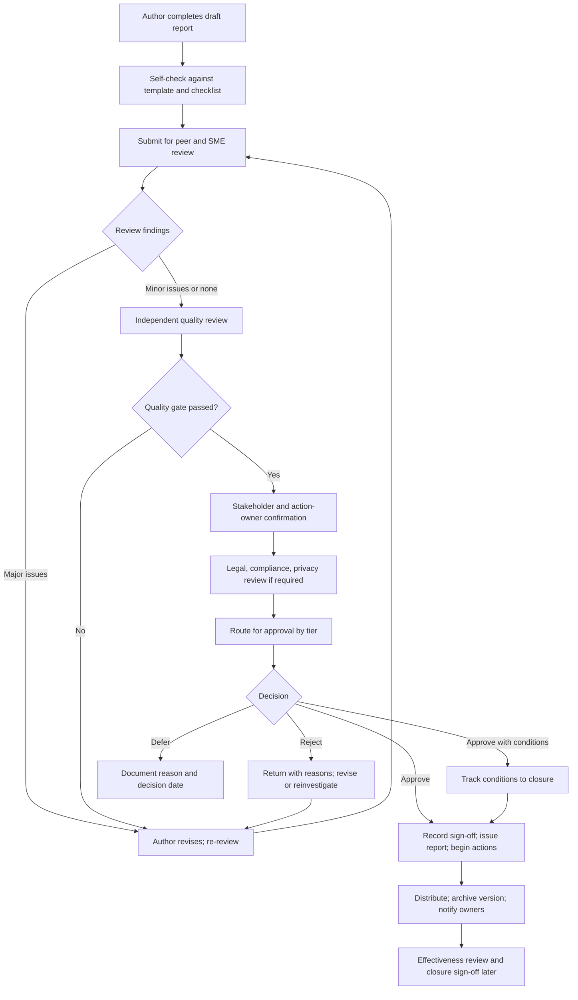
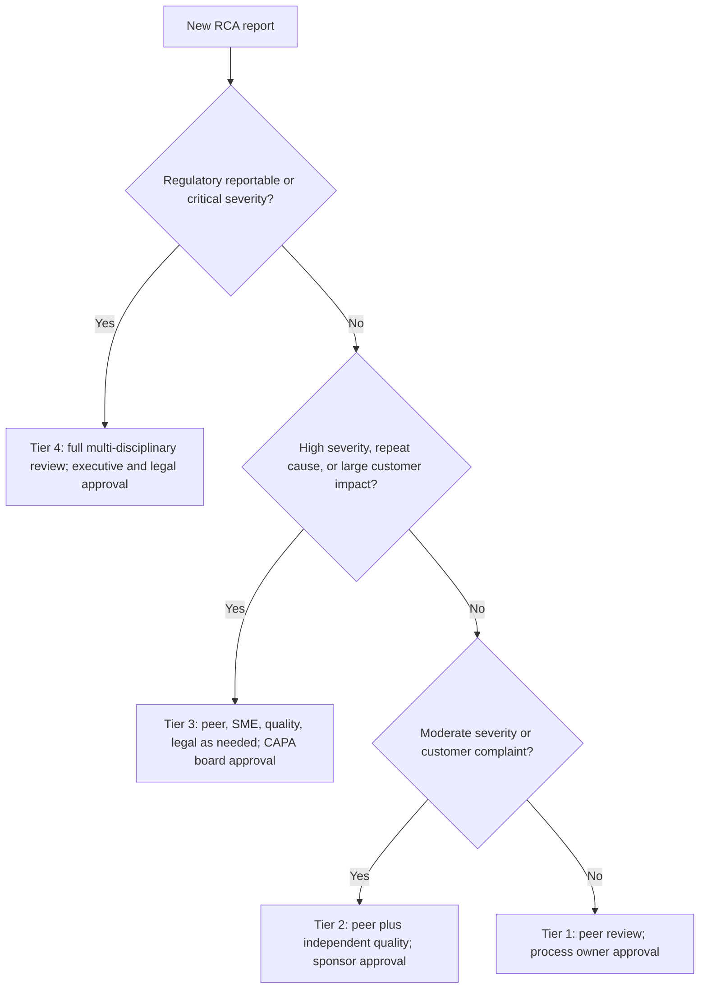
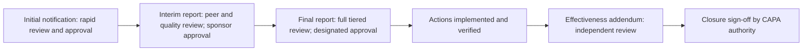
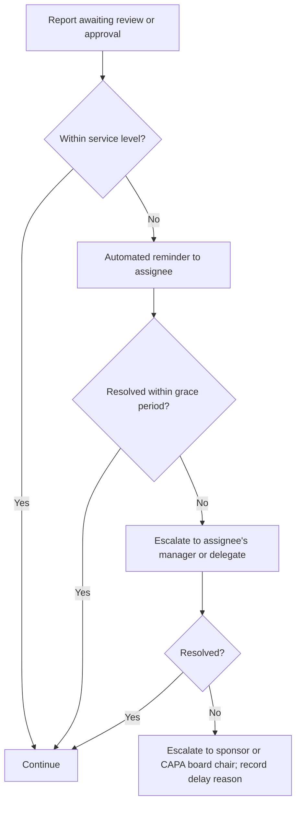

## Report Review and Sign-Off Workflows


### Overview

A Root Cause Analysis (RCA) report is only as trustworthy as the process that vetted it. Between the moment an investigator writes "root cause identified" and the moment an organization acts on that conclusion, the report needs to pass through **structured review** (challenge, correction, and improvement) and **formal sign-off** (authorized acceptance of the findings and commitments). Without this workflow, reports carry unchallenged assumptions, actions lack real ownership, and leaders discover gaps only when the problem recurs or an auditor asks who approved the conclusion.

Review and sign-off serve two distinct but related purposes:

| Purpose | Function | Typical Question |
| --- | --- | --- |
| **Review** | Improve the quality and correctness of the analysis | "Is the reasoning sound, the evidence adequate, and the report clear?" |
| **Sign-off (approval)** | Confer authority and accountability | "Do we accept these conclusions and commit to these actions, resources, and risks?" |

They are not the same activity and should not be performed by the same people in the same step. Reviewers **test** the report; approvers **accept** it. Blurring the two produces rubber-stamping (approval without scrutiny) or endless debate (approval sought before quality is established).

A well-designed workflow also has to balance competing pressures: **rigor** against **speed** (containment and customer commitments cannot wait weeks for signatures), **independence** against **expertise** (the best reviewers may know the system too well), and **accountability** against **blame-free culture** (signing a report should mean owning the follow-through, not being blamed for the event).

**Key Points**

- **Review improves the report; sign-off authorizes it.** Keep the two distinct.
- Review should be **independent, criteria-based, and evidence-focused**, not a proofreading pass.
- Approval authority should be matched to **severity, risk, and commitment size**, using tiered workflows.
- Every approval should be **recorded, dated, and traceable**, with the version approved clearly identified.
- Workflows need **time limits, escalation paths, and delegation rules**, or they become the bottleneck they were meant to prevent.
- Review must remain **blame-free**: critique the reasoning and evidence, not the investigator.
- A sign-off is a **commitment to follow-through**, so approvers must have authority over the resources and actions they endorse.
- **Staged reporting** (initial, interim, final, effectiveness) requires review and approval at each stage, scaled to its purpose.

---

### Review vs. Approval: Distinct Roles and Activities

| Dimension | Review | Approval (Sign-Off) |
| --- | --- | --- |
| **Goal** | Verify quality, challenge reasoning, find gaps | Accept findings, commit resources, accept residual risk |
| **Nature** | Analytical and iterative | Decisional and terminal for that version |
| **Performed by** | Peers, subject-matter experts, independent reviewers, quality function | Accountable authority: sponsor, process owner, quality head, CAPA board, executive |
| **Output** | Comments, required changes, recommendation | Approve, approve with conditions, reject, or defer |
| **Depth** | Detailed, line-level where needed | Focused on conclusions, commitments, and risk |
| **Independence** | Should include people not involved in the event | Should include authority over the affected process and resources |
| **Timing** | Before approval; possibly multiple rounds | After review is satisfied |
| **Accountability** | For the quality of critique | For the decision and its consequences |

#### Types of Review

| Review Type | Focus | Performed By | When |
| --- | --- | --- | --- |
| **Peer review** | Technical accuracy, logic, and clarity | Colleague with relevant expertise, not on the investigation team | Draft complete |
| **Subject-matter expert (SME) review** | Domain correctness of causal claims and proposed actions | Engineers, clinicians, scientists | Analysis and action sections |
| **Independent / quality review** | Adherence to method, evidence sufficiency, traceability, blame-free tone | Quality or RCA-competent reviewer | Before approval |
| **Stakeholder review** | Feasibility, impact, and acceptance of actions | Action owners, affected departments | Action plan drafted |
| **Legal / compliance / privacy review** | Regulatory obligations, privileged content, personal data, external statements | Legal, compliance, privacy officers | Before distribution of sensitive reports |
| **Customer / regulator review** | Acceptance of the report or corrective action commitments | External party | When contractually or legally required |
| **Executive review** | Strategic risk, resource decisions, external exposure | Senior leadership | High-severity events |
| **Effectiveness review** | Whether actions worked, and closure decision | Independent reviewer | After the monitoring window |

---

### The End-to-End Workflow



| Stage | Purpose | Key Output |
| --- | --- | --- |
| **1. Author self-check** | Catch obvious gaps before others spend time | Completed checklist |
| **2. Peer and SME review** | Test technical reasoning and evidence | Review comments and disposition |
| **3. Independent quality review** | Confirm method rigor, traceability, and completeness | Quality gate result |
| **4. Stakeholder confirmation** | Verify actions are feasible and owners accept | Owner acknowledgments |
| **5. Specialist review** | Address legal, regulatory, and privacy concerns | Clearance or required edits |
| **6. Approval routing** | Obtain authorized decision | Signed approval records |
| **7. Issue and distribution** | Publish the approved version | Controlled release |
| **8. Follow-up sign-offs** | Approve effectiveness and closure | Closure record |

[Inference: Not every event needs every stage. Tiering (described below) scales the workflow to risk so that minor issues are not delayed by heavyweight review.]

---

### Roles and Responsibilities

| Role | Responsibilities | Authority |
| --- | --- | --- |
| **Author / lead investigator** | Writes the report; responds to comments; maintains version history | Owns content; cannot approve own report |
| **Facilitator** | Led the RCA method; ensures analysis follows the method | Advisory in review |
| **Peer reviewer** | Tests reasoning and evidence; provides constructive critique | Recommends changes |
| **SME reviewer** | Validates domain-specific claims and action feasibility | Recommends changes |
| **Independent quality reviewer** | Applies review checklist; confirms traceability and blame-free tone | Can hold the quality gate |
| **Action owner** | Confirms they understand and accept assigned actions | Accepts or contests assignments |
| **Process owner** | Confirms accuracy about their process; commits to changes | Approves actions within their area |
| **Sponsor** | Provides resources; resolves cross-functional issues | Approves resource commitments |
| **Approving authority** | Formally accepts the report (varies by tier) | Approve, conditionally approve, reject, or defer |
| **CAPA board / review board** | Collective decision-making for significant cases | Approves plans, risk acceptance, closure |
| **Executive** | Accepts enterprise-level risk; external commitments | Final authority for high-severity events |
| **Legal / compliance / privacy** | Advise on obligations and sensitive content | Can require changes or restrict distribution |
| **Document controller / records manager** | Manages versions, distribution, retention | Ensures controlled records |

**Independence considerations**

| Situation | Concern | Mitigation |
| --- | --- | --- |
| Reviewer was involved in the event or the change under investigation | Bias toward defending decisions | Use a reviewer from another team |
| Author's manager is the sole approver | Pressure to soften findings | Independent quality reviewer and a second approver |
| Only people from one function review | Blind spots | Cross-functional review |
| Approver has a stake in the outcome | Conflict of interest | Recusal; alternate approver |
| Small organization with few qualified reviewers | Limited independence | External reviewer, peer-organization exchange, or a documented compensating control |

---

### Tiered Workflows: Matching Rigor to Risk

A single, heavyweight process applied to every report either overburdens low-risk items or under-reviews high-risk ones. Define **tiers** based on severity, novelty, regulatory exposure, and cost.

| Tier | Typical Trigger | Review | Approval | Target Cycle Time |
| --- | --- | --- | --- | --- |
| **Tier 1: Minor** | Low severity; low recurrence; contained; no regulatory impact | Peer review | Process owner or line manager | Days |
| **Tier 2: Standard** | Moderate severity; customer complaint; repeat issue | Peer plus independent quality review; stakeholder confirmation | Sponsor or functional director; quality approval | 1 to 2 weeks |
| **Tier 3: Major** | High severity; safety, regulatory, or large customer impact; significant cost | Peer, SME, independent quality, legal/compliance as needed | CAPA board; executive sponsor | 2 to 4 weeks (with interim reporting) |
| **Tier 4: Critical / externally reportable** | Catastrophic or regulator-reportable events; potential litigation | Multi-disciplinary and independent review; legal review mandatory; possible external expert review | Executive leadership, potentially board-level; external submission approvals | Per regulatory and contractual deadlines |

[Inference: Tier boundaries, review depth, and cycle times are illustrative. Define them in your CAPA procedure based on your risk classification scheme, regulatory obligations, and customer requirements.]

#### Determining Tier

| Factor | Question |
| --- | --- |
| **Severity** | What is the worst credible or actual consequence? |
| **Scope** | How many customers, products, sites, or systems? |
| **Regulatory / contractual** | Are there reporting obligations or customer-specified requirements? |
| **Recurrence** | Is this a repeat cause or a second failure? |
| **Novelty** | Is the failure mode new or poorly understood? |
| **Cost** | Direct and indirect financial exposure |
| **Reputation** | Public visibility |
| **Detectability** | Did the event escape controls silently? |



**Escalation of tier during review:** If reviewers find that severity, scope, or recurrence was underestimated, the tier should be raised and the workflow restarted at the appropriate level. Tier assignment should be **revisited** at defined points, not fixed permanently at intake.

---

### Review Criteria: What Reviewers Should Examine

Reviewers need explicit criteria, or comments drift into style preferences and pet theories. A structured checklist keeps review consistent and focused on substance.

#### Content Review Checklist

| Area | Review Questions |
| --- | --- |
| **Problem statement** | Is the deviation quantified with what, where, when, and how much? Is a baseline stated? Is the statement free of embedded causes? |
| **Impact** | Are impacts quantified across relevant dimensions? Are estimates labeled? |
| **Scope and method** | Are scope, exclusions, team, methods, and limitations stated? Is the method suited to the problem's complexity? |
| **Timeline** | Is it evidence-based, in a consistent time zone, with sources? Are detection and response milestones identified? |
| **Evidence** | Is there an evidence register? Are sources reliable and corroborated? Are gaps disclosed? |
| **Causal analysis** | Does each causal step cite evidence? Were alternatives considered and excluded with reasons? Does the chain reach a system-level cause? |
| **Root cause statements** | Are they specific, system-level, and blame-free? Are contributing factors and detection gaps separated? Is confidence stated? |
| **Assumptions and gaps** | Are assumptions and evidence gaps documented, with their effect on conclusions? |
| **Containment** | Is it distinguished from corrective action? Are retirement conditions defined? |
| **Actions** | Are they SMART, traced to causes, owned by single individuals, and of appropriate strength? Are there orphan actions or unaddressed causes? |
| **Effectiveness plan** | Are criteria, baseline, window, method, reviewer, and review date defined in advance? |
| **Extent of condition** | Were other processes, products, or sites assessed, including negative findings? |
| **Lessons learned** | Are generalized principles and application points stated? |
| **Consistency** | Do numbers, dates, and claims agree across sections and with the executive summary? |
| **Tone** | Is language factual, neutral, and blame-free? |
| **Sensitive content** | Is personal, privileged, or security-sensitive information handled correctly? |

#### Review Depth by Tier

| Criterion | Tier 1 | Tier 2 | Tier 3 | Tier 4 |
| --- | --- | --- | --- | --- |
| Evidence traceability audited | Spot check | Key claims | All key claims | All claims, with source verification |
| Independent replication of analysis | Not required | Optional | Recommended | Required for critical conclusions |
| Alternative hypotheses challenged | Brief | Yes | Formal challenge session | Formal challenge plus external input |
| Statistical checks | Basic | As applicable | Reviewed by statistician or quality engineer | Independent statistical review |
| Legal / compliance review | As needed | As needed | Usually | Mandatory |

#### Reviewer Techniques

| Technique | Description |
| --- | --- |
| **Trace-back test** | Pick a root cause and trace it to evidence; pick an action and trace it to a cause |
| **Counterfactual check** | Ask, "If the cause had been absent, would the event likely not have occurred?" |
| **Alternative-explanation challenge** | Propose a competing cause and see whether the report can exclude it |
| **"So what?" test** | For each finding, ask what decision or action it supports |
| **Naive-reader test** | Have someone outside the event summarize the report in their own words |
| **Number reconciliation** | Cross-check figures between executive summary, body, and appendices |
| **Assumption hunt** | List what the report takes for granted |
| **Blame scan** | Read for language that attributes causes to individuals |
| **Red team** | Assign a reviewer to argue the conclusion is wrong |
| **Pre-mortem** | Ask, "If this fix fails, what will we say went wrong?" |

---

### Conducting the Review

#### Comment Management

Structured comments prevent lost feedback and endless loops.

| Field | Purpose |
| --- | --- |
| **Comment ID** | Traceability |
| **Reviewer and date** | Accountability |
| **Location** | Section, page, or evidence ID |
| **Category** | Accuracy, evidence, logic, completeness, clarity, tone, compliance |
| **Severity** | Critical, major, minor, editorial |
| **Comment** | Specific observation or question |
| **Suggested resolution** | Constructive proposal, if any |
| **Author response** | Accepted, modified, or declined, with reasoning |
| **Status** | Open, resolved, escalated |
| **Verification** | Who confirmed the resolution |

#### Severity Definitions

| Severity | Definition | Effect |
| --- | --- | --- |
| **Critical** | Root cause unsupported, factual error affecting conclusions, missing regulatory content, or unsafe action | Blocks progression |
| **Major** | Significant gap in evidence, analysis, or actions; traceability problem | Must be resolved before approval |
| **Minor** | Weakness that does not change conclusions; clarity issue | Should be resolved; may be tracked |
| **Editorial** | Typos, formatting, style | Fix at author's discretion |

#### Review Meetings

Written review is efficient, but a **live review session** is valuable for high-severity cases, where reasoning must be challenged interactively.

| Element | Practice |
| --- | --- |
| **Pre-read** | Circulate the report and checklist in advance; require reviewers to read before the meeting |
| **Facilitator** | Neutral moderator keeps focus on evidence and reasoning |
| **Author presentation** | Brief walkthrough of the causal chain and evidence |
| **Structured challenge** | Reviewers test each key link and consider alternatives |
| **Decision capture** | Record agreed changes, disagreements, and open questions |
| **Time-box** | Prevent open-ended debate; park detailed issues for follow-up |
| **Psychological safety** | Critique reasoning, not people; encourage dissent |

#### Handling Disagreement

| Situation | Approach |
| --- | --- |
| **Reviewer disputes the root cause** | Identify the specific evidence that would discriminate; run the test if feasible; document unresolved disagreement and confidence limit |
| **Author declines a comment** | Require a written rationale; escalate to the independent reviewer if the comment is major or critical |
| **Reviewers disagree with each other** | Facilitator clarifies the underlying assumption; seek additional evidence; escalate to the approving authority with both views summarized |
| **Approver overrides review findings** | Record the override, rationale, and accepted risk explicitly |
| **Pressure to soften findings** | Independent quality reviewer and escalation route; protect reviewers from retaliation |

**Key Points**

- **Document dissent.** A report that hides unresolved disagreement is less trustworthy than one that states it and explains how residual uncertainty is being managed.
- Aim to resolve disagreements with **evidence** (a test, a data pull, an interview) rather than by seniority.

---

### Approval and Sign-Off Mechanics

#### Decision Options

| Decision | Meaning | Required Follow-Up |
| --- | --- | --- |
| **Approved** | Findings and commitments accepted as written | Issue and begin actions |
| **Approved with conditions** | Accepted, subject to specific changes or actions | Track conditions with owners and dates; verify closure before or after issue as specified |
| **Rejected / returned** | Not accepted; reasons stated | Revise or reinvestigate; return to review |
| **Deferred** | Decision postponed pending information or resources | Record what is needed, owner, and decision date |
| **Delegated** | Approval assigned to another authorized person | Record delegation and authority basis |

#### What an Approval Attests

Signing should mean something specific. Define the attestation so approvers understand what they endorse.

| Approver Type | Typical Attestation |
| --- | --- |
| **Author** | The report accurately reflects the investigation and evidence |
| **Independent reviewer** | The report meets quality criteria; reasoning and evidence are adequate for the tier |
| **Process owner** | The description of the process is accurate; I commit to implementing assigned changes |
| **Action owner** | I accept the action, due date, and effectiveness criteria |
| **Sponsor** | Resources are committed; escalation support is available |
| **Quality / CAPA authority** | The report satisfies the CAPA procedure and the plan is adequate |
| **Legal / compliance** | The report has been reviewed for regulatory, legal, and privacy considerations |
| **Executive** | I accept the conclusions, resource commitments, and any residual risk |

#### Signature Block Example

| Role | Name | Attestation | Decision | Date | Version |
| --- | --- | --- | --- | --- | --- |
| Lead investigator | A. Nguyen | Report accurately reflects investigation | Submitted | 2026-09-12 | v1.2 |
| Independent quality reviewer | R. Chen | Meets quality criteria for Tier 3 | Approved | 2026-09-14 | v1.2 |
| Process owner | J. Mbeki | Process description accurate; actions accepted | Approved | 2026-09-14 | v1.2 |
| Legal / compliance | K. Osei | Reviewed for regulatory and privacy considerations | Approved with conditions (see C-2) | 2026-09-15 | v1.2 |
| Sponsor | D. Alvarez | Resources committed | Approved | 2026-09-15 | v1.2 |
| CAPA board chair | M. Alvarez | Plan adequate; residual risk accepted per RA-01 | Approved | 2026-09-16 | v1.2 |

**Key Points**

- **Tie each signature to a specific version** of the document. An approval of v1.1 does not cover v1.2.
- Make the **attestation explicit** so signers are not endorsing more than they reviewed.
- Signatures without attestation lead to "sign-to-acknowledge" habits that provide false assurance.

#### Separation of Duties

| Principle | Application |
| --- | --- |
| **Author cannot approve own report** | Independent approver required |
| **Implementer cannot verify own effectiveness** | Independent effectiveness reviewer |
| **Approver should not be the sole reviewer** | Distinct review and approval roles |
| **Conflicts of interest** | Recusal and alternate approver |
| **Sensitive events** | Approval above the level of the process owner where the process owner may be implicated |

[Inference: Small teams may not achieve full separation; document compensating controls such as an external reviewer or peer-organization exchange.]

---

### Electronic Signatures, Records, and Audit Trail

Where reports support regulated activities, the signature mechanism itself may be subject to requirements.

| Requirement | Purpose |
| --- | --- |
| **Unique identification** | Each signer is individually identifiable and authenticated |
| **Intent and meaning** | Signature indicates the meaning (review, approval, responsibility) |
| **Linkage to record** | Signature is bound to the specific version and cannot be transferred to another |
| **Time stamping** | Date and time of signing are recorded |
| **Audit trail** | Changes, reviews, approvals, and rejections are logged in an immutable history |
| **Access control** | Only authorized roles can sign or modify at each stage |
| **Record integrity** | Approved versions are locked; revisions create new versions |
| **Retention and retrieval** | Records are retained per policy and retrievable for audit |
| **Non-repudiation** | Signers cannot credibly deny signing |

[Inference: Regulated environments (for example, life sciences, aerospace, and some financial contexts) often have specific electronic-record and electronic-signature requirements. Follow the applicable regulations and your quality system.]

#### Version Control

| Practice | Description |
| --- | --- |
| **Semantic version numbering** | Draft (0.x), reviewed (1.0), revised (1.1, 1.2), effectiveness addendum (2.0) |
| **Change log** | Each version states what changed and why |
| **Locked approved versions** | Approved versions are immutable; edits create a new version |
| **Comparison capability** | Diff or redline between versions so reviewers see changes |
| **Supersession** | Old versions clearly marked as superseded, with links to the current one |
| **Distribution tracking** | Record who received which version |

---

### Staged Reporting and Sign-Off

Serious events cannot wait for a final report before leadership and customers receive information. Staged reporting gives each stage a right-sized review and approval.

| Stage | Content | Review and Approval | Typical Timing |
| --- | --- | --- | --- |
| **Initial notification** | What is known, impact so far, containment, next update time | Rapid review by incident lead and communications or legal as needed; approval by duty manager or sponsor | Hours |
| **Interim report** | Confirmed facts, preliminary causes (labeled), actions underway, revised impact | Peer review and quality check; sponsor approval | Days |
| **Final report** | Verified root cause, complete action plan, verification plan | Full review per tier; approval by designated authority | Weeks |
| **Effectiveness addendum** | Results against criteria; closure recommendation | Independent effectiveness review; closure approval | After monitoring window |
| **Closure** | Confirmation that all criteria are met | CAPA authority sign-off | After addendum |



**Guidance for staged reporting**

- Mark **preliminary** content explicitly and use consistent labels for facts, inferences, and unknowns.
- Do not present unverified root causes as conclusions in interim reports.
- Ensure **each stage's approval is scoped** to what that stage attests (an interim approval does not endorse an unverified cause).
- Define **maximum time to first notification** and **update cadence** in the procedure.
- Coordinate external communications (customers, regulators) through defined approvers so messages remain consistent with the approved report.

[Inference: Timelines for staged reporting are frequently set by customer contracts, regulators, or internal policy; follow the applicable requirements.]

---

### Approval Authority Matrix

Define who can approve what, so decisions are made at the right level and delays are minimized.

| Decision | Tier 1 | Tier 2 | Tier 3 | Tier 4 |
| --- | --- | --- | --- | --- |
| **Approve report** | Process owner | Sponsor / functional director | CAPA board | Executive leadership |
| **Approve corrective actions and due dates** | Process owner | Process owner and sponsor | CAPA board | Executive and CAPA board |
| **Approve resources (budget, headcount)** | Line manager | Director | VP / executive | Executive |
| **Approve deadline extension** | Line manager | Sponsor | CAPA board | Executive |
| **Approve residual risk acceptance** | Process owner | Director | Executive sponsor | Executive / board |
| **Approve containment retirement** | Process owner | Quality and process owner | CAPA board | CAPA board and executive |
| **Approve closure** | Quality | Quality and sponsor | CAPA board | Executive and CAPA board |
| **Approve external communication** | Communications lead | Communications and quality | Communications, legal, and executive | Executive with legal |

[Inference: Authority levels depend on organizational structure and delegation-of-authority policy; align the matrix with your governance framework.]

#### Delegation and Coverage

| Rule | Purpose |
| --- | --- |
| **Named delegates for each approver** | Prevents stalls during absence |
| **Delegation limits** | Delegates cannot approve above their authority level |
| **Recorded delegation** | Delegation is documented with the basis of authority |
| **Out-of-hours coverage** | Critical events have on-call approvers |
| **Emergency approval path** | Provisional approval for urgent actions with retrospective formal review |

---

### Timeliness: Service Levels and Escalation

Slow review harms the organization in two ways: customers wait, and knowledge becomes stale. Define time expectations.

| Step | Suggested Service Level (Illustrative) | Escalation if Exceeded |
| --- | --- | --- |
| **Author addresses review comments** | 3 to 5 business days | Notify case owner |
| **Peer / SME review** | 3 business days | Reminder; assign alternate reviewer |
| **Independent quality review** | 3 to 5 business days | Escalate to quality manager |
| **Stakeholder confirmation** | 2 to 3 business days | Escalate to sponsor |
| **Approval decision** | 2 to 5 business days | Escalate to next-level authority |
| **Critical event approvals** | Hours to 1 business day | Immediate escalation to executive on-call |

[Inference: Actual service levels should reflect severity, customer commitments, and regulatory deadlines; treat these values as starting points.]



A useful cycle-time measure is:

$$\text{Review cycle time} = t_{\text{approved}} - t_{\text{submitted for review}}$$

Track it by tier, and separate **active time** (comments being addressed) from **wait time** (queued for a reviewer). Wait time is usually the largest and most improvable component.

$$\text{Wait fraction} = \frac{\text{Time waiting for reviewers or approvers}}{\text{Total cycle time}}$$

**Example**

A Tier 2 report has a 20-day cycle: 6 days of active revision and 14 days waiting for reviewers and approvers.

$$\text{Wait fraction} = \frac{14}{20} = 70\%$$

The improvement opportunity lies in reviewer availability, parallel review, and clearer routing rather than in the authoring effort.

**Speed-up practices**

| Practice | Benefit |
| --- | --- |
| **Parallel review** (peer, SME, and quality review at once where independent) | Cuts elapsed time |
| **Pre-read and checklists** | Reduces back-and-forth |
| **Defined reviewer pools with capacity tracking** | Avoids bottlenecks |
| **Automated routing and reminders** | Prevents reports from stalling |
| **Provisional approval for urgent actions** | Allows containment and time-critical fixes to proceed |
| **Right-sized tiers** | Avoids heavyweight review for minor items |
| **Standard templates** | Reduces variation and reviewer effort |

---

### Handling Conditions, Rejections, and Rework

#### Approval with Conditions

Conditions convert reservations into tracked work rather than informal promises.

| Element | Requirement |
| --- | --- |
| **Specific condition** | Clear statement of what must be done |
| **Owner and due date** | Single accountable person and a date |
| **Verification** | Who confirms it is done |
| **Consequence** | Whether the report is issued pending completion or held |
| **Tracking** | Conditions appear in the action register |

**Example**

> **Condition C-2 (Legal):** Remove customer account identifiers from Section 6 timeline before external distribution. Owner: A. Nguyen. Due: 2026-09-17. Verified by: K. Osei. The internal version may be issued; the external version is held until verified.

#### Rejection and Rework

| Practice | Description |
| --- | --- |
| **State reasons in specific terms** | Cite criteria and evidence gaps, not general dissatisfaction |
| **Distinguish fixable from fundamental** | Minor revision vs. reinvestigation |
| **Set a re-review path** | Who re-reviews and by when |
| **Limit rework cycles** | Escalate after a defined number of rounds (for example, three) to identify structural problems |
| **Learn from patterns** | Frequent rejections for the same reason indicate training or template needs |

#### When Reviewers Find That the Analysis Is Wrong

Sometimes review reveals that the root cause is not supported. This is a **success of the process**, not a failure of the author.

| Response | Description |
| --- | --- |
| **Pause approval** | Do not approve a report whose central conclusion is unsupported |
| **Reopen investigation** | Assign additional analysis; consider an independent facilitator |
| **Reassess containment** | Confirm interim controls remain adequate while the analysis continues |
| **Communicate status honestly** | Update stakeholders that findings are under revision |
| **Preserve the record** | Keep previous versions and the reasoning for the change |

---

### Special Considerations: Legal, Privacy, and External Review

| Concern | Guidance |
| --- | --- |
| **Privileged or litigation-sensitive events** | Involve Legal before drafting and before distribution; consider separating privileged analysis from shareable lessons |
| **Regulatory notification content** | Compliance reviews all statements for accuracy and consistency with submitted filings |
| **Personal data (staff, customers, patients)** | Privacy officer reviews; use roles rather than names; apply minimum necessary detail |
| **Security-sensitive findings** | Restrict technical exploit details; publish sanitized principles broadly |
| **Customer-specific requirements** | Confirm format, timelines, and approval steps required by the customer |
| **Regulator or customer approval** | Track external comments and acceptance as part of the workflow; do not assume acceptance |
| **Public statements** | Communications and Legal approve; ensure consistency with the approved internal report |
| **Records retention** | Confirm retention and destruction rules for reports and supporting evidence |

[Inference: Legal privilege, disclosure, and retention rules vary by jurisdiction and circumstance; consult qualified legal counsel for specific situations.]

---

### Effectiveness Review and Closure Sign-Off

Sign-off does not end with the report. Two later approvals complete the loop.

| Approval | Purpose | Typical Approver |
| --- | --- | --- |
| **Action completion verification** | Confirms each action was implemented as specified | Independent verifier or quality |
| **Effectiveness review approval** | Confirms criteria were met over the monitoring window | Independent reviewer |
| **Containment retirement approval** | Authorizes removal of temporary controls | Process owner and quality (CAPA board for high tier) |
| **Closure approval** | Confirms all closure criteria are satisfied | CAPA authority |
| **Risk acceptance renewal** | Periodically reconfirms accepted residual risk | Original approver or higher |

Closure criteria to attest to include: root cause verified, actions complete and effective, standardization done, containment retired or risk accepted, horizontal deployment addressed, lessons captured, records complete, and surveillance in place.

**Key Points**

- Effectiveness and closure approvals should be **independent of implementation**.
- If effectiveness criteria are not met, the sign-off is **not granted**; the case returns to analysis or refinement (see escalation of ineffective actions).
- Time-limited approvals (risk acceptance) should have **expiry and review dates**.

---

### Workflow Design Options and Tooling

| Approach | Strengths | Limitations | Suitable For |
| --- | --- | --- | --- |
| **Manual (email, shared documents)** | Simple; no tooling cost | Lost comments, unclear versions, weak audit trail | Very small teams; low volume |
| **Document management system with review workflow** | Version control, routing, e-signature | May be rigid; separate from CAPA tracking | Regulated environments |
| **CAPA / quality management system (QMS) module** | Integrated case, actions, review, approval, and audit trail | Cost; configuration effort | Mature quality programs |
| **Ticketing / incident-management platform** | Familiar to IT teams; integrates with incident data | Limited signature and version control | Software and operations |
| **Git-based ("docs as code") pull-request workflow** | Line-level review, diffs, required approvers, history | Less accessible to non-technical reviewers | Engineering organizations |
| **Hybrid** | Combines strengths | Integration complexity | Larger organizations |

#### Workflow Features to Prioritize

| Feature | Value |
| --- | --- |
| **Configurable routing by tier** | Right-sized review |
| **Parallel and sequential steps** | Speed and control |
| **Required-approver enforcement** | Prevents skipping steps |
| **Comment tracking with resolution status** | Nothing lost |
| **Version comparison** | Reviewers see what changed |
| **Automated reminders and escalation** | Timeliness |
| **Delegation and out-of-office handling** | Continuity |
| **Audit trail and locked approved versions** | Integrity |
| **Dashboards** | Visibility of queue, aging, and bottlenecks |
| **Integration with CAPA, action tracking, and lessons-learned repository** | End-to-end traceability |

**Git-based example:** A repository of RCA reports can require **pull-request review** with **branch protection** (minimum approvers, required status checks, and code-owner review for specific sections), producing line-level comments, diffs between versions, and an immutable history. This mirrors the same principles of independent review and recorded approval. [Inference: This model works best where reviewers are comfortable with the tooling; provide templates and guidance for non-technical participants.]

---

### Templates

#### Review Checklist (Summary Form)

```markdown
### RCA Report Review Checklist

- **Report ID / version / tier:**
- **Reviewer / role / date:**
- **Independence:** [ ] Not involved in the event or the change under investigation

| # | Criterion | Pass | Comment / Comment ID |
|---|-----------|------|----------------------|
| 1 | Problem statement quantified with baseline | [ ] | |
| 2 | Impact quantified; estimates labeled | [ ] | |
| 3 | Scope, method, team, limitations stated | [ ] | |
| 4 | Timeline evidence-based; sources cited | [ ] | |
| 5 | Evidence register complete; reliability noted | [ ] | |
| 6 | Alternatives considered and excluded with reasons | [ ] | |
| 7 | Root cause system-level and blame-free; confidence stated | [ ] | |
| 8 | Assumptions and evidence gaps documented | [ ] | |
| 9 | Containment separated from corrective actions | [ ] | |
| 10 | Every root cause has an action; every action traces to a cause | [ ] | |
| 11 | Actions SMART; single owners; appropriate strength | [ ] | |
| 12 | Effectiveness plan defined in advance | [ ] | |
| 13 | Extent-of-condition assessed | [ ] | |
| 14 | Numbers consistent across sections | [ ] | |
| 15 | Sensitive content handled appropriately | [ ] | |

**Recommendation:** [ ] Approve  [ ] Approve with conditions  [ ] Return for revision  [ ] Reinvestigate
**Summary of major findings:**
```

#### Approval Record

```markdown
### Approval Record: RCA-YYYY-NNNN

- **Version approved:** v_._   **Tier:** _
- **Review status:** All critical and major comments resolved: [ ] Yes

| Role | Name | Attestation | Decision | Conditions | Date |
|------|------|-------------|----------|------------|------|
| Lead investigator | | Report reflects investigation | Submitted | | |
| Independent reviewer | | Meets quality criteria for tier | | | |
| Process owner | | Process description accurate; actions accepted | | | |
| Legal / compliance (if required) | | Reviewed for regulatory and privacy | | | |
| Sponsor | | Resources committed | | | |
| Approving authority | | Findings, plan, and residual risk accepted | | | |

**Conditions tracking:**

| ID | Condition | Owner | Due | Verified by | Status |
|----|-----------|-------|-----|-------------|--------|

**Residual risk acceptance (if any):** <description, approver, review date>
```

#### Workflow Definition (Configuration Outline)

```markdown
### Workflow: RCA Report Review and Approval

- **Trigger:** Draft report submitted
- **Tier assignment:** by severity/regulatory/recurrence criteria; re-evaluated at review
- **Steps:**
  1. Author self-check
  2. Peer and SME review (parallel), SLA 3 business days
  3. Independent quality review, SLA 3 to 5 business days
  4. Stakeholder confirmation of actions, SLA 2 to 3 business days
  5. Specialist review (legal, compliance, privacy) where required
  6. Approval per authority matrix, SLA 2 to 5 business days
  7. Issue and distribute; lock version
- **Escalation:** reminders at SLA; manager at +2 days; sponsor at +5 days
- **Delegation:** named delegates; authority limits recorded
- **Audit trail:** all comments, decisions, and versions retained
- **Exit states:** Approved, Approved with conditions, Returned, Deferred
```

---

### Implementation Sketch: Workflow Rule Engine and Aging Report

A compact Python example shows how routing rules, separation-of-duties checks, and review-aging can be automated.

**Example**

```python
from dataclasses import dataclass, field
from datetime import date, timedelta

TIER_STEPS = {
    1: ["peer_review", "process_owner_approval"],
    2: ["peer_review", "quality_review", "stakeholder_confirmation", "sponsor_approval"],
    3: ["peer_review", "sme_review", "quality_review", "stakeholder_confirmation",
        "legal_review", "capa_board_approval"],
    4: ["peer_review", "sme_review", "quality_review", "stakeholder_confirmation",
        "legal_review", "capa_board_approval", "executive_approval"],
}

SLA_DAYS = {"peer_review": 3, "sme_review": 3, "quality_review": 5,
            "stakeholder_confirmation": 3, "legal_review": 5,
            "process_owner_approval": 3, "sponsor_approval": 5,
            "capa_board_approval": 7, "executive_approval": 5}

@dataclass
class Step:
    name: str
    assignee: str
    assigned_on: date
    decision: str | None = None   # None = pending

@dataclass
class ReportWorkflow:
    report_id: str
    author: str
    tier: int
    involved_in_event: set = field(default_factory=set)
    steps: list = field(default_factory=list)


def assign_tier(severity: str, regulatory: bool, repeat_cause: bool) -> int:
    if regulatory or severity == "critical":
        return 4
    if severity == "high" or repeat_cause:
        return 3
    if severity == "medium":
        return 2
    return 1


def check_rules(wf: ReportWorkflow) -> list[str]:
    issues = []
    required = TIER_STEPS[wf.tier]
    present = {s.name for s in wf.steps}
    for r in required:
        if r not in present:
            issues.append(f"Missing required step for tier {wf.tier}: {r}")
    for s in wf.steps:
        if s.assignee == wf.author:
            issues.append(f"Separation of duties: author assigned to {s.name}.")
        if s.name.endswith("review") and s.assignee in wf.involved_in_event:
            issues.append(f"Independence: {s.assignee} was involved in the event but is assigned {s.name}.")
    return issues


def aging_report(wf: ReportWorkflow, today: date) -> list[str]:
    lines = []
    for s in wf.steps:
        if s.decision is None:
            age = (today - s.assigned_on).days
            sla = SLA_DAYS.get(s.name, 5)
            if age > sla:
                lines.append(f"{wf.report_id}: {s.name} with {s.assignee} is {age - sla} day(s) past SLA.")
    return lines


tier = assign_tier(severity="high", regulatory=False, repeat_cause=False)
wf = ReportWorkflow(
    report_id="RCA-2026-0142", author="A. Nguyen", tier=tier,
    involved_in_event={"J. Mbeki"},
    steps=[
        Step("peer_review", "J. Mbeki", date(2026, 9, 1), "approved"),
        Step("quality_review", "R. Chen", date(2026, 9, 5)),
        Step("stakeholder_confirmation", "H. Schmidt", date(2026, 9, 5)),
        Step("capa_board_approval", "M. Alvarez", date(2026, 9, 12)),
    ],
)

print(f"Assigned tier: {tier}")
print("\nRule violations:")
for i in check_rules(wf):
    print(" -", i)

print("\nAging:")
for line in aging_report(wf, today=date(2026, 9, 24)):
    print(" -", line)
```

**Output**

```text
Assigned tier: 3

Rule violations:
 - Missing required step for tier 3: sme_review
 - Missing required step for tier 3: legal_review
 - Independence: J. Mbeki was involved in the event but is assigned peer_review.

Aging:
 - RCA-2026-0142: quality_review with R. Chen is 14 day(s) past SLA.
 - RCA-2026-0142: stakeholder_confirmation with H. Schmidt is 16 day(s) past SLA.
 - RCA-2026-0142: capa_board_approval with M. Alvarez is 5 day(s) past SLA.
```

The sketch demonstrates **rule-based routing**, **separation-of-duties and independence checks**, and **SLA aging**. It cannot judge the quality of the review or the soundness of the analysis; those remain human responsibilities. Production systems would drive reminders, escalation, and signature capture from the same rules. [Inference: Automating structural controls reduces skipped steps and stalled reports, but should be paired with reviewer training so reviews remain substantive rather than procedural.]

---

### Metrics for the Review and Approval Process

| Metric | Definition | Interpretation |
| --- | --- | --- |
| **Review cycle time** | Median days from submission to approval, by tier | Responsiveness |
| **Wait fraction** | Time waiting for reviewers or approvers ÷ total cycle time | Bottleneck location |
| **First-pass approval rate** | Reports approved without return ÷ reports submitted | Draft quality and template effectiveness |
| **Rework cycles** | Average number of review rounds | Clarity of expectations |
| **Comment severity mix** | Share of critical, major, minor, and editorial comments | Where quality problems arise |
| **SLA compliance** | Steps completed within service level ÷ steps due | Process discipline |
| **Escalation rate** | Reports escalated for delay ÷ reports | Capacity and priority problems |
| **Reviewer independence rate** | Reviews performed by independent reviewers ÷ reviews | Integrity of review |
| **Rejection and reinvestigation rate** | Reports returned for reinvestigation ÷ reports | Detection of weak analyses |
| **Post-approval defect rate** | Reports later found to have errors or ineffective actions ÷ approved reports | Whether review is catching problems |
| **Effectiveness pass rate of approved plans** | Actions meeting criteria at first review ÷ actions reviewed | Whether review improves action quality |
| **Overdue approvals** | Count and age of approvals past SLA | Governance health |

$$\text{First-pass approval rate} = \frac{\text{Reports approved without return}}{\text{Reports submitted}} \times 100\%$$


$$\text{SLA compliance} = \frac{\text{Steps completed within SLA}}{\text{Steps due}} \times 100\%$$

**Interpretation notes**

- A **very high first-pass approval rate** with a **low effectiveness pass rate** later suggests reviews may be **too lenient** (rubber-stamping).
- A **very low first-pass rate** may indicate unclear standards, poor templates, or excessive perfectionism.
- A rising **post-approval defect rate** signals that review depth or independence needs strengthening.
- Plot cycle time and SLA compliance on control charts to distinguish genuine deterioration from normal variation. [Inference: Metrics should drive process improvement, not individual performance evaluation, so that reviewers and authors are not incentivized to game them.]

---

### Culture: Making Review Rigorous and Safe

Review works only when critique is welcomed and honest disagreement is safe.

| Cultural Principle | Practice |
| --- | --- |
| **Critique the reasoning, not the person** | Frame comments as questions about evidence and logic |
| **Reward rigorous challenge** | Recognize reviewers who identify substantive gaps |
| **Protect independent reviewers** | Prevent retaliation or pressure to soften findings |
| **Normalize revision** | Treat changes to conclusions as a sign of good process |
| **Leaders model openness** | Executives accept unfavorable findings and support the fixes |
| **Avoid approval theater** | Discourage signing without reading; spot-audit review depth |
| **Share review learning** | Use recurring comments to improve templates and training |
| **Time for review** | Allocate capacity so review is not squeezed out |
| **Blame-free interpretation of signatures** | Signing indicates ownership of follow-through, not fault for the event |

**Warning signs of a weak review culture**

| Sign | Implication |
| --- | --- |
| Reviews take minutes and produce no comments | Rubber-stamping |
| Approvers sign without attending the review or reading the summary | Approval theater |
| Findings soften as reports move up the hierarchy | Pressure to sanitize |
| Reviewers avoid critiquing senior authors | Hierarchy bias |
| The same defects recur across reports | Templates and training not improving |
| Reports are approved to meet a deadline despite open critical comments | Schedule overriding rigor |

---

### Common Pitfalls and Remedies

| Pitfall | Consequence | Remedy |
| --- | --- | --- |
| Conflating review and approval | Either rubber-stamping or endless debate | Separate roles, steps, and criteria |
| One-size-fits-all workflow | Delays for minor items; under-review for major | Tiered workflows with clear triggers |
| Non-independent reviewers | Bias and blind spots | Independence rules; reviewers from other teams; external reviewers when needed |
| Author approves own report | Weak control | Separation of duties |
| No review criteria | Inconsistent, subjective comments | Structured checklist and severity definitions |
| Comments tracked informally | Lost feedback; unresolved issues | Comment log with status and verification |
| Approval without version reference | Ambiguity about what was approved | Bind signatures to specific versions; lock approved versions |
| Signatures without attestation | Reflexive sign-off | Define what each signature attests |
| Approvers lack authority over resources | Commitments not honored | Match approvers to authority; include sponsor |
| No time limits or escalation | Stalled reports | SLAs, reminders, and escalation paths |
| Approval blocked by absent approvers | Delays | Named delegates and out-of-hours coverage |
| Pressure to soften findings | Sanitized reports | Independent quality reviewer; escalation route; culture support |
| Undocumented dissent | False consensus | Record disagreements and residual uncertainty |
| Late legal or compliance involvement | Rework or exposure | Early consultation for sensitive events |
| No review of actions' feasibility | Unachievable plans | Stakeholder confirmation and owner acceptance |
| Approving unverified root causes | Ineffective fixes | Quality gate requires evidence sufficiency; label confidence |
| Ignoring conditions after conditional approval | Unaddressed reservations | Track conditions as actions with owners |
| Skipping effectiveness and closure sign-off | Unknown results | Required independent effectiveness review and closure approval |
| Weak audit trail | Cannot defend decisions | Immutable records, timestamps, version history |
| Metrics that reward speed only | Superficial reviews | Balance cycle-time metrics with quality and post-approval defect rates |

---

### Best Practices Checklist

- **Separate review from approval**, and define distinct roles, criteria, and outputs for each.
- **Tier the workflow** by severity, regulatory exposure, recurrence, and novelty, and re-evaluate the tier during review.
- Use an **explicit review checklist** and comment severity definitions, and track comments through resolution and verification.
- Ensure **independence**: reviewers and approvers should not have been involved in the event, and authors and implementers should not approve or verify their own work.
- Include **cross-functional review** (SME, quality, stakeholders, and legal or privacy where needed).
- Tie every **signature to a specific version** and define what each signature **attests**; lock approved versions.
- Match **approval authority to risk and resources** using a documented authority matrix, with named delegates and emergency paths.
- Set **service levels, reminders, and escalation rules** to prevent stalled reports, and monitor wait time.
- Support **staged reporting** (initial, interim, final, effectiveness) with review scaled to each stage.
- **Document dissent, conditions, and risk acceptances**, with owners, dates, and verification.
- Require **independent effectiveness review and closure sign-off**.
- Maintain a **complete audit trail** and follow applicable electronic-record and signature requirements.
- Cultivate a **blame-free, evidence-focused review culture** that protects independent reviewers and treats revised conclusions as a strength.
- Track **cycle time, first-pass rate, SLA compliance, post-approval defect rate, and downstream effectiveness**, and use them to improve the process rather than to evaluate individuals.

---

**Related Topics**

- Standard structure of an RCA report
- Documenting assumptions and evidence gaps
- Writing executive summaries for leadership
- Creating lessons learned repositories
- CAPA board governance and management review
- Verifying corrective action effectiveness
- Escalation paths for ineffective actions
- Document control, versioning, and electronic signature requirements
- Independent and peer review methods for technical analyses
- Delegation of authority and approval matrices