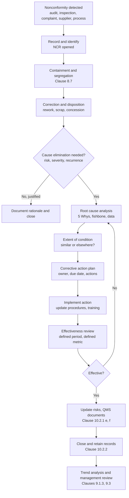

## Integration with ISO 9001 Nonconformance Processes


ISO 9001 is the international standard for quality management systems (QMS). Its requirements for handling nonconformities and corrective action define *when* an organization must investigate causes and *what evidence* it must retain. RCA and the "5 Whys" are the working methods that satisfy the cause-determination portion of those requirements. This reference maps the standard's clauses to a practical nonconformance workflow, shows where RCA fits, explains documentation and audit expectations, and covers common failure modes. Clause numbering below follows ISO 9001:2015; the 2015 edition remains the current published edition as far as I know, but confirm the version applicable to your certification scope, since amendments (such as the 2024 climate-change amendment) and revisions can change details.

### 1. Terminology and Clause Map

**Core definitions** (ISO 9000:2015 vocabulary)

| Term | Meaning |
| --- | --- |
| Nonconformity | Non-fulfilment of a requirement |
| Defect | Non-fulfilment of a requirement related to an intended or specified use |
| Correction | Action to eliminate a detected nonconformity (fixes the instance) |
| Corrective action | Action to eliminate the *cause* of a nonconformity and prevent recurrence |
| Preventive action | Historical term; in the 2015 edition its intent is absorbed into risk-based thinking (clause 6.1) |
| Containment | Common industry term for immediate protection of the customer; not a formal ISO term but usually part of correction |

**Key Points**

- **Correction versus corrective action** is the central distinction. Reworking a bad batch is correction. Eliminating why the batch was bad is corrective action. RCA belongs to the second.
- ISO 9001 requires corrective action to be *appropriate to the effects* of the nonconformity, so not every issue demands full RCA.

**Clause map**

| Clause | Title | Relevance to RCA and Nonconformance |
| --- | --- | --- |
| 8.7 | Control of nonconforming outputs | Identification, segregation, correction, disposition, and records for nonconforming products or services |
| 10.2 | Nonconformity and corrective action | Reaction, cause evaluation, corrective action, effectiveness review, QMS updates |
| 10.3 | Continual improvement | Uses analysis results to drive improvement |
| 9.1.3 | Analysis and evaluation | Data trends inform recurring nonconformities |
| 9.2 | Internal audit | Source of nonconformities |
| 9.3 | Management review | Reviews nonconformity and corrective action performance |
| 8.4 | Externally provided processes, products and services | Supplier nonconformance handling |
| 6.1 | Actions to address risks and opportunities | Preventive intent, risk-based thinking |
| 7.5 | Documented information | Record retention and control |
| 10.1 | General (improvement) | Overall improvement intent |

### 2. What Clause 10.2 Requires

Clause 10.2.1 requires that when a nonconformity occurs, including those arising from complaints, the organization shall:

| Sub-item | Requirement | Where RCA Fits |
| --- | --- | --- |
| a | React to the nonconformity and, as applicable, take action to control and correct it, and deal with the consequences | Containment and correction |
| b | Evaluate the need for action to eliminate the cause(s), so that it does not recur or occur elsewhere, by reviewing and analyzing the nonconformity, **determining the causes**, and determining whether similar nonconformities exist or could potentially occur | **Core RCA** |
| c | Implement any action needed | Corrective action execution |
| d | Review the effectiveness of any corrective action taken | Verification of effectiveness |
| e | Update risks and opportunities determined during planning, if necessary | Risk register update |
| f | Make changes to the QMS, if necessary | Procedure, process, and training changes |

Clause 10.2.2 requires **documented information as evidence of**:

- the nature of the nonconformities and any subsequent actions taken
- the results of any corrective action

**Key Points**

- The standard says "evaluate the need for action". It does not mandate a specific RCA method, tool, or number of "whys". The organization chooses methods that are appropriate and defensible.
- "Occur elsewhere" is a **extent-of-condition** requirement: determine whether the same cause exists in other products, lines, sites, or processes.
- Corrective action must be **appropriate to the effects** of the nonconformity, which supports a graded, risk-based approach to RCA depth.
- Effectiveness review (10.2.1 d) is mandatory. Closing an action when it is implemented, without checking that the problem stopped, is a frequent audit finding.

### 3. Clause 8.7: Control of Nonconforming Outputs

Clause 8.7 governs the *product* side, the physical or service output that fails requirements. Its actions include:

- **Correction** (rework, repair, re-inspection)
- **Segregation, containment, return, or suspension** of supply
- **Informing the customer**
- **Obtaining authorization for acceptance under concession** (use-as-is with approval)

After correction, conformity to requirements must be re-verified. Documented information must describe the nonconformity, actions taken, concessions obtained, and the authority deciding the action.

**Relationship between 8.7 and 10.2**

| Aspect | 8.7 (Nonconforming Outputs) | 10.2 (Corrective Action) |
| --- | --- | --- |
| Focus | The nonconforming *output* | The *cause* in the system |
| Question | What do we do with this product? | Why did this happen, and how do we prevent it? |
| Trigger | Any nonconforming output detected | Nonconformity requiring cause elimination |
| RCA involvement | Usually none | Central |

A disposition decision (scrap, rework, use-as-is) does not by itself satisfy 10.2. Both processes usually run in parallel from the same nonconformance record.

### 4. End-to-End Nonconformance Workflow with RCA



**Stage details**

**Stage 1: Detection and Recording**

Sources include incoming inspection, in-process checks, final inspection, internal audits, external audits, customer complaints, supplier issues, process monitoring, and employee reports. A unique identifier (NCR number) is assigned and the record captures what, where, when, who detected it, quantity affected, and applicable requirement.

**Stage 2: Containment and Correction**

Protect the customer first: quarantine suspect stock, sort or inspect, stop shipment, and notify affected parties. Then correct (rework, repair, scrap, or accept by concession with proper authority).

**Stage 3: Decide Whether Root Cause Analysis Is Needed**

ISO 9001 leaves this to the organization's judgment, so a documented, risk-based criterion is valuable.

| Trigger Example | Typical Response Level |
| --- | --- |
| Isolated minor cosmetic deviation, no recurrence, no customer impact | Correction only, rationale recorded |
| Repeat occurrence of the same defect | Full RCA |
| Customer complaint or field failure | Full RCA, often with formal report |
| Safety, regulatory, or legal implications | Full RCA with elevated review |
| Major audit nonconformity | Full RCA and corrective action plan |
| Trend crossing a threshold (e.g., scrap rate above target) | Full RCA |

**Stage 4: Root Cause Analysis**

Select method proportional to complexity:

| Situation | Suitable Method |
| --- | --- |
| Simple, single-path failure with clear evidence | 5 Whys |
| Multiple possible cause categories | Fishbone plus 5 Whys on top branches |
| Chronic, variation-driven problems | Statistical analysis, DOE (see Six Sigma DMAIC) |
| Customer or automotive supplier format | 8D report |
| Complex, safety-relevant events | Fault tree analysis, barrier analysis |
| Process-flow and waste issues | Lean tools, VSM |

Well-formed RCA distinguishes:

- **Direct (proximate) cause**: what immediately produced the defect
- **Root cause**: the underlying system condition that, if removed, prevents recurrence
- **Escape (detection) cause**: why the existing controls did not detect the problem
- **Systemic cause**: management-system gap, such as missing procedure, inadequate training design, or unclear responsibility

Asking both *"why did it occur?"* and *"why was it not detected?"* is a strong practice, because both gaps require corrective action.

**Stage 5: Extent of Condition**

Assess whether the same cause could affect other products, lines, shifts, sites, suppliers, or processes. This directly answers the standard's "occurs elsewhere" wording.

**Stage 6: Corrective Action Planning and Implementation**

Each action should have an owner, due date, and success criterion. Where possible, prefer stronger controls over weaker ones:

| Control Strength | Example |
| --- | --- |
| Stronger | Eliminate the cause by design, poka-yoke, automation |
| Moderate | Procedural change with built-in verification step |
| Weaker | Training only, reminders, added inspection |

Actions relying solely on retraining or "be more careful" are generally weak and often recur.

**Stage 7: Effectiveness Review**

Define in advance *what* will be measured, *how long* to observe, and *what result* counts as effective. The review should be conducted after enough production volume or time has passed to be meaningful.

| Element | Example |
| --- | --- |
| Metric | Recurrence count, defect rate, audit result |
| Observation window | 90 days or 3 consecutive production lots |
| Criterion | Zero recurrence, or rate below defined target |
| Reviewer | Independent of the action owner where practical |

**Stage 8: QMS Updates and Closure**

Update the risk register, work instructions, control plans, FMEAs, training records, and process documents as applicable, then close the record with retained evidence.

### 5. Documenting RCA for ISO 9001 Evidence

Auditors sample nonconformance records and test whether the logic is traceable. A robust record typically contains:

| Section | Content |
| --- | --- |
| Identification | NCR number, date, product or process, location, detector |
| Description | Factual statement of the nonconformity, requirement violated, quantity affected |
| Containment and correction | Actions taken, dates, responsible person, disposition authority |
| Risk and severity assessment | Basis for the RCA depth decision |
| Root cause analysis | Method used, evidence, cause chain, verified root cause |
| Extent of condition | Other products or processes checked, findings |
| Corrective action plan | Actions, owners, due dates |
| Implementation evidence | Revised procedures, training records, photos, change records |
| Effectiveness review | Metric, results, reviewer, conclusion |
| Closure | Approval, date, links to updated documents |

**Example: Completed 5 Whys entry in an NCR**

| Field | Entry |
| --- | --- |
| Nonconformity | 42 of 500 machined shafts exceeded diameter tolerance (spec 25.00 ± 0.02 mm) |
| Correction | 100% sort, 42 scrapped, remaining 458 verified conforming |
| Why 1 | Diameter drifted oversize during the run because tool wear increased |
| Why 2 | Worn insert stayed in use beyond its intended life |
| Why 3 | Tool life counter was not reset after the last insert change |
| Why 4 | Insert change instruction does not include a counter reset step |
| Why 5 | Work instruction was written before the counter feature was added and never revised |
| Root cause | Work instruction not updated when the controller feature was introduced (change management gap) |
| Corrective action | Revise work instruction, add reset confirmation to the setup checklist, add gauge check every 50 parts |
| Extent of condition | Reviewed instructions for 6 other machines with the same controller; 2 had the same gap and were revised |
| Effectiveness review | 90 days, zero out-of-tolerance events, first-pass yield at 99.6% |

**Key Points**

- Records should show **evidence** for each "why", not only the reasoning. Attach logs, photos, measurements, or interview notes.
- ISO 9001 requires documented information as evidence, but the format is flexible. Electronic QMS platforms, spreadsheets, or forms are all acceptable if controlled per clause 7.5.
- Records must be protected against loss, unintended alteration, and improper use, and retained per organizational or regulatory retention rules.

### 6. Sources of Nonconformity and Handling Variations

| Source | Notes for RCA Integration |
| --- | --- |
| Incoming inspection or supplier nonconformance | Clause 8.4 applies. Issue a supplier corrective action request (SCAR), require the supplier's RCA, review its adequacy, and verify effectiveness. |
| In-process nonconformance | Fast feedback loops. Combine with SPC and process monitoring. |
| Final inspection or test escapes | Examine both the causing process step and why upstream detection failed. |
| Customer complaints and returns | Clause 9.1.2 (customer satisfaction) links here. Prioritize by severity and recurrence. |
| Internal audit findings | Clause 9.2 requires corrective action without undue delay. Grade as major or minor per audit procedure. |
| External (certification body) audit findings | Root cause and corrective action plan are typically required within a time set by the certification body's rules. |
| Process monitoring and data trends | Clause 9.1.3 analysis may reveal recurring issues before they become customer-facing. |

**Audit finding grades** (terminology used by many certification bodies, not defined in ISO 9001 itself):

| Grade | Typical Meaning |
| --- | --- |
| Major nonconformity | Absence or total breakdown of a required system element, or a situation raising significant doubt about the ability to deliver conforming output |
| Minor nonconformity | Isolated lapse or partial failure that does not indicate systemic collapse |
| Observation / opportunity for improvement | Not a nonconformity; a potential weakness |

Exact grading criteria and response timelines vary by certification body and scheme, so consult the applicable rules.

### 7. Risk-Based Thinking and Graded RCA

The 2015 edition emphasizes risk-based thinking. In nonconformance handling this supports scaling effort to consequence.

Risk-based prioritization commonly uses a severity-occurrence-detection scoring approach as in FMEA:

$$RPN = S \times O \times D$$

where $S$ is Severity, $O$ is Occurrence, and $D$ is Detection, each scored on a defined scale (often 1 to 10). RPN has known limitations, including that different combinations of S, O, and D can yield the same value while representing different risk profiles, so many organizations weight severity separately or use Action Priority tables (as in the AIAG-VDA FMEA handbook). [Inference: the choice of scoring scheme for triggering RCA depth is an organizational decision, not prescribed by ISO 9001.]

A simple tiering example:

| Tier | Criteria | Required Response |
| --- | --- | --- |
| 1 | Low severity, first occurrence, contained | Correction, documented rationale |
| 2 | Moderate severity or repeat | 5 Whys or fishbone, corrective action, effectiveness check |
| 3 | High severity, customer-impacting, or safety-related | Formal RCA (8D or equivalent), cross-functional team, management review |

### 8. Linking Nonconformance Data to Continual Improvement

Individual NCRs feed system-level improvement through data analysis (clause 9.1.3) and management review (clause 9.3).

**Common metrics**

- Number of nonconformities by source, process, product, and supplier
- Repeat nonconformity rate
- Corrective action closure time (overdue actions)
- Effectiveness rate of corrective actions (percentage confirmed effective)
- Cost of poor quality (scrap, rework, warranty, complaints)
- Defects per million opportunities:

$$DPMO = \frac{D}{U \times O} \times 10^6$$

where $D$ is defects, $U$ units, and $O$ opportunities per unit.

**Pareto analysis** of NCR causes identifies the vital few contributing categories. Repeated appearance of the same *cause category* (for example, "work instruction not updated") across unrelated NCRs signals a systemic weakness, which becomes an input to management review and improvement projects.

**Management review inputs** (clause 9.3.2) include the status of corrective actions, nonconformities, monitoring and measurement results, audit results, and performance of external providers, so the NCR system is directly visible to top management.

### 9. Integration with Other Standards and Frameworks

| Framework | Relationship |
| --- | --- |
| IATF 16949 (automotive) | Adds specific requirements for problem-solving methods, error-proofing, and reaction to control plan out-of-control conditions; commonly uses 8D and 5 Whys |
| AS9100 (aerospace) | Adds requirements for root cause analysis, corrective action, and containment with emphasis on escapes and flow-down to suppliers |
| ISO 13485 (medical devices) | Requires corrective and preventive action (CAPA), including verification that actions do not adversely affect device safety and performance |
| FDA 21 CFR 820 (US medical devices) | CAPA subsystem is a major inspection focus |
| ISO 14001 / ISO 45001 | Parallel nonconformity and corrective action clauses for environmental and occupational health and safety management systems, sharing the harmonized structure |
| Six Sigma / Lean | Provide analytical toolsets that satisfy the "determine the cause" requirement |

Because these sector standards build on or extend ISO 9001, an RCA process designed to satisfy the stricter sector requirements usually satisfies ISO 9001's requirements as well. Specific requirements and wording differ by standard and edition, so consult the current text.

### 10. Software and Records Management

Electronic quality management systems (eQMS) commonly digitize the NCR and CAPA workflow with configurable stages, routing, e-signatures, overdue notifications, and linked records.

**Typical workflow features** [Inference: feature sets vary by vendor and configuration]

- Configurable NCR and CAPA forms with mandatory RCA fields
- Automatic escalation for overdue actions
- Linked records (NCR to CAPA to change order to training)
- Trend dashboards and Pareto reports
- Audit trails of changes and approvals
- Supplier portals for SCAR exchange

Whether paper or electronic, controls should ensure the record is identifiable, legible, retrievable, and protected (clause 7.5.3).

**Data-model sketch for an NCR/CAPA record** (illustrative, not standardized):

```plaintext
NCR
  ncr_id, date_detected, source, product_or_process, location
  description, requirement_violated, quantity_affected
  severity, containment_actions[], disposition, disposition_authority
CAPA (linked 0..n to NCR)
  capa_id, ncr_ids[], rca_method, root_cause, escape_cause
  extent_of_condition, actions[] {description, owner, due_date, status}
  effectiveness_criteria, review_date, review_result
  closed_by, closed_date
Links
  documents_changed[], risk_register_updates[], training_records[]
```

### 11. Common Failure Modes and Audit Pitfalls

1. **Correction mistaken for corrective action**: the batch is reworked and the record closes without a cause analysis.
2. **Cause stated as "operator error"** with retraining as the only action, without examining why the process allowed the error.
3. **No extent-of-condition check**, so the same cause persists on other lines or products.
4. **No effectiveness review**, or a review with no defined criteria or timeframe.
5. **Actions closed on completion date** rather than on demonstrated effect.
6. **Recurring nonconformities** with repeated closures of the same cause category, indicating superficial RCA.
7. **Missing evidence**: causes asserted without data, records, or observation.
8. **Overdue actions** left unmanaged and not visible to management.
9. **Failure to update the risk register, FMEA, or control plan** after learning from the failure.
10. **Supplier corrective actions accepted without review** of the supplier's RCA quality.
11. **Excessive formality for trivial issues**, creating paperwork burden that discourages reporting. Graded response prevents this.
12. **Blame-oriented culture**, reducing honest reporting and depth of analysis.

**Auditor questions commonly asked** [Inference: representative of typical audit practice, not an official list]

- How do you decide when a nonconformity needs root cause analysis?
- Show me a recent corrective action. How did you determine the root cause, and what evidence supports it?
- How did you check whether the same problem could occur elsewhere?
- How and when do you verify effectiveness? What were the results?
- Which recurring issues have appeared in your trend data, and what was done?

### 12. Implementation Checklist

1. Define the NCR and corrective action procedure, mapping it to clauses 8.7 and 10.2.
2. Set documented criteria for when RCA is required and at what depth.
3. Standardize RCA method options and provide training (5 Whys, fishbone, 8D, and statistical methods as needed).
4. Require both occurrence and detection (escape) causes to be analyzed.
5. Require extent-of-condition assessment on every RCA-level record.
6. Prefer stronger controls in the action hierarchy, and avoid training-only fixes where possible.
7. Define effectiveness review criteria, window, and reviewer at action-planning time.
8. Link NCR/CAPA closure to updates of risk registers, FMEAs, control plans, and work instructions.
9. Trend NCR data and report to management review.
10. Periodically audit the NCR and CAPA process itself, including sampling closed records for quality of RCA.

**Conclusion**

ISO 9001 does not prescribe a particular RCA method. It requires that nonconformities be controlled, their causes determined and eliminated where warranted, similar conditions checked elsewhere, effectiveness verified, and evidence retained. The 5 Whys and related RCA tools are the practical means of meeting the cause-determination requirement, while the QMS supplies the surrounding structure: triggers, records, effectiveness review, risk updates, and management oversight. Strong integration means proportionate RCA depth, evidence-backed cause chains, verified effectiveness, and feedback into system-level improvement. Clause wording, sector-specific requirements, and certification body expectations vary by edition and scheme, so confirm against the current standard and your certification body's rules.

**Related Topics**

- Corrective and Preventive Action (CAPA) system design
- 8D problem-solving methodology
- Supplier corrective action requests and supplier quality management
- Internal audit programs and audit finding grading
- FMEA and control plan updates after nonconformities
- Effectiveness verification methods and metrics
- IATF 16949, AS9100, and ISO 13485 problem-solving requirements
- Cost of poor quality analysis
- Management review inputs and quality KPIs
- Electronic QMS implementation and validation