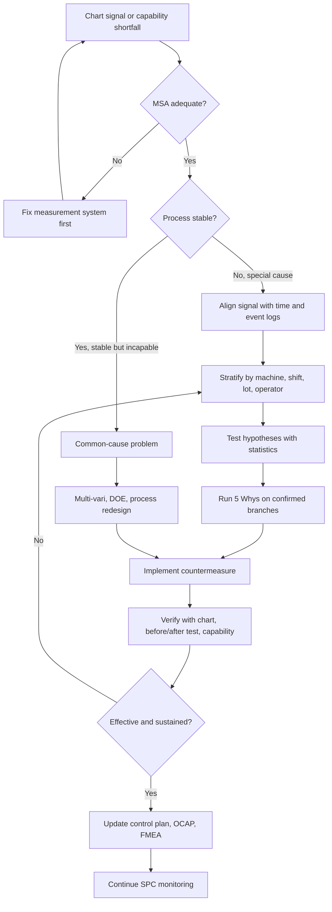

## Statistical Quality Control Tie-Ins

Statistical Quality Control (SQC) supplies the quantitative evidence that Root Cause Analysis needs. The "5 Whys" produces causal hypotheses, and SQC tools detect when a process has changed, localize where and when the change occurred, distinguish real signals from random noise, and verify that a corrective action worked. This reference maps SQC methods to each stage of an RCA, explains how control chart signals trigger investigations, shows how to stratify and test data to support each "why", and covers acceptance sampling, capability analysis, and effectiveness verification. Formulas and constants below are standard textbook forms; consult a current SPC reference (for example, the AIAG SPC manual or Montgomery's *Introduction to Statistical Quality Control*) for exact tables and edge cases.

### 1. Conceptual Framework: SQC as the Evidence Layer of RCA

SQC rests on Shewhart's distinction between two kinds of variation:

| Variation Type | Also Called | Nature | Appropriate Response |
| --- | --- | --- | --- |
| Common cause | Chance, inherent, random | Stable, built into the system; produces a predictable distribution | Change the system (management action, process redesign) |
| Special cause | Assignable | Sporadic, arising from a specific event or condition outside the usual system | Find and remove the specific cause (classic RCA) |

This distinction determines the RCA strategy:

- A **special-cause signal** on a control chart points to a specific time, machine, material, or event. A localized 5 Whys and gemba investigation is well suited.
- A **stable but unacceptable** process (in control but incapable) has only common-cause variation. Hunting for a single culprit is futile. The process itself must be redesigned, which calls for structured methods (DOE, capability improvement, Six Sigma DMAIC).

Treating common-cause variation as special cause (**tampering** or over-adjustment) tends to *increase* variation, and treating special-cause signals as noise lets defects continue. Deming's funnel experiment is the classic illustration of over-adjustment.

**Key Points**

- Control charts answer *"did something change?"* and *"when?"*. The 5 Whys answers *"why?"*
- Every "why" in a chain that makes a claim about the process can, in principle, be checked against data.
- SQC does not identify causes by itself. It narrows *where to look* and confirms *whether a fix worked*.

(svg_diagram)

<svg xmlns="http://www.w3.org/2000/svg" viewBox="0 0 900 300" width="900" height="300" font-family="Arial, sans-serif">
<text x="450" y="28" text-anchor="middle" font-size="18" font-weight="bold">SQC Feeding the RCA Loop (svg_diagram)</text>
<rect x="20" y="70" width="160" height="90" rx="8" fill="#e3f2fd" stroke="#1565c0" stroke-width="2" />
<text x="100" y="105" text-anchor="middle" font-size="15" font-weight="bold">Monitor</text>
<text x="100" y="128" text-anchor="middle" font-size="12">Control charts,</text>
<text x="100" y="144" text-anchor="middle" font-size="12">capability tracking</text>
<rect x="210" y="70" width="160" height="90" rx="8" fill="#e3f2fd" stroke="#1565c0" stroke-width="2" />
<text x="290" y="105" text-anchor="middle" font-size="15" font-weight="bold">Detect Signal</text>
<text x="290" y="128" text-anchor="middle" font-size="12">Rule violation,</text>
<text x="290" y="144" text-anchor="middle" font-size="12">trend, shift</text>
<rect x="400" y="60" width="180" height="110" rx="8" fill="#ffe0b2" stroke="#e65100" stroke-width="3" />
<text x="490" y="95" text-anchor="middle" font-size="15" font-weight="bold">Localize and Test</text>
<text x="490" y="118" text-anchor="middle" font-size="12">Stratify, Pareto,</text>
<text x="490" y="134" text-anchor="middle" font-size="12">hypothesis tests, 5 Whys</text>
<rect x="610" y="70" width="130" height="90" rx="8" fill="#e3f2fd" stroke="#1565c0" stroke-width="2" />
<text x="675" y="105" text-anchor="middle" font-size="15" font-weight="bold">Correct</text>
<text x="675" y="128" text-anchor="middle" font-size="12">Countermeasure</text>
<rect x="760" y="70" width="120" height="90" rx="8" fill="#e3f2fd" stroke="#1565c0" stroke-width="2" />
<text x="820" y="105" text-anchor="middle" font-size="15" font-weight="bold">Verify</text>
<text x="820" y="128" text-anchor="middle" font-size="12">Chart confirms</text>
<line x1="180" y1="115" x2="210" y2="115" stroke="#333" stroke-width="2" />
<line x1="370" y1="115" x2="400" y2="115" stroke="#333" stroke-width="2" />
<line x1="580" y1="115" x2="610" y2="115" stroke="#333" stroke-width="2" />
<line x1="740" y1="115" x2="760" y2="115" stroke="#333" stroke-width="2" />
<path d="M 820 160 L 820 230 L 100 230 L 100 160" fill="none" stroke="#666" stroke-width="2" stroke-dasharray="6,4" />
<text x="460" y="255" text-anchor="middle" font-size="12" fill="#444">Continued monitoring closes the loop and detects recurrence</text>
</svg>

### 2. Control Charts as RCA Triggers and Locators

A control chart plots a statistic over time against limits derived from the process's own variation. Points and patterns outside expected random behavior indicate special causes.

#### 2.1 Chart Selection

| Data Type | Situation | Chart |
| --- | --- | --- |
| Continuous, individual readings | One measurement per period, or subgrouping impractical | Individuals and Moving Range ($X$-$mR$, also I-MR) |
| Continuous, rational subgroups, small $n$ | Subgroup size roughly 2 to 10 | $\bar{X}$-$R$ |
| Continuous, rational subgroups, larger $n$ | Subgroup size above about 10 | $\bar{X}$-$S$ |
| Attribute, proportion defective, variable sample size | Pass/fail counts | $p$ chart |
| Attribute, number defective, constant sample size | Pass/fail counts | $np$ chart |
| Attribute, defects per unit, constant area of opportunity | Count of defects | $c$ chart |
| Attribute, defects per unit, variable area of opportunity | Count of defects | $u$ chart |
| Small shifts, high sensitivity needed | Detecting drifts of about 0.5 to 1.5 $\sigma$ | CUSUM or EWMA |
| Rare events | Low defect rates | $g$ or $t$ charts [Inference: applicability depends on event process assumptions] |

#### 2.2 Limit Formulas

For an individuals chart, with moving range $MR_i = |x_i - x_{i-1}|$ and average moving range $\overline{MR}$:

$$UCL_X = \bar{x} + 3\frac{\overline{MR}}{d_2}, \qquad LCL_X = \bar{x} - 3\frac{\overline{MR}}{d_2}$$

with $d_2 = 1.128$ for moving ranges of span 2. The moving range chart upper limit is:

$$UCL_{MR} = D_4 \overline{MR}, \qquad D_4 = 3.267$$

For an $\bar{X}$-$R$ chart with subgroup mean $\bar{\bar{x}}$ and average range $\bar{R}$:

$$UCL_{\bar{X}} = \bar{\bar{x}} + A_2 \bar{R}, \qquad LCL_{\bar{X}} = \bar{\bar{x}} - A_2 \bar{R}$$

$$UCL_R = D_4 \bar{R}, \qquad LCL_R = D_3 \bar{R}$$

where $A_2$, $D_3$, and $D_4$ depend on subgroup size (for $n = 5$: $A_2 = 0.577$, $D_3 = 0$, $D_4 = 2.114$).

For a $p$ chart with average proportion $\bar{p}$ and sample size $n_i$:

$$UCL_p = \bar{p} + 3\sqrt{\frac{\bar{p}(1-\bar{p})}{n_i}}, \qquad LCL_p = \bar{p} - 3\sqrt{\frac{\bar{p}(1-\bar{p})}{n_i}}$$

with the lower limit set to zero if the computed value is negative.

For a $c$ chart with average defect count $\bar{c}$:

$$UCL_c = \bar{c} + 3\sqrt{\bar{c}}, \qquad LCL_c = \bar{c} - 3\sqrt{\bar{c}}$$

For an EWMA chart with smoothing constant $\lambda$ (commonly 0.05 to 0.25):

$$z_t = \lambda x_t + (1-\lambda) z_{t-1}$$

**Rational subgrouping** matters for RCA. Subgroups should be formed so that variation *within* a subgroup reflects only common causes, and variation *between* subgroups can reveal special causes (for example, group parts from one machine and one shift together). Poor subgrouping hides the very signal RCA needs.

#### 2.3 Signal Detection Rules

Widely used rule sets include the Western Electric rules and the Nelson rules. Typical patterns:

| Rule | Pattern | Common Interpretation |
| --- | --- | --- |
| 1 | One point beyond 3σ from the center line | Sudden special cause (breakage, wrong setup, bad lot) |
| 2 | 2 of 3 consecutive points beyond 2σ, same side | Shift emerging |
| 3 | 4 of 5 consecutive points beyond 1σ, same side | Small persistent shift |
| 4 | 8 (Nelson: 9) consecutive points on one side of the center line | Sustained mean shift |
| 5 | 6 consecutive points steadily increasing or decreasing | Trend, such as tool wear or temperature drift |
| 6 | 14 consecutive points alternating up and down | Over-adjustment, two alternating sources, or mixture |
| 7 | 15 consecutive points within 1σ of center | Stratification, incorrect subgrouping, or falsified data |
| 8 | 8 consecutive points beyond 1σ on both sides | Mixture of populations |

Exact rule counts and thresholds differ slightly between sources and software, so verify the rule set your organization has adopted. Applying many rules simultaneously raises the false-alarm rate, which should be balanced against sensitivity.

**Pattern-to-hypothesis mapping** (starting points for a "why" chain, not conclusions) [Inference: these are heuristics that guide investigation]

| Chart Pattern | Candidate Cause Types to Investigate |
| --- | --- |
| Single extreme point | Setup error, contaminated material, measurement error, one-time event |
| Sudden sustained shift | New material lot, tool or fixture change, operator or method change, recalibration |
| Gradual trend | Tool wear, fatigue, temperature drift, consumable depletion, buildup |
| Cycles | Shift patterns, environmental cycles, maintenance schedule, batch routine |
| Mixture or bimodality | Two machines, two suppliers, two operators combined in one stream |
| Stratification (hugging center) | Over-broad subgrouping, mixed sources within subgroup, altered data |
| Increased variability | Loose fixture, worn bearings, inconsistent material, inadequate control |

**Worked Example: Individuals chart signal leading to a 5 Whys**

A fill-weight process has target 500 g. The I-MR chart (baseline $\bar{x} = 500.2$ g, $\overline{MR} = 1.1$ g) has:

$$UCL_X = 500.2 + 3\frac{1.1}{1.128} = 500.2 + 2.93 = 503.1\ \text{g}$$

$$LCL_X = 500.2 - 2.93 = 497.3\ \text{g}$$

Starting at 06:10, nine consecutive points fall above the center line, then several exceed 502 g. This is a Rule 4 shift signal. Investigation steps:

1. **Time-align** the signal with logs: shift change at 06:00, new raw-material lot opened at 06:05.
2. **Stratify** fill weights by lot, filler head, and operator.
3. **Test** the hypothesis that the new lot differs: material density measured for old versus new lot (two-sample t-test).
4. **Run the 5 Whys** on confirmed findings:

| Why | Answer | Evidence |
| --- | --- | --- |
| Why did fill weight rise? | Volumetric filler dispenses fixed volume; material density increased | Density lab data |
| Why did density increase? | New lot has lower moisture content | Certificate of analysis and lab check |
| Why does the process not compensate? | Filler is set by volume with no density feedback | Process documentation |
| Why is there no density feedback? | Original design assumed a stable supplier specification | Design record |
| Why was that assumption never revisited? | Supplier changes are not linked to a process-parameter review | Change-management procedure review |

Root cause: change management does not trigger process-parameter review when incoming material properties shift.

### 3. Stratification, Pareto Analysis, and Data Segmentation

**Stratification** separates data by potential source of variation (machine, shift, operator, lot, supplier, time, location, tool) to reveal whether the problem concentrates in one segment. It is often the fastest path from "we have a defect problem" to "the defect problem is on Press 7 during second shift".

**Pareto analysis** ranks categories by frequency or cost. The cumulative percentage identifies the vital few:

$$\text{Cumulative \%}_k = \frac{\sum_{i=1}^{k} n_i}{\sum_{i=1}^{N} n_i} \times 100$$

where categories are sorted in descending order of count $n_i$. Pareto analysis should be repeated after fixes, because the ranking shifts once the top cause is addressed.

**Multi-vari analysis** partitions variation into families, commonly positional (within-piece), cyclical (piece-to-piece), and temporal (time-to-time). It directs the RCA to the dominant family before detailed causes are pursued.

**Example: Stratified defect data**

| Machine | Shift | Units | Defects | Defect Rate |
| --- | --- | --- | --- | --- |
| A | 1 | 4,000 | 32 | 0.80% |
| A | 2 | 3,800 | 30 | 0.79% |
| B | 1 | 4,100 | 34 | 0.83% |
| B | 2 | 3,900 | 148 | 3.79% |

The problem is concentrated in Machine B during Shift 2, so the "why" chain should start there, examining what differs (operator, ambient conditions, material staging, maintenance timing).

### 4. Hypothesis Testing to Verify "Why" Links

Each "why" can be treated as a testable hypothesis. Common tests by data type:

| Question | Test |
| --- | --- |
| Do two group means differ? (e.g., Machine A vs. B) | Two-sample t-test (Welch's when variances differ) |
| Do three or more group means differ? | One-way ANOVA (or Kruskal-Wallis if non-normal) |
| Do group variances differ? | F-test, Levene's test |
| Do two defect proportions differ? | Two-proportion z-test |
| Is defect occurrence associated with a categorical factor? | Chi-square test of independence |
| Is a continuous $X$ related to $Y$? | Correlation, simple or multiple regression |
| Does a binary outcome depend on predictors? | Logistic regression |
| Did the mean change after the fix? | Paired t-test or two-sample t-test on before/after data |

Welch's t statistic:

$$t = \frac{\bar{x}_1 - \bar{x}_2}{\sqrt{\dfrac{s_1^2}{n_1} + \dfrac{s_2^2}{n_2}}}$$

Two-proportion z statistic with pooled proportion $\hat{p} = \dfrac{x_1 + x_2}{n_1 + n_2}$:

$$z = \frac{\hat{p}_1 - \hat{p}_2}{\sqrt{\hat{p}(1-\hat{p})\left(\dfrac{1}{n_1} + \dfrac{1}{n_2}\right)}}$$

Chi-square statistic:

$$\chi^2 = \sum \frac{(O_i - E_i)^2}{E_i}$$

**Worked example** (continuing the stratification table): compare Machine B Shift 2 versus all other groups.

- B2: $x_1 = 148$ defects, $n_1 = 3{,}900$, so $\hat{p}_1 = 0.0379$
- Others: $x_2 = 32 + 30 + 34 = 96$ defects, $n_2 = 4{,}000 + 3{,}800 + 4{,}100 = 11{,}900$, so $\hat{p}_2 = 0.00807$
- Pooled: $\hat{p} = \dfrac{148 + 96}{3{,}900 + 11{,}900} = \dfrac{244}{15{,}800} = 0.01544$

$$z = \frac{0.0379 - 0.00807}{\sqrt{0.01544(0.98456)\left(\frac{1}{3900} + \frac{1}{11900}\right)}} = \frac{0.02983}{\sqrt{0.015201 \times 0.0003404}} = \frac{0.02983}{0.002275} \approx 13.1$$

This is far beyond any conventional critical value, so the difference is statistically significant. The test says the difference is not attributable to chance. It does **not** say *why*, which is where the 5 Whys and gemba work continue.

**Key Points**

- Statistical significance is not proof of causation. Confirm with mechanism, observation, and an intervention.
- Also check practical significance (effect size, cost impact).
- Check test assumptions (independence, normality where required, adequate sample size). Data from a process that is out of control may violate the stability assumption behind many tests, so stabilize or stratify first.
- Multiple comparisons inflate false positives. Use appropriate corrections or treat findings as hypotheses to confirm.

### 5. Process Capability and Performance Linking to RCA

Capability compares process spread to specification limits. It is meaningful only when the process is **stable** (in statistical control).

$$C_p = \frac{USL - LSL}{6\sigma_{within}}$$

$$C_{pk} = \min\left(\frac{USL - \mu}{3\sigma_{within}},\ \frac{\mu - LSL}{3\sigma_{within}}\right)$$

Performance indices use the overall (long-term) standard deviation $\sigma_{overall}$:

$$P_p = \frac{USL - LSL}{6\sigma_{overall}}, \qquad P_{pk} = \min\left(\frac{USL - \mu}{3\sigma_{overall}},\ \frac{\mu - LSL}{3\sigma_{overall}}\right)$$

The within-subgroup estimate is commonly $\hat{\sigma}_{within} = \bar{R}/d_2$ (for $\bar{X}$-$R$ charts) or $\overline{MR}/1.128$ (individuals charts).

**Diagnosing with capability indices**

| Observation | Likely Meaning | RCA Direction |
| --- | --- | --- |
| $C_p$ high, $C_{pk}$ low | Process spread fine but off-center | Investigate centering, setup, offsets, calibration |
| $C_p$ and $C_{pk}$ both low | Excess variation | Investigate sources of variation (DOE, multi-vari, equipment condition) |
| $C_{pk}$ good, $P_{pk}$ much lower | Instability or shifts over time | Investigate special causes between subgroups |
| Both indices adequate but defects occur | Non-normality, mixtures, or measurement issues | Check distribution, stratification, measurement system |

Commonly cited benchmarks include $C_{pk} \geq 1.33$ for established processes and higher (for example $\geq 1.67$) for critical characteristics in some industries, though acceptance thresholds are set by customer and standard requirements.

**Sigma level and DPMO**

$$DPMO = \frac{D}{U \times O} \times 10^6$$

A commonly used convention adds a 1.5σ long-term shift when converting DPMO to a "sigma level", so 3.4 DPMO corresponds to "six sigma". This 1.5σ shift is a convention with debated empirical justification. [Speculation: whether the fixed shift matches any particular real process is uncertain.]

**Non-normal data**: capability formulas assume approximate normality. For skewed data, use appropriate transformations (Box-Cox, Johnson) or fitted non-normal distributions and percentile-based capability methods, and document the choice.

### 6. Measurement System Analysis: Ruling Out the Gauge

Before attributing variation to the process, confirm the measurement system is adequate. Observed variance decomposes as:

$$\sigma^2_{observed} = \sigma^2_{process} + \sigma^2_{measurement}$$

with measurement variance including repeatability (same appraiser, same device) and reproducibility (different appraisers):

$$\sigma^2_{measurement} = \sigma^2_{repeatability} + \sigma^2_{reproducibility}$$

**Gauge R&R** commonly reports percent of study variation:

$$\%GRR = \frac{\sigma_{GRR}}{\sigma_{total}} \times 100$$

Widely used guidance (AIAG-style) treats under 10% as generally acceptable, 10 to 30% as marginal depending on application and cost, and over 30% as unacceptable. Also review the number of distinct categories (ndc), where a value of 5 or more is commonly recommended.

**Other MSA elements**: bias, linearity, stability of the gauge over time, and attribute agreement analysis (kappa statistics) for pass/fail inspection.

**Why this ties into RCA**: measurement error is a frequent "hidden" cause. A control chart signal may reflect a gauge drift, a calibration lapse, or an inspector difference rather than a process change. Include "measurement" as a standing branch in the fishbone and check it early.

### 7. Acceptance Sampling and Inspection Escapes

Acceptance sampling decides whether to accept or reject a lot based on a sample. Standards include ANSI/ASQ Z1.4 (attribute sampling, successor family to MIL-STD-105E) and ANSI/ASQ Z1.9 (variables sampling, successor family to MIL-STD-414); ISO 2859 and ISO 3951 are corresponding international series.

The **operating characteristic (OC) curve** shows the probability of accepting a lot as a function of the true lot defect rate. For a single sampling plan $(n, c)$ (sample size $n$, acceptance number $c$), the probability of acceptance assuming a binomial model is:

$$P_a(p) = \sum_{k=0}^{c} \binom{n}{k} p^k (1-p)^{n-k}$$

**Key quality concepts**

| Concept | Meaning |
| --- | --- |
| AQL (Acceptable Quality Limit) | Poorest quality level of a continuing series of lots considered satisfactory as a process average |
| LTPD / RQL | Level of quality the plan is designed to reject with high probability |
| Producer's risk ($\alpha$) | Probability of rejecting a good lot |
| Consumer's risk ($\beta$) | Probability of accepting a bad lot |

**RCA tie-in: escape analysis**

When a defective lot passes inspection and reaches a customer, two causes exist: why the defect *occurred*, and why it *escaped*. Sampling plans have inherent risk, and a plan with $c = 0$ and small $n$ can accept lots with a nonzero defect rate. Escape analysis examines whether the sampling plan, inspector attention, inspection method, or gauge sensitivity was the weak link, and whether the sampling plan should be tightened, switched to 100% or automated inspection, or replaced by process control.

Acceptance sampling is often described as detection-oriented, whereas SPC is prevention-oriented, because it monitors the process before defects are produced. [Inference: this is a common quality-management framing rather than a formal distinction.]

### 8. Verifying Corrective Action Effectiveness with SQC

A fix should be confirmed with data, not assumed.

**Verification methods**

| Method | Use |
| --- | --- |
| Control chart with annotated intervention | Show shift in center or reduced variation; recompute limits only after the process is stable at the new level |
| Before/after hypothesis test | Test mean, variance, or proportion difference |
| Capability re-study | Confirm $C_{pk}$ or $P_{pk}$ improvement |
| Pareto re-comparison | Confirm the targeted category shrank |
| Sustained monitoring | Confirm no recurrence over a defined period or volume |

**Example: Before/after proportion test**

Before fix: 148 defects in 3,900 units (3.79%). After fix: 27 defects in 4,000 units (0.675%).

Pooled proportion: $\hat{p} = \dfrac{148 + 27}{3{,}900 + 4{,}000} = 0.02215$

$$z = \frac{0.0379 - 0.00675}{\sqrt{0.02215(0.97785)\left(\frac{1}{3900} + \frac{1}{4000}\right)}} = \frac{0.03115}{\sqrt{0.021659 \times 0.000506}} = \frac{0.03115}{0.003310} \approx 9.4$$

The reduction is statistically significant. Confirming durability still requires monitoring over a longer period and across normal variation sources (different lots, seasons, operators).

**Recalculating limits**: do not recompute control limits routinely, or they will chase the process. Recompute after a confirmed, intentional process change, using stable data collected after the change.

### 9. Connecting SQC to Formal Quality Systems

| System | SQC Tie-In |
| --- | --- |
| ISO 9001 clauses 9.1.1 and 9.1.3 | Monitoring, measurement, analysis, and evaluation of data, including statistical techniques where appropriate |
| Six Sigma DMAIC | Measure (baseline, MSA), Analyze (hypothesis tests, DOE), Control (SPC and control plan) |
| Lean / Kaizen | Control charts and run charts as visual management; statistical checks used when observation alone is inconclusive |
| FMEA and Control Plan | Control plans specify characteristics, methods, sample sizes, and reaction plans that rely on SPC; occurrence ratings can be informed by capability data |
| PPAP / APQP (automotive) | Initial process capability studies and ongoing SPC requirements |
| 8D / CAPA | SQC data used in problem description, root cause verification, and effectiveness confirmation |

**Reaction plans (OCAP: Out-of-Control Action Plans)**

A control chart is only useful if a defined response exists. An OCAP typically specifies:

1. The signal criteria that trigger action
2. Immediate containment (stop, quarantine, sort)
3. Checks the operator performs (setup, tool, material, gauge)
4. Escalation path if the cause is not found
5. Documentation and RCA trigger criteria

### 10. Data Quality, Assumptions, and Limits of SQC in RCA

- **Autocorrelation**: successive observations may be correlated (for example, slow-moving processes), causing standard limits to produce false alarms. Use time-series adjustment or residual charts where appropriate.
- **Non-normal or discrete data**: verify chart choice and limit validity.
- **Small samples**: limits computed from few points are unreliable. A commonly quoted guideline is 20 to 25 subgroups for initial limits, though sources differ.
- **Rare events**: standard attribute charts perform poorly at very low defect rates; consider $g$, $t$, or rare-event methods.
- **Data integrity**: rounding, resolution, manual transcription errors, and selective recording can create artificial patterns.
- **Overreliance on tests**: a very large sample can make trivial differences "significant". Pair p-values with effect size and confidence intervals.
- **Special cause versus common cause misclassification**: both directions are costly.
- **Causal inference limits**: observational data supports association. Designed experiments and controlled trials provide stronger causal evidence.

Behavior of formulas, rule sets, and software implementations varies by textbook, standard, and vendor, so verify against the reference your organization uses.

### 11. Practical Integration Workflow

### 12. Common Pitfalls

1. **Reacting to every point** as a special cause (tampering), which increases variation.
2. **Ignoring genuine signals** because the point is within specification limits. Control limits and specification limits are different: control limits describe what the process *does*, specifications describe what the customer *wants*.
3. **Plotting specification limits on control charts** as if they were control limits.
4. **Computing limits from unstable data** or from too few points.
5. **Poor rational subgrouping** that hides between-group differences.
6. **Skipping MSA**, mistaking gauge error for process variation.
7. **Confusing statistical significance with cause**, or accepting a cause without a mechanism.
8. **Recomputing limits after every shift**, making the chart blind to real change.
9. **Using capability indices on unstable or non-normal processes** without adjustment.
10. **Verifying a fix with too little data or too short a period**.
11. **No reaction plan**, so signals produce no action.
12. **Chart maintained by a quality department only**, rather than used by operators who can react quickly.

### 13. Quick Reference: SQC Tool to RCA Stage

| RCA Stage | SQC Tool |
| --- | --- |
| Detect that a problem exists | Control charts, run charts, capability monitoring |
| Define and scope | Pareto, stratification, histograms |
| Localize (where/when) | Stratified charts, multi-vari, time-aligned signals |
| Rule out measurement | Gauge R&R, attribute agreement, bias/linearity/stability |
| Generate and test hypotheses | Scatter plots, regression, t-tests, ANOVA, chi-square |
| Confirm mechanisms | DOE, controlled trials |
| Verify corrective action | Before/after charts, hypothesis tests, capability re-study |
| Sustain | SPC, control plans, OCAP, periodic audits |

**Conclusion**

SQC and RCA are complementary. Control charts and capability analysis detect and localize departures from expected behavior, stratification and hypothesis testing convert plausible "whys" into evidence-supported findings, MSA prevents blaming the process for measurement noise, and SPC together with re-verification confirms that a corrective action worked and stays effective. The 5 Whys supplies the causal narrative, SQC keeps that narrative honest with data. Methods, rules, constants, and acceptance thresholds vary by source, industry, and customer requirements, so confirm them against the standards and references applicable to your operation.

**Related Topics**

- Control chart selection and advanced charts (CUSUM, EWMA, multivariate)
- Measurement System Analysis in depth (Gauge R&R, attribute agreement)
- Process capability for non-normal data
- Design of Experiments for cause verification
- Acceptance sampling plans and OC curve design
- Out-of-Control Action Plans and control plan design
- Multi-vari analysis and variance components
- Regression and logistic regression for defect modeling
- SPC in APQP/PPAP and IATF 16949 environments
- Statistical software workflows for RCA data analysis