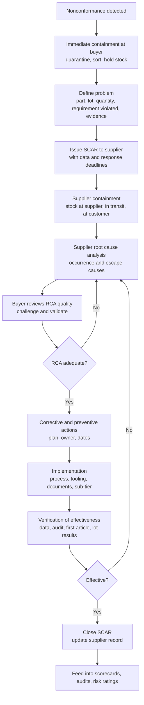

## Supplier Quality Root Cause Investigations


Supplier quality root cause investigations apply RCA to nonconformances that originate outside the buyer's own walls: a purchased material, component, sub-assembly, or service fails to meet requirements, and the causal chain crosses an organizational boundary. This creates challenges that internal RCA does not face: limited visibility into the supplier's process, differing quality maturity, contractual and commercial dynamics, and the need to verify a cause the buyer cannot directly observe. This reference covers the end-to-end investigation workflow, the Supplier Corrective Action Request (SCAR) process, how the "5 Whys" and other tools are applied across the buyer-supplier interface, evaluation of supplier RCA quality, containment and escape analysis, verification, escalation, and integration with supplier management systems. Clause references follow ISO 9001:2015; sector standards (IATF 16949, AS9100, ISO 13485) add requirements that differ by edition and customer, so confirm against the current text and contract terms.

### 1. Why Supplier RCA Differs from Internal RCA

| Aspect | Internal RCA | Supplier RCA |
| --- | --- | --- |
| Process visibility | Direct access to gemba, data, people | Limited; depends on supplier cooperation and site access |
| Ownership of the fix | Same organization | Supplier owns cause and action; buyer owns acceptance |
| Evidence | Directly collected | Often supplied by the supplier; requires validation |
| Speed | Controlled internally | Depends on supplier responsiveness and priorities |
| Contractual dimension | None | Purchase agreements, quality agreements, chargebacks, warranty |
| Cause scope | Single organization's system | Supplier's system plus the buyer-supplier interface (specifications, drawings, communication, change control) |
| Culture and capability | Known | Highly variable across the supply base |

**Key Points**

- A supplier defect frequently has **two layers of cause**: what went wrong in the supplier's process, and what allowed it to reach the buyer (the buyer's own incoming controls, specifications, or communication).
- Buyer-side contributors are common and should be examined honestly: ambiguous drawings, incomplete specifications, late changes, missing critical-characteristic flags, or inadequate incoming inspection.
- ISO 9001 clause 8.4 requires the organization to ensure externally provided processes, products, and services conform to requirements, apply controls proportionate to risk, and communicate requirements clearly. Clause 10.2 governs corrective action for the resulting nonconformities.

### 2. Sources and Triggers of Supplier Nonconformances

| Source | Typical Trigger |
| --- | --- |
| Incoming inspection | Sampling or 100% inspection finds out-of-specification material |
| In-process detection | Defect discovered during assembly, machining, or test, traced to a purchased item |
| Final test or audit | Failure traced back to a supplied component |
| Field return or customer complaint | Failure in service linked to supplier part |
| Supplier notification | Supplier self-reports an escape or process change |
| Supplier audit | Process or system nonconformity found on-site |
| Trend data | Rising reject rate, PPM, or cost of poor quality |
| Change events | Process change, sub-tier change, or relocation causing quality shifts |

A **supplier issue** is often first recorded as an internal nonconformance (NCR), then linked to a SCAR sent to the supplier. Keeping the two records cross-referenced preserves traceability and supports trend analysis.

### 3. End-to-End Investigation Workflow



**Stage details**

**Stage 1: Buyer-Side Containment**

Protect operations and customers first: quarantine suspect inventory, halt use of the affected lots, sort or 100% inspect as needed, and identify downstream product already built with the affected material. Record quantities and locations for traceability. Containment is a correction, not a cause elimination.

**Stage 2: Problem Definition and Evidence Package**

A supplier can only investigate what it clearly understands. The buyer's package typically includes:

- Part number, revision, drawing and specification references
- Supplier lot, date code, and traceability data
- Requirement violated and measured values, with measurement method
- Photographs, sample parts, test reports, and failure analysis findings
- Quantity affected and business impact (cost, line stoppage, customer effect)
- Where and how the defect was detected
- Return authorization and shipping instructions for retained samples

Retain physical evidence and returned parts for the supplier's analysis and for dispute resolution.

**Stage 3: SCAR Issuance**

The SCAR (also called SCR, SCAR/CAPA, or supplier CAPA request) formally requests corrective action. Content and response windows are set in the supplier quality agreement or purchase terms; commonly, containment is requested within a very short window (often 24 hours), an initial response within days, and a full RCA and corrective action plan within roughly 10 to 30 days depending on severity and industry. These timelines are conventions and vary by company and customer.

**Stage 4: Supplier Containment and Extent of Condition**

The supplier should contain stock at its facility, in transit, at warehouses or consignment locations, and at the buyer, and should verify whether the same cause could affect other parts, lots, customers, or lines. This mirrors the "occurs elsewhere" requirement of ISO 9001 clause 10.2.1(b).

**Stage 5: Supplier Root Cause Analysis**

The supplier performs RCA using its chosen methods. The buyer may specify a format (8D, A3, or the buyer's SCAR form) but should evaluate the quality of the reasoning rather than the form's completeness alone (see Section 5).

**Stage 6: Buyer Review and Acceptance**

The buyer assesses whether the root cause is credible, evidence-backed, and complete, and whether the corrective actions logically address the identified causes. Inadequate responses are returned with specific feedback.

**Stage 7: Implementation and Verification**

Actions are implemented and verified on both sides: the supplier demonstrates effectiveness with process data, and the buyer confirms with incoming results over a defined period or number of lots.

**Stage 8: Closure and Feedback**

After effectiveness is confirmed, the SCAR closes, supplier records are updated, and outcomes feed scorecards, risk ratings, audit planning, and lessons learned.

### 4. Applying the 5 Whys Across the Supplier Interface

The 5 Whys is a common method suppliers use, but supplier RCA benefits from reasoning about both **occurrence** (why the defect was made) and **escape** (why it was not detected before shipment), and often from a third dimension: **systemic** (why the management system allowed it).

**Worked Example: Cracked plastic housings from a molding supplier**

*Buyer finding*: 3.2% of Lot 4471 housings show hairline cracks at a boss during assembly torque-down. Drawing calls for material Grade X at specified wall thickness.

**Occurrence chain (why the defect was produced)**

| Why | Answer | Evidence to Request |
| --- | --- | --- |
| Why did the housings crack? | Residual stress at the boss exceeded material strength under assembly load | Failure analysis (fractography), stress analysis |
| Why was residual stress high? | Cooling was too rapid on cavity 3 and 4, causing locked-in stress | Mold temperature records, thermal profile |
| Why was cooling too rapid? | Coolant flow to those cavities was above setpoint after a manifold repair | Maintenance record, flow measurements |
| Why was flow above setpoint? | Repair technician reassembled the manifold without restoring the flow restrictor | Repair work order, disassembly inspection |
| Why was this not caught? | Post-maintenance restart procedure has no verification of coolant flow setpoints | Procedure review |

*Root cause (occurrence)*: no post-maintenance verification step for mold cooling parameters.

**Escape chain (why the defect was not detected)**

| Why | Answer | Evidence |
| --- | --- | --- |
| Why did cracked parts ship? | Final inspection is visual only and does not stress the boss | Inspection instruction |
| Why is inspection visual only? | Control plan lists cracking as low risk based on historical zero-defect performance | Control plan and FMEA |
| Why was the risk rated low? | FMEA was not updated when tooling was modified | FMEA revision history |

*Root cause (escape)*: FMEA and control plan not updated after tooling change (change management gap).

**Corrective actions** should address both chains: add post-maintenance parameter verification and lot release checks (occurrence), and update the FMEA and control plan, adding a torque-load or dye-penetrant sample test at the boss (escape).

**Key Points**

- Requesting only an occurrence analysis leaves detection gaps open, and the next occurrence of the same failure mode may again escape.
- Root cause statements such as "operator error", "inspector missed it", or "lack of attention" are generally not accepted as terminal causes. They should be pushed to the system condition that permitted the error.
- Each "why" answer should be supported by an artifact: record, measurement, photograph, or observation.

### 5. Evaluating the Quality of a Supplier's RCA

Suppliers vary widely in RCA capability. A buyer-side review checklist helps detect superficial responses:

| Check | Question |
| --- | --- |
| Problem understanding | Does the description match the buyer's evidence, including the failure mode and quantity? |
| Containment completeness | Were all stock locations, in-transit product, and other customers considered? |
| Evidence | Is each cause supported by data, records, or physical findings? |
| Occurrence and escape | Are both analyzed? |
| Depth | Does the analysis reach a systemic cause, not stop at a person or a symptom? |
| Reproducibility | Can the cause be demonstrated or reproduced, or is it only asserted? |
| Extent of condition | Were other parts, lines, sites, and customers assessed? |
| Action linkage | Does each action map to a specific verified cause? |
| Action strength | Are actions preferentially error-proofing or design changes, rather than training or added inspection only? |
| Sub-tier | If the cause originates at the supplier's supplier, has the supplier driven action there? |
| Verification plan | Are effectiveness criteria, timing, and metrics defined? |
| System updates | Are FMEA, control plan, work instructions, and training updated? |

**Common red flags in supplier responses**

1. Root cause listed as "operator error", "human error", or "did not follow procedure"
2. Corrective action is "retrain operators" or "increase inspection" only
3. Cause not verified or reproduced (a plausible story without evidence)
4. Identical root cause statements repeated across multiple SCARs
5. No escape analysis
6. Extent of condition ignored
7. Timeline unrealistic or actions closed on submission rather than demonstrated effect
8. Blame transferred to the buyer's specification without evidence, or to the sub-tier without follow-up
9. Documentation copied from a prior report

**Action strength hierarchy** (commonly used ranking; naming varies by source)

| Strength | Example |
| --- | --- |
| Strong | Eliminate the cause by design, automation, forcing functions, poka-yoke |
| Intermediate | Standardized procedures with built-in verification, checklists with hard stops, redundancy |
| Weak | Training, reminders, warnings, additional inspection, policy statements |

### 6. Investigation Techniques Specific to Supplier Issues

| Technique | Purpose |
| --- | --- |
| Physical failure analysis (metallography, SEM/EDS, fractography, chemical analysis) | Establish failure mode and material or process signature |
| Comparison of good versus bad parts, lots, or cavities | Isolate differences (Is / Is Not analysis) |
| Traceability review (lot, heat, date code, machine, shift) | Localize the origin |
| Supplier process audit and gemba visit (process audit, layered process audit) | Observe actual conditions versus documented process |
| Review of supplier records: control charts, SPC, inspection data, calibration, maintenance | Test the supplier's claims and detect signals |
| Change history review (process, tooling, material, sub-tier, location, personnel) | Identify change-induced causes |
| Measurement correlation (buyer versus supplier measurement of the same parts) | Rule out measurement disagreement |
| Sub-tier investigation | Follow the cause upstream when material or components originate there |
| Fishbone diagram with 6M categories applied to the supplier's process | Structured hypothesis generation |
| 8D or A3 format | Standard problem-solving structure |
| DOE or statistical analysis on supplier process data | Confirm causes in variation-driven problems |

**Measurement disagreement** is a frequent early obstruction. Before debating causes, confirm both parties measure the same characteristic the same way: same datum scheme, gauge type, temperature conditions, and fixture. Exchanging samples for correlation studies is standard practice. Observed variance includes the measurement system contribution:

$$\sigma^2_{observed} = \sigma^2_{process} + \sigma^2_{measurement}$$

**Failure-mode signature reading (illustrative heuristics)** [Inference: heuristics guide investigation and require confirmation with data]

| Observation | Candidate Direction |
| --- | --- |
| Defects confined to one lot | Material lot, batch process, setup, or single event |
| Defects confined to one cavity, fixture, or line | Tooling or equipment condition |
| Defects after a date | Change event (process, material, personnel, maintenance) |
| Defects everywhere at low rate | Chronic process capability issue |
| Buyer and supplier data disagree | Measurement or specification interpretation |
| Repeated similar defects across SCARs | Ineffective past corrective actions or unaddressed systemic cause |

### 7. Statistical Methods in Supplier Investigations

Supplier quality relies on data at several points.

**Incoming and process data**

- **PPM (parts per million defective)** for lot and supplier performance:

$$PPM = \frac{\text{Defective parts}}{\text{Total parts received}} \times 10^6$$

- **Lot acceptance sampling**: OC-curve-based plans (see ISO 2859 and ANSI/ASQ Z1.4 for attribute plans) with acceptance probability under a binomial model:

$$P_a(p) = \sum_{k=0}^{c} \binom{n}{k} p^k (1-p)^{n-k}$$

Sampling has inherent risk: lots with a non-zero defect rate can be accepted, which is why supplier process controls matter more than buyer inspection.

**Process capability evidence**

Buyers commonly request capability data (for example, $C_{pk}$ or $P_{pk}$) on critical characteristics:

$$C_{pk} = \min\left(\frac{USL - \mu}{3\sigma_{within}},\ \frac{\mu - LSL}{3\sigma_{within}}\right)$$

Typical customer expectations include values such as $C_{pk} \geq 1.33$ for established processes and higher for critical characteristics, but thresholds are contract- and industry-specific. Capability is meaningful only if the process is stable, so request control charts alongside indices.

**Hypothesis testing to verify causes**

- Compare defect proportions between lots, cavities, or shifts with a two-proportion z-test or chi-square test
- Compare measured means between good and bad populations with a t-test or ANOVA
- Use regression to relate a process parameter to a quality characteristic

Two-proportion z statistic with pooled proportion $\hat{p}$:

$$z = \frac{\hat{p}_1 - \hat{p}_2}{\sqrt{\hat{p}(1-\hat{p})\left(\frac{1}{n_1} + \frac{1}{n_2}\right)}}$$

**Example**: Lot 4471 shows 3.2% defective (16 of 500). A prior conforming lot shows 0.4% (2 of 500). Pooled $\hat{p} = \dfrac{18}{1000} = 0.018$:

$$z = \frac{0.032 - 0.004}{\sqrt{0.018(0.982)\left(\frac{2}{500}\right)}} = \frac{0.028}{\sqrt{0.017676 \times 0.004}} = \frac{0.028}{0.008409} \approx 3.33$$

This supports a real difference between lots (well beyond typical significance thresholds), directing attention to what changed between them. Statistical significance does not identify the mechanism, so physical evidence and process records remain necessary.

**Verification of effectiveness** commonly uses control charts of the supplier's post-fix process, before/after tests, and buyer-side lot results over a defined window.

### 8. Containment, Escapes, and Customer Protection

**Layers of containment** (the "containment ladder")

| Location | Action |
| --- | --- |
| Buyer receiving and warehouse | Quarantine, sort, or hold |
| Buyer production floor | Stop use, segregate WIP |
| Finished goods and shipped product | Trace and assess customer exposure |
| Supplier stock (finished, WIP, raw) | Sort, hold, re-inspect |
| In transit and consignment | Recall or hold |
| Other customers of the supplier | Supplier notifies as appropriate and per confidentiality |

**Controlled shipping levels** (industry practice, especially automotive and aerospace): after a significant escape, the supplier may be placed under additional inspection requirements until performance is demonstrated. Common conventions:

| Level | Typical Meaning |
| --- | --- |
| Controlled Shipping Level 1 (CS1) | Supplier adds an additional inspection or sort on the affected characteristic, inside its own facility |
| Controlled Shipping Level 2 (CS2) | Additional inspection by a third party or at the buyer's direction, with formal reporting |

Definitions and terminology differ by customer and are often set in supplier quality manuals. Exit criteria (for example, a defined number of consecutive conforming lots or a period without recurrence) should be stated upfront.

**Cost recovery**: contracts frequently address chargebacks for sorting, rework, line stoppage, and warranty impacts. Cost recovery is separate from RCA and should not delay technical investigation.

### 9. Verification, Closure, and Sustaining Effectiveness

**Verification criteria** should be defined when actions are planned, not after:

| Element | Example |
| --- | --- |
| Metric | PPM on the affected characteristic, recurrence count, $C_{pk}$ |
| Window | 90 days or 5 consecutive shipments, whichever is longer |
| Criterion | Zero recurrence, or PPM below agreed target |
| Evidence | Supplier process data and buyer incoming inspection results |
| Independent confirmation | On-site verification of implemented controls, first article inspection, or layered process audit |

**Do not close** a SCAR when actions are merely *implemented*. Close when effectiveness is *demonstrated*. Late-effect verification protects against actions that appear to work briefly and then decay.

**Sustaining measures**

- Updated FMEA, control plan, and work instructions received and reviewed
- Poka-yoke or automated checks physically installed and verified
- Training records reviewed where training is part of the action
- Change management link: future process, tooling, material, or sub-tier changes require notification or approval according to the quality agreement
- Periodic audit or layered process audit of the corrected step

### 10. Escalation and Supplier Development

Not every supplier problem is solved by a single SCAR. Escalation ladders commonly include:

| Level | Condition | Typical Response |
| --- | --- | --- |
| 1 | Isolated event, cooperative supplier | Standard SCAR |
| 2 | Repeat issue, weak RCA, or late response | Enhanced review, on-site visit, requirement for management sign-off |
| 3 | Chronic performance, major escape, or systemic weakness | Formal supplier improvement plan, controlled shipping, joint problem-solving team |
| 4 | Persistent failure to improve | Probation status, new-business hold, dual sourcing, resourcing, or termination consideration |

**Supplier development options**: joint kaizen or problem-solving workshops, training in RCA methods, process capability studies, shared SPC tools, and quality system audits (ISO 9001, IATF 16949, or customer-specific). Investing in supplier capability often lowers total cost compared with repeated sorting and firefighting.

**Key Points**

- Escalation criteria should be transparent and documented in the quality agreement so that suppliers understand expectations.
- Balance firmness with partnership: a supplier who fears punishment may hide problems, while one who trusts the relationship reports early.

### 11. Supplier Performance Data and Trend Analysis

Aggregated data turns individual SCARs into system insight.

| Metric | Definition |
| --- | --- |
| Incoming PPM | Defective parts per million received |
| Lot acceptance rate | Percentage of lots accepted at incoming inspection |
| SCAR count and rate | Number of SCARs, normalized per volume or spend |
| SCAR response timeliness | Percentage of responses within required window |
| SCAR recurrence rate | Percentage of SCARs repeating a previous failure mode |
| Delivery performance | On-time in full, sometimes combined into a composite score |
| Cost of poor quality | Sorting, rework, scrap, line stoppage, warranty attributable to supplier |
| Audit score | Result of system or process audits |

A **supplier scorecard** commonly weights quality, delivery, cost, and responsiveness into a composite score used for supplier ratings and sourcing decisions. Weighting schemes are organizational choices.

**Pareto analysis** of SCARs by failure mode, part family, or root cause category highlights systemic themes (for example, repeated change-management gaps across many suppliers), which may indicate a *buyer-side* requirement or communication issue.

Supplier trends feed clause 9.1.3 (analysis and evaluation) and clause 9.3 (management review) of ISO 9001, and the criteria for evaluation, selection, monitoring, and re-evaluation of external providers under clause 8.4.1.

### 12. Regulatory, Contractual, and Standards Considerations

| Framework | Supplier RCA Relevance |
| --- | --- |
| ISO 9001:2015 clauses 8.4, 8.7, 10.2 | Control of external providers, nonconforming outputs, corrective action |
| IATF 16949 | Supplier monitoring, requirements for problem solving, error-proofing, and manufacturing supplier development; customer-specific requirements often add formal SCAR expectations |
| AS9100 | Supplier control, flow-down of requirements, escape analysis, and corrective action to external providers |
| ISO 13485 and FDA 21 CFR 820 | Purchasing controls and CAPA, supplier evaluation and change notification, particularly important for regulated devices |
| Quality agreements or supplier quality manuals | Contractually define SCAR timelines, containment expectations, change notification, controlled shipping, and chargebacks |

For regulated products, supplier nonconformances may trigger additional obligations (for example, complaint handling, field action assessment, or regulatory reporting). Applicability depends on jurisdiction and product classification, so consult regulatory and legal specialists as needed.

**Intellectual property and confidentiality**: RCA may expose proprietary process details. Agreements should address confidentiality, evidence retention, and data sharing.

### 13. SCAR Record Structure

A well-structured SCAR captures traceable information for audit and trend analysis.

| Section | Content |
| --- | --- |
| Header | SCAR number, date, supplier, buyer contact, severity |
| Problem description | Part, revision, lot, quantity, requirement violated, measured data, evidence |
| Buyer containment | Actions and status at buyer |
| Supplier containment | Stock locations checked, results, dates |
| Root cause analysis | Method, occurrence cause, escape cause, evidence, systemic cause |
| Extent of condition | Other parts, lines, sites, customers assessed |
| Corrective actions | Actions, owners, due dates, mapping to causes |
| Preventive actions | Systemic and horizontal deployment |
| Verification plan and results | Metrics, criteria, window, reviewer, data |
| System updates | FMEA, control plan, work instructions, training references |
| Approval and closure | Buyer sign-off, date, effectiveness statement |
| Cost and disposition | Sorting cost, scrap, chargeback references |

**Illustrative data-model sketch** (not a standard):

```plaintext
SCAR
  scar_id, supplier_id, ncr_ids[], date_issued, severity, due_dates{containment, response, closure}
  part_number, revision, lots[], quantity_affected, requirement_violated, evidence_files[]
  buyer_containment[], supplier_containment[]
  rca {method, occurrence_cause, escape_cause, systemic_cause, evidence[]}
  extent_of_condition[], actions[] {description, owner, due_date, status, linked_cause}
  effectiveness {metric, window, criterion, result, reviewer}
  system_updates[], cost_recovery, status, closed_by, closed_date
```

### 14. Common Pitfalls

1. **Accepting a form filled in rather than an analysis performed**, including cause statements with no evidence.
2. **Stopping at "operator error"** or "inspection missed it".
3. **Ignoring the escape cause**, leaving detection weaknesses intact.
4. **Skipping the buyer-side check**: ambiguous drawings, late changes, missing critical-characteristic identification, or weak incoming controls.
5. **Measurement disagreement unresolved**, leading to unproductive cause debates.
6. **No extent-of-condition check** at the supplier or across its other customers and lines.
7. **Closing on implementation** rather than demonstrated effectiveness.
8. **Over-reliance on incoming inspection** as the defense, when supplier process control is the more reliable barrier.
9. **Transferring blame** to sub-tiers without ensuring the supplier drives action upstream.
10. **Repeated SCARs with the same failure mode**, indicating that prior actions were ineffective or that systemic causes are unaddressed.
11. **Purely punitive relationships**, discouraging transparency.
12. **No horizontal deployment**, so the same weakness persists at sister suppliers, other parts, or other plants.
13. **Slow response** on the buyer's side (late feedback on RCA submissions) undermining momentum.

### 15. Practical Checklist

1. Contain at the buyer immediately and record quantities and traceability.
2. Build a clear evidence package (data, photos, samples, requirement references).
3. Issue the SCAR with defined containment, response, and closure timelines.
4. Require supplier containment across all stock locations and an extent-of-condition assessment.
5. Require both occurrence and escape analyses, with evidence for each cause.
6. Resolve measurement correlation early where data disagree.
7. Review the supplier's RCA for depth, evidence, and action strength before accepting it.
8. Examine buyer-side contributors (specification clarity, change communication, incoming controls).
9. Define effectiveness criteria, window, and verification method in advance.
10. Verify with supplier process data, buyer incoming results, and, where warranted, on-site audit.
11. Confirm updates to FMEA, control plan, work instructions, and change management.
12. Close only after demonstrated effectiveness and feed results into scorecards, audits, and management review.
13. Escalate according to documented criteria when performance does not improve.

**Conclusion**

Supplier quality root cause investigations extend RCA across an organizational boundary, where success depends on clear problem definition, rigorous containment, evidence-based cause determination on both occurrence and escape, critical review of the supplier's analysis, and verified effectiveness before closure. The 5 Whys remains a useful reasoning tool, but its value here depends on the evidence attached to each answer and on pushing past person-level explanations to systemic causes on both sides of the interface. Timelines, controlled-shipping conventions, scorecard weights, and required formats vary by industry, customer, and contract, so confirm them against applicable standards and agreements.

**Related Topics**

- Supplier Corrective Action Request (SCAR) design and templates
- 8D methodology for supplier problem solving
- Supplier audits, layered process audits, and process audits
- Incoming inspection, acceptance sampling, and sampling plan design
- Controlled shipping and containment programs
- Supplier scorecards and performance rating systems
- Supplier development and joint improvement programs
- Change management and change notification requirements (PCN, PPAP resubmission)
- First Article Inspection and PPAP in supplier qualification
- Supplier quality agreements and cost recovery mechanisms