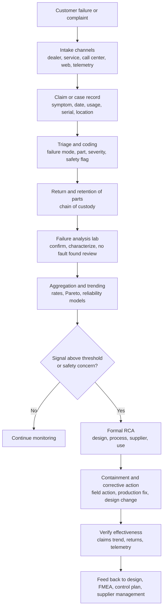

## Warranty and Field Failure Analysis

Warranty and field failure analysis applies RCA to failures that occur *after* a product has left the factory and entered customer use. Unlike in-plant nonconformances, field failures arrive through indirect channels (claims, returns, service reports, telemetry), with incomplete information, uncontrolled use conditions, and time delays between cause and effect. The analyst must reconstruct what happened from limited evidence, separate genuine product weaknesses from misuse and no-fault-found events, quantify the size and trajectory of the problem statistically, and decide whether containment actions such as a field campaign or recall are warranted. This reference covers the data pipeline, failure classification, physical failure analysis, reliability statistics, root cause methods adapted to field data, escape analysis, containment and regulatory considerations, and the feedback loop into design and manufacturing. Statistical formulas are standard textbook forms, and regulatory obligations vary by industry and jurisdiction, so verify against current references and legal counsel.

### 1. Why Field Failure RCA Differs from In-Plant RCA

| Aspect | In-Plant Nonconformance | Field Failure |
| --- | --- | --- |
| Time from cause to detection | Minutes to days | Weeks to years |
| Evidence | Parts, process data, direct observation | Returned parts (if any), claim text, service notes, telemetry, customer accounts |
| Operating conditions | Controlled, known | Uncontrolled, variable, sometimes unknown |
| Traceability | Usually full | Often partial (serial or date code only, or none) |
| Sample availability | Abundant | Only what is returned, biased toward failures |
| Failure confirmation | Immediate | May not reproduce (no fault found) |
| Business drivers | Scrap, rework | Warranty cost, safety, brand, regulatory exposure |
| Data quality | High | Variable, free-text, coded inconsistently |

**Key Points**

- Field data is a **biased and censored sample**. It contains only failures that were reported, claimed, or returned, and units still working are *right-censored* observations (their eventual failure time is unknown).
- A field failure can have multiple layers of cause: design weakness, manufacturing variation, material or supplier defect, installation or service error, misuse, environmental stress, and wear-out. RCA must separate these because the corrective owner differs for each.
- Speed matters: field failures can affect safety and grow with fleet age and volume, so early detection and containment often precede complete cause determination.

### 2. The Field Data Pipeline

**Data sources**

| Source | Content | Typical Limitations |
| --- | --- | --- |
| Warranty claims | Claim date, part, labor, cost, dealer text, failure code | Coding inconsistency, cost-driven claim behavior, delay in reporting |
| Returned parts (RMA) | Physical evidence for analysis | Return rate may be low or biased; parts degrade in transit or handling |
| Service and repair records | Diagnostics, parts replaced | Shotgun parts replacement masks true failed part |
| Customer complaints | Narrative of symptoms | Subjective, incomplete |
| Telemetry and diagnostic data (connected products) | Operating history, fault codes, usage | Privacy, data gaps, sensor limits |
| Field service reports and inspections | Engineering observations | Small sample sizes |
| Production and sales data | Build dates, volume, configuration, distribution | Needed as denominators; often disconnected from claims |
| Regulatory and third-party sources | Incident databases, complaints to agencies | Different definitions and reporting lags |

**Data quality actions**: standardize failure code taxonomies, require serial or date code capture, link claims to build data (traceability), mine free text with structured coding or text analytics, and audit code accuracy. Poor coding is one of the most common obstacles to field RCA.

### 3. Failure Classification and Triage

Before analysis, each failure should be classified to route it correctly.

**Failure mode and cause categories**

| Category | Meaning | Typical Owner |
| --- | --- | --- |
| Design-related | Design margin, tolerance stack, material selection, software logic | Engineering |
| Manufacturing-related | Assembly error, process variation, tooling, workmanship | Manufacturing quality |
| Supplier-related | Component or material defect | Supplier quality |
| Installation or service-related | Incorrect installation, repair error | Service and training |
| Use or misuse | Operation outside intended conditions or abuse | Product management, labeling |
| Environmental | Corrosion, temperature, humidity, contamination beyond design basis | Engineering, validation |
| Wear-out (end of life) | Expected degradation with age or usage | Reliability and warranty policy |
| No fault found (NFF) | Failure not reproduced on analysis | Requires deeper investigation |
| Software or firmware | Logic, calibration, update-related | Software engineering |

**Severity and safety triage**: failures with potential for injury, fire, regulatory violation, or loss of critical function are escalated immediately regardless of frequency. Severity ranking commonly follows FMEA-style scales, and safety-related field data is typically reviewed by a dedicated committee with authority to initiate field actions.

**No Fault Found (NFF)** deserves special attention. NFF is also labeled *cannot duplicate* (CND), *retest OK* (RTOK), or *no trouble found* (NTF). Frequent causes include intermittent faults (loose connections, thermal or vibration-dependent behavior), test conditions differing from field conditions, diagnostic errors, software or configuration issues, and customer misunderstanding. Treating NFF as "no problem" hides real defects. Recommended approaches include environmental stress testing (thermal cycling, vibration), extended monitoring, inspection of connectors and solder joints, log analysis, and comparison against field conditions.

### 4. Failure Analysis and Physical Evidence

Physical evidence anchors a field RCA. A disciplined lab sequence preserves evidence and avoids destroying the failure signature.

**Typical non-destructive to destructive sequence**

1. **Documentation and chain of custody**: photograph as received, record identification, and note packaging condition.
2. **External visual inspection**: damage, contamination, corrosion, wear patterns, tampering.
3. **Functional verification**: reproduce the reported symptom under defined conditions.
4. **Non-destructive analysis**: X-ray or CT imaging, acoustic microscopy (for delamination), thermal imaging, electrical characterization, leak testing.
5. **Data extraction**: read stored fault codes, event logs, or usage history.
6. **Destructive analysis** (after non-destructive steps are exhausted): cross-sectioning, decapsulation, metallography, fractography (fracture surface analysis), scanning electron microscopy with energy-dispersive spectroscopy (SEM/EDS), chemical and material analysis (FTIR, ICP), and mechanical testing.
7. **Comparison with reference samples** (known good parts and other failed parts).
8. **Root cause synthesis** combining physical findings, build records, and field conditions.

**Failure mechanism categories (illustrative)**

| Domain | Common Mechanisms |
| --- | --- |
| Mechanical | Fatigue, overload fracture, creep, wear, fretting, stress corrosion cracking |
| Electrical and electronic | Electrical overstress (EOS), electrostatic discharge (ESD), electromigration, tin whiskers, solder joint fatigue, dielectric breakdown, conductive anodic filament growth |
| Chemical and environmental | Corrosion, galvanic reaction, ingress of moisture or contaminants, outgassing, material degradation from UV or heat |
| Thermal | Thermal cycling fatigue, overheating, thermal runaway |
| Software | Logic errors, race conditions, memory leaks, configuration mismatches |

**Failure mechanism versus failure mode versus root cause**

| Term | Example |
| --- | --- |
| Failure mode (what is observed) | Device does not power on |
| Failure mechanism (physical process) | Solder joint fatigue crack at a BGA corner ball |
| Direct cause | Cyclic thermal strain exceeded joint fatigue life |
| Root cause | Design allowed high strain (CTE mismatch and no underfill), and thermal validation did not cover field cycling profile |

### 5. Statistical and Reliability Methods

Field failure analysis depends on statistics to size the problem, detect trends early, and predict future claims.

#### 5.1 Basic Rates and Normalization

Raw claim counts mislead because fleet size and age change over time. Normalization measures:

| Metric | Definition |
| --- | --- |
| Claims per thousand units (CPU or R/1000) | Claims divided by units in service, times 1000 |
| Incidents per thousand vehicles per time in service (or per hundred units) | Claims normalized by months in service (MIS) |
| Failure rate (hazard) | Instantaneous failure rate given survival to time $t$ |
| PPM in field | Failures per million units shipped |
| Cost per unit (CPU) or warranty cost per unit sold | Total warranty cost divided by units sold |

Analyses commonly organize data by **build cohort** (production month) and **time in service** so that a change in one production period can be detected and compared to earlier cohorts.

#### 5.2 Reliability Functions

For a failure time distribution with density $f(t)$ and cumulative distribution $F(t)$:

$$R(t) = 1 - F(t) = P(T > t)$$

$$h(t) = \frac{f(t)}{R(t)}$$

$$H(t) = \int_0^t h(u)\,du, \qquad R(t) = e^{-H(t)}$$

Here $R(t)$ is reliability (survival function), $h(t)$ is the hazard rate, and $H(t)$ is the cumulative hazard.

#### 5.3 Weibull Analysis

The Weibull distribution is widely used because it flexibly models infant mortality, random failures, and wear-out:

$$F(t) = 1 - \exp\left[-\left(\frac{t}{\eta}\right)^{\beta}\right]$$

$$h(t) = \frac{\beta}{\eta}\left(\frac{t}{\eta}\right)^{\beta - 1}$$

where $\beta$ is the shape parameter and $\eta$ is the characteristic life (the time by which about 63.2% of units have failed). A three-parameter form adds a location parameter $\gamma$.

| Shape $\beta$ | Hazard Behavior | Typical Interpretation |
| --- | --- | --- |
| $\beta < 1$ | Decreasing | Infant mortality: manufacturing defects, poor quality, early failures |
| $\beta \approx 1$ | Constant | Random failures (exponential case): chance events, overstress |
| $\beta > 1$ | Increasing | Wear-out: fatigue, corrosion, aging |

The Weibull shape parameter is a powerful clue for RCA direction. Infant-mortality signatures point toward manufacturing or supplier quality (and screening or burn-in gaps), while wear-out signatures point toward design life, material degradation, or duty cycle underestimates. [Inference: shape parameter interpretation is a heuristic, since mixed failure modes can distort the fit and yield misleading $\beta$ values.]

**Mixed populations**: a Weibull plot with a bend or multiple slopes suggests more than one failure mode. Analyze modes separately (competing risk analysis), or the fit will misrepresent both.

**Parameter estimation** methods include median rank regression (probability plotting) and maximum likelihood estimation (MLE). MLE handles censored data and is generally preferred for small samples with many suspensions, though it can be biased for very small samples, for which bias correction or Bayesian methods may be considered.

**Mean time to failure** for a Weibull distribution:

$$MTTF = \eta\,\Gamma\left(1 + \frac{1}{\beta}\right)$$

where $\Gamma$ is the gamma function. B-life values (for example, $B10$) give the time by which a given fraction fails:

$$B_p = \eta\left[-\ln(1 - p)\right]^{1/\beta}$$

so $B_{10} = \eta\,[-\ln(0.90)]^{1/\beta}$.

#### 5.4 Censored Data and Non-Parametric Estimation

Most fleet units are still operating, so failure data is **right-censored**. The Kaplan-Meier estimator gives a non-parametric survival estimate:

$$\hat{R}(t) = \prod_{t_i \leq t}\left(1 - \frac{d_i}{n_i}\right)$$

where $d_i$ is the number of failures at time $t_i$ and $n_i$ is the number of units at risk just before $t_i$.

**Worked example**: a cohort of 1,000 units is tracked. At month 6, 990 units remain at risk and 6 fail during that month. At month 7, 980 remain at risk and 4 fail. Then:

$$\hat{R}(7) = \left(1 - \frac{6}{990}\right)\left(1 - \frac{4}{980}\right) = (0.993939)(0.995918) \approx 0.98988$$

so estimated survival to month 7 is about 99.0%, ignoring earlier months.

Other useful tools: the Nelson-Aalen cumulative hazard estimator, Cox proportional hazards regression (to test effects of covariates such as supplier, plant, region, or usage), and **mean cumulative function (MCF)** plots for repairable systems (systems that can fail and be repaired repeatedly).

#### 5.5 Warranty Data Specific Issues

- **Reporting delay (lag)**: claims arrive after failure and sometimes after cost is booked. Recent cohorts appear artificially better until claims mature. Delay-adjusted (nowcasting) methods estimate the eventual claim count.
- **Unknown usage**: age is often known but usage (mileage, cycles) may not be. Two-dimensional warranty analysis models both.
- **Warranty limits**: claims stop at warranty expiry, so data beyond limits is missing (truncation).
- **Non-random reporting**: customers near the warranty limit may claim more often. Claim rates are affected by policy changes, goodwill programs, or dealer incentives.
- **Left truncation and unknown production**: ensure denominators reflect units actually in service.

#### 5.6 Trend Detection and Early Warning

| Method | Use |
| --- | --- |
| Control charts on claims per thousand ($u$ or $p$ charts) by production month | Detect cohort-level shifts (special cause) |
| CUSUM or EWMA on claim rates | Detect small persistent increases |
| Comparison of cohort survival curves (log-rank test) | Test whether two build groups differ |
| Sequential probability ratio test | Early detection of rate increases |
| Bayesian updating | Combine prior reliability knowledge with sparse early failures |
| Pareto of failure modes, parts, cost | Prioritize |
| Geographic, dealer, or usage segmentation | Reveal environmental or service effects |

For a $u$ chart of claims per unit exposure with average rate $\bar{u}$ and exposure $n_i$:

$$UCL_u = \bar{u} + 3\sqrt{\frac{\bar{u}}{n_i}}, \qquad LCL_u = \bar{u} - 3\sqrt{\frac{\bar{u}}{n_i}}$$

The log-rank test compares survival between groups and is widely used for build-cohort comparisons, assuming approximately proportional hazards.

**Worked example: cohort comparison**

Production month A (baseline): 5,000 units, 40 claims at 6 months (0.80%). Production month B (after a supplier change): 4,800 units, 96 claims at 6 months (2.00%). Two-proportion test with pooled proportion $\hat{p} = \dfrac{40 + 96}{5{,}000 + 4{,}800} = 0.013878$:

$$z = \frac{0.0200 - 0.0080}{\sqrt{0.013878(0.986122)\left(\frac{1}{4800} + \frac{1}{5000}\right)}} = \frac{0.0120}{\sqrt{0.013685 \times 0.00040833}} = \frac{0.0120}{0.002364} \approx 5.08$$

The difference is statistically significant (well beyond conventional thresholds). It points investigators toward what changed between cohorts (the supplier change), but the mechanism must still be established through physical analysis and process review.

#### 5.7 Warranty Cost Forecasting and Accrual

Reliability models feed **warranty reserve** estimates. A simple expected-claims model for a cohort:

$$E[\text{Claims}] = N \cdot F(t_w)$$

where $N$ is units sold and $F(t_w)$ is the probability of failure within warranty period $t_w$. Expected cost multiplies by average cost per claim. Forecast uncertainty is substantial when data is immature, so forecasts should be presented with confidence or prediction intervals rather than single values. [Inference: accounting treatment of warranty reserves depends on applicable accounting standards and organizational policy.]

### 6. Applying RCA Methods to Field Failures

#### 6.1 Structured Problem Definition

A field problem statement should specify: failure mode and mechanism (if known), affected models, build date range and plants, configuration, operating environment, time or usage at failure, failure rate versus expected, cost and safety implications, and confidence in the data.

#### 6.2 Is / Is Not and Cohort Comparison

Compare affected and unaffected units across build date, plant, line, supplier lot, software version, region, climate, usage profile, and customer type. Differences that separate the two groups are candidate causes. This is often the most efficient step in field RCA because field populations contain natural experiments.

| Dimension | Affected | Unaffected |
| --- | --- | --- |
| Build dates | Week 22 to 27 | Before week 22 and after week 27 |
| Plant | Plant B | Plant A |
| Supplier lot | Lot range 8810 to 8840 | Other lots |
| Region | Coastal, high humidity | Inland |
| Software | Version 2.3 | Version 2.4 |

#### 6.3 5 Whys with Field Constraints

**Worked example: Intermittent no-start complaints in a control module**

| Why | Answer | Evidence |
| --- | --- | --- |
| Why did units fail to start? | Microcontroller reset intermittently during power-up | Fault log analysis; reproduced on bench under low-voltage ramp |
| Why did it reset? | Supply voltage momentarily dipped below the reset threshold | Oscilloscope capture of supply rail |
| Why did the supply dip? | Bulk capacitor ESR (equivalent series resistance) higher than specified, so ripple exceeded margin | ESR measurement of returned versus new capacitors |
| Why was ESR high? | Capacitors from one supplier lot used a substituted electrolyte that degrades faster with heat | Teardown, chemical analysis, supplier disclosure |
| Why was the substitution not detected? | Change was not notified, and incoming inspection did not test ESR | Supplier change records, incoming inspection plan |
| Why was ESR not on the inspection plan? | Design FMEA rated capacitor degradation as low occurrence, and the control plan omitted the characteristic | FMEA and control plan review |

Systemic causes: (1) supplier change notification failure, (2) incoming inspection gap, (3) FMEA and control plan not reflecting a known degradation mechanism. Actions address all three, plus a field action for suspect date code ranges.

**Cautions specific to field 5 Whys**

- Answers must be backed by returned-part evidence or data, since field conditions cannot be observed directly.
- A plausible chain built from claim text alone is a hypothesis, not a finding.
- Branching is common because multiple factors (design margin, lot variation, thermal environment) often interact.

#### 6.4 Other Methods

| Method | Role in Field RCA |
| --- | --- |
| Fishbone (Ishikawa) | Organize design, process, material, environment, use, and measurement branches |
| Fault Tree Analysis (FTA) | Top-down logic of how system-level failure arises from component events; supports probability calculations |
| FMEA (as a comparison tool) | Check whether the failure mode and mechanism were anticipated and how occurrence and detection were rated |
| 8D | Formal team-based structure often required by customers |
| Barrier analysis | Identify which controls (design margins, screening, test) failed to prevent or detect |
| Change analysis | Compare what changed (design, process, supplier, software, environment) between good and bad populations |
| DOE and accelerated testing | Reproduce and confirm mechanism |
| Stress-strength interference | Model probability of failure when applied stress overlaps strength distribution |

Stress-strength interference for normally distributed stress $S \sim N(\mu_S, \sigma_S^2)$ and strength $X \sim N(\mu_X, \sigma_X^2)$:

$$P(\text{failure}) = P(X < S) = \Phi\left(-\frac{\mu_X - \mu_S}{\sqrt{\sigma_X^2 + \sigma_S^2}}\right)$$

where $\Phi$ is the standard normal cumulative distribution function. This helps quantify how variation in field loads and component strength combines to drive failure probability.

### 7. Reproduction, Accelerated Testing, and Validation of Cause

A field failure cause is best confirmed by reproducing the failure mechanism, not merely observing correlation.

**Approaches**

- **Bench reproduction** using conditions extracted from field data (temperature, voltage, vibration, duty cycle)
- **Accelerated life testing (ALT)**: elevate stress to shorten time to failure, then extrapolate to use conditions using an acceleration model
- **HALT (Highly Accelerated Life Test)** and **HASS** (Highly Accelerated Stress Screen): discover weaknesses and screen production

Common acceleration models (validity depends on the dominant failure mechanism):

Arrhenius (temperature-driven chemical or diffusion processes):

$$AF = \exp\left[\frac{E_a}{k}\left(\frac{1}{T_{use}} - \frac{1}{T_{stress}}\right)\right]$$

where $E_a$ is the activation energy in electron-volts, $k = 8.617 \times 10^{-5}$ eV/K is Boltzmann's constant, and temperatures are in kelvin.

Inverse power law (mechanical or voltage stress):

$$AF = \left(\frac{S_{stress}}{S_{use}}\right)^n$$

Coffin-Manson (thermal cycling fatigue):

$$AF = \left(\frac{\Delta T_{stress}}{\Delta T_{use}}\right)^m$$

**Worked example**: activation energy $E_a = 0.7$ eV, use temperature 55 °C (328.15 K), stress temperature 105 °C (378.15 K):

$$AF = \exp\left[\frac{0.7}{8.617 \times 10^{-5}}\left(\frac{1}{328.15} - \frac{1}{378.15}\right)\right] = \exp\left[8123.5 \times 0.00040294\right] = \exp(3.273) \approx 26.4$$

so one hour at stress corresponds to roughly 26 hours at use conditions if the same mechanism dominates and the model applies. Acceleration factors are highly sensitive to $E_a$ and to the assumption that the mechanism does not change at elevated stress, so extrapolation should be validated. [Inference: reported activation energies vary widely by mechanism and material, and choosing a value without experimental support can produce misleading life predictions.]

**Confirmation criteria for a field root cause**

1. The mechanism explains the observed failure signature on returned parts.
2. The mechanism can be reproduced or demonstrated (bench, ALT, or simulation).
3. The cause explains the distribution of failures across cohorts, environments, and time (why some units fail and others do not).
4. Removing or mitigating the cause reduces failures in new production and, where applicable, in remediated field units.

### 8. Escape Analysis and Feedback into Design and Process

Field failures are also failures of the upstream **detection system**. For each confirmed cause, ask why it was not prevented and not detected earlier:

| Barrier | Question |
| --- | --- |
| Design review and DFMEA | Was the failure mode identified? Was the risk rating accurate? |
| Design validation testing | Did test conditions cover field stresses, duty cycles, and durations? |
| Supplier qualification and change control | Was the change detected and evaluated? |
| Process FMEA and control plan | Was the characteristic controlled and measured? |
| Production testing and screening | Could a functional test, burn-in, or stress screen have caught it? |
| Final inspection and audit | Did sampling or inspection cover the defect? |
| Field monitoring | Was early warning available and used? |

**Feedback loops**

- Update DFMEA and PFMEA occurrence ratings using field data
- Update design guidelines, derating rules, and validation protocols (test-to-field correlation)
- Add production screening or test coverage
- Improve supplier requirements and change notification
- Revise warranty coding and data capture
- Add lessons learned to knowledge bases and design checklists

### 9. Containment, Field Actions, and Regulatory Considerations

**Decision factors** for a field action (service campaign, retrofit, customer notification, or recall):

- Safety risk (severity, probability, exposure)
- Regulatory obligations and reporting timelines
- Number of units potentially affected and identifiability of affected population
- Detectability and availability of a remedy
- Legal, customer, and reputational considerations

**Typical response tiers** (terminology varies by industry)

| Tier | Description |
| --- | --- |
| Production containment | Stop shipment, sort inventory, implement additional inspection or test |
| Change point cut-in | Implement the fix in production and mark the effective serial or date code |
| Service bulletin or technical service notice | Instruct service network on diagnosis and repair |
| Voluntary service campaign or retrofit | Proactive repair of affected units |
| Safety recall or regulatory field action | Formal action with regulator notification |
| Customer communication | Notification, advisories, or software update |

**Regulatory context (examples; jurisdiction and product dependent)**

| Domain | Illustrative Frameworks |
| --- | --- |
| Automotive | Requirements to report safety defects and conduct recalls under national regulators (for example, US Motor Vehicle Safety Act and TREAD reporting, UNECE-related regulations elsewhere) |
| Consumer products | Product safety regulators require reporting of substantial hazards (for example, US CPSA) |
| Medical devices | Complaint handling, medical device reporting (MDR), vigilance systems, and CAPA under ISO 13485, FDA 21 CFR 820 and 803 |
| Aerospace | Airworthiness authority requirements, service difficulty reporting, airworthiness directives |
| Electrical and electronic products | Product safety directives and standards (regional) |

Timelines for regulator notification can be short (days to weeks from awareness of a potential safety issue), and specific triggers and definitions differ by jurisdiction. Engage regulatory and legal specialists, because decisions with safety implications should not depend solely on statistical thresholds.

**Interim risk reduction** often continues while RCA proceeds: guidance to customers, monitoring, targeted inspections, or software mitigation.

### 10. Linkage to Quality Management Systems

| Standard or System | Field Failure RCA Tie-In |
| --- | --- |
| ISO 9001 clause 9.1.2 (customer satisfaction), 10.2, 8.5.5 (post-delivery activities, including warranty and feedback) | Requires consideration of post-delivery activities, customer feedback, and corrective action |
| IATF 16949 | Requires field failure analysis, warranty management processes, and analysis of returned parts, including NTF handling and feedback into the design and process FMEA |
| AS9100 | Requires analysis and investigation of returned product, customer complaint handling, and corrective action |
| ISO 13485 / FDA 21 CFR 820 | Complaint handling, CAPA, and medical device reporting |
| Six Sigma DMAIC and DFSS | Field data provide the baseline for improvement projects and inputs to design-for-reliability |
| ISO 9001 clause 9.3 (management review) | Warranty and field performance are standard review inputs |

Warranty metrics commonly tracked include claims per thousand, cost per unit, repeat repair rate, NFF rate, returns analyzed within target time, average time to root cause, and field action effectiveness.

### 11. Verification of Effectiveness

Because field cycles are long, verification combines leading and lagging indicators.

| Indicator | Meaning |
| --- | --- |
| Change-point comparison | Claims per thousand of post-fix cohorts versus pre-fix cohorts at equal time in service |
| Validation testing | Accelerated tests on updated design or process show the mechanism eliminated |
| Production metrics | Screening yield, process capability on the identified characteristic |
| Returned-part analysis | Absence of the failure signature in new returns |
| Telemetry | Fault code and usage data from updated units |
| Repair-effectiveness | Repeat failure rate in remediated field units |
| Survival curve comparison | Log-rank test between old and new cohorts |

**Verification criteria** should be defined in advance (metric, time-in-service window, sample size, and pass threshold). Early data may be too sparse for decisive comparisons, so stage-gate reviews (for example, at 3, 6, and 12 months in service) are commonly used, alongside leading indicators.

### 12. Common Pitfalls

1. **Treating NFF as "no failure"**, which conceals intermittent or condition-dependent defects.
2. **Analyzing claim counts without normalizing** by units in service, age, and cohort.
3. **Ignoring censoring and reporting lag**, causing recent cohorts to look artificially reliable.
4. **Mixing failure modes** in a single Weibull or trend analysis.
5. **Relying on claim text or dealer coding** without physical analysis.
6. **Assuming correlation is cause**: a cohort difference identifies candidates, not mechanisms.
7. **Stopping at "customer misuse"** without asking whether the design allowed or foreseeably invited it.
8. **Single-cause thinking** when design margin, process variation, and environment interact.
9. **Delaying containment** for full statistical proof when safety is involved.
10. **Neglecting escape analysis**, so the same category of failure recurs.
11. **Poor chain of custody and part retention**, destroying evidence.
12. **Extrapolating accelerated test results** beyond the validity of the acceleration model.
13. **Closing the loop only in production** without updating FMEA, validation tests, and supplier requirements.
14. **Warranty-cost-driven bias**: focusing only on high-cost claims and missing frequent low-cost failures, or vice versa, or being influenced by policy-driven claim behavior.

### 13. Practical Checklist

1. Standardize failure coding and capture serial and date code, usage, environment, and symptoms at intake.
2. Link claims to production, supplier lot, and configuration data.
3. Normalize claims by cohort and time in service, and monitor with control charts and survival analysis.
4. Triage by safety, severity, and volume, and escalate potential safety issues immediately.
5. Retain returned parts with chain of custody and analyze with a staged non-destructive to destructive protocol.
6. Investigate NFF systematically with stress and log analysis.
7. Compare affected and unaffected populations across build, supplier, plant, software, region, and usage.
8. Use Weibull and reliability analysis with correct handling of censoring and mixed modes.
9. Build evidence-backed cause chains covering occurrence and escape, and confirm the mechanism by reproduction.
10. Decide containment and field actions based on safety and regulatory criteria, engaging legal and regulatory functions.
11. Implement corrective actions in design, process, supplier controls, and validation, and update FMEA and control plans.
12. Verify effectiveness with predefined metrics across time-in-service windows and feed lessons into design and quality systems.

**Conclusion**

Warranty and field failure RCA extends root cause analysis into an environment of incomplete, delayed, and biased evidence. It requires disciplined data pipelines, sound reliability statistics that respect censoring and mixed failure modes, careful physical failure analysis, and systematic cohort comparison to localize causes. The 5 Whys contributes structured reasoning, but each step needs support from returned-part evidence, reproduction, or data. Effective programs address both the occurrence and the escape of failures, weigh safety and regulatory obligations alongside statistical thresholds, and route lessons back into design, process, supplier, and validation practices. Formulas, thresholds, timelines, and legal obligations vary by industry, jurisdiction, and product, so confirm against applicable standards and professional guidance.

**Related Topics**

- Weibull analysis and reliability data analysis in depth
- Kaplan-Meier, Cox regression, and competing risks methods
- Warranty data mining and text analytics
- Fault Tree Analysis and Failure Modes, Effects, and Criticality Analysis (FMECA)
- Accelerated life testing and HALT/HASS design
- Recall and field action decision frameworks
- Failure analysis laboratory techniques (SEM/EDS, fractography, metallography)
- Design for reliability and physics-of-failure approaches
- No Fault Found investigation methodologies
- Medical device complaint handling and CAPA