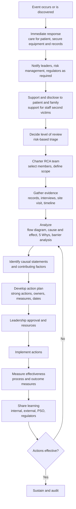

## Sentinel Event Root Cause Analysis

A sentinel event is a patient safety event that reaches a patient and results in death, permanent harm, or severe temporary harm. In healthcare, Root Cause Analysis (RCA) of sentinel events is a structured, systems-focused investigation whose purpose is to understand how the care system allowed the event to occur and to design strong actions that reduce the likelihood of recurrence. It differs from manufacturing RCA in several respects: the "product" is a human patient, the process is a socio-technical care pathway with high variability, evidence is largely testimonial and documentary, legal and regulatory pressures are strong, and a just culture must balance accountability with learning. This reference covers definitions and regulatory context, the RCA process (commonly called RCA2 in the US), team composition, evidence gathering, causal analysis methods including the 5 Whys and its limits, human factors and systems thinking, action hierarchy, measurement, disclosure and support for affected people, legal and confidentiality considerations, and common pitfalls. Regulatory definitions, timelines, and reporting requirements vary by country, state, accreditor, and payer, so verify against current sources before applying them.

### 1. Definitions and Terminology

| Term | Meaning |
| --- | --- |
| Adverse event | Harm to a patient resulting from medical care rather than from the underlying condition |
| Sentinel event (The Joint Commission, US) | A patient safety event (not primarily related to the natural course of the patient's illness or underlying condition) that reaches a patient and results in death, permanent harm, or severe temporary harm |
| Never event | Serious, largely preventable incident that should not occur if preventive measures are in place (term used by the National Quality Forum and NHS England, with differing lists) |
| Serious Reportable Event (SRE) | NQF-defined category of never events, often tied to state reporting rules |
| Near miss (close call) | An event that did not reach the patient, or reached the patient without causing harm, but had potential to do so |
| Unsafe condition | A circumstance that increases the probability of a patient safety event |
| Root cause | An underlying system-level factor which, if corrected, would reduce the likelihood of recurrence (healthcare RCA increasingly uses "causal factors" or "contributing factors" to reflect multiple causes) |
| Active failure | Unsafe act by a person at the sharp end, with immediate effects |
| Latent condition | Hidden weakness in the system (design, staffing, policy, equipment, culture) that creates the conditions for error |
| Just culture | Framework distinguishing human error, at-risk behavior, and reckless behavior, with responses proportionate to each |

**Examples of events commonly classified as sentinel** (definitions and lists vary by organization and jurisdiction)

- Patient death or permanent harm from a medication error
- Wrong-site, wrong-procedure, or wrong-patient surgery
- Unintended retention of a foreign object after surgery
- Suicide of a patient in a staffed care setting or within a defined period after discharge
- Infant discharge to the wrong family or infant abduction
- Delay in treatment resulting in death or permanent harm
- Fall resulting in serious injury or death
- Severe maternal morbidity or maternal death (definitions vary)
- Fire in a patient care area causing harm
- Patient death or serious injury associated with use of restraint or seclusion
- Radiation overdose or treatment to the wrong site

**Key Points**

- A sentinel event signals the need for **immediate investigation and response**, and its label is not dependent on error or fault. It refers to severity of outcome.
- Definitions differ: The Joint Commission's list and reviewable-event criteria, the NQF SRE list, and national systems (for example, NHS England's Patient Safety Incident Response Framework) do not map one-to-one.
- Modern practice emphasizes **systems thinking** over individual blame, in line with the Institute of Medicine report *To Err Is Human* (1999) and later work by the National Patient Safety Foundation.

### 2. Regulatory and Accreditation Context

| Body / Framework | Relevance (illustrative; confirm current requirements) |
| --- | --- |
| The Joint Commission (US) | Sentinel Event Policy expects organizations to conduct a comprehensive systematic analysis (often within 45 business days of becoming aware) and develop an action plan. Submission to TJC is voluntary in general, but review of sentinel events is a component of accreditation |
| State health departments (US) | Many states mandate reporting of specific serious events within set timelines, with varying content requirements |
| CMS Conditions of Participation (US) | Requirements for QAPI (Quality Assessment and Performance Improvement) programs in participating hospitals |
| Patient Safety Organizations (PSOs) under the Patient Safety and Quality Improvement Act of 2005 (US) | Provide federal privilege and confidentiality protections for Patient Safety Work Product when created for reporting to a PSO |
| NHS England | Patient Safety Incident Response Framework (PSIRF), which replaced the Serious Incident Framework, emphasizes proportionate learning responses; Patient Safety Incident Investigations (PSII) for select events |
| Australia, Canada, others | National or state incident management policies and sentinel event lists (for example, Australian Sentinel Events list, Canadian provincial policies) |
| Device and drug regulators (for example, FDA MedWatch, MHRA Yellow Card) | Reporting of device- or drug-related events |
| Professional licensing boards and risk management/insurers | May have separate reporting or notification obligations |

The Joint Commission's commonly cited target for completing a comprehensive systematic analysis and action plan is 45 business days from the event or from becoming aware of it. [Unverified: exact wording and timelines in current policy versions should be confirmed against the latest Joint Commission Sentinel Event Policy, as details are periodically revised.]

### 3. The RCA Process Overview (RCA2 and Related Frameworks)

The **RCA2** guide ("RCA2: Improving Root Cause Analyses and Actions to Prevent Harm," National Patient Safety Foundation, 2015; now under the Institute for Healthcare Improvement) updated healthcare RCA practice by stressing action strength, risk-based prioritization of events to analyze, and measurement of action effectiveness. The VA National Center for Patient Safety (NCPS) also developed widely used RCA tools and triage questions.

**Timeline (illustrative for a US hospital)**

| Period | Activities |
| --- | --- |
| Immediately | Provide clinical care, ensure safety, sequester equipment and supplies, preserve records (including audit trails), notify leadership and risk management |
| Within 24 to 72 hours | Initial review and triage, begin disclosure conversations, initiate staff support, decide on regulatory reporting, assemble RCA team |
| Within about 45 business days | Complete comprehensive systematic analysis and action plan (common accreditation expectation) |
| 3, 6, 12 months | Follow-up on action implementation and effectiveness measures |

### 4. Immediate Response and Preservation of Evidence

**Priorities**

1. **Care for the patient** and prevent further harm.
2. **Make the environment safe**: remove defective equipment from service, quarantine medications or products.
3. **Preserve evidence**: secure devices with logs (infusion pumps, monitors, ventilators), retain packaging and labels, save electronic health record (EHR) audit trails, and preserve schedules, staffing records, and communications. Avoid altering the medical record after the event, and document late entries appropriately.
4. **Notify**: leadership, risk management, quality and safety, and, as required, regulators, the manufacturer (for device issues), and insurers.
5. **Support the affected**: patient and family (disclosure), and staff involved (peer support).

**Chain of custody** for devices and physical items should be documented, and tampering avoided. Technical download of device data by qualified personnel or the manufacturer should be planned.

### 5. Disclosure, Communication, and Support

**Disclosure to patients and families** is an ethical expectation and often a regulatory or accreditation requirement. Good practice (for example, the CANDOR approach from AHRQ, "Communication and Optimal Resolution") includes:

- Timely, honest communication about what is known and unknown
- Expression of regret and, where appropriate, apology
- Commitment to investigate and share findings
- Ongoing contact with a designated point person
- Involvement of the patient or family in the review where they wish
- Attention to billing holds and resolution processes

Laws on apology inadmissibility vary by jurisdiction, so consult legal and risk management.

**Support for staff ("second victims")**: clinicians involved in serious events often experience distress, guilt, and loss of confidence. Programs such as peer support, employee assistance, and structured debriefing improve wellbeing and retention. The RCA process itself should be conducted respectfully to avoid compounding distress.

**Key Points**

- Disclosure and RCA proceed in parallel and are not substitutes for each other.
- Patients and families are frequently valuable sources of insight into what happened and about communication failures.
- Involvement of family in the RCA process is increasingly encouraged, subject to privilege and confidentiality arrangements.

### 6. Deciding When and How Deeply to Analyze

Not every event warrants a full RCA. RCA2 encourages a **risk-based approach** using severity and probability of recurrence. The Safety Assessment Code (SAC) matrix from the VA is one example: severity (catastrophic, major, moderate, minor) crossed with probability (frequent, occasional, uncommon, remote) yields a score guiding whether to conduct a full RCA.

| Severity \ Probability | Frequent | Occasional | Uncommon | Remote |
| --- | --- | --- | --- | --- |
| Catastrophic | 3 | 3 | 3 | 3 |
| Major | 2 | 2 | 2 | 1 |
| Moderate | 2 | 1 | 1 | 1 |
| Minor | 1 | 1 | 1 | 1 |

Scores of 3 typically trigger a full RCA, while lower scores may be handled through other reviews. [Inference: the exact matrix values and thresholds are shown here as a representative pattern, and the current VA and organizational versions should be consulted.]

Options for response range from a comprehensive RCA to a focused review, aggregate review of similar lower-severity events, failure mode and effects analysis (FMEA) for proactive assessment, or human factors-oriented simulation.

### 7. Assembling the RCA Team

**Recommended characteristics** (RCA2 suggests roughly 4 to 6 core members, though composition varies)

| Role | Contribution |
| --- | --- |
| Team leader or facilitator | Trained in RCA, neutral, guides the process |
| Subject-matter experts | Clinicians familiar with the type of care process (but not directly involved in the event) |
| Frontline staff | Who perform similar work routinely and know practical realities |
| Patient safety or quality professional | Methods, data, regulatory knowledge |
| Human factors or systems engineering expertise (where available) | Analysis of design and usability |
| Pharmacy, biomedical engineering, IT, nursing, or other domain specialists as needed | Domain knowledge |
| Leadership sponsor | Authority to approve resources and actions (often not a member of the working team) |
| Patient or family advisor (optional but increasingly encouraged) | Patient perspective |

**Exclusions**: individuals directly involved in the event should generally not be on the team (though they are interviewed), and supervisors of involved individuals are often excluded to reduce conflict and improve candor.

**Ground rules**: focus on systems, not blame; maintain confidentiality; separate the RCA from disciplinary or peer review processes (with the peer review privilege in mind); document decisions.

### 8. Evidence Gathering

**Sources**

| Source | Examples |
| --- | --- |
| Medical record | Notes, orders, medication administration record, vital signs, imaging, consents |
| EHR audit trail | Who accessed or changed what and when, alert firing and overrides |
| Device data | Infusion pump logs, ventilator settings, monitor alarms, bar-code scanning records |
| Pharmacy and supply records | Dispensing logs, lot numbers, stocking practices |
| Staffing and scheduling data | Nurse-to-patient ratios, overtime, float staff, experience mix |
| Policies, procedures, protocols | As written versus as practiced |
| Training records | Orientation, competency validation |
| Physical environment | Layout, lighting, noise, equipment placement (site visit) |
| Interviews | Staff involved, witnesses, patient and family |
| Prior events and data | Similar incidents, near misses, complaints, audits |
| Literature and guidelines | Evidence-based standards, alerts from safety organizations |

**Interview practice**: interviews are conducted in a non-punitive, open-ended manner (for example, using cognitive-interview techniques), ideally soon after the event and individually. Explain purpose and confidentiality, ask the person to tell the story, and probe for the conditions that influenced decisions ("What was going on around you?", "What did you expect to happen?"). Avoid leading questions and hindsight bias.

**Work-as-imagined versus work-as-done**: the written policy often differs from actual practice because of workload, tools, and competing priorities. RCA should capture both. Workarounds are signals of system design gaps.

### 9. Constructing the Timeline and Flow Diagrams

A **timeline** (chronology) reconstructs events in sequence with times, actors, actions, and decision points, and flags deviations from expected practice.

| Time | Event | Source | Comment |
| --- | --- | --- | --- |
| 08:10 | Order entered for drug X 10 mg | CPOE audit | Dose within alert threshold |
| 08:12 | Alert fired, overridden | EHR log | Override reason blank |
| 09:05 | Pharmacy verification | Pharmacy system | Verified without indication on order |
| 10:20 | Nurse administers dose | MAR, barcode scan | Barcode scan bypassed |
| 11:40 | Patient becomes unresponsive | Nursing note | Rapid response called |

A **process flow diagram** of the care process as designed and as performed helps locate where failures and barriers occurred. Add a **barrier analysis** overlay (defenses that should have prevented the event and why each failed or was absent).

### 10. Causal Analysis Methods

#### 10.1 Cause-and-Effect (Fishbone) and Contributing Factor Frameworks

Healthcare adaptations of the fishbone use domain-specific categories. The **Joint Commission Framework for RCA** and the **London Protocol** (Vincent and colleagues) list contributory factor classes, for example:

| Category | Examples |
| --- | --- |
| Patient factors | Condition complexity, language, cognitive status |
| Task and technology factors | Protocol availability, equipment design, alert design, interface usability |
| Individual (staff) factors | Knowledge, skill, fatigue, distraction |
| Team factors | Communication, handoffs, supervision, hierarchy |
| Work environment | Staffing, workload, physical layout, noise, interruptions |
| Organizational and management factors | Policy, culture, resource allocation, priorities |
| Institutional and external context | Regulation, supply chain, payer requirements |

The VA NCPS and RCA2 use a set of **triage questions** covering human factors, communication, training, environment, equipment, rules and policies, fatigue and scheduling, barriers, and other areas to prompt inquiry.

#### 10.2 The 5 Whys in Healthcare

The 5 Whys can be a helpful prompt to push beyond superficial explanations, but in healthcare it must be used with care. Critiques (including in RCA2) note that it can oversimplify complex socio-technical systems, encourage a single causal chain, stop at a convenient answer, and depend on the analyst's biases. Healthcare events commonly involve several interacting causes, so **branching** analysis (a cause tree, "Whys" repeated at each branch) is preferable to a single linear chain.

**Worked example: Wrong-route medication error (intravenous vincristine administered intrathecally is a well-documented category of catastrophic error; this example is a generic illustration)**

*Event*: A patient received a medication by an incorrect route, resulting in severe harm.

| Why | Answer | Evidence |
| --- | --- | --- |
| Why did the patient receive the drug by the wrong route? | The nurse connected the syringe to the wrong access port | Interview, timeline |
| Why did the nurse connect to the wrong port? | Two ports had compatible connectors, and the syringe fit both | Device inspection |
| Why did the connectors fit? | The device design allowed cross-compatibility and no forcing function existed | Device evaluation, manufacturer information |
| Why was the drug prepared in a syringe usable at either port? | Pharmacy prepares and labels drugs in syringes of the same type regardless of route | Pharmacy practice review |
| Why is there no route-specific packaging or separation? | Purchasing decisions and policy did not require route-specific, non-interchangeable connectors, and a previous risk assessment did not cover this scenario | Policy and procurement review, FMEA history |

*Systemic causes*: device and packaging design permitting misconnection, absence of a forcing function, and gaps in procurement and risk assessment. Also examine contributing conditions (workload, interruptions, checklist use, labeling, independent double check), and do not conclude with "nurse error".

**Guidance for using 5 Whys in sentinel events**

- Never stop at "human error", "failure to follow policy", "inadequate training", or "lack of vigilance". Ask what conditions made that action likely or reasonable at the time.
- Use it within a wider toolset (timeline, flow diagram, barrier analysis, fishbone), not as the only method.
- Support each answer with evidence.
- Beware hindsight and outcome bias: the outcome was known to reviewers but not to the clinician in the moment.
- Present multiple contributing factors rather than a single "root cause".

#### 10.3 Other Analytical Tools

| Tool | Purpose |
| --- | --- |
| Barrier analysis | Identify defenses, whether they existed, worked, or were bypassed |
| Change analysis | Compare event conditions to normal (what was different: staff, equipment, process, patient) |
| Fault tree analysis | Logic tree of how the top event could arise from component failures and human actions |
| Event and causal factor charting | Sequence with conditions and causes |
| Human Factors Analysis and Classification System (HFACS) | Taxonomy of unsafe acts, preconditions, unsafe supervision, and organizational influences (adapted from aviation) |
| Systems Engineering Initiative for Patient Safety (SEIPS) model | Work-system model (person, tasks, tools and technology, organization, environment) linked to processes and outcomes |
| Cognitive task analysis, simulation, and usability testing | Understand decision making and interface issues |
| Failure Mode and Effects Analysis (FMEA) and Healthcare FMEA (HFMEA) | Proactive analysis of similar processes to find other vulnerabilities |
| Bow-tie analysis | Visualize threats, preventive barriers, consequences, and mitigating barriers |
| Cause-and-effect analysis of data (Pareto) | Prioritize among recurring factors |

FMEA risk scoring commonly uses:

$$RPN = S \times O \times D$$

with severity $S$, occurrence $O$, and detection $D$ on defined scales, although RPN has known limitations, and HFMEA uses its own severity-probability scoring with a decision tree. [Inference: the choice of scoring method depends on organizational policy.]

**Swiss cheese model (James Reason)**: harm occurs when holes in multiple layers of defense align. Layers might include policy, staffing, equipment design, verification steps, and monitoring. RCA seeks to identify holes (latent conditions) and strengthen or add layers.

(svg_diagram)

<svg xmlns="http://www.w3.org/2000/svg" viewBox="0 0 900 320" width="900" height="320" font-family="Arial, sans-serif">
<text x="450" y="28" text-anchor="middle" font-size="18" font-weight="bold">Layers of Defense and Aligned Weaknesses (svg_diagram)</text>
<rect x="80" y="60" width="110" height="190" rx="10" fill="#e3f2fd" stroke="#1565c0" stroke-width="2" />
<rect x="250" y="60" width="110" height="190" rx="10" fill="#e3f2fd" stroke="#1565c0" stroke-width="2" />
<rect x="420" y="60" width="110" height="190" rx="10" fill="#e3f2fd" stroke="#1565c0" stroke-width="2" />
<rect x="590" y="60" width="110" height="190" rx="10" fill="#e3f2fd" stroke="#1565c0" stroke-width="2" />
<ellipse cx="135" cy="150" rx="18" ry="22" fill="#ffffff" stroke="#1565c0" stroke-width="2" />
<ellipse cx="305" cy="150" rx="18" ry="22" fill="#ffffff" stroke="#1565c0" stroke-width="2" />
<ellipse cx="475" cy="150" rx="18" ry="22" fill="#ffffff" stroke="#1565c0" stroke-width="2" />
<ellipse cx="645" cy="150" rx="18" ry="22" fill="#ffffff" stroke="#1565c0" stroke-width="2" />
<line x1="30" y1="150" x2="780" y2="150" stroke="#c62828" stroke-width="3" stroke-dasharray="8,5" />
<polygon points="780,150 764,142 764,158" fill="#c62828" />
<text x="135" y="275" text-anchor="middle" font-size="12">Policy and</text>
<text x="135" y="290" text-anchor="middle" font-size="12">staffing</text>
<text x="305" y="275" text-anchor="middle" font-size="12">Equipment and</text>
<text x="305" y="290" text-anchor="middle" font-size="12">interface design</text>
<text x="475" y="275" text-anchor="middle" font-size="12">Verification</text>
<text x="475" y="290" text-anchor="middle" font-size="12">steps</text>
<text x="645" y="275" text-anchor="middle" font-size="12">Monitoring and</text>
<text x="645" y="290" text-anchor="middle" font-size="12">rescue</text>
<text x="30" y="135" font-size="12" fill="#c62828">Hazard</text>
<text x="790" y="135" font-size="12" fill="#c62828">Harm</text>
</svg>

### 11. Human Factors and Systems Thinking

**Error types (Reason, Rasmussen)**

| Type | Description | Typical Countermeasure |
| --- | --- | --- |
| Slip | Attentional failure in a familiar task (right intention, wrong execution) | Forcing functions, design simplification, reduce interruptions |
| Lapse | Memory failure (omitting a step) | Checklists, reminders, automation |
| Mistake (rule-based or knowledge-based) | Incorrect plan or decision | Decision support, training, protocols, expertise access |
| Violation | Deliberate deviation (routine, situational, or reckless) | Address drivers of drift, workload; accountability for reckless conduct |

**Common contributing factors in healthcare events**: interruptions and distractions, handoff communication failures, fatigue and excessive workload, confusing look-alike or sound-alike drugs and labels, poor interface or alert design (alert fatigue), inadequate staffing or skill mix, ambiguity of ownership, steep authority gradients that inhibit speaking up, production pressure, missing or ambiguous policies, inconsistent equipment across units, and inadequate onboarding.

**Just Culture algorithms** (for example, from David Marx) help assess responses:

| Behavior | Response |
| --- | --- |
| Human error | Console, examine system design |
| At-risk behavior (drift, unintentional risk normalization) | Coach, remove incentives for risk-taking, address system drivers |
| Reckless behavior (conscious disregard of substantial risk) | Remedial or disciplinary action per policy |

Just culture does not mean no accountability. The point is that responses should be proportionate and consistent, and separate from the learning-oriented RCA. Substitution tests ("Would three other similarly trained clinicians likely have done the same in this situation?") help evaluate whether a system issue is at play.

**Resilience perspective (Safety-II)**: rather than studying only failures, examine how the system usually succeeds through adaptation, and learn from everyday work. This complements traditional RCA. [Inference: adoption of Safety-II concepts in formal RCA processes varies across organizations.]

### 12. Writing Causal Statements

RCA2 recommends **five rules of causation** (adapted from the VA NCPS) to keep statements precise and actionable:

1. Clearly show the cause-and-effect relationship.
2. Use specific, accurate descriptors, not negative or vague words ("poor", "inadequate", "careless").
3. Identify the preceding cause, not only the human error.
4. Violations of procedure are not root causes; they must have a preceding cause.
5. Failure to act is only causal when there is a pre-existing duty to act.

**Causal statement format**: *"[Cause] increased the likelihood of [effect], which led to [event]."*

**Examples**

Weak: "The nurse failed to follow the policy and gave the wrong dose."

Stronger: "The absence of a standardized concentration for heparin infusion bags stocked in the unit increased the likelihood of a concentration mix-up, which led to the patient receiving a tenfold overdose."

Stronger: "The alert design for high-dose warnings presented the same visual format as low-value alerts, which increased the likelihood the alert would be overridden, contributing to the administration of a dose above the safe range."

### 13. Action Hierarchy and Action Plan Development

The **VA/IHI Action Hierarchy** (RCA2) ranks actions by their expected strength in reducing harm:

| Strength | Examples |
| --- | --- |
| Stronger | Architectural or physical plant changes; forcing functions (for example, non-interchangeable connectors, physical barriers); simplify process and remove unnecessary steps; standardize on equipment or process; tangible involvement and action by leadership (for example, provide time and resources, make safety a stated priority) |
| Intermediate | Redundancy (independent double checks where truly independent); increase staffing or decrease workload; software enhancements or modifications; eliminate or reduce distractions (for example, no-interruption zones); education using simulation-based training with periodic refreshers; checklists and cognitive aids; eliminate look-alike or sound-alike names; standardized communication tools (for example, SBAR, read-back); enhanced documentation or communication |
| Weaker | Double checks (non-independent); warnings and labels; new procedure, memorandum, or policy; training (didactic only) |

Actions relying solely on policy changes, warnings, and training are generally less reliable because they depend on memory, vigilance, and sustained effort. The plan should include stronger actions wherever feasible, and weaker actions should be complementary.

**Action plan elements**

| Element | Detail |
| --- | --- |
| Linked cause | Each action addresses a specific causal statement |
| Action description | Specific, unambiguous |
| Strength classification | Stronger, intermediate, weaker |
| Owner | Individual accountable (with authority) |
| Resources | Budget, staff time, technology |
| Timeline | Start and completion dates |
| Risk of unintended consequences | Assess new hazards (a form of pre-mortem or FMEA) |
| Measure of success | Process and outcome measures with target and sampling |
| Monitoring and reporting | Who reports, to whom, how often |
| Leadership approval | Sign-off and resourcing |

**Example action plan excerpt**

| Cause | Action | Strength | Owner | Due | Measure |
| --- | --- | --- | --- | --- | --- |
| Interchangeable connectors permit route error | Procure and deploy route-specific, non-interchangeable connectors for all applicable devices | Stronger (forcing function) | Director of Supply Chain with Biomedical Engineering | 90 days | 100% of applicable units converted; monthly audit; zero route misconnection events |
| Multiple heparin concentrations in stock | Standardize on a single premixed concentration from pharmacy | Stronger (standardization) | Pharmacy Director | 60 days | Percentage of units stocked with only the standard bag; audit results |
| Alert overrides without reason | Redesign alert with tiering and mandatory override reason with pharmacist review for high-risk drugs | Intermediate (software) | CMIO and Pharmacy Informatics | 120 days | Override rate for high-risk alerts; alert acceptance rate |
| Staff unaware of the change | Simulation-based training with annual refresh | Intermediate | Nursing Education | 90 days | Competency completion rate |

### 14. Measuring Effectiveness

Action effectiveness measures should be defined at planning time, and RCA2 stresses that measures should show whether the actions were **implemented** (process measures) and whether they **worked** (outcome measures), with sampling plans and target values.

| Measure Type | Example |
| --- | --- |
| Process (implementation) | Percentage of infusion pumps converted, percentage of staff trained, checklist compliance audited by direct observation |
| Process (effect on behavior) | Rate of barcode scan compliance, independent double check completion |
| Outcome | Rate of medication errors of a given type per 1,000 patient-days, rate of recurrence of the event type, near-miss reports |
| Balancing measures | New problems introduced, workload changes, delays |
| Culture and engagement | Safety culture survey scores, reporting rates |

Run charts and control charts are useful for monitoring, and they align with the statistical process control principles used in manufacturing. Because sentinel events are rare, outcome measures alone are underpowered, so process measures and near-miss data serve as leading indicators. For rare events, time-between-events charts (such as g-charts) are appropriate. [Inference: chart selection depends on event frequency and data availability.]

For example, for events occurring at rate $\lambda$ per unit exposure, the probability of observing zero events in exposure $T$ under a Poisson model is:

$$P(0) = e^{-\lambda T}$$

which helps illustrate that a short event-free period is weak evidence of improvement when the baseline rate is low.

### 15. Documentation, Confidentiality, and Legal Considerations

**Privilege and confidentiality** vary widely. In the US, protections may arise from state peer review or patient safety statutes, and from the federal Patient Safety and Quality Improvement Act (PSQIA) for Patient Safety Work Product reported to a PSO. Organizations often structure the RCA process within a privileged patient safety evaluation system (PSES) and label documents accordingly. Consult legal counsel about scope, exceptions, and what may be discoverable.

**Practical documentation guidance** (confirm with counsel)

- Keep RCA documents separate from the medical record. Do not reference the RCA in the patient chart.
- Record factual, non-judgmental language.
- Limit distribution to those with a need to know.
- Maintain a distinction between the RCA report (analysis and action plan) and the factual records supporting it.
- Avoid speculation and legal conclusions such as "negligence" in RCA documents.

**Reporting obligations** to regulators, accreditors, and external bodies should be tracked, with timelines and content requirements assigned to a responsible person. Reporting to a PSO or state system may have different rules from reporting to an accreditor.

**Peer review and disciplinary processes** should be kept distinct from RCA. Where an individual's conduct requires separate review (for example, impairment or reckless behavior), the organization follows its policies, and the RCA continues to focus on systems.

### 16. Sharing Learning

- Internal dissemination: safety huddles, leadership rounds, alerts, and case-based education (de-identified)
- Cross-organizational learning: aggregated data through PSOs, state or national reporting systems, and safety alerts from organizations such as the Joint Commission, ISMP (Institute for Safe Medication Practices), ECRI, and national agencies
- Publication in journals or conferences in de-identified form
- Incorporation into policy, order sets, device selection criteria, curricula, and simulations
- Horizontal deployment: assess whether the same vulnerability exists in other units, sites, or processes (extent-of-condition review)

### 17. Comparison with Industrial RCA

| Aspect | Manufacturing and Quality RCA | Healthcare Sentinel Event RCA |
| --- | --- | --- |
| Object of analysis | Product or process nonconformity | Harm to a patient in a care process |
| Evidence | Parts, process data, measurements | Records, interviews, device logs, environment |
| Reproducibility | Often possible (test, DOE) | Rarely reproducible; simulation may help |
| Variability | Controlled process | High patient and situational variability |
| Data volume | High | Low for rare events |
| Emotional and ethical dimensions | Moderate | High (patient harm, disclosure, staff distress) |
| Legal environment | Product liability, contracts | Malpractice, regulation, privilege and confidentiality |
| Typical tools | 5 Whys, fishbone, SPC, DOE, 8D | Timeline, flow diagram, barrier analysis, RCA2 triage questions, action hierarchy |
| Just culture | Relevant | Central |
| Countermeasure preference | Poka-yoke, standard work | Forcing functions, standardization, simplification |

The common principle is that stronger, system-level controls outperform training and reminders.

### 18. Common Pitfalls

1. **Stopping at individual blame** ("nurse error", "physician failed") without identifying system contributors.
2. **Hindsight and outcome bias** influencing the team.
3. **Single root cause thinking**, forcing a linear chain onto a multi-factor event.
4. **Weak actions only** (retraining, new policy), leading to recurrence.
5. **Lack of leadership involvement**, meaning actions are not resourced or prioritized.
6. **Delayed or omitted disclosure** to patient and family.
7. **Neglecting staff support**, harming those involved and future reporting.
8. **Poor evidence preservation** (devices reset, records altered, supplies discarded).
9. **Team composition problems**, such as involving those closest to the event or excluding frontline expertise.
10. **Confusing the RCA with disciplinary review**, which discourages candor.
11. **No measurement** of effectiveness, or actions marked complete without confirming impact.
12. **Failure to consider unintended consequences** of new controls.
13. **Ignoring near misses**, which contain equivalent learning at lower cost.
14. **Poor confidentiality practice**, exposing the organization and chilling honest inquiry.
15. **Excessively long reports** that no one reads. Concise, action-focused communication is more effective.
16. **Not sharing learning** beyond the unit or organization.

### 19. Practical Checklist

1. Care for the patient, make the environment safe, and preserve evidence and records.
2. Notify leadership and risk management, and identify regulatory and accreditor reporting duties and deadlines.
3. Begin disclosure and provide support to patient, family, and staff.
4. Triage the event and charter an RCA team with appropriate expertise and a neutral facilitator.
5. Gather records, device data, staffing and policy information, and conduct non-punitive interviews and a site visit.
6. Build a timeline and flow diagram comparing work-as-imagined to work-as-done.
7. Analyze with multiple tools (barrier analysis, fishbone or contributing-factor framework, branching 5 Whys, human factors analysis).
8. Write causal statements following the rules of causation, avoiding blame language.
9. Develop an action plan with stronger actions where feasible, owners, timelines, and measures.
10. Obtain leadership approval and resources, and assess for unintended consequences.
11. Implement, then measure process and outcome effectiveness, including balancing measures.
12. Share learning, deploy horizontally, and audit sustainment.
13. Maintain confidentiality and privilege practices as advised by counsel.

**Conclusion**

Sentinel event RCA in healthcare is a systems-oriented, learning-focused investigation of events causing serious patient harm. It combines rapid response, evidence preservation, compassionate disclosure and staff support, a multidisciplinary team, structured causal analysis, and, most importantly, strong actions with measurable effectiveness. The 5 Whys remains a useful prompt for deeper inquiry, but it works best as one tool among several, applied in a branching fashion and always supported by evidence, because healthcare events rarely have a single linear cause. Definitions, timelines, reporting duties, confidentiality protections, and accreditation expectations differ by jurisdiction and organization, so confirm them with current regulatory guidance and legal counsel.

**Related Topics**

- RCA2 methodology and the action hierarchy in depth
- Just culture and the second victim phenomenon
- Healthcare FMEA (HFMEA) and proactive risk assessment
- Human factors engineering and the SEIPS model
- Medication safety and error-prevention design (ISMP practices)
- Disclosure, apology, and communication-and-resolution programs (CANDOR)
- Patient Safety Organizations and legal privilege
- Handoff communication (SBAR, I-PASS) and teamwork training
- Diagnostic error and delay-in-treatment analysis
- Safety-II and resilience engineering in healthcare