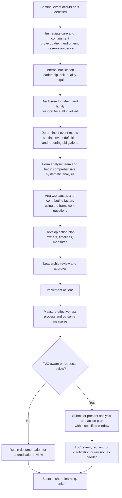

## Joint Commission RCA Framework


The Joint Commission (TJC) is a US-based nonprofit accrediting body for hospitals and other healthcare organizations. Its Sentinel Event Policy and its published "Framework for Root Cause Analysis and Corrective Actions" define what accredited organizations are expected to do after a serious patient safety event: respond, investigate through a thorough and credible comprehensive systematic analysis (commonly called a root cause analysis), develop an action plan, implement it, and monitor its effectiveness. This reference covers the policy's definitions and expectations, the structure and content of the framework, the analytic questions it poses, how it relates to RCA2 and the VA NCPS tools, the role of the 5 Whys within it, how to write and assess causal statements and actions, timelines and submission options, and common weaknesses found in submitted analyses. Policies and frameworks are revised periodically, and detailed wording, timelines, and thresholds should be verified against the current TJC Sentinel Event Policy and accreditation manual for the applicable program (hospital, behavioral health, ambulatory, home care, and so on).

### 1. Background and Regulatory Position

The Joint Commission began its Sentinel Event Policy in 1996 and has revised it several times. Accreditation standards (in the Leadership and Performance Improvement chapters, with the sentinel event requirements historically tied to standards such as LD.03.09.01 for hospitals) require organizations to have a process for identifying, responding to, and learning from sentinel events. Standard numbering and text change between manual editions, so confirm the current identifiers.

| Element | Description |
| --- | --- |
| Purpose | Improve patient safety by ensuring organizations respond to serious events with thorough analysis and durable corrective action, and by enabling learning across healthcare |
| Basis | Accreditation requirements, with review of the organization's response to sentinel events |
| Voluntary self-reporting | Organizations are encouraged, though generally not required, to report sentinel events to TJC. TJC may also become aware of events through patients, families, media, or other sources, and may request information |
| Review of response | TJC reviews the organization's comprehensive systematic analysis and action plan for thoroughness and credibility when it becomes aware of a reviewable sentinel event |
| Confidentiality | TJC has stated that it treats submitted information confidentially, and organizations may choose formats (such as a submission through a secure extranet site or an on-site review) that they consider appropriate to protect privileged material. The legal status of any disclosed document varies, so obtain legal advice |
| Related bodies | Patient Safety Organizations (PSOs), state agencies, CMS, and other accreditors have separate or overlapping requirements |

**Key Points**

- The framework is expressed as both a **policy** (what must be done, when, and by whom) and an **analytic guide** (what the analysis should cover).
- TJC does not prescribe a single analytic method. It expects the analysis to be thorough and credible. Organizations may use RCA2, the VA NCPS approach, the London Protocol, or an internally developed process, provided the key elements are addressed.
- Where this reference refers to a commonly cited timeline (for example, about 45 business days), treat it as a general expectation to confirm against the current policy text.

### 2. Definitions Under the Sentinel Event Policy

| Term | Meaning (paraphrased; confirm current wording) |
| --- | --- |
| Patient safety event | An event, incident, or condition that could have resulted or did result in harm to a patient |
| Sentinel event | A patient safety event that reaches a patient and results in death, permanent harm, or severe temporary harm |
| Permanent harm | Harm to the patient that is not expected to resolve, requiring ongoing intervention or resulting in lasting functional loss |
| Severe temporary harm | Critical, potentially life-threatening harm lasting for a limited time with no permanent residual, but requiring transfer to a higher level of care or monitoring for a prolonged period, transfer to a higher level of care for a life-threatening condition, or additional major surgery, procedure, or treatment to resolve the condition |
| Reviewable sentinel events | Subset of events that TJC specifically identifies for review (for example, specified categories such as unanticipated death, wrong-site surgery, retained foreign object, and others listed in the policy) |
| Comprehensive systematic analysis | The organization's structured investigation of causes and contributing factors, aimed at system-level improvement (often called a root cause analysis, though TJC uses the broader term) |
| Action plan | Documented, time-bound, owned actions designed to reduce the risk of recurrence, with measures of effectiveness |
| Close call / near miss | An event that did not reach the patient or reached the patient without harm. These are not sentinel events but are valuable learning sources |

Examples of categories TJC has historically listed among sentinel events include suicide of a patient in a setting with around-the-clock care, unintended retention of a foreign object, surgery on the wrong patient or body part, infant abduction or discharge to the wrong family, severe maternal morbidity and maternal death, fall resulting in injury requiring surgery or causing death, delay in treatment resulting in severe harm, and others. Lists are updated over time.

### 3. Policy Expectations: The Response Sequence



**Stage details**

**Immediate response**: care for the patient, prevent further harm, preserve devices, supplies, and records, and notify appropriate internal roles. The organization is expected to support those affected, including patients, families, and staff.

**Disclosure**: TJC standards on patient rights and communication (for example, requirements that patients and families be informed of unanticipated outcomes of care) support timely, honest disclosure. State law and organizational policy shape details.

**Analysis and action plan**: TJC's commonly cited expectation is completion of the comprehensive systematic analysis and action plan within 45 business days of the event or of becoming aware of it. [Unverified: the exact trigger and any allowance for extensions should be confirmed in the current Sentinel Event Policy.]

**Submission or review**: When TJC becomes aware of a reviewable sentinel event, it requests the organization's analysis and action plan. Organizations can typically submit documents, or work with TJC through alternative approaches such as a review during a site visit or a screen-share arrangement, depending on their confidentiality concerns and TJC's options at the time. [Unverified: available review pathways change, so confirm the current options.]

**Follow-up**: TJC may ask for evidence of implementation and of measures of success, and it may follow up on action plans that are judged deficient.

### 4. The Framework Structure: Analytic Questions and Domains

The TJC "Framework for Root Cause Analysis and Corrective Actions" is presented as a table of questions organized by category, intended to guide the team through the analysis. A commonly seen organization includes:

| Domain | Focus of Inquiry |
| --- | --- |
| Behavioral assessment / human factors | Were staff fatigued, distracted, or impaired? Did the individuals have the knowledge and skills? What were the situational demands? |
| Patient assessment and care planning | Was the patient assessed appropriately? Were risks identified and communicated? Was the plan of care appropriate and followed? |
| Physical environment and equipment | Was the environment safe? Was equipment functioning, appropriate, available, and configured correctly? Were there design issues? |
| Information management and communication | Was information accurate, timely, and accessible? Were handoffs effective? Did communication among team members and with the patient function? |
| Staffing and competence | Were staffing levels and skill mix adequate? Was orientation and competency validation sufficient? |
| Organizational culture and leadership | Was there a culture that supported reporting and speaking up? Were priorities and resources aligned with safety? |
| Security, medication management, other specific systems | Were relevant policies and processes (for example, medication use, security, restraint use) designed and followed? |
| Uncontrollable external factors | Were there factors beyond the organization's control that contributed? Can the organization mitigate their effects? |
| Other | Additional issues the team identifies |

For each domain, the team asks whether a factor was present, whether it contributed to the event, and what the underlying system-level cause was. Answers should be supported by evidence, and the framework's structure helps prevent narrow investigations that stop at the sharp-end actor.

**Representative analytic questions** (paraphrased illustrations of the type of questions a team should ask)

| Domain | Illustrative Question |
| --- | --- |
| Human factors | What was the workload and how many concurrent tasks did the staff member handle? |
| Communication | Was critical information about the patient's condition or plan communicated to everyone who needed it, and how was it verified? |
| Equipment | Were alarms audible, actionable, and set appropriately? Did the device design invite misuse? |
| Policy and procedure | Was there a policy? Was it accessible, practical, and used? How does actual practice differ? |
| Training | How were staff trained and evaluated on the process? |
| Environment | Did layout, lighting, noise, or storage practices contribute? |
| Leadership | Did leaders know about similar issues previously? Were prior concerns addressed? |
| Barriers | What defenses should have prevented the event and why did they fail or not exist? |

### 5. Steps in a Comprehensive Systematic Analysis Aligned to TJC Expectations

Although TJC does not mandate one method, the analysis it expects typically includes the following steps.

1. **Define the event and scope** with a factual summary.
2. **Assemble a multidisciplinary team** with appropriate expertise, including those knowledgeable about the process and not directly involved in the event.
3. **Collect data**: records, device data, interviews, policies, staffing information, environmental review.
4. **Create a timeline and flow diagram** of the process as designed and as performed.
5. **Identify causal and contributing factors** using the framework domains and additional tools (fishbone, barrier analysis, 5 Whys, fault trees).
6. **Determine root causes** and write causal statements linking causes to the event.
7. **Assess relevant literature and best practices** for the involved process (for example, national guidelines and standards).
8. **Evaluate the risk of recurrence** and similar vulnerabilities in other areas of the organization.
9. **Develop corrective actions** targeted at root causes, with preference for stronger actions.
10. **Define measures of effectiveness**, targets, and monitoring responsibilities.
11. **Obtain leadership approval and provide resources**.
12. **Implement and monitor**, adjusting as needed.

**Elements TJC reviewers commonly look for** (based on the framework's stated criteria for a thorough and credible analysis; confirm current criteria)

| Criterion | Meaning |
| --- | --- |
| Thorough | Addresses the significant process elements, includes relevant literature and best practices, and considers human factors and other contributing areas |
| Credible | Includes leadership participation, involves those closest to the process, is internally consistent, and provides explanations for all findings, including the absence of relevant factors |
| Includes analysis of the process | Not limited to the individuals involved |
| Determines system-level causes | Not limited to individual performance |
| Identifies risk reduction strategies | With a plan to implement, timelines, and measurement |
| Measures effectiveness | Includes measurement approach and follow-up |

The idea of **explaining the absence** of a factor is distinctive: if a domain question is answered "no contribution", the analysis should still show it was considered and why it was ruled out.

### 6. The 5 Whys Within the TJC Framework

TJC's framework and related educational materials include a step for asking "why" repeatedly to drill into causes. It is one prompt among many, and TJC expects analysts to use it to move beyond the immediate cause rather than treat it as a complete method.

**Guidance for use**

- Treat "why" as a **branching** tool. Each answer may have several causes. Follow each branch.
- Stop when you reach a cause that is **actionable at the system level**, not when you reach the fifth "why".
- Do not conclude with individual performance ("failed to follow protocol", "careless", "inadequate attention") without asking what conditions produced the behavior.
- Support each answer with evidence such as records, logs, observation, or interview findings.
- Use the "what would stop this from happening again?" test on each candidate cause: if removing the cause would not plausibly prevent recurrence, dig further.

**Worked Example: Patient fall with serious injury on an inpatient unit**

*Event*: A patient assessed as at moderate fall risk fell while walking to the bathroom unassisted and sustained a hip fracture requiring surgery.

| Why | Answer | Evidence |
| --- | --- | --- |
| Why did the patient fall? | Patient attempted to walk to the bathroom alone at night and lost balance | Interview, nursing note, camera-free event reconstruction |
| Why was the patient walking alone? | The call light was not answered within the time the patient was willing to wait | Call light system log shows a 9-minute response |
| Why was the response delayed? | Only two nurses were covering the unit that night with several admissions and a rapid response in progress | Staffing records, event log |
| Why was staffing at that level? | Float pool coverage was unavailable, and no escalation pathway existed to adjust unit assignments in real time | Staffing policy review, interview with staffing office |
| Why was the fall-prevention plan not effective for this patient? | Risk score was recorded but did not trigger a bed-exit alarm or scheduled toileting rounds, because the care plan template did not link risk level to specific interventions | Care plan template review, EHR configuration |

*Systemic causes identified*: absence of real-time staffing escalation, and a fall-risk process in the EHR that recorded the score without linking to required interventions. Additional contributing factors could include medication effects on gait and nighttime lighting, and these branches would be pursued as well.

### 7. Writing Causal Statements

TJC-aligned practice adopts the **five rules of causation** (also used in RCA2 and derived from the VA NCPS):

1. Show the cause-and-effect relationship clearly.
2. Use specific, accurate descriptors rather than vague or negative words ("poor", "inadequate", "careless").
3. Human errors must have a preceding cause.
4. Violations of procedure must have a preceding cause.
5. Failure to act is causal only when there was a pre-existing duty to act.

**Format**: *"[Cause] increased the likelihood of [effect], which led to [event]."*

**Examples**

| Weak | Stronger |
| --- | --- |
| "The nurse did not follow the fall policy." | "The absence of a link between the fall-risk score and required interventions in the care plan template increased the likelihood that high-risk patients would not receive bed-exit alarms or scheduled toileting rounds, which led to the unassisted ambulation and fall." |
| "Inadequate staffing caused the delay." | "The lack of a defined process to adjust unit assignments in real time during simultaneous admissions and an emergency response increased the likelihood of delayed call light response, which contributed to the patient attempting to walk unassisted." |

### 8. Corrective Action Development and Strength

TJC expects the action plan to identify **risk reduction strategies** targeted at root causes, with responsible parties, timelines, and measures of success. Materials associated with the framework, and the RCA2 guidance widely used to operationalize it, emphasize the **action hierarchy**:

| Strength | Examples |
| --- | --- |
| Stronger | Forcing functions, architectural changes, standardization of equipment or process, simplification, leadership engagement with resource commitment |
| Intermediate | Redundancy, software enhancements, reduce workload or distractions, simulation-based training with refreshers, checklists and cognitive aids, standardized communication tools |
| Weaker | Policy or procedure changes alone, warnings and labels, didactic training, non-independent double checks |

A credible plan usually includes at least one stronger or intermediate action for each significant root cause, with weaker actions serving as supports. Actions that rely solely on retraining or reminders are commonly viewed as insufficient.

**Example action plan excerpt (fall event continued)**

| Root Cause | Action | Strength | Owner | Due | Measure of Success |
| --- | --- | --- | --- | --- | --- |
| Risk score not linked to interventions | Rebuild fall-risk assessment in the EHR so that a moderate or high score automatically generates required orders (bed-exit alarm, toileting schedule, non-slip footwear) | Intermediate (software) | CNIO with Nursing Informatics | 120 days | Percentage of moderate and high risk patients with all bundle components (audit 30 patients per month per unit); target at least 95% |
| No real-time staffing escalation | Create a charge-nurse-activated staffing escalation pathway with authority to reassign staff or call in additional coverage | Intermediate | Chief Nursing Officer | 60 days | Escalation events logged and resolved within 30 minutes; monthly review |
| Delayed call light response | Install call light dashboard with automatic escalation to a secondary responder after a defined interval | Intermediate | Director of Nursing Operations with Facilities | 6 months | Median and 90th percentile call response time; falls per 1,000 patient-days with injury |

**Measurement**: define process measures (implementation and adherence), outcome measures (recurrence, related events), balancing measures (unintended effects), sample size, frequency, target, and responsible person. TJC's guidance stresses that measures should be able to show whether the actions are effective, and organizations are commonly expected to monitor over a defined period (for example, several months) with documented results. [Inference: specific durations and sample size requirements are organizational choices unless a particular standard states otherwise.]

For rare outcomes, event-free time is weak evidence. If the baseline rate is $\lambda$ events per unit exposure, then the probability of no events in exposure $T$ under a Poisson model is:

$$P(0) = e^{-\lambda T}$$

which shows why process measures are essential as leading indicators.

### 9. Leadership, Culture, and Team Composition

TJC expects **leadership involvement**, and the framework's credibility criteria explicitly reference participation of leadership and of those closest to the process. Standards on the culture of safety (LD.03.01.01 and related standards in current manuals; confirm identifiers) expect leaders to create and maintain a culture of safety and quality, including a **just culture** that encourages reporting and learning while holding people accountable for reckless behavior.

| Team Role | Notes |
| --- | --- |
| Facilitator | Trained in RCA and neutral |
| Leadership sponsor | Ensures resources and follow-through |
| Frontline staff familiar with the process | Not directly involved in the event where possible |
| Subject-matter experts | Clinical, pharmacy, biomedical engineering, informatics, environmental services, security as relevant |
| Patient safety and quality staff | Methods and data |
| Patient and family perspective | Increasingly encouraged |

The individuals directly involved in the event are interviewed but typically not team members. Supervisors of the involved staff are often excluded from the team to encourage open discussion.

### 10. Relationship to Other RCA Frameworks

| Framework | Relationship to the TJC Framework |
| --- | --- |
| RCA2 (NPSF/IHI) | Operational guidance that aligns with TJC expectations, adding risk-based triage of events, the action hierarchy, and measurement emphasis |
| VA NCPS RCA tools | Source of triage questions, Safety Assessment Code matrix, five rules of causation, and action hierarchy adapted in RCA2 |
| London Protocol (Vincent and colleagues) | Systems analysis of clinical incidents using contributory factor classification |
| NHS England PSIRF | Different national approach emphasizing proportionate, learning-focused responses rather than a prescribed RCA for each event |
| HFMEA / FMEA | Proactive assessment often used after an RCA to examine similar processes |
| Six Sigma and Lean tools | Provide analytic tools (process mapping, Pareto, control charts) that can support the comprehensive systematic analysis |
| ISO 9001 and industrial CAPA | Similar structure (containment, cause analysis, corrective action, effectiveness), different regulatory context |

TJC's framework is intentionally method-neutral, so organizations can integrate these tools as long as the analysis meets its criteria.

### 11. Statistical and Quality Tools Used Within the Framework

Although the framework is qualitative in structure, quantitative methods often support it.

| Tool | Use |
| --- | --- |
| Run charts and control charts | Monitor process measures (for example, falls per 1,000 patient-days, barcode scan compliance) |
| Pareto analysis | Prioritize among recurring contributing factors across events |
| Time-between-events charts (g-charts, t-charts) | Monitor rare events |
| Trend analysis of near misses | Detect emerging risks |
| Benchmarking | Compare rates to national databases where available (for example, NDNQI for nursing-sensitive indicators) |
| Fault tree analysis | Explore combinations of failures |
| Simulation | Test usability and process assumptions |

Rate normalization example:

$$\text{Fall rate} = \frac{\text{Number of falls}}{\text{Patient-days}} \times 1000$$

A control chart for rates per exposure $n_i$ (a $u$ chart) uses limits:

$$UCL_u = \bar{u} + 3\sqrt{\frac{\bar{u}}{n_i}}, \qquad LCL_u = \bar{u} - 3\sqrt{\frac{\bar{u}}{n_i}}$$

where $\bar{u}$ is the average rate per unit exposure. Special-cause signals prompt investigation, and improvement after an intervention should be evaluated with appropriate run chart or control chart rules rather than simple before-and-after averages.

### 12. Documentation Structure

A well-organized analysis document supports both internal use and any external review. A common structure (illustrative; organizations may use TJC's own template or an internal one):

| Section | Content |
| --- | --- |
| Event summary | Concise, factual description, dates, location, patient outcome (de-identified as appropriate in the analysis document) |
| Team and process | Team members by role, methods, dates, evidence reviewed |
| Timeline and process description | Chronology and flow diagram |
| Findings by framework domain | For each domain: whether it contributed, evidence, and rationale, including factors ruled out |
| Root causes and causal statements | Written per the rules of causation |
| Literature and best practice review | Relevant guidelines and standards, and comparison to organizational practice |
| Risk reduction strategies and action plan | Table with cause, action, strength, owner, timeline, measure |
| Measurement plan | Process, outcome, and balancing measures with targets and monitoring |
| Leadership review | Sign-off and resource commitments |
| Communication and learning | How lessons will be shared internally and externally |

**Illustrative data model for tracking** (not a standard):

```plaintext
SentinelEvent
  event_id, date_occurred, date_identified, event_type, location, outcome_category
  reportable_to[] {agency, due_date, submitted_date}
  disclosure {date, participants, follow_up}
  analysis {team[], start_date, completion_date, methods[], evidence_index[]}
  findings[] {domain, contributed(bool), evidence, rationale}
  causal_statements[]
  actions[] {linked_cause, description, strength, owner, due_date, status}
  measures[] {type, definition, target, sample, frequency, results[]}
  leadership_approval {name, date}
  status, closed_date
```

### 13. Confidentiality, Privilege, and Legal Considerations

- Protections for RCA materials arise from a patchwork of state peer review and patient safety statutes, and, in the US, the Patient Safety and Quality Improvement Act (PSQIA) for Patient Safety Work Product reported to a PSO. The scope of protection varies by state and circumstance, and privilege can be lost through improper handling or distribution.
- Organizations often conduct RCAs within a defined patient safety evaluation system and label documents accordingly. Engage counsel to structure the process.
- Keep the RCA document separate from the medical record and avoid referencing the RCA in the chart.
- Consider what is shared with TJC and in what format. TJC has stated that it protects the confidentiality of information it receives, and it offers options for how to present the analysis. Organizations should decide with counsel whether to submit documents or use an alternative review format.
- State reporting laws, CMS requirements, and other regulators may separately require notification or documentation.
- Avoid legal conclusions in RCA documents ("negligent", "at fault") and keep language factual.

### 14. Common Deficiencies in Analyses

Patterns that commonly reduce the credibility of a comprehensive systematic analysis:

1. **Focus on individual performance** as the primary cause, with actions such as counseling or retraining.
2. **Missing or superficial consideration of framework domains**, with no explanation of factors ruled out.
3. **Action plans consisting mainly of weaker actions** (policy revision, education, reminders).
4. **Root cause statements that are vague or not causally linked** to the event.
5. **Lack of leadership involvement** and no clear resource commitment.
6. **No measurement plan**, or measures that cannot show effectiveness (no baseline, target, sample, or timeline).
7. **Failure to review relevant literature or best practices.**
8. **Failure to consider recurrence risk elsewhere** in the organization.
9. **Incomplete evidence**, such as no device data or staffing data examined.
10. **Analysis not completed within the expected timeframe** without documented justification.
11. **Excessive reliance on single-chain 5 Whys** that ends at a proximal cause.
12. **Team composition problems**, such as no frontline representation or the inclusion of those directly involved.
13. **Inconsistencies** between the narrative, causal statements, and actions.
14. **No plan to share learning** or sustain changes.

### 15. Practical Checklist

1. Confirm the event meets the organization's and TJC's sentinel event definitions, and identify all external reporting obligations and deadlines.
2. Provide care, preserve evidence, and begin disclosure and staff support.
3. Charter a multidisciplinary team with leadership sponsorship and a trained facilitator.
4. Gather records, device and system data, policies, staffing information, and interview results.
5. Build a timeline and flow diagram of work-as-designed versus work-as-done.
6. Work systematically through the framework domains, documenting contributing factors and explaining those ruled out.
7. Use branching 5 Whys, fishbone, and barrier analysis to reach system-level causes.
8. Write causal statements using the five rules of causation.
9. Review literature and best practices for the process involved.
10. Develop actions with attention to the action hierarchy, and assign owners, dates, and resources.
11. Define measures of effectiveness with targets, sampling, and responsible individuals.
12. Obtain leadership approval and communicate findings appropriately.
13. Complete the analysis within the expected timeframe and prepare for possible TJC review with counsel's guidance.
14. Implement, monitor, adjust, and share lessons across the organization.

**Conclusion**

The Joint Commission's RCA framework defines what a credible response to a sentinel event looks like: prompt care and disclosure, a comprehensive systematic analysis that examines human factors, communication, environment, equipment, staffing, and leadership, system-level causal statements, actions matched to causes with a preference for stronger interventions, and measurement of effectiveness. It is deliberately method-neutral, so organizations commonly operationalize it with RCA2 tools, including the action hierarchy and rules of causation, and use the 5 Whys as a prompt within a branching, evidence-based analysis. Policy wording, timelines, submission pathways, and standard numbers are revised periodically, so verify them against current Joint Commission documents and obtain legal advice on confidentiality and reporting obligations.

**Related Topics**

- RCA2 methodology and action hierarchy in detail
- VA National Center for Patient Safety tools (triage questions, Safety Assessment Code matrix)
- Patient Safety Organizations and PSQIA privilege
- Just culture frameworks and second victim support
- Healthcare FMEA and proactive risk assessment
- London Protocol and contributory factor classification
- NHS England PSIRF compared with US approaches
- Disclosure and communication-and-resolution programs
- Leadership standards for a culture of safety
- Measuring safety improvement with run charts and control charts