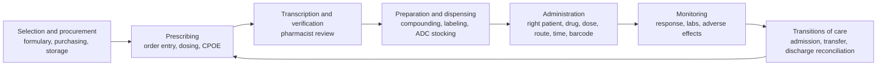
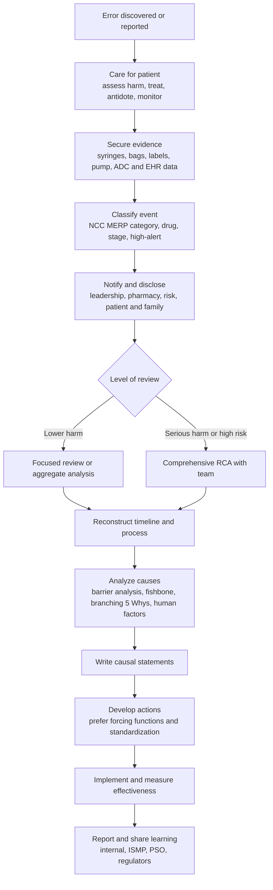

## Medication Error Investigation

A medication error is a preventable event that may cause or lead to inappropriate medication use or patient harm while the medication is in the control of a health care professional, patient, or consumer. Investigating medication errors is one of the most common and most productive applications of RCA in healthcare, because the medication-use process is long, involves many hand-offs and technologies, and produces well-characterized failure modes. This reference covers definitions and classification (NCC MERP index, ISMP taxonomy), the medication-use system and where errors arise, the investigation workflow, evidence collection specific to medications (EHR audit trails, automated dispensing cabinets, infusion pumps, barcode scanning), causal analysis including the 5 Whys and its limits, high-alert medications and error-prone situations, strong versus weak interventions, measurement (rates, trigger tools, control charts), disclosure and reporting, regulatory context, and common pitfalls. Regulatory requirements, reporting programs, and definitions differ across countries, states, and accreditors, so verify against current sources.

### 1. Definitions and Classification

| Term | Meaning |
| --- | --- |
| Medication error (NCC MERP) | Any preventable event that may cause or lead to inappropriate medication use or patient harm while the medication is in the control of the health care professional, patient, or consumer |
| Adverse drug event (ADE) | Injury resulting from medical intervention related to a drug, whether or not preventable |
| Adverse drug reaction (ADR) | Harmful, unintended response to a drug at normal doses; generally not preventable and not a medication error |
| Preventable ADE | An ADE caused by a medication error |
| Potential ADE | A medication error with potential to cause harm that did not reach the patient or did not cause harm |
| Near miss (close call) | An error that was caught before reaching the patient |
| Sentinel event | A patient safety event that reaches a patient and results in death, permanent harm, or severe temporary harm (see The Joint Commission policy) |
| Never event | Serious, largely preventable event (for example, certain wrong-route or wrong-drug events) on lists such as the NQF Serious Reportable Events |
| High-alert medication | A drug bearing a heightened risk of causing significant patient harm when used in error (ISMP maintains lists) |

**NCC MERP Index for Categorizing Medication Errors** (National Coordinating Council for Medication Error Reporting and Prevention)

| Category | Description |
| --- | --- |
| A | Circumstances or events that have the capacity to cause error |
| B | An error occurred but did not reach the patient |
| C | An error reached the patient but did not cause harm |
| D | An error reached the patient and required monitoring to confirm no harm, and/or required intervention to preclude harm |
| E | Error may have contributed to or resulted in temporary harm and required intervention |
| F | Error may have contributed to or resulted in temporary harm and required initial or prolonged hospitalization |
| G | Error may have contributed to or resulted in permanent patient harm |
| H | Error required intervention necessary to sustain life |
| I | Error may have contributed to or resulted in the patient's death |

Categories E through I are harm categories, and category G or higher commonly meets sentinel event criteria (confirm the applicable definition).

**Types of medication error** (a common taxonomy, drawing on NCC MERP and ISMP categories)

| Type | Example |
| --- | --- |
| Wrong drug | Look-alike or sound-alike name confusion |
| Wrong dose (including overdose and underdose) | Decimal error, unit confusion, weight-based dosing error |
| Wrong route | Intravenous drug given intrathecally, oral liquid given intravenously |
| Wrong time or frequency | Missed or extra dose, timing errors for time-critical drugs |
| Wrong patient | Patient identification failure |
| Omission | Ordered dose not given |
| Wrong rate or duration | Infusion pump programming error |
| Wrong dosage form or preparation | Extended-release crushed, wrong concentration prepared |
| Monitoring error | Lack of required lab monitoring or response |
| Drug-drug, drug-allergy, or drug-disease interaction not detected | Ignored or absent alert |
| Documentation or transcription error | Incorrect entry in the record |
| Deteriorated drug | Expired or improperly stored product |

### 2. The Medication-Use System and Where Errors Arise

Errors can arise at every stage, and the stage where an error is *detected* is often different from where it was *made*.

| Stage | Typical Error Mechanisms |
| --- | --- |
| Selection, procurement, storage | Look-alike packaging, multiple concentrations stocked, unsafe storage of concentrated electrolytes, shortages leading to substitutions |
| Prescribing | Wrong drug or dose, missing indication, unsafe abbreviations, weight or renal function not considered, alert overrides, order set defaults |
| Transcription and verification | Misread handwriting (paper), interface errors, pharmacist verification without full clinical context, workload-driven shortcuts |
| Preparation and dispensing | Compounding errors, wrong diluent or concentration, mislabeling, stocking wrong drug in an automated dispensing cabinet (ADC) pocket, overrides bypassing pharmacist review |
| Administration | Wrong patient, wrong dose or rate, barcode workarounds, interruptions, pump programming errors, wrong route from connector misconnection |
| Monitoring | Failure to monitor levels or vital signs, alarm fatigue, failure to act on abnormal results |
| Transitions of care | Incomplete medication reconciliation, omitted or duplicated therapy, unclear discharge instructions |

Published studies have found that errors are frequently made in prescribing and administration, and that a substantial share of prescribing errors is intercepted by pharmacists and nurses. Exact percentages vary by study, setting, and detection method, so cite primary sources rather than remembered figures.

**Key Points**

- Medication errors are typically **system failures with several contributing factors**, not single acts of carelessness.
- A defense-in-depth model (prescribing checks, pharmacist verification, barcode scanning, independent checks for selected drugs, monitoring) assumes that each layer has holes. RCA seeks to find which holes aligned.
- Errors involving **high-alert medications** carry disproportionate harm and deserve stronger controls.

### 3. High-Alert Medications and Error-Prone Situations

The Institute for Safe Medication Practices (ISMP) publishes lists of high-alert medications for acute care, community/ambulatory, and long-term care settings, and lists of error-prone abbreviations, look-alike/sound-alike drug names, and confused drug names. Categories on ISMP's acute care high-alert list have historically included:

- Anticoagulants (heparin, enoxaparin, warfarin, direct oral anticoagulants)
- Insulin (all forms, especially concentrated U-500)
- Opioids (especially IV, transdermal, and high-potency formulations)
- Concentrated electrolytes (potassium chloride concentrate, hypertonic sodium chloride, magnesium sulfate)
- Neuromuscular blocking agents
- Chemotherapy (intravenous and oral)
- Sedatives (for example, midazolam, propofol) used for procedural or ICU sedation
- Adrenergic agonists and antagonists in IV form
- Epidural or intrathecal medications
- Pediatric and neonatal liquid formulations requiring weight-based dosing
- Vincristine and other drugs with known catastrophic wrong-route risk

Lists change over time, so consult the current ISMP list.

**Error-prone situations**: pediatric dosing, renal or hepatic impairment, weight-based calculations, verbal orders, emergent orders, look-alike/sound-alike drugs, multiple concentrations of the same drug, patient-controlled analgesia, insulin pumps, shift handoffs, transitions of care, and drug shortages leading to unfamiliar products.

### 4. Investigation Workflow

**Step 1: Immediate patient care and containment**

Assess the patient, provide treatment (antidote, supportive care, monitoring), and consult toxicology, pharmacy, or poison control as appropriate. Remove the implicated product from use.

**Step 2: Secure evidence**

| Evidence | Why It Matters |
| --- | --- |
| Actual drug containers, syringes, bags, labels, vials, pumps | Confirm what was prepared and given, concentration, labeling, lot numbers |
| Infusion pump logs (programmed rate, dose, library used, overrides, alarms) | Reconstruct programming and delivery |
| Automated dispensing cabinet transaction records | Who removed what, when, override reasons, stock configuration |
| Barcode medication administration (BCMA) scan logs | Scan compliance, overrides, reason codes |
| EHR order history and audit trail | Order entry, alerts fired and overridden, modifications, verification times |
| Pharmacy system records | Verification, compounding records, quality checks |
| Compounding documentation and beyond-use dating | For prepared products |
| Staffing, workload, and interruption data | Context of work |
| Policies, order sets, protocols, drug library configuration | Design of the process |
| Interviews | Individual perspectives, work-as-done |

Avoid altering records after the event, and document late entries appropriately. Retain and label physical evidence with chain of custody, and involve the manufacturer when a product or device defect is suspected.

**Step 3: Classify the event**

Record the NCC MERP category, error type, stage of the medication-use process where the error originated and where it was detected, involved drugs and high-alert status, and patient outcome.

**Step 4: Disclosure and support**

Communicate honestly and promptly with the patient and family, and support the clinicians involved (the "second victim" phenomenon is well documented). Follow organizational policy and applicable law.

**Step 5: Determine depth of review**

A risk-based approach reserves comprehensive RCA for serious harm or high-risk events, while lower-harm events are analyzed in aggregate, through focused reviews, or through proactive assessment (FMEA). Near misses in high-risk processes deserve analysis because they often reveal the same latent conditions as harm events.

**Step 6: Reconstruct the process**

Build a timeline and a flow diagram of the medication-use process as designed and as performed. Compare work-as-imagined and work-as-done, and mark defenses (checks, alerts, verifications) and whether each functioned.

### 5. Cause Analysis Methods

#### 5.1 Contributing Factor Frameworks

A structured list prevents narrow investigations. Common domains:

| Domain | Illustrative Contributing Factors |
| --- | --- |
| Patient factors | Age, weight, renal or hepatic function, allergies, communication barriers, complexity |
| Drug and product factors | Look-alike/sound-alike names, similar packaging, multiple concentrations, shortages, unfamiliar generic substitution |
| Task and process design | Unclear order sets, complex calculations, manual transcription, unnecessary steps, missing independent checks |
| Technology and equipment | Order entry defaults and pick lists, alert design and alert fatigue, barcode workarounds, pump drug library gaps, interoperability failures, connector compatibility |
| Individual factors | Knowledge, experience, fatigue, stress, distraction |
| Team and communication | Handoff quality, verbal orders, ambiguity of ownership, hierarchy that discourages questioning |
| Environment | Lighting, noise, cluttered workspace, interruptions, crowded medication rooms |
| Staffing and workload | Nurse-to-patient ratios, pharmacist coverage, overtime, float staff |
| Organizational and management | Policies, culture, resource allocation, prior warnings ignored |
| External | Manufacturer labeling, drug shortages, regulatory environment |

The SEIPS (Systems Engineering Initiative for Patient Safety) model and the London Protocol offer similar structures.

#### 5.2 The 5 Whys and Its Limits in Medication Events

The 5 Whys helps move beyond the immediate act, but medication events usually involve several interacting causes. Use a **branching** approach and demand evidence for each answer.

**Worked Example: Tenfold heparin overdose in a neonate**

*Event*: A neonate received a heparin dose ten times the intended amount from a flush syringe, resulting in a coagulopathy requiring treatment (NCC MERP category F, illustrative).

| Why | Answer | Evidence |
| --- | --- | --- |
| Why did the neonate receive ten times the intended dose? | A vial of higher-concentration heparin was used in place of the flush concentration | Vial retrieved, lot and concentration confirmed |
| Why was the higher-concentration vial used? | It was stored in the same ADC drawer and pocket area as the flush vial, with similar labels and vial color | ADC configuration, photographs of packaging |
| Why were similar products stored together? | Pharmacy stocked both concentrations on the unit for convenience, and no review of look-alike storage existed | Stocking policy, interview with pharmacy manager |
| Why did the checks not catch it? | The nurse scanned the vial barcode, but the BCMA system did not require dose-strength confirmation for flush products, and the independent double check was not required for heparin flushes | BCMA scan log, policy review |
| Why was there no double check for heparin flushes in neonates? | The high-alert list used by the hospital omitted flush products, and prior near-miss reports of concentration mix-ups were not aggregated or acted on | High-alert list review, event reporting system query |

*Systemic causes*: look-alike storage and packaging, inadequate barcode/dose-confirmation design for flushes, incomplete high-alert policy, and weak learning from prior near misses. Actions can include removing concentrated heparin from patient care units, using premixed prefilled flush syringes, pharmacy-prepared unit-dose neonatal products, and pump or BCMA modifications.

**Cautions**

- "Nurse failed to read the label" is a symptom to explain, not a root cause. Ask why reading the label was the last barrier, and why a single error could reach a neonate.
- The "substitution test" (would other similarly trained staff likely have done the same in this environment?) guides whether the cause is a system design problem.
- Avoid hindsight and outcome bias. Interview and analyze with attention to what was known at the time.

#### 5.3 Other Analytical Tools

| Tool | Application to Medication Events |
| --- | --- |
| Barrier analysis | Map each defense (prescribing check, pharmacist verification, BCMA, independent double check, monitoring) and whether it worked |
| Change analysis | What differed from usual (new product, new staff, new pump software, shortage substitution)? |
| Fault tree analysis | Combinations of failures leading to a wrong-drug or overdose event |
| Failure Mode and Effects Analysis (FMEA) / HFMEA | Proactive assessment of the medication process for similar vulnerabilities |
| Human Factors Analysis and Classification System (HFACS) | Categorize unsafe acts, preconditions, supervision, organizational influences |
| Cognitive task analysis and usability testing | Evaluate order entry screens, pump interfaces, labels |
| Trigger tools | Retrospective chart review using triggers (for example, naloxone administration, vitamin K, abrupt medication stop) to detect ADEs (IHI Global Trigger Tool) |
| Pareto analysis of error data | Prioritize drug classes, stages, and causes |

FMEA risk priority number (with noted limitations):

$$RPN = S \times O \times D$$

where $S$ is severity, $O$ is occurrence, and $D$ is detection on defined scales. Healthcare FMEA (HFMEA) uses a modified severity-probability scoring and a decision tree instead of RPN. [Inference: choice of scoring method depends on organizational policy.]

#### 5.4 Error Types and Human Performance

| Error Type | Description | Typical Medication Example | Preferred Countermeasure |
| --- | --- | --- | --- |
| Slip | Attentional failure with correct intention | Picking up the adjacent vial | Physical separation, distinct packaging, barcode scanning |
| Lapse | Memory failure | Omitting a step in a multistep preparation | Checklist, automation, prompts |
| Rule-based mistake | Misapplication of a rule | Applying an adult protocol to a child | Weight-based order sets with limits, decision support |
| Knowledge-based mistake | Lack of knowledge in a novel situation | Unfamiliar drug in a shortage | Pharmacist support, reference tools, simplified protocols |
| Violation | Deliberate deviation | Bypassing BCMA when scanner fails | Fix root drivers (equipment reliability, workflow), just culture response |

A just culture approach distinguishes human error (console and fix the system), at-risk behavior (coach and remove incentives), and reckless behavior (accountability). Medication errors are overwhelmingly the first two.

### 6. Common Failure Modes and Illustrative Root Causes

| Scenario | Frequent Latent Conditions |
| --- | --- |
| Wrong-route administration (for example, IV vincristine given intrathecally) | Interchangeable connectors, similar syringes, no route-specific packaging, no forced separation of preparation and administration, minibag rather than syringe practice not implemented |
| Insulin overdose | Ambiguous "U" abbreviation, concentrated insulin available on units, dose calculation errors, syringe-type confusion, poor communication about meal timing |
| Opioid overdose (for example, PCA) | Programming errors, unclear equianalgesic conversion, monitoring gaps (capnography), opioid-naive patient given high-strength product, family-activated dosing |
| Concentrated potassium chloride error | Concentrate stocked on unit, unlabeled or poorly labeled, absence of premixed solutions |
| Anticoagulant errors | Multiple concentrations, complex protocols, inadequate monitoring, transitions without reconciliation |
| Chemotherapy dosing errors | Manual calculation, body surface area miscalculation, incomplete independent verification, non-standardized regimens, unit confusion (mg vs mg/m²) |
| Wrong-patient error | Failure of two-identifier practice, similar patient names, BCMA workaround, specimen or order mislabeling |
| Pediatric weight-based errors | Pounds versus kilograms confusion, decimal errors, adult concentrations used, no dose range checking |
| Look-alike/sound-alike drug confusion | Name similarity in order entry, tall-man lettering not used, storage adjacency |
| Transition-of-care omissions | No structured reconciliation, incomplete home medication list |

**Unsafe practices to look for**: unsafe abbreviations (for example, "U" for units, "QD", trailing zeros, missing leading zeros), verbal orders in non-emergency settings, override of alerts without documentation, bulk stock of concentrated drugs, ADC override without pharmacist review, and BCMA bypass.

### 7. Technology: Benefits and Failure Modes

| Technology | Benefit | Failure Modes to Investigate |
| --- | --- | --- |
| Computerized provider order entry (CPOE) with clinical decision support | Eliminates handwriting errors, provides dose checking, interaction alerts | Alert fatigue, poor defaults, pick-list errors, order set design, override without justification |
| Barcode medication administration (BCMA) | Verifies right patient and drug, reduces wrong-drug and wrong-patient errors | Workarounds (scanning duplicate labels, overrides), unreadable barcodes, poor scanner availability, no dose or concentration verification |
| Smart infusion pumps with drug libraries | Guardrails on dose and rate | Bypassing the library ("basic infusion" mode), library not updated, unit-of-measure confusion, no interoperability with EHR |
| Automated dispensing cabinets | Secure storage and tracking | Mis-stocking, override access, look-alike adjacency, pocket configuration |
| IV compounding automation and gravimetric checks | Accuracy in preparation | Wrong source product loaded, software configuration errors |
| Electronic medication administration record (eMAR) | Real-time documentation | Documentation drift, timing errors, poor display of complex regimens |
| Interoperability (EHR-pump integration) | Reduces manual programming | Interface failures, mismatched orders, incomplete integration |

Technology can introduce new failure modes ("e-iatrogenesis"), so investigation should examine the human-technology interface and workarounds. Workarounds are signals of poor fit between the system and work demands.

### 8. Interventions and the Action Hierarchy

The VA/IHI (RCA2) action hierarchy ranks actions by expected reliability:

| Strength | Examples in Medication Safety |
| --- | --- |
| Stronger | Forcing functions (non-interchangeable connectors, physical barriers, ADC hard stops); standardization (single concentration, premixed or prefilled products, standard order sets); simplification (remove concentrated products from patient units, eliminate unnecessary steps); architectural or physical changes (separate preparation and administration areas); leadership commitment with resources |
| Intermediate | Independent double checks for selected high-risk steps (when truly independent); software enhancements (dose limits, hard stops, drug library updates); staffing or workload adjustments; reduce distractions (no-interruption zones); simulation-based training with refreshers; cognitive aids and checklists; tall-man lettering and distinct labeling; standardized communication tools (read-back, SBAR) |
| Weaker | Policy revisions alone; warnings and labels alone; didactic training or education alone; reminders; non-independent double checks |

**Example action plan for the heparin event**

| Root Cause | Action | Strength | Owner | Measure |
| --- | --- | --- | --- | --- |
| Similar concentrations stocked together | Remove concentrated heparin from all patient care units; supply premixed heparin only | Stronger | Director of Pharmacy | Audit of ADC and unit stock monthly; zero concentrated vials on units |
| Flush products not in high-alert policy | Revise policy; require pharmacy-prepared neonatal flush syringes | Stronger | P&T Committee, Neonatal Nurse Manager | Percentage of neonatal flushes from unit-dose syringes |
| BCMA does not verify concentration | Configure BCMA and product catalog to require dose-strength confirmation | Intermediate | CNIO and Pharmacy Informatics | BCMA compliance and override rates |
| Near misses not aggregated | Monthly medication-safety dashboard by drug class and stage; review by medication safety committee | Intermediate | Medication Safety Officer | Dashboard delivered monthly; actions tracked |

**Unintended consequences**: assess whether a new control creates new hazards (for example, removing concentrated products could delay urgent preparation unless pharmacy turnaround is adequate). A pre-implementation FMEA or simulation is prudent.

### 9. Measurement and Monitoring

**Rates and metrics**

| Metric | Definition |
| --- | --- |
| Medication error rate | Errors per 1,000 patient-days (or per 1,000 doses administered) |
| ADE rate | ADEs per 1,000 patient-days |
| Harm rate | Errors reaching patient with harm (NCC MERP E to I) per 1,000 patient-days |
| Near-miss reporting rate | Reported close calls per 1,000 patient-days (a higher rate often signals a healthier reporting culture) |
| BCMA scan compliance | Percentage of administrations with successful patient and drug scan |
| Override rates | Overrides in ADCs, BCMA, pumps, and alerts |
| Drug library compliance | Percentage of infusions programmed through the library |
| Independent double check compliance | Audited observation |
| Time to pharmacist verification | Process timeliness |
| Reconciliation completion | Percentage of admissions and discharges with completed medication reconciliation |

Error rate example:

$$\text{Error rate} = \frac{\text{Number of medication errors}}{\text{Patient-days}} \times 1000$$

**Detection methods** and their differing sensitivity: voluntary event reporting (captures a fraction of events), chart review, trigger tools (IHI Global Trigger Tool), direct observation (higher sensitivity for administration errors), pharmacy intervention logs, and automated surveillance of EHR data. No method captures all events, so triangulate. Voluntary reporting rates reflect culture and ease of reporting as much as true error rates.

**Statistical process control**: use $u$ charts for rates per exposure and run charts to detect change:

$$UCL_u = \bar{u} + 3\sqrt{\frac{\bar{u}}{n_i}}, \qquad LCL_u = \bar{u} - 3\sqrt{\frac{\bar{u}}{n_i}}$$

For rare serious events, use time-between-events charts (g-chart). The probability of zero events over exposure $T$ at baseline rate $\lambda$ is:

$$P(0) = e^{-\lambda T}$$

which shows why event-free periods are weak evidence when the baseline rate is low, and why **process measures** (for example, scan compliance, premixed product usage, override rates) serve as leading indicators of effectiveness.

**Worked example**: An ICU had 6 anticoagulant-related errors in 4,000 patient-days (1.5 per 1,000). After interventions, it had 2 in 4,200 patient-days (0.48 per 1,000). A two-rate comparison suggests improvement, but with small counts the difference may not be statistically conclusive. Use exact (Poisson) methods, run charts across multiple periods, and corroborate with process measures.

### 10. Disclosure, Reporting, and Learning Systems

**Disclosure**: inform patients and families of errors that reach the patient, especially those causing harm, in line with organizational policy, professional ethics, and accreditation requirements. Approaches such as CANDOR (Communication and Optimal Resolution) integrate disclosure, investigation, and resolution.

**Internal reporting**: encourage voluntary reporting through easy, non-punitive systems, with feedback to reporters. Track both errors and near misses.

**External reporting and learning (illustrative; jurisdiction dependent)**

| Program | Role |
| --- | --- |
| ISMP National Medication Errors Reporting Program (MERP) | Voluntary reporting and dissemination of alerts |
| FDA MedWatch and FDA medication error reports | Product-related events, labeling and packaging issues |
| USP-ISMP Medication Errors Reporting Program | Collaborative reporting of errors, including naming and labeling |
| Patient Safety Organizations (PSOs) | Confidential aggregated learning under PSQIA protections |
| State reporting systems | Mandatory reporting of specified serious events in some states |
| The Joint Commission | Sentinel event policy for accredited organizations |
| National systems elsewhere (for example, NHS England Learn from Patient Safety Events service, Australia's medication safety programs) | National learning and reporting |

Manufacturers should be notified when packaging, labeling, or product quality contributed. Reporting labeling or naming problems through ISMP or FDA can lead to system-wide changes.

**Confidentiality and privilege**: analysis documents may be protected under state peer review statutes or PSQIA when structured properly. Consult legal counsel, keep RCA materials separate from the medical record, and use factual, non-judgmental language.

### 11. Regulatory and Standards Context

| Framework | Relevance (illustrative; confirm current requirements) |
| --- | --- |
| The Joint Commission Medication Management standards | Requirements for medication-use processes, high-alert medication management, look-alike/sound-alike identification, and National Patient Safety Goals related to medication safety (for example, labeling of medications, anticoagulant safety, reconciliation) |
| CMS Conditions of Participation (US) | Pharmaceutical services, nursing services, and QAPI requirements |
| USP General Chapters <795>, <797>, <800> | Compounding standards for nonsterile, sterile, and hazardous drugs |
| State boards of pharmacy and nursing | Practice acts, reporting obligations, and investigation of licensed professionals |
| FDA | Product labeling, naming review, and adverse event reporting |
| ISMP guidelines and Targeted Medication Safety Best Practices | Recognized best-practice recommendations for hospitals |
| WHO Global Patient Safety Challenge: Medication Without Harm | International initiative to reduce severe avoidable medication-related harm |
| NHS England and other national systems | Different incident response frameworks and reporting systems |

### 12. Medication Error Investigation vs. Manufacturing Nonconformance RCA

| Aspect | Manufacturing Nonconformance | Medication Error Investigation |
| --- | --- | --- |
| Product | Physical product with specifications | Patient outcome from a multi-step care process with a physical product |
| Evidence | Parts, data, measurements | Products, device logs, records, interviews |
| Repeatability | Often reproducible | Rarely reproducible, but simulation and usability testing help |
| Variability | Controlled process | High patient and situational variability |
| Detection | Inspection, SPC | Voluntary reports, triggers, observation, monitoring |
| Prevention emphasis | Poka-yoke, standard work | Forcing functions, standardization, simplification |
| Human factors | Relevant | Central |
| Ethical and legal dimensions | Product liability | Patient harm, disclosure, professional licensure, second victim considerations |

The shared principle is that stronger, system-level controls outperform training and reminders.

### 13. Common Pitfalls

1. **Ending with individual blame** ("nurse error", "pharmacist failed to catch") and remedial retraining only.
2. **Ignoring prior near misses and similar events** that signal latent conditions.
3. **Failing to secure physical evidence and device data** early.
4. **Treating alert overrides or BCMA workarounds as individual noncompliance** without exploring why the system design invited them.
5. **Focusing only on the stage where the error was detected** rather than where it originated.
6. **Relying on weak actions** such as new policies, warnings, and education.
7. **Skipping independent verification design analysis**: double checks that are not truly independent are weak controls.
8. **Neglecting extent-of-condition review**: the same vulnerability may exist for other drugs, units, or sites.
9. **Not involving pharmacy, informatics, biomedical engineering, and frontline nurses** in the analysis.
10. **Not measuring effectiveness**, or using only outcome measures for rare events.
11. **Introducing new hazards** with a fix without assessing unintended consequences.
12. **Poor disclosure and staff support.**
13. **Overreliance on voluntary reports** to estimate error rates.
14. **Inconsistent classification** across events, making trending unreliable.
15. **Not sharing learning** externally when product, naming, or labeling issues contribute.

### 14. Practical Checklist

1. Treat the patient, secure implicated products, devices, and records, and notify leadership, pharmacy, and risk management.
2. Classify the event (NCC MERP category, error type, stage, drug, high-alert status).
3. Begin disclosure and provide support to patient, family, and staff.
4. Decide review depth using a risk-based approach, and form a multidisciplinary team for serious events.
5. Extract data from EHR audit trails, ADCs, BCMA, pumps, pharmacy systems, and compounding records.
6. Reconstruct a timeline and process flow, comparing work-as-designed with work-as-done.
7. Analyze contributing factors across drug, task, technology, team, environment, organization, and patient domains, using barrier analysis and branching 5 Whys.
8. Write causal statements that avoid blame language and link to system conditions.
9. Choose actions from the stronger and intermediate tiers where possible, and test for unintended consequences.
10. Define process, outcome, and balancing measures with targets, and monitor with run or control charts.
11. Review similar drugs, units, and sites for the same vulnerabilities.
12. Report to internal committees, ISMP, FDA, PSO, and regulators as applicable, and share de-identified lessons.
13. Sustain improvements with audits, drug library maintenance, and periodic reassessment.

**Conclusion**

Medication error investigation applies systems-focused RCA to a process where multiple defenses, technologies, and people interact. Effective investigations secure physical and electronic evidence, classify events consistently, reconstruct both the designed and actual process, and analyze contributing factors across drug, task, technology, team, and organizational domains. The 5 Whys helps push beyond the sharp-end act when used in a branching, evidence-based way, but strong outcomes come from actions such as forcing functions, standardization, and simplification rather than retraining or reminders. Effectiveness must be measured with process and outcome indicators appropriate to event rarity. Definitions, lists of high-alert drugs, reporting obligations, and standards vary by organization and jurisdiction and change over time, so confirm against current ISMP, accreditor, regulator, and legal guidance.

**Related Topics**

- ISMP high-alert medication lists and Targeted Medication Safety Best Practices
- Barcode medication administration design and workaround analysis
- Smart infusion pump drug library governance
- Look-alike/sound-alike drug management and tall-man lettering
- Medication reconciliation and transitions of care
- Pediatric and neonatal medication safety
- Chemotherapy and hazardous drug safety processes
- Trigger tools and adverse drug event surveillance
- Clinical decision support design and alert fatigue
- Just culture and support for clinicians involved in medication events