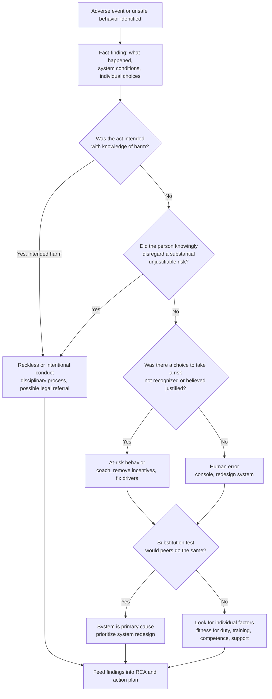

## Just Culture in Clinical Settings

Just culture is a organizational framework for responding to adverse events and unsafe behaviors in a way that is fair, consistent, and learning-oriented. It rests on a central distinction: the system shares responsibility with individuals for outcomes, and the response to a behavior should depend on the nature of that behavior (human error, at-risk behavior, or reckless behavior), not on the severity of the outcome. In clinical settings, just culture is the cultural foundation that makes Root Cause Analysis possible, because clinicians will not report errors or speak candidly in interviews if they expect reflexive punishment, and organizations will not learn if they stop at blaming the person at the sharp end. This reference covers the conceptual origins, the behavioral categories and response model, decision algorithms and tests (substitution, foresight, and others), how just culture interacts with RCA and the 5 Whys, reporting and disclosure, second victim support, implementation steps, measurement, regulatory and legal context, criticisms, and common pitfalls. Terminology, tools, and legal protections vary by organization and jurisdiction, and should be confirmed against current sources and legal counsel.

### 1. Origins and Conceptual Foundations

| Source | Contribution |
| --- | --- |
| James Reason (*Human Error*, 1990; *Managing the Risks of Organizational Accidents*, 1997) | Distinguished active failures from latent conditions; developed the Swiss cheese model and proposed the "substitution test" and the culpability decision tree |
| Sidney Dekker (*Just Culture*, 2007 and later editions) | Emphasized that accountability should be forward-looking and restorative, and cautioned that blame frameworks can turn into disguised punishment; discussed the criminalization of error |
| David Marx (*Patient Safety and the "Just Culture": A Primer for Health Care Executives*, 2001) | Defined the three behavioral categories (human error, at-risk behavior, reckless behavior) and matching responses, widely adopted in healthcare through the Just Culture Algorithm |
| Aviation and nuclear safety (for example, reporting systems such as NASA ASRS) | Provided evidence that non-punitive reporting increases learning |
| Institute of Medicine, *To Err Is Human* (1999) | Popularized systems thinking in healthcare and called for cultures that support reporting and learning |
| AHRQ, National Patient Safety Foundation (NPSF), Joint Commission, and IHI | Promoted safety culture and just culture as required elements of high-reliability organizations |

**Core premises**

1. **Humans err**: error is normal and predictable, and systems should be designed accordingly.
2. **Outcomes are not a valid measure of culpability**: identical behavior can produce a harmless result or a catastrophe depending on chance.
3. **Responses should be proportionate to behavior**: console, coach, or discipline depending on the choice made and the risk knowingly taken.
4. **Both individual and organizational accountability exist**: leaders are accountable for system design, resources, and the response to reported problems.
5. **Learning depends on reporting**, and reporting depends on trust that the response will be fair.

**Key Points**

- Just culture is neither a "blame-free" culture nor a "punitive" culture. It is a **balance** between learning and accountability. Blame-free approaches can be perceived as failing to address reckless conduct, while punitive approaches suppress reporting.
- It is often paired with the concept of a **reporting culture**, **learning culture**, **flexible culture**, and **informed culture** in Reason's description of a safety culture.
- The concept originated in and continues to evolve through contributions from multiple disciplines, so definitions differ between authors and organizations. [Inference: the Marx algorithm is the most common operational model in US healthcare, but it is not the only one.]

### 2. The Three Behavioral Categories and Responses

| Behavior | Definition | Typical Cause | Organizational Response |
| --- | --- | --- | --- |
| **Human error** | An unintentional, inadvertent action, slip, lapse, or mistake that was not the person's intent and that they did not knowingly take a risk to produce | Attention failure, memory lapse, system design, poor interface, workload | **Console** the individual; examine and fix the system that made the error likely; no discipline based on the error itself |
| **At-risk behavior** | A behavioral choice that increases risk where the risk is not recognized or is mistakenly believed to be justified (risk drift, normalization of deviance) | Workarounds, production pressure, unclear rules, incentives that reward speed | **Coach** the individual; remove incentives for at-risk behavior; create incentives for healthy behavior; address system drivers |
| **Reckless behavior** | A behavioral choice to consciously disregard a substantial and unjustifiable risk | Conscious disregard of known safety rules, impairment by choice, intentional harm | **Remedial or disciplinary action** according to organizational policy and applicable law; possibly regulatory or legal referral |

**Illustrative clinical examples**

| Scenario | Likely Category | Rationale and Response |
| --- | --- | --- |
| A nurse selects the wrong vial from a drawer where two look-alike vials are stored adjacently | Human error | Unintended slip in a poorly designed environment. Console, and redesign storage and packaging |
| A nurse routinely scans the patient's wristband from a printed sheet because the scanner often fails to read wristbands, and a wrong-patient near miss occurs | At-risk behavior | Choice to bypass scan to keep pace, believing the risk to be small. Coach, fix scanner reliability and workflow, examine why this workaround is common |
| A clinician who has been repeatedly reminded and understands the risks deliberately skips a mandatory time-out for convenience and a wrong-site procedure occurs | Reckless behavior (subject to fact-finding) | Conscious disregard of a known, substantial risk. Follow disciplinary policy while also examining organizational contributors |
| A physician comes to work impaired and knowingly cares for patients | Reckless behavior, with possible additional obligations (for example, health program referral, reporting) | Address safety and support alongside accountability, per policy and law |

**Key distinction**: at-risk versus reckless behavior often turns on the person's **mental state** (did they perceive the risk, and did they believe it was justified?), which requires careful, fair fact-finding rather than assumptions from the outcome.

(svg_diagram)

<svg xmlns="http://www.w3.org/2000/svg" viewBox="0 0 900 330" width="900" height="330" font-family="Arial, sans-serif">
<text x="450" y="28" text-anchor="middle" font-size="18" font-weight="bold">Behavior Categories and Matched Responses (svg_diagram)</text>
<rect x="30" y="60" width="260" height="200" rx="10" fill="#e8f5e9" stroke="#2e7d32" stroke-width="2" />
<text x="160" y="90" text-anchor="middle" font-size="16" font-weight="bold">Human Error</text>
<text x="160" y="118" text-anchor="middle" font-size="12">Unintended slip, lapse,</text>
<text x="160" y="134" text-anchor="middle" font-size="12">or mistake</text>
<text x="160" y="170" text-anchor="middle" font-size="14" font-weight="bold" fill="#2e7d32">Response: CONSOLE</text>
<text x="160" y="192" text-anchor="middle" font-size="12">Fix the system,</text>
<text x="160" y="208" text-anchor="middle" font-size="12">support the person</text>
<rect x="320" y="60" width="260" height="200" rx="10" fill="#fff8e1" stroke="#f9a825" stroke-width="2" />
<text x="450" y="90" text-anchor="middle" font-size="16" font-weight="bold">At-Risk Behavior</text>
<text x="450" y="118" text-anchor="middle" font-size="12">Risk not recognized or</text>
<text x="450" y="134" text-anchor="middle" font-size="12">believed justified</text>
<text x="450" y="170" text-anchor="middle" font-size="14" font-weight="bold" fill="#e65100">Response: COACH</text>
<text x="450" y="192" text-anchor="middle" font-size="12">Remove incentives and</text>
<text x="450" y="208" text-anchor="middle" font-size="12">system drivers of drift</text>
<rect x="610" y="60" width="260" height="200" rx="10" fill="#ffebee" stroke="#c62828" stroke-width="2" />
<text x="740" y="90" text-anchor="middle" font-size="16" font-weight="bold">Reckless Behavior</text>
<text x="740" y="118" text-anchor="middle" font-size="12">Conscious disregard of a</text>
<text x="740" y="134" text-anchor="middle" font-size="12">substantial, unjustifiable risk</text>
<text x="740" y="170" text-anchor="middle" font-size="14" font-weight="bold" fill="#c62828">Response: HOLD ACCOUNTABLE</text>
<text x="740" y="192" text-anchor="middle" font-size="12">Remedial or disciplinary</text>
<text x="740" y="208" text-anchor="middle" font-size="12">action per policy</text>
<text x="450" y="300" text-anchor="middle" font-size="13" fill="#444">Response follows the behavior and choice, not the severity of the outcome</text>
</svg>

### 3. Decision Tools and Tests

#### 3.1 The Substitution Test

Ask: *"Given the same circumstances, knowledge, training, and system conditions, would three other similarly qualified clinicians likely have made the same choice?"* If yes, the problem lies mainly in the system, and individual punishment is inappropriate. Variations use "would a peer with similar experience have acted the same way?"

#### 3.2 The Foresight Test

Ask whether the individual could reasonably have foreseen the risk of their action, and whether they had the knowledge to do so. Lack of foresight moves toward human error or at-risk behavior, and conscious foresight of a substantial risk with proceeding anyway moves toward recklessness.

#### 3.3 Reason's Culpability Decision Tree (Adapted)

A sequence of questions to reach a culpability judgment:

1. Were the actions as intended? If not, and no deliberate harm, treat as an unintentional error. If they were intended, continue.
2. Was there evidence of substance abuse or impairment?
3. Did the individual knowingly violate safe operating procedures?
4. Were the procedures available, workable, intelligible, and correct?
5. Would the individual pass the substitution test?
6. Is there a history of unsafe acts? (This question must be applied cautiously, and it should not overshadow the current event.)

The tree is a decision aid, not an automatic verdict.

#### 3.4 Marx's Just Culture Algorithm (Conceptual Flow)

#### 3.5 Related Frameworks and Tools

| Tool | Description |
| --- | --- |
| NHS "Just Culture Guide" (NHS Improvement, 2018) | Structured questions to guide managers toward proportional responses, and a reminder that a just culture requires attention to the wider system before considering individual action |
| Incident Decision Tree (originally developed for UK aviation and adapted to healthcare by the UK National Patient Safety Agency) | Stepwise questions on deliberate harm, incapacity, foresight, substitution, and mitigating circumstances |
| MERIT (Merit Incident Review Tool), Just Culture Company algorithm, and other institutional adaptations | Standardized scoring or flow for managers |
| Restorative just culture (Dekker and colleagues, and others) | Shifts focus from "what rule was broken and who is responsible" to "who was harmed, what do they need, and whose obligation is it to meet those needs" |

Different tools give somewhat different structures, and organizations should adopt one consistently with training for leaders.

### 4. Just Culture and Root Cause Analysis

Just culture and RCA are complementary and interdependent.

| Aspect | Relationship |
| --- | --- |
| Access to accurate information | Staff will describe what really happened, including workarounds and near misses, only if they trust the response |
| Separation of learning from discipline | RCA seeks system-level causes and does not determine culpability. Individual accountability is handled in a separate, parallel process (for example, human resources, peer review) that uses just culture tools |
| Interpretation of "human error" | RCA treats human error as a starting point for questions (the "why" behind the error), and just culture supplies the response framework for the individual |
| Action selection | Actions are aimed at system redesign (stronger actions). Just culture ensures that individual coaching or discipline is used only where warranted, and not as a substitute for system change |
| Culture measurement | RCA findings often reveal cultural issues (for example, steep authority gradients or normalized deviance) that just culture and safety culture programs then address |

**Applying the 5 Whys through a just culture lens**

The 5 Whys can slide into blame if the chain ends with a person. Just culture provides guardrails.

*Event*: A patient received a double dose of a scheduled medication.

| Why | Answer | Just Culture Lens |
| --- | --- | --- |
| Why did the patient receive two doses? | Two nurses each administered the dose within 30 minutes | Fact, not blame |
| Why did both administer it? | The eMAR showed the dose as due for each because the first nurse documented after a delay | Documentation timing and system display |
| Why was documentation delayed? | The first nurse was called to an emergency and planned to document afterward | Realistic work condition, substitution test likely passes |
| Why was there no other signal that the dose was given? | The eMAR does not show "in-progress" status and handoff between nurses lacked a check | System design gap |
| Why does the process rely on documentation after the fact? | Barcode scan and documentation are separate steps in the workflow, and the scanner is located away from the bedside | System design and equipment placement |

Outcome: the just culture analysis would classify the first nurse's action as human error under system conditions (console), and actions target workflow design (documentation at time of scan, visibility of in-progress administration, scanner placement) rather than discipline.

**Warning signs that RCA is drifting into blame**: root cause statements naming an individual ("nurse failed to..."), corrective actions limited to counseling or retraining, absence of system-level actions, and the use of terms such as "careless" or "negligent". RCA2's rules of causation and action hierarchy support just culture principles.

### 5. Reporting Systems and Psychological Safety

**Reporting culture** depends on trust that reports lead to improvement and are not used punitively.

| Practice | Purpose |
| --- | --- |
| Easy, anonymous or confidential reporting options | Lower barriers |
| Prompt feedback to reporters | Demonstrate that reporting leads to action |
| Separation of reporting data from personnel files | Reduce fear of retaliation |
| Reporting of near misses and unsafe conditions | Capture learning at lower cost |
| Leadership visibility (safety huddles, executive rounds, "good catch" recognition) | Model expected behavior |
| Clear policy statements on non-punitive reporting and defined exceptions (reckless behavior) | Set expectations |
| Protection under peer review or patient safety work product privileges where available | Encourage candor |

**Psychological safety** (a concept developed by Amy Edmondson) is the shared belief that team members can speak up without fear of humiliation or punishment. Research in healthcare teams has linked psychological safety to reporting, learning behavior, and, in several studies, to team performance and safety outcomes. Effect sizes and causal direction vary across studies, so cite primary literature for specific claims. [Inference: psychological safety is generally regarded as a necessary but not sufficient condition for a strong safety culture.]

**Speaking up and hierarchy**: authority gradients between physicians, nurses, and trainees can suppress concerns. Tools such as CUS words ("I am Concerned, Uncomfortable, this is a Safety issue"), TeamSTEPPS' two-challenge rule, and structured escalation pathways help, and they work only where the culture supports them.

### 6. Disclosure, Patient Involvement, and the Second Victim

**Disclosure**: just culture supports honest communication with patients and families about adverse events. Programs such as CANDOR (AHRQ) integrate disclosure, investigation, apology, and resolution. Legal protections for apologies vary by state.

**The second victim phenomenon**: clinicians involved in serious events often experience guilt, anxiety, sleep disturbance, and loss of confidence, and some leave the profession. The term was introduced by Albert Wu (2000), and some prefer terms such as "clinicians affected by adverse events" because "victim" may be viewed as inappropriate. Support measures include:

| Support Component | Example |
| --- | --- |
| Immediate psychological first aid | Peer support member contacts the clinician within hours |
| Time and space | Temporary relief from duties if needed |
| Peer support programs | Trained colleagues (for example, the forYOU team at the University of Missouri, the Resilience in Stressful Events (RISE) program at Johns Hopkins) |
| Access to counseling and employee assistance | Confidential professional support |
| Communication about the investigation | Keeping the person informed and involving them in learning |
| Return to practice planning | Graduated support after severe events |
| Leadership response | Visible non-punitive stance, recognition of the human cost |

Supporting involved clinicians is compatible with accountability. A clinician can be supported while the organization evaluates their behavior according to fair criteria.

### 7. Implementation in a Clinical Organization

**Implementation roadmap**

| Step | Activities |
| --- | --- |
| 1. Leadership commitment | Board and executive endorsement, resource allocation, personal modeling of behavior |
| 2. Policy development | Written just culture policy, definitions of behavior categories, roles, and response pathways; alignment with HR, medical staff bylaws, nursing practice, and union agreements |
| 3. Select and adapt a tool | Choose an algorithm or guide (for example, Marx, NHS Just Culture Guide), and adapt to local context |
| 4. Training | Leaders and managers (fact-finding, applying the algorithm, coaching conversations), staff (expectations, reporting), HR and legal (consistency) |
| 5. Fact-finding process | Standard approach to investigating behaviors, interviewing fairly, and documenting |
| 6. Case review panel | Multidisciplinary group (for example, HR, risk, clinical leadership, peer representation) to review complex cases for consistency |
| 7. Reporting infrastructure | Easy reporting, feedback loops, dashboards |
| 8. Support programs | Peer support and second victim programs |
| 9. Measurement | Culture surveys, reporting metrics, consistency audits |
| 10. Continuous review | Periodic policy review, case audits, and adjustment |

**Fact-finding principles**

- Begin with the system: examine equipment, workload, policies, training, and staffing conditions before evaluating the individual.
- Interview the individual early and respectfully, and offer support and, where appropriate, representation.
- Avoid hindsight bias: judge the behavior on what was known at the time.
- Document mitigating factors (fatigue, workload, ambiguous rules, unfamiliar equipment).
- Distinguish between deviation from policy and unsafe behavior: some policies are unworkable, and following them literally could be unsafe.
- Consider the individual's history but avoid prejudging based on prior events.
- Ensure consistency: similar behaviors should draw similar responses regardless of role, seniority, or outcome.

### 8. Measuring Just Culture and Safety Culture

| Instrument or Metric | Description |
| --- | --- |
| AHRQ Surveys on Patient Safety Culture (SOPS) | Validated survey with domains such as teamwork, communication openness, nonpunitive response to error, feedback about error, and management support. AHRQ maintains a comparative database for benchmarking |
| Safety Attitudes Questionnaire (SAQ) | Survey of safety climate, teamwork climate, and other factors |
| Just Culture Assessment Tool (for example, from the Just Culture Company or other developers) | Measures perceptions of fairness and consistent responses. [Unverified: availability, versions, and validation status of specific commercial tools should be confirmed] |
| Event reporting rates and near-miss to harm ratio | Higher near-miss reporting relative to harm events is often interpreted as a sign of a healthier reporting culture |
| Time to feedback after a report | Reflects responsiveness |
| Consistency audits | Review of disciplinary outcomes for similar behaviors, checking for bias related to role, profession, or outcome |
| Staff turnover and involvement of affected clinicians | Indirect indicators of trust and support |
| Speaking-up indicators | Survey items and observed practices |

Survey results should be interpreted with attention to response rates, unit-level variation, and change over time. Survey scores alone do not prove that a just culture is operating, so pair them with behavioral and process data. For survey proportions, a simple confidence interval for a proportion $\hat{p}$ from $n$ responses is:

$$\hat{p} \pm z_{\alpha/2}\sqrt{\frac{\hat{p}(1-\hat{p})}{n}}$$

which helps avoid over-interpreting differences between small units.

### 9. Legal, Regulatory, and Professional Context

| Area | Considerations (illustrative; jurisdiction dependent) |
| --- | --- |
| Accreditation | The Joint Commission requires leaders to create and maintain a culture of safety and quality (Leadership standards, with a just culture expectation and a Sentinel Event Alert on safety culture, Issue 57, 2017). Confirm current standard numbers |
| Patient Safety and Quality Improvement Act (US) | Federal privilege and confidentiality protections for patient safety work product reported to a Patient Safety Organization, which support candid reporting |
| State peer review and patient safety statutes | Vary widely in scope and strength |
| Professional licensing boards | May receive reports on clinicians. Some boards have adopted just culture principles in reviewing cases, and others have not |
| Criminal and civil law | Criminal prosecution of clinicians for medical errors is uncommon but has occurred (for example, notable cases involving medication errors), and such cases are widely discussed in the just culture literature as having a chilling effect. Legal standards for negligence and gross negligence differ from behavioral categories in just culture algorithms |
| Employment law and collective bargaining | Disciplinary procedures must follow legal and contractual requirements. Just culture policies should be aligned with these |
| Reporting obligations | State and federal reporting duties (for example, serious events, impaired professionals, National Practitioner Data Bank) operate independently of internal just culture decisions |
| Discovery and privilege | Documents may be discoverable depending on how they are created and used. Consult counsel |

Just culture policies do not override legal obligations. Organizations should coordinate with legal counsel, HR, and medical staff leadership so that the policy is applied consistently within the legal framework.

### 10. Criticisms and Limitations

| Critique | Discussion |
| --- | --- |
| Distinguishing at-risk from reckless behavior relies on judgments about mental state | Fact-finding can be subjective, and inconsistent application can undermine trust. Standardized tools and multidisciplinary review help |
| Algorithms may appear to legitimize blame | Dekker and others caution that focusing on "who is culpable" can distract from system learning, and propose restorative approaches focused on needs and obligations |
| Hindsight and outcome bias | Even trained reviewers may judge behaviors more harshly when the outcome is severe. Awareness and structured tools mitigate but do not eliminate bias |
| Power and professional hierarchies | Applications may be uneven across professions (for example, nurses versus physicians), reflecting organizational politics |
| Risk of "just culture" as a label without substance | Organizations may adopt the language without changing practice. Measures and audits are needed |
| Balancing accountability and learning | Some staff perceive just culture as excusing poor performance, and others still fear punishment. Communication and consistency are essential |
| Evidence base | Evidence for improved safety outcomes directly attributable to just culture programs is mixed and difficult to isolate from other safety interventions. [Inference: much support comes from case studies, cross-sectional surveys, and expert consensus rather than randomized trials] |
| Individual competence and performance issues | Just culture does not replace processes for managing chronic performance problems, impairment, or unprofessional conduct, which require separate, appropriate mechanisms |

### 11. Comparison with Other Approaches

| Approach | Description | Comparison |
| --- | --- | --- |
| Blame-oriented (punitive) culture | Seeks the responsible individual and applies sanctions | Suppresses reporting and misses system causes |
| Blame-free culture | Avoids individual accountability | May fail to address reckless behavior and erode fairness |
| Just culture | Distinguishes behaviors and applies proportionate responses | Balances learning and accountability |
| Restorative just culture | Focuses on harm, needs, and obligations, with those affected engaged in healing | Emphasizes relational repair and forward-looking accountability |
| Safety-II perspective | Studies how work usually succeeds through adaptation | Complements just culture by shifting attention from error only to normal performance variability |
| High-reliability organization (HRO) principles | Preoccupation with failure, reluctance to simplify, sensitivity to operations, commitment to resilience, deference to expertise | Just culture is a supporting element of HRO practice |

Just culture in industry contexts (manufacturing, aviation) shares the same principles, and healthcare adaptations must account for patient harm, professional licensure, and the emotional weight of clinical work.

### 12. Practical Application: A Structured Review Conversation

A manager reviewing an event with a clinician might follow this sequence (adapted from common just culture guides):

1. **Set the tone**: explain the purpose (understanding and learning), the process, and support available.
2. **Establish the facts**: ask the clinician to describe what happened and what they were thinking, and let them tell the story without interruption.
3. **Explore system conditions**: workload, staffing, equipment, interruptions, policies, training, and communication.
4. **Explore the decision points**: what options were considered, what risks were perceived, and what informed the choice.
5. **Apply the tests**: substitution test, foresight test, and review of policy clarity and feasibility.
6. **Classify the behavior** (human error, at-risk, reckless) with a second reviewer for consistency.
7. **Decide the response**: console, coach, or accountable action, with documentation of rationale.
8. **Identify system actions**: what will change in the system so the same situation is less likely to produce the same error.
9. **Follow up**: confirm support, track actions, and close the loop with the clinician.

**Example coaching record excerpt (at-risk behavior)**

| Element | Entry |
| --- | --- |
| Behavior | Routine bypass of barcode scan when scanner fails to read wristband |
| Risk perception | Believed the risk to be low because patient was well known; scanner failures common |
| System drivers | Scanner reliability issues, workload, no quick alternative when scan fails |
| Response | Coaching conversation on risk of wrong-patient administration, agreed expectations for use of alternative verification steps |
| System actions | Replace scanners, add downtime process with a two-identifier manual verification, monitor scan compliance |
| Follow-up | Review compliance data at 30 and 90 days, and recognize improvement |

### 13. Common Pitfalls

1. **Using outcome severity to determine response**, rather than behavior and choice.
2. **Skipping the system review** and moving directly to individual accountability.
3. **Inconsistent application** across professions, roles, or units.
4. **Treating "human error" as a synonym for "no accountability"**, or as grounds for automatically attributing carelessness.
5. **Labeling too quickly as reckless** without proper fact-finding on mental state.
6. **Coaching without removing the drivers** of at-risk behavior, so the behavior returns.
7. **Adopting the language of just culture without training leaders** or aligning HR processes.
8. **Ignoring the second victim** and failing to provide support.
9. **Failing to give feedback on reports**, leading to reporting fatigue.
10. **Confusing RCA with disciplinary review**, which discourages candid participation.
11. **Overlooking organizational and leadership accountability** for resources, staffing, and priorities.
12. **Not measuring perceptions and consistency**, so problems remain hidden.
13. **Conflating just culture with a lack of standards**, weakening expectations for professional conduct.
14. **Ignoring legal and regulatory obligations** that operate in parallel.

### 14. Practical Checklist

1. Secure visible, sustained commitment from leadership, and align board, executives, and medical staff.
2. Adopt a written just culture policy and a standard decision tool, and adapt it to local law, HR practices, and labor agreements.
3. Train leaders and managers in fact-finding, bias awareness, the substitution test, and coaching conversations.
4. Establish a multidisciplinary review process for complex or high-severity cases to ensure consistency.
5. Build accessible, non-punitive reporting systems with timely feedback and visible improvements.
6. Separate RCA (system learning) from individual accountability processes while ensuring they inform each other.
7. Implement peer support and second victim programs.
8. Prioritize stronger system-level actions in response to events, and use coaching and discipline only where warranted.
9. Measure safety culture with validated surveys, reporting metrics, and consistency audits, and act on the results.
10. Coordinate with legal counsel regarding privilege, reporting duties, and employment law.
11. Review the policy and case outcomes periodically, and adjust for fairness and effectiveness.

**Conclusion**

Just culture provides the behavioral and organizational framework that makes systems-focused RCA workable in clinical settings. By distinguishing human error, at-risk behavior, and reckless behavior, and by responding with consoling, coaching, or accountability accordingly, organizations encourage reporting and candor while still holding individuals responsible for conscious disregard of substantial risk. It works only when paired with genuine system improvement, consistent and unbiased fact-finding, support for affected clinicians and patients, and leadership accountability for the conditions in which people work. The 5 Whys and other RCA tools are safest when used in this frame, pushing analysis past the sharp-end act to the conditions that made the act likely. Definitions, tools, evidence quality, and legal protections vary by organization and jurisdiction, so confirm them against current literature, regulators, and legal counsel.

**Related Topics**

- Marx's Just Culture Algorithm and NHS Just Culture Guide in detail
- Restorative just culture and Dekker's critique of blame
- Second victim support programs (forYOU, RISE) and peer support design
- AHRQ Surveys on Patient Safety Culture and interpretation
- Psychological safety and speaking-up interventions (TeamSTEPPS, CUS words)
- High-reliability organization principles in healthcare
- Reason's Swiss cheese model and organizational accident theory
- Normalization of deviance and risk drift
- Disclosure and communication-and-resolution programs (CANDOR)
- Legal aspects of medical error reporting and privilege