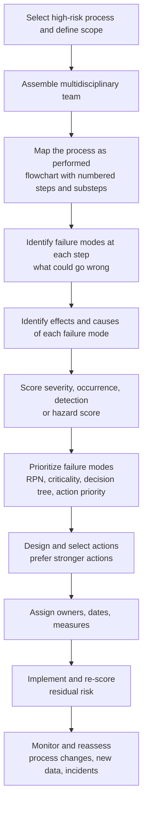

## Failure Mode and Effects Analysis in Healthcare


Failure Mode and Effects Analysis (FMEA) is a proactive, team-based method for examining a process or design step by step, asking what could go wrong at each step, what effects the failure would have, how likely it is, and how likely it is to be detected before harm occurs. Where RCA looks backward at an event that has already happened, FMEA looks forward to prevent the event. In healthcare, FMEA was adapted from aerospace, defense, and automotive engineering into Healthcare FMEA (HFMEA) by the VA National Center for Patient Safety and into the IHI/ISMP-style FMEA used widely for medication and procedure processes. This reference covers the method's origin and healthcare adaptations, the step-by-step procedure, scoring systems (RPN, HFMEA hazard scoring, and the AIAG-VDA Action Priority alternative), worked examples, how FMEA and RCA feed each other, regulatory and accreditation expectations, statistical and quantitative considerations, facilitation practice, limitations, and common pitfalls. Standards, scales, and regulatory expectations vary by organization and jurisdiction and change over time, so verify against current sources.

### 1. Origins and Healthcare Adaptations

| Source | Contribution |
| --- | --- |
| US military (MIL-P-1629, 1949; later MIL-STD-1629A) | Early formal FMEA and FMECA (Failure Mode, Effects, and Criticality Analysis) procedures for reliability |
| NASA (Apollo program) and aerospace | Broadened use for safety-critical systems |
| Automotive industry (Ford, AIAG, VDA) | Design FMEA (DFMEA) and Process FMEA (PFMEA), RPN scoring, and the 2019 AIAG-VDA harmonized handbook introducing Action Priority |
| IEC 60812 | International standard for FMEA and FMECA procedures |
| VA National Center for Patient Safety (DeRosier and colleagues, 2002) | Healthcare FMEA (HFMEA), which blends FMEA, Hazard Analysis and Critical Control Points (HACCP), and RCA concepts, with a hazard scoring matrix and decision tree |
| Institute for Healthcare Improvement (IHI) | FMEA tool and worksheet for healthcare teams, based on RPN scoring |
| Joint Commission | Leadership standard requiring organizations to select at least one high-risk process each year for proactive risk assessment (historically LD.5.2, later LD.03.09.01 and related; confirm current numbering) |
| ISMP | Application of FMEA to medication-use processes, including guidance for pharmacy and nursing |
| ISO 14971 | Risk management for medical devices, in which FMEA is a commonly used technique |
| ISO 31000 / IEC 31010 | General risk management standards listing FMEA among assessment techniques |

**Key Points**

- FMEA is **proactive** (prospective risk assessment), complementing **reactive** RCA. Together they form a learning loop: RCA findings update FMEA, and FMEA identifies vulnerabilities before harm.
- In healthcare, the "product" is a care process, and the "customer" is the patient, so severity is expressed in terms of patient harm.
- Variants used in healthcare include Process FMEA (most common), Design FMEA (medical devices, health IT, and equipment), and System FMEA. HFMEA is a streamlined healthcare-specific version.
- FMEA is a **qualitative-to-semi-quantitative** method whose scores are ordinal judgments, and this affects how they should be interpreted (see Section 6).

### 2. Where FMEA Fits: Proactive and Reactive Risk Tools

| Tool | Timing | Question | Typical Trigger |
| --- | --- | --- | --- |
| FMEA / HFMEA | Before harm (prospective) | What could go wrong, and how do we prevent or detect it? | New process, new technology, high-risk process, required annual proactive assessment |
| RCA / comprehensive systematic analysis | After an event | Why did this happen and how do we prevent recurrence? | Sentinel event, serious harm |
| Aggregate review | After a set of events | What patterns exist across many events? | Trend of lower-harm events |
| Trigger tools and surveillance | Ongoing | Is harm occurring that we have not been told about? | Routine monitoring |
| Simulation and usability testing | Before or during implementation | How does the process or device perform under realistic conditions? | Device selection, workflow design |
| Bow-tie and fault tree analysis | Prospective or retrospective | How do threats, barriers, and consequences relate? | Complex hazards |

**Typical healthcare FMEA topics**: medication use (high-alert drugs, chemotherapy, insulin, heparin), blood transfusion, surgical safety (wrong-site surgery, retained items), patient identification, handoffs and transitions, infusion pump programming, radiation therapy, specimen labeling, infection prevention (central line insertion), EHR and clinical decision support changes, new equipment introduction, discharge and follow-up, and emergency department triage.

### 3. The FMEA Procedure



**Step 1: Select the process and define scope**

Choose a process that is high risk, high volume, problem-prone, or newly introduced. Define clear boundaries (for example, "inpatient high-alert intravenous medication administration from order to documentation"), because an overly broad scope produces unmanageable worksheets. Leadership should sponsor the project and commit resources.

**Step 2: Assemble a multidisciplinary team**

| Role | Contribution |
| --- | --- |
| Facilitator | Trained in FMEA, guides process and keeps the team on track |
| Frontline staff who perform the process | Knowledge of work-as-done |
| Subject-matter experts (physicians, nurses, pharmacists, technicians, biomedical engineers, informatics) | Technical knowledge |
| Quality and patient safety staff | Methods, data, and event history |
| Process owner or manager | Authority to implement changes |
| Patient or family advisor (where feasible) | Patient perspective |
| Human factors or systems engineering specialist (where available) | Usability and cognitive analysis |

Team size of roughly 6 to 10 is commonly recommended. Include people who actually do the work, since managers' descriptions of a process often differ from practice.

**Step 3: Map the process**

Create a flowchart of the process as it is actually performed (not as written), with numbered steps and, for complex steps, substeps. Validate the map through observation and staff input. A typical medication administration map might include: order entry, pharmacist verification, dispensing, retrieval, patient identification, barcode scan, pump programming, administration, monitoring, and documentation.

**Step 4: Identify failure modes**

For each step, ask "In what ways could this step fail?" A failure mode is *how* the step fails (the error or defect), not the cause or effect. Use prompts such as omission, commission, wrong sequence, wrong timing, wrong amount, wrong item, wrong patient, and delay.

**Step 5: Identify effects and causes**

- **Effect**: what happens to the patient or downstream process if the failure occurs and is not caught.
- **Cause**: why the failure mode could happen (system and human factors), often explored with a fishbone or a short "why" sequence.

**Step 6: Score the failure modes** (see Section 4)

**Step 7: Prioritize**

Rank failure modes by RPN, hazard score, or Action Priority, and apply judgment to severity, especially for catastrophic effects.

**Step 8: Design and select actions**

Develop actions to eliminate the failure mode, reduce its likelihood, or improve detection. Prefer stronger actions from the action hierarchy (forcing functions, standardization, simplification, automation) over weaker actions (policy, education, warnings).

**Step 9: Assign ownership and measures**

Each action needs an owner, timeline, resources, and a measure of success.

**Step 10: Implement and re-score**

After implementation, re-score severity, occurrence, and detection to estimate **residual risk**, and verify with data (audits, observations, event reports).

**Step 11: Monitor and reassess**

Reassess when the process changes, when incidents occur, or at defined intervals (for example, annually for high-risk processes).

### 4. Scoring Systems

#### 4.1 Classic FMEA: Risk Priority Number (RPN)

Each failure mode is rated for **Severity (S)**, **Occurrence (O)**, and **Detection (D)**, commonly on 1 to 10 scales, and the product gives the RPN:

$$RPN = S \times O \times D$$

with a range of 1 to 1,000.

**Illustrative healthcare rating scales** (organizations should define their own and apply them consistently)

| Rating | Severity (patient effect) | Occurrence (likelihood) | Detection (likelihood of catching before harm) |
| --- | --- | --- | --- |
| 1 | No effect | Remote (failure unlikely) | Almost certain to detect |
| 2 to 3 | Minor: no or minimal harm, no treatment | Low (rare, isolated) | High chance of detection |
| 4 to 6 | Moderate: temporary harm needing intervention or monitoring | Moderate (occasional) | Moderate chance |
| 7 to 8 | Serious: permanent or major harm, hospitalization | High (frequent) | Low chance |
| 9 to 10 | Catastrophic: death or life-threatening harm | Very high (almost inevitable) | Almost impossible to detect or no control exists |

Note that for **Detection**, a *high* number means *poor* detection, which is a common source of confusion.

**Worked example (PFMEA excerpt, IV heparin infusion)**

| Step | Failure Mode | Effect | Cause | S | O | D | RPN |
| --- | --- | --- | --- | --- | --- | --- | --- |
| Pump programming | Wrong concentration entered | Over- or underdose, hemorrhage or clotting | Multiple concentrations in stock; manual entry | 9 | 5 | 6 | 270 |
| Pump programming | Drug library bypassed | Loss of dose limit protection | Library incomplete for this drug; workflow shortcut | 8 | 4 | 7 | 224 |
| Patient identification | Wrong patient | Wrong patient receives anticoagulant | Similar names; scan bypass | 9 | 3 | 5 | 135 |
| Monitoring | aPTT not checked on schedule | Unrecognized over-anticoagulation | No automatic reminder, staffing | 8 | 5 | 6 | 240 |
| Documentation | Rate change not documented | Confusion at handoff | Separate steps, workload | 5 | 6 | 5 | 150 |

After adding actions (single premixed concentration, drug library completion and pump-EHR integration, automated lab reminders), the team re-scores. For the top row, suppose $S=9$ (unchanged), $O=2$, $D=3$:

$$RPN_{new} = 9 \times 2 \times 3 = 54$$

a reduction from 270 to 54 in the team's estimate. Note that severity usually does not change unless the failure effect itself is engineered out.

**Limitations of RPN** (widely discussed in the reliability and quality literature)

| Limitation | Explanation |
| --- | --- |
| Ordinal scales multiplied as if numeric | The product of ordinal ratings has no rigorous meaning as a ratio-scale quantity |
| Different combinations give the same RPN | $S=9, O=2, D=2$ (RPN 36) is treated as far less risky than $S=3, O=6, D=6$ (RPN 108), yet the first involves catastrophic harm |
| Holes in the scale | Many RPN values cannot occur (for example, primes above 10), and the range is not continuous |
| Weighting | Severity, occurrence, and detection are weighted equally in the formula even though their importance differs |
| Sensitivity to small scoring changes | A one-point change in one factor can shift rank order substantially |
| Subjectivity and team bias | Scores depend on team composition and dominance effects |
| Poor treatment of common cause failures and dependencies | Interactions between failure modes are not modeled |

Common mitigations: always review high-severity failure modes regardless of RPN, set a severity threshold (for example, S of 9 or 10 always requires action), use criticality ($S \times O$) as a supplementary ranking, and use consensus scoring with defined anchors.

**Criticality** (as in FMECA) is often defined as:

$$C = S \times O$$

and in quantitative FMECA (MIL-STD-1629A), mode criticality is:

$$C_m = \beta \cdot \alpha \cdot \lambda_p \cdot t$$

where $\beta$ is the conditional probability of the failure effect, $\alpha$ is the failure mode ratio, $\lambda_p$ is the part failure rate, and $t$ is operating time. Quantitative FMECA is more common for equipment and devices than for clinical processes, where reliable failure rate data are scarce.

#### 4.2 AIAG-VDA Action Priority (AP)

The 2019 AIAG-VDA FMEA Handbook replaced RPN thresholds with **Action Priority** tables assigning High, Medium, or Low priority based on combinations of S, O, and D ratings, with severity given the strongest weight. High AP means action is required (or management must justify the lack of action). Although the handbook targets automotive contexts, the principle (severity-weighted prioritization rather than a multiplied number) is increasingly cited in healthcare and medical device risk management. [Inference: adoption in clinical process FMEA is limited and varies by organization.]

#### 4.3 Healthcare FMEA (HFMEA) Hazard Scoring

HFMEA replaces RPN with a **Hazard Scoring Matrix** (severity by probability), followed by a **Decision Tree** analysis. The VA's published method uses four severity categories and four probability categories:

| Severity | Description (paraphrased) |
| --- | --- |
| Catastrophic | Death or major permanent loss of function |
| Major | Permanent lessening of bodily function, disfigurement, surgical intervention required, increased length of stay for three or more patients, increased level of care for three or more patients |
| Moderate | Increased length of stay or increased level of care for one or two patients |
| Minor | No injury or increased length of stay or level of care |

| Probability | Description (paraphrased) |
| --- | --- |
| Frequent | Likely to occur immediately or within a short period (may happen several times in one year) |
| Occasional | Probably will occur (may happen several times in one to two years) |
| Uncommon | Possible to occur (may happen sometime in two to five years) |
| Remote | Unlikely to occur (may happen sometime in five to 30 years) |

Hazard score (illustrative matrix used in the VA method, values paraphrased; confirm against the current published tool):

| Severity \ Probability | Frequent | Occasional | Uncommon | Remote |
| --- | --- | --- | --- | --- |
| Catastrophic | 16 | 12 | 8 | 4 |
| Major | 12 | 9 | 6 | 3 |
| Moderate | 8 | 6 | 4 | 2 |
| Minor | 4 | 3 | 2 | 1 |

A hazard score of 8 or above (commonly cited threshold) typically triggers the **decision tree**, and lower scores may be handled without full analysis unless other criteria apply. The decision tree asks, for each failure mode and cause:

1. **Single point weakness?** Would failure at this step cause the effect without another failure or backup? (If yes, proceed.)
2. **Existing effective control measure?** Is a control in place that reliably prevents or mitigates the failure?
3. **Detectability?** Is the hazard so obvious and readily detectable that it can be controlled?

Failure modes that are single point weaknesses, without effective controls and not obviously detectable, proceed to action. The decision tree encourages attention to the *system architecture* (single points of failure), which is a distinct strength of HFMEA compared with RPN ranking.

HFMEA also simplifies work by allowing the team to rate at the failure mode level and then analyze causes for those that pass the screening criteria, rather than scoring every cause exhaustively.

#### 4.4 Comparison of Scoring Approaches

| Feature | RPN (classic/IHI) | HFMEA (VA) | Action Priority (AIAG-VDA) |
| --- | --- | --- | --- |
| Inputs | S, O, D (1 to 10) | Severity and probability (4 by 4) plus decision tree | S, O, D (1 to 10) with lookup table |
| Output | Number (1 to 1000) | Hazard score and decision tree outcome | High, Medium, Low priority |
| Treats detection | Numerically | Through decision tree (detectability question) | Through the lookup table |
| Severity emphasis | Equal weight in product | Strong through matrix and thresholds | Highest weight |
| Ease of use | Familiar, quick | Moderate, requires decision tree | Requires reference tables |
| Main weakness | Ordinal multiplication, ties, masking of severity | Coarse categories | Automotive-oriented |

Many organizations combine methods, for example using RPN for ranking while requiring action on any failure mode with catastrophic severity.

### 5. Worked Example: Wrong-Site Surgery Process (Excerpt)

**Scope**: from scheduling to time-out for elective surgery.

| Step | Failure Mode | Effect | Causes | Existing Controls | S | O | D | RPN | Action |
| --- | --- | --- | --- | --- | --- | --- | --- | --- | --- |
| Scheduling | Laterality omitted or wrong on booking | Wrong-side procedure planned | Free-text entry, verbal booking | Consent form review | 9 | 4 | 5 | 180 | Make laterality a required discrete field in scheduling and EHR; auto-populate downstream forms |
| Pre-op verification | Site marking omitted | No visual site cue | Time pressure, unclear responsibility | Nurse checklist | 9 | 4 | 4 | 144 | Require surgeon marking before entering OR with hard stop in pre-op checklist; involve patient |
| Positioning and prep | Prep on incorrect side | Wrong side exposed | Marking covered by drapes or prep | Time-out | 9 | 3 | 5 | 135 | Marking placed to remain visible after prep and draping; standardized marking |
| Time-out | Time-out performed as a formality | Failure to catch discrepancy | Distraction, cultural hierarchy | Policy | 9 | 5 | 6 | 270 | Structured, standardized time-out with active participation and stop-the-line authority; observation audits |
| Documentation | Imaging displayed with wrong orientation | Surgeon misreads laterality | Mirrored images, unlabeled | Radiology labels | 8 | 3 | 6 | 144 | Display standardization and labeled orientation markers |

The highest RPN failure mode (time-out as a formality) points to a culture and behavior issue, which the team addresses with a stronger design (structured time-out, required participation, observation and feedback) and leadership support, rather than education alone. Severity is 9 across all rows, so under the severity-threshold rule every failure mode requires an action regardless of RPN rank.

### 6. Quantitative Considerations and Interpretation

FMEA scores are **expert judgments**, and their statistical properties deserve care.

- **Ordinal nature**: ratings such as 3, 6, and 9 do not imply that a 9 is three times worse than a 3. Multiplication and averaging can mislead.
- **Inter-rater variability**: different teams may score the same failure mode differently, so anchor scales with concrete descriptions and use consensus discussion. When data exist (event reports, audit results), calibrate occurrence and detection ratings against them.
- **Data-informed occurrence**: if the team has baseline data, occurrence can be tied to a rate. For example, if audits show a scan bypass rate of $r = 0.04$ per administration, the expected number of bypassed scans in $N$ administrations is:

$$E[X] = N \cdot r$$

so for $N = 10{,}000$ administrations per month, roughly 400 bypasses occur. This may justify a high occurrence rating irrespective of the team's impression of "rarity".

- **Combined detection**: when multiple independent barriers exist, the probability that a failure passes all barriers is the product of individual miss probabilities. If barriers have miss probabilities $m_1, m_2, \ldots, m_k$ and are truly independent:

$$P(\text{escape}) = \prod_{i=1}^{k} m_i$$

For example, with a pharmacist check missing 10% of errors ($m_1 = 0.10$) and a nurse check missing 30% ($m_2 = 0.30$), $P = 0.03$. The independence assumption is often violated in practice (for example, both checkers may rely on the same flawed label, or the second checker is influenced by the first), so estimates of combined barrier performance tend to be optimistic. [Inference: dependence between checks in clinical workflows is common, and independent double checks may be less effective than the arithmetic suggests.]

- **Expected harm view**: a rough expected annual harm for a failure mode with event probability per opportunity $p$, opportunities per year $N$, probability of escape $e$, and probability of harm given escape $h$ is:

$$E[\text{harm events}] = N \cdot p \cdot e \cdot h$$

This helps compare failure modes on a common basis when data are available, but the inputs are frequently uncertain.

- **Confidence intervals for observed rates**: when using audit data to inform ratings, sampling variability matters. For an observed proportion $\hat{p}$ from $n$ observations, an approximate interval is:

$$\hat{p} \pm z_{\alpha/2}\sqrt{\frac{\hat{p}(1-\hat{p})}{n}}$$

For very low rates or small $n$, use exact methods (for example, Clopper-Pearson).

- **Monte Carlo and probabilistic risk assessment**: for complex systems, fault tree analysis, event tree analysis, or Monte Carlo simulation can complement FMEA where failure rate data exist. In many clinical processes such data are sparse, so qualitative approaches predominate.

### 7. Linking FMEA and RCA

| Direction | How They Connect |
| --- | --- |
| RCA to FMEA | Root causes and contributing factors from an event become failure modes and causes in the FMEA, or trigger an FMEA of the whole process to find other weak points beyond the single event |
| FMEA to RCA | When an event occurs, compare it to the FMEA: was the failure mode anticipated? If yes, why did the controls fail? If not, why was it missed? Update occurrence and detection ratings using event data |
| Occurrence calibration | Event and near-miss reports provide empirical occurrence data for FMEA scoring |
| Extent-of-condition | After an RCA, FMEA can examine analogous processes (for example, other high-alert drugs) for the same vulnerability |
| Action verification | FMEA re-scoring can be checked against post-implementation measures identified in RCA action plans |

**The 5 Whys in FMEA**: the cause column of an FMEA row is often developed with brief "why" reasoning or a fishbone to reach actionable system causes. As in RCA, avoid stopping at "human error" or "staff not careful", because such causes point to weak actions. Use a branching approach when several causes plausibly produce the same failure mode.

**Example**: failure mode "wrong concentration programmed on pump". Whys: (1) the nurse entered the wrong concentration, (2) because two concentrations are stocked with similar labels, (3) because pharmacy stocks both for flexibility and no standardization policy exists, (4) because the last review of high-alert drug storage did not include heparin premixes. Actions target standardization and storage rather than nurse attention.

### 8. Regulatory, Accreditation, and Standards Context

| Framework | Relevance (illustrative; confirm current requirements) |
| --- | --- |
| The Joint Commission | Leadership standards expect proactive risk assessment of high-risk processes, with annual selection of at least one process, and use of an acceptable methodology such as FMEA. Sentinel Event Policy expectations reference proactive risk reduction. Confirm current standard identifiers |
| CMS Conditions of Participation (US) | QAPI requirements include proactive identification of risk and improvement |
| ISO 14971 (medical devices) | Risk management process for manufacturers, where FMEA is a common hazard analysis technique. Also relevant to healthcare organizations that modify or develop devices or software |
| FDA design controls (21 CFR 820.30) and the Quality Management System Regulation | Design risk analysis for devices |
| IEC 60812 | FMEA procedure standard |
| IEC 62366 | Usability engineering for medical devices, often paired with use-related FMEA |
| IEC 80001-1 | Risk management for IT networks incorporating medical devices |
| ISO 31000, ISO/IEC 31010 | General risk management principles and techniques |
| USP <797> and <800> | Compounding standards where FMEA-style risk assessment of preparation processes may be applied |
| NHS England | Use of FMEA and similar proactive tools within patient safety programs, alongside the Patient Safety Incident Response Framework |
| WHO | Patient safety guidance recommending proactive risk assessment, including FMEA-type approaches |

Documentation of the proactive risk assessment (team, process map, worksheet, actions, and follow-up) is typically expected to be available for accreditation review.

### 9. Facilitation Practice and Worksheet Design

**Facilitation tips**

- Begin with a clear process map, and resist skipping it, because errors in the map propagate through the analysis.
- Brainstorm failure modes first without scoring, to avoid early filtering.
- Distinguish failure mode, cause, and effect, and keep each in its own column.
- Use scoring anchors and discuss disagreements rather than averaging quickly.
- Limit the scope and session length. Multiple shorter sessions often outperform a single marathon workshop.
- Include frontline staff and encourage candor, protected by a just culture atmosphere.
- Capture **existing controls** explicitly, because detection scores depend on them.
- Time-box scoring debates and flag items for later data review.
- Track actions in a shared system with owners and due dates.

**Worksheet columns (typical)**

| Column | Content |
| --- | --- |
| Process step | Numbered step from the process map |
| Failure mode | What could go wrong |
| Potential effect(s) | Consequence to patient and downstream process |
| Potential cause(s) | System and human factors |
| Current controls | Existing preventive and detective controls |
| S, O, D | Ratings |
| RPN or hazard score | Computed priority |
| Recommended action | Action, ideally strong |
| Owner and due date | Accountability |
| Actions taken and revised S, O, D | Residual risk after implementation |

**Illustrative data-model sketch** (not a standard):

```plaintext
FMEA
  fmea_id, title, scope, sponsor, facilitator, team[], start_date, review_date
  process_map {steps[] {step_id, description, owner}}
  failure_modes[] {
    step_id, failure_mode, effects[], causes[], current_controls[]
    severity, occurrence, detection, score, method
    actions[] {description, strength, owner, due_date, status}
    revised {severity, occurrence, detection, score}
  }
  measures[] {definition, target, result, date}
  linked_events[] (event ids from RCA or reports)
```

### 10. Action Selection After FMEA

Apply the same **action hierarchy** used in RCA2:

| Strength | Examples in Healthcare FMEA |
| --- | --- |
| Stronger | Forcing functions (hard stops, connector incompatibility), standardization (single concentration, standard order sets), simplification, automation, physical or architectural separation, removal of hazardous products from unit stock |
| Intermediate | Software enhancements (dose limits, alerts with tiering), independent double checks where truly independent, checklists and cognitive aids, workload and staffing adjustments, reduction of interruptions, simulation training with refreshers, standardized communication tools |
| Weaker | New policies, warnings and labels, didactic education, reminders, non-independent double checks |

**Three levers of risk reduction**: reduce **severity** (change the design so that failure causes less harm, for example, using low-concentration products), reduce **occurrence** (prevent the failure, for example, forcing functions), and improve **detection** (catch it before harm, for example, barcode verification, alarms, monitoring). Hierarchy of controls thinking generally favors elimination and prevention over detection.

**Unintended consequences**: each proposed action should be examined for new failure modes it creates. A second FMEA pass on the redesigned process (a "re-FMEA") is good practice for major changes.

### 11. Measurement and Sustainment

| Measure | Purpose |
| --- | --- |
| Action completion rate and timeliness | Confirm implementation |
| Process measures (for example, scan compliance, premixed product usage, checklist completion, drug library compliance) | Confirm the control operates |
| Outcome measures (for example, event rates, near-miss rates, harm rates) | Confirm impact |
| Residual risk scores | Compare against target |
| Audit and observation results | Verify work-as-done |
| Reassessment schedule | Ensure the FMEA stays current |

Use run charts and control charts to monitor process measures over time. For rates per exposure, a $u$ chart has limits:

$$UCL_u = \bar{u} + 3\sqrt{\frac{\bar{u}}{n_i}}, \qquad LCL_u = \bar{u} - 3\sqrt{\frac{\bar{u}}{n_i}}$$

For rare events, use time-between-events charts. Because serious events are rare, an event-free interval is weak evidence of success when the baseline rate is low: with baseline rate $\lambda$ per unit exposure, the probability of no events in exposure $T$ is $P(0) = e^{-\lambda T}$, so process measures are the primary leading indicators.

**Living document**: update the FMEA after incidents, process changes, new technology, and audit findings. A FMEA that is filed and forgotten loses value quickly.

### 12. Limitations and Criticisms

| Limitation | Discussion |
| --- | --- |
| Resource intensive | Full FMEA of a complex process can take many hours across multiple staff, and scope discipline is essential |
| Subjectivity | Scores rely on expert opinion and are affected by team composition and group dynamics |
| Sequential, step-based view | May underrepresent interactions, emergent behavior, and system-level couplings. Complementary methods (STPA, FRAM, bow-tie, simulation) address complexity |
| Focus on failure rather than success | Safety-II perspectives emphasize studying how work succeeds through adaptation, which FMEA does not capture |
| Anticipation limits | Teams identify failure modes they can imagine, so novel failure modes may be missed |
| Evidence base | Evidence that healthcare FMEA reduces patient harm is limited and mostly derived from case studies and before-and-after reports, with heterogeneous methodology. [Inference: publication bias and difficulty isolating the FMEA effect from concurrent changes limit inference] |
| RPN weaknesses | Ordinal multiplication, ties, and masking of severity (see Section 4.1) |
| Risk of "checkbox" use | Performing a FMEA annually for accreditation without genuine engagement produces little benefit |
| Action follow-through | Value depends on implementing and verifying actions |

Alternative or complementary proactive methods include **STPA** (System-Theoretic Process Analysis) for complex socio-technical systems, **FRAM** (Functional Resonance Analysis Method), **HAZOP** (borrowed from chemical process safety), **HACCP**-style control point analysis, and **bow-tie** diagrams.

### 13. Common Pitfalls

1. **Scope too broad**, producing overwhelming and shallow analysis.
2. **Process map based on policy** rather than actual practice.
3. **Confusing failure modes, causes, and effects** in the worksheet.
4. **Ranking solely by RPN** and ignoring high-severity, low-RPN failure modes.
5. **Reversed detection scale** (high number meaning good detection) causing scoring errors.
6. **Rating detection based on aspirational controls** that exist on paper but are inconsistently used (for example, double checks that are frequently skipped or non-independent).
7. **Relying on weak actions** (education, policy, warnings) for high-risk failure modes.
8. **Excluding frontline staff**, missing workarounds and real-world conditions.
9. **No data calibration**: ignoring event reports, near misses, and audit data when scoring occurrence and detection.
10. **No owner, deadline, or measure** for actions.
11. **No re-scoring or verification** after implementation.
12. **Failing to consider new failure modes** introduced by the fix.
13. **Treating FMEA as a one-time exercise** rather than a living document.
14. **Groupthink and hierarchy effects** dominating scoring, especially when senior physicians dominate discussion.
15. **Neglecting the link to RCA and event data**, so proactive and reactive learning remain separate.

### 14. Practical Checklist

1. Select a high-risk or new process, define a bounded scope, and secure leadership sponsorship.
2. Assemble a multidisciplinary team including frontline staff and a trained facilitator.
3. Build and validate a process map reflecting actual practice.
4. Brainstorm failure modes at each step, separating mode, cause, and effect.
5. Document existing controls and gather event, near-miss, and audit data to inform scoring.
6. Score using defined scales and a chosen method (RPN, HFMEA hazard scoring with decision tree, or Action Priority), reversing no scale directions and applying a severity override.
7. Prioritize failure modes and identify single points of failure.
8. Design actions favoring forcing functions, standardization, simplification, and automation, and check for unintended consequences.
9. Assign owners, timelines, resources, and success measures.
10. Implement, verify with process and outcome measures, and re-score residual risk.
11. Feed lessons from incidents and RCAs back into the FMEA, and reassess at defined intervals.
12. Document the process for accreditation and organizational learning, and share findings across similar units.

**Conclusion**

FMEA in healthcare gives organizations a structured, team-based way to find and fix vulnerabilities in high-risk processes before patients are harmed. Its value depends on a realistic process map, honest failure mode identification, sensible scoring that does not let the arithmetic of RPN hide catastrophic severity, and above all on selecting strong actions, implementing them, and verifying their effect. Used together with RCA, event reporting, and just culture, it closes a learning loop: events inform proactive analysis, and proactive analysis reduces future events. Scoring scales, thresholds, standards, and regulatory expectations vary by organization and jurisdiction and change over time, so confirm them against current accreditor, regulator, and standards documents.

**Related Topics**

- Healthcare FMEA (HFMEA) decision tree and VA NCPS tools in depth
- AIAG-VDA Action Priority tables and alternatives to RPN
- ISO 14971 medical device risk management and use-related risk analysis
- Bow-tie analysis and fault tree analysis in patient safety
- STPA and FRAM for complex socio-technical systems
- Barrier analysis and independent double check effectiveness
- Medication-use process FMEA (ISMP guidance) and high-alert medication controls
- Simulation-based proactive risk assessment and usability testing
- Safety-II and resilience engineering in healthcare
- Risk registers and enterprise risk management in health systems