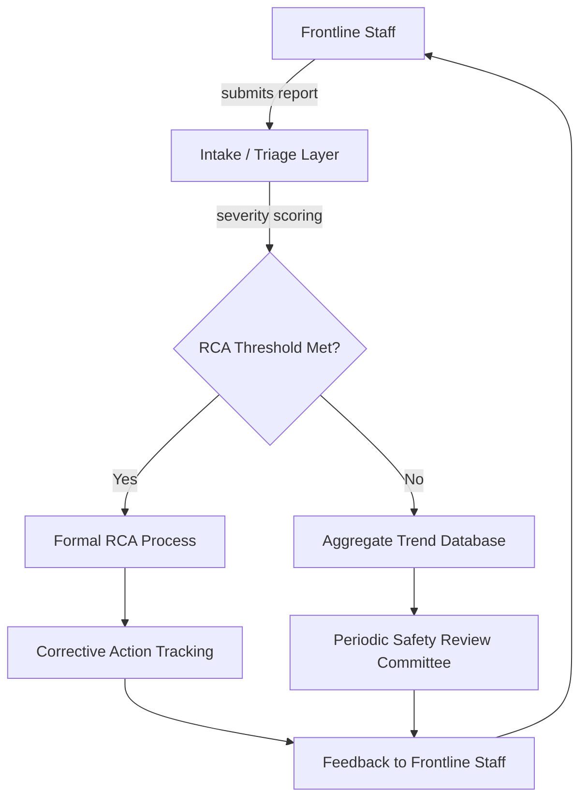

## Patient Safety Reporting Systems

### Purpose and Scope

Patient safety reporting systems are the organizational infrastructure — process, technology, and governance — through which healthcare workers report adverse events, near misses, and unsafe conditions, feeding into root cause analysis and systemic improvement. These systems sit upstream of RCA: an RCA cannot begin until an event has been captured, triaged, and routed to investigation, so the design of the reporting system directly determines what RCA activity even happens.

### Event Classification Taxonomy

Reporting systems typically classify events along severity and preventability axes before RCA triage:

| Category | Definition | Example |
| --- | --- | --- |
| Sentinel Event | Unexpected occurrence involving death or serious physical/psychological harm, unrelated to the natural course of illness | Wrong-site surgery |
| Adverse Event | Harm resulting from medical care, not underlying disease | Medication causing an allergic reaction not previously documented |
| Near Miss (Close Call) | Error that did not reach the patient or caused no harm | Wrong medication caught by pharmacist before administration |
| Unsafe Condition | Circumstance with potential to cause harm, no event yet occurred | Look-alike drug vials stored adjacently |

This taxonomy is not merely descriptive — it typically drives the RCA trigger threshold. Many institutions mandate formal RCA (or the AHRQ-style "Comprehensive Systematic Analysis") for all sentinel events, while near misses may be aggregated for trend review rather than individually investigated.

### System Architecture

A patient safety reporting system generally has four functional layers:

**Intake / Triage Layer** — captures the initial report, often via structured web forms, mobile apps, or integration with the EHR (Electronic Health Record). Fields typically include event type, location, patient identifiers (or de-identified equivalent for near-miss logs), time, and free-text narrative.

**Severity Scoring** — applies a standardized harm scale at intake. The most widely referenced is the **NCC MERP Index** (National Coordinating Council for Medication Error Reporting and Prevention), which ranges from Category A (circumstances with capacity to cause error) through Category I (event contributing to patient death).

**RCA Routing** — events crossing a severity or regulatory threshold are routed to formal RCA, typically with a mandated timeframe (e.g., Joint Commission accreditation standards in the U.S. historically expect sentinel event review within 45 days of the organization becoming aware of the event).

**Corrective Action Tracking** — closes the loop by linking RCA-derived corrective actions back to accountable owners and verifying implementation, structurally identical to the CAPA tracking described in general RCA documentation templates.

### Key System Design Properties

**Key Points**

- **Non-punitive / Just Culture reporting**: Systems designed to elicit honest reporting distinguish human error, at-risk behavior, and reckless behavior, applying different organizational responses to each rather than uniform discipline. This design choice is consistently cited in patient safety literature as the primary determinant of reporting volume — punitive systems suppress reporting of exactly the events RCA needs to see. [Inference — this causal claim is well-supported in patient safety literature but represents an organizational/behavioral generalization rather than a deterministic law]
- **Confidentiality and legal protection**: In the U.S., reports submitted to a federally listed **Patient Safety Organization (PSO)** under the Patient Safety and Quality Improvement Act (PSQIA) receive federal privilege and confidentiality protection, shielding the underlying analysis from discovery in litigation. This is a specific legal mechanism, not a general property of all reporting software.
- **Anonymous vs. confidential reporting**: Anonymous reporting (no identifying metadata captured) maximizes psychological safety but prevents follow-up questions during RCA; confidential reporting (identity known to a restricted safety team but not disciplinary bodies) is more common in mature systems because it preserves investigability.
- **Standardized taxonomies for aggregation**: Systems that use controlled vocabularies (e.g., WHO's International Classification for Patient Safety, or AHRQ Common Formats) allow cross-institutional benchmarking and multi-hospital trend analysis, which free-text-only systems cannot support without secondary NLP processing.

### Common Reporting System Platforms and Standards

- **AHRQ Common Formats** (U.S.) — standardized data elements and definitions for patient safety event reporting, enabling PSOs to aggregate data across member hospitals.
- **RCA² (RCA and Action)** — an AHRQ/NPSF-endorsed methodology extending traditional RCA with structured action design and strength-of-action hierarchies (stronger actions: forcing functions, automation; weaker actions: training, policy reminders).
- **WHO International Classification for Patient Safety (ICPS)** — a globally referenced conceptual framework and taxonomy for patient safety concepts, used to harmonize reporting terminology across countries.
- Commercial/institutional platforms (e.g., RL6:Risk, Datix, Verge) — vendor systems implementing intake, triage, and RCA workflow, commonly integrated with EHR systems for automatic contextual data pull (medication lists, care team, location).

### Integration with RCA Workflow

The reporting system's role in RCA is primarily as the **evidence source and trigger mechanism**:

1. The narrative and structured metadata from the initial report become the starting **Problem Statement** and **Timeline** seed for the RCA document.
2. Severity scoring at intake determines RCA mandate and urgency (a Category I/sentinel event typically triggers immediate multidisciplinary team convening).
3. The reporting system's case ID is cross-referenced in the RCA's metadata header, preserving traceability from raw report to completed analysis to corrective action closure.
4. Aggregated near-miss data (events below RCA threshold) feeds periodic trend reviews that can retroactively trigger RCA if a pattern — rather than a single severe event — reveals systemic risk.

### Common Failure Modes

- **Underreporting due to blame culture**: If disciplinary consequences are perceived as likely, near-miss and error reporting volume drops sharply, starving the RCA pipeline of its earliest and cheapest-to-fix signals.
- **Alert/report fatigue**: Excessive mandatory reporting fields or high-friction intake forms reduce completion rates and narrative quality.
- **Siloed systems**: Reporting systems not integrated with the EHR require duplicate manual entry, increasing staff burden and reducing real-time context available to RCA teams.
- **Delayed triage**: Without automated severity scoring, sentinel events can sit in an intake queue past regulatory review windows.

### Related Topics

- RCA² methodology and action hierarchy design (forcing functions vs. training-based fixes)
- Just Culture algorithm for distinguishing human error, at-risk behavior, and recklessness
- Joint Commission sentinel event policy and accreditation reporting requirements
- NCC MERP medication error severity index in detail
- Human factors engineering as applied to RCA corrective actions in clinical settings