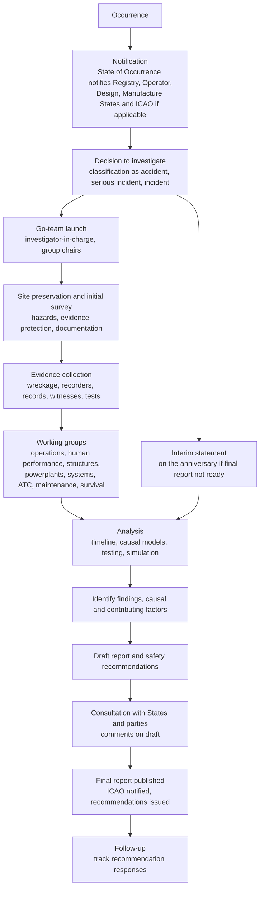

## Aviation Accident Investigation Methodology

Aviation accident investigation is the most mature and institutionalized form of Root Cause Analysis in any industry. It is governed by an international treaty framework (ICAO Annex 13), carried out by independent state authorities whose purpose is prevention rather than blame or liability, and it draws on physical evidence recovery, flight recorder data, human factors science, systems safety models, and structured causal analysis. This reference covers the legal and organizational framework, the investigation lifecycle from notification to final report and safety recommendations, evidence collection and wreckage analysis, flight data and cockpit voice recorder analysis, the major analytical models (Reason's Swiss cheese, SHEL/SHELL, HFACS, event and causal factor charting, fault trees, STAMP/CAST), how the "5 Whys" is used and where it falls short in this domain, report structure and causal language, safety recommendation practice, the interface with legal and judicial processes, safety management system integration, and notable case illustrations of methodological lessons. Regulations, procedures, and organizational names differ by state and change over time, so verify against current ICAO documents and national regulations.

### 1. Legal and Institutional Framework

| Instrument | Role |
| --- | --- |
| Convention on International Civil Aviation (Chicago Convention, 1944), Article 26 | Requires the State where an accident occurs in another contracting State's aircraft to institute an inquiry, in accordance with ICAO procedures |
| ICAO Annex 13, *Aircraft Accident and Incident Investigation* | The core international standard: definitions, notification, responsibility for investigation, conduct, reports, safety recommendations, and protection of certain records |
| ICAO Doc 9756, *Manual of Aircraft Accident and Incident Investigation* (multiple parts) | Detailed guidance on organization, investigation procedures, and specific techniques |
| ICAO Annex 19, *Safety Management* | Safety management system (SMS) and State Safety Programme requirements |
| ICAO Doc 9859, *Safety Management Manual* | Guidance on hazard identification, risk assessment, and safety assurance |
| ICAO Annex 6, Annex 8, Annex 11, and others | Operations, airworthiness, and air traffic services requirements relevant to findings |
| National statutes and regulations | Examples: 49 U.S.C. Chapter 11 and 49 CFR Part 830 (United States, NTSB); Regulation (EU) No 996/2010 (European Union); the Air Accidents Investigation Branch regime under UK law; Transportation Safety Board of Canada Act |
| Regional cooperation frameworks | For example, the European Network of Civil Aviation Safety Investigation Authorities (ENCASIA) |

**Fundamental principle** (Annex 13, paragraph 3.1): the sole objective of an accident or incident investigation is the **prevention of accidents and incidents**, and it is *not* the purpose of this activity to apportion blame or liability.

**Independence**: Annex 13 emphasizes that the investigating authority should be independent of aviation regulators, operators, and other bodies whose interests could conflict with the investigation. Many States have established permanent, multimodal safety boards (for example, NTSB in the US, TSB in Canada, BEA in France, BFU in Germany, AAIB in the UK, ATSB in Australia, JTSB in Japan).

**Key definitions (Annex 13, paraphrased; confirm the current edition)**

| Term | Meaning |
| --- | --- |
| Accident | An occurrence associated with the operation of an aircraft which takes place between the time any person boards with the intention of flight until all such persons have disembarked, in which a person is fatally or seriously injured, the aircraft sustains damage or structural failure of a defined kind, or the aircraft is missing or completely inaccessible |
| Serious incident | An incident involving circumstances indicating that an accident nearly occurred |
| Incident | An occurrence other than an accident which affects or could affect safety of operation |
| State of Occurrence | The State in whose territory the accident or incident occurs |
| State of Registry, State of the Operator, State of Design, State of Manufacture | States with defined rights and obligations, including participation as accredited representatives |
| Accredited representative and advisers | Representatives of involved States who participate in the investigation |
| Causes (historic Annex 13 definition) | Actions, omissions, events, conditions, or a combination thereof, which led to the accident or incident. Identification of causes does not imply assignment of fault or determination of administrative, civil, or criminal liability |
| Safety recommendation | A proposal by the investigating authority, based on information derived from the investigation, made with the intention of preventing accidents or incidents |

Some authorities have moved away from the word "cause" in favor of "findings", "contributing factors", and "probable cause" language, reflecting the multi-factorial nature of accidents. The US NTSB, for example, issues a "probable cause" statement, while other States list "causes and contributing factors" or "findings" separately.

**Key Points**

- The separation of safety investigation from criminal and civil proceedings is a foundational design choice. It exists to secure candid cooperation from crews, controllers, maintainers, and companies.
- Annex 13 restricts the use of certain records (for example, cockpit voice recordings, witness statements given under safety investigation authority, and analysis and opinions) for purposes other than the investigation, except where a competent authority determines that disclosure outweighs the adverse domestic and international impact on future investigations.
- International participation is structured, so the State of Occurrence leads while other States provide accredited representatives and technical advisers (manufacturers, operators, unions).

### 2. Investigation Lifecycle

**Timelines** (Annex 13 and national practice)

| Item | Expectation |
| --- | --- |
| Notification | Immediate, by the fastest means available, with defined content |
| Preliminary report | Sent to ICAO and involved States within 30 days of the accident for aircraft above specified mass thresholds |
| Final report | Made public as soon as possible, and preferably within 12 months |
| Interim statement | If the final report cannot be made public within 12 months, an interim statement is made public on each anniversary |

Complex investigations often take well over a year, and independent boards commonly publish progress and interim safety recommendations when urgent hazards are identified.

**Organization of the investigation**

| Role | Function |
| --- | --- |
| Investigator-in-Charge (IIC) | Overall responsibility for organization, conduct, and control of the investigation |
| Group chairs | Lead specialist groups (for example, structures, systems, powerplants, operations, human performance, air traffic control, meteorology, maintenance records, survival factors, cockpit voice recorder, flight data recorder) |
| Parties and accredited representatives | Participants with technical expertise (manufacturers, operators, regulators, unions), under the direction of the investigating authority |
| Family assistance and communications | Support for victims and families and public information, with defined roles in many States |

In the United States, the NTSB "party system" designates parties to the investigation who can supply technical assistance, but parties who have a financial or litigation interest are constrained (for example, they may not communicate with the media about the investigation and their participation can be limited). Other States use different structures, and Annex 13 places control of the investigation with the investigating authority.

### 3. Site Response and Evidence Preservation

**Priorities on arrival**

1. **Safety and rescue**: hazards to investigators (fuel, composites dust, hazardous materials, pyrotechnics, high-pressure bottles, biohazards).
2. **Preservation**: secure the site, control access, and protect evidence from disturbance, weather, scavengers, and removal.
3. **Documentation before movement**: photograph, video, sketch, and map wreckage, and record positions using GPS, total station, or aerial imagery (including drones and photogrammetry).
4. **Recovery of perishable evidence**: recorders, fluids, fuel samples, switch and control positions, ground scars, tire marks, and witness marks.
5. **Witness identification**: crew, passengers, ATC, ground personnel, maintenance staff, and bystanders, interviewed early.

**Wreckage distribution and ground scars** provide clues to attitude, speed, and configuration at impact, and to whether the aircraft was intact in flight. A widely dispersed wreckage field over a long distance suggests in-flight breakup, while a compact field suggests a low-energy, high-angle, or controlled impact.

**Key evidence categories**

| Category | Examples |
| --- | --- |
| Physical evidence | Structure, fractures, engines, flight controls, landing gear, cockpit switch and lever positions, instruments, fuel, hydraulic fluid, cabin and seats |
| Recorded data | Flight data recorder (FDR), cockpit voice recorder (CVR), quick access recorder, engine monitoring, ACARS and other data link messages, radar and ADS-B, ATC voice and data, weather radar and satellite imagery, aircraft health monitoring |
| Documentary evidence | Maintenance records, technical logs, airworthiness directives, operator manuals and procedures, training records, flight planning, dispatch documents, weight and balance, crew scheduling and duty time |
| Human evidence | Witness interviews, medical and toxicological data, crew qualifications and experience, fatigue-related information, behavioral history, 72-hour histories |
| Organizational evidence | Safety management system records, oversight and audit history, regulator approvals, safety reports, company culture indicators |
| Environmental evidence | Meteorological data, airport conditions, NOTAMs, lighting, terrain, wildlife strikes, volcanic ash |

**Chain of custody** is documented for key items, particularly recorders, components for laboratory examination, and any evidence potentially used in later proceedings.

### 4. Flight Recorders and Data Analysis

**Recorder types**

| Recorder | Content |
| --- | --- |
| Flight Data Recorder (FDR) | Time-history of flight parameters (from a small mandatory set to over 1,000 parameters on modern aircraft), including altitude, airspeed, heading, attitude, engine parameters, control positions, autopilot modes, and warnings |
| Cockpit Voice Recorder (CVR) | Audio of the cockpit area microphone and crew audio channels, radio communications, alarms, and ambient sounds. Modern CVRs record two hours or more (newer requirements extend recording duration up to 25 hours for new aircraft under revised ICAO and regulatory standards, phased by aircraft type and date; verify current requirements) |
| Combined and image recorders | Some airplanes have combined units or cockpit image or airborne image recorders. Requirements and use vary by State, and privacy and protections are debated |
| Quick Access Recorder (QAR) and flight data monitoring (FDM/FOQA) data | Routine flight data used for operator safety programs, and can supplement investigations |
| Locator beacons | Underwater locator beacons (ULB), typically with 30-day battery life (with extended-duration beacons introduced after major ocean search cases), and emergency locator transmitters (ELT) |

**Analysis practices**

- **Readout in a laboratory** under the investigating authority, with validated tools and manufacturer support for decoding frames, calibration, and engineering unit conversion.
- **Time synchronization** among FDR, CVR, ATC audio, radar, and other sources, using common time references, so that events can be sequenced accurately. Synchronization uncertainty must be documented.
- **CVR transcript**: an investigative group listens, produces a transcript of relevant portions, and identifies speakers, tones, sounds (for example, warnings, switch clicks, engine spool changes). Public release of CVR contents is restricted by Annex 13 and national laws, and transcripts in public reports are typically limited to relevant portions.
- **Sound spectrum analysis** can identify engine speeds, stall warnings, and mechanical sounds.
- **Flight path reconstruction** and **animations** from FDR and radar data.
- **Performance calculations**: energy state, stall margins, engine thrust versus demanded, and aircraft response to control inputs.
- **Simulator replication** with the manufacturer's engineering simulator or a full-flight simulator to test hypotheses and crew workload.

Basic aerodynamic relationships used in analysis include lift, and the stall speed dependence on load factor. Lift is:

$$L = \frac{1}{2}\rho V^2 S C_L$$

where $\rho$ is air density, $V$ is true airspeed, $S$ is wing area, and $C_L$ is the lift coefficient. In steady level flight $L = W$, and stall speed increases with load factor $n$ (for example, in a coordinated turn):

$$V_{s,n} = V_{s,1g}\sqrt{n}, \qquad n = \frac{1}{\cos\phi}$$

where $\phi$ is the bank angle. At a 60° bank, $n = 2$, so stall speed increases by a factor of about $\sqrt{2} \approx 1.41$. Such relationships help interpret recorded data, and detailed reconstruction uses aircraft-specific aerodynamic models. Conclusions should note the uncertainty of each data source and computation.

### 5. Wreckage and Component Examination

| Discipline | Examination Focus |
| --- | --- |
| Structures | Fracture surfaces (fatigue striations, overload features, corrosion), failure sequence, load paths, evidence of in-flight breakup, fire damage, bird strike |
| Powerplants | Engine damage indicating power at impact (rotation marks, blade bending), fuel system contamination, control settings, uncontained failure, foreign object damage |
| Systems | Hydraulics, electrical, flight control, avionics, pressurization, fire detection and suppression, warning systems, software and firmware |
| Materials science and metallurgy | Fractography (optical and scanning electron microscopy), chemical analysis, hardness testing, heat damage assessment |
| Fire and explosives | Origin and cause of fire, forensic explosive residue analysis where sabotage is suspected |
| Human factors and survival | Restraint performance, seat and cabin structure, evacuation, emergency equipment, injury patterns |
| Computed tomography and non-destructive testing | Evaluate internal condition of components without destructive sectioning |

**Failure mechanism examples**: fatigue crack growth (initiation site, beach marks, striations, final overload zone), stress corrosion cracking, hydrogen embrittlement, and creep. Where a fatigue crack is found, further questions are how the crack initiated (material defect, manufacturing, damage, corrosion), why inspection did not find it (inspection method, interval, access, human performance), and why design and certification assumptions did not cover it. This escalation of questions resembles a branching 5 Whys, moving from the physical failure to inspection programs, design assumptions, and oversight.

### 6. Human Performance Investigation

Human performance groups examine crew, controller, and maintainer actions in context, not to assign blame, but to understand why actions made sense at the time.

**Elements examined**

| Area | Questions |
| --- | --- |
| Qualifications and experience | Certificates, ratings, recency, training history, type experience |
| Physiological state | Fatigue and circadian factors, sleep history, workload and duty time, illness, medication, alcohol and drugs (toxicology), hypoxia |
| Cognitive and situational factors | Situation awareness, attention and distraction, mental models, automation understanding, startle and surprise, workload, decision-making |
| Crew resource management (CRM) | Communication, leadership, authority gradient, coordination, monitoring and challenging |
| Procedures and checklists | Availability, clarity, design, compliance and reasons for deviations |
| Human-machine interface | Display design, alerting logic, mode awareness, control design, ergonomics |
| Training | Content, realism, upset prevention and recovery training, recurrent training, scenario coverage |
| Operational pressures | Schedule, commercial pressures, culture of compliance, normalization of deviance |
| Organization | Safety culture, management priorities, resources, oversight |

**Interviews** are conducted as soon as practical, separately, non-accusatory, and structured (cognitive interview techniques help recall). Statements are protected under Annex 13, and interviewers avoid leading questions and hindsight bias. Where crew are deceased, reconstruction depends on recorder data, training records, and colleague accounts.

**Hindsight bias and outcome bias** are recognized hazards for investigators. Investigators aim to reconstruct the information available to the operators at each moment (local rationality) rather than judging by knowledge of the outcome.

### 7. Analytical Models and Frameworks

| Model | Idea | Use in Investigation |
| --- | --- | --- |
| **Sequence-of-events / timeline analysis** | Chronology of relevant events and conditions | Foundation for all analysis |
| **Domino model (Heinrich)** | Chain of events leading to injury | Historical, largely superseded |
| **Swiss cheese model (Reason)** | Accidents occur when weaknesses in multiple layers of defenses align. Distinguishes active failures and latent conditions | Framing of organizational and defensive layers |
| **SHEL / SHELL model (Edwards, Hawkins)** | Interfaces among Software, Hardware, Environment, Liveware (central human), and other Liveware | Structuring human factors interactions |
| **HFACS (Human Factors Analysis and Classification System)** | Taxonomy built on Reason: unsafe acts, preconditions for unsafe acts, unsafe supervision, organizational influences | Classification and trending of human factors across many accidents |
| **ICAO Accident/Incident Data Reporting (ADREP) taxonomy** | Standard occurrence categories and descriptive factors | Data reporting to ICAO and safety trending |
| **Events and Causal Factors (ECF) charting; MES (Multi-linear Events Sequencing); STEP (Sequentially Timed Events Plotting)** | Diagram of events, conditions, and causal links | Visualizing complex sequences |
| **Fault tree analysis** | Top-down deductive logic of how the top event arises from combinations of events | Systems and reliability analysis, probabilistic assessment |
| **Barrier analysis / MORT (Management Oversight and Risk Tree)** | Identify barriers, whether they failed or were absent | Management and defense analysis |
| **AcciMap (Rasmussen)** | Multi-level socio-technical system map from work to government | Organizational and regulatory influences |
| **STAMP / CAST (Leveson)** | Systems-theoretic model treating accidents as control failures. CAST is the analysis method | Complex, software-intensive, and organizational accidents |
| **FRAM (Hollnagel)** | Functional Resonance Analysis Method examining variability in functions | Complementary Safety-II perspective |
| **TEM (Threat and Error Management)** | Threats, errors, and undesired states in flight operations | Operational safety and training frameworks |
| **Bow-tie** | Hazard, top event, threats, consequences, and barriers | Risk communication, SMS |
| **Five Whys / "Why-Because" analysis (Ladkin)** | Causal reasoning with logical testing | Explicit causal chains; Why-Because Analysis (WBA) uses formal counterfactual test |

**Counterfactual test** (used in WBA and general causal reasoning): factor A is a necessary causal factor of B if, had A not occurred, B would not have occurred (in the circumstances). The test helps avoid including merely correlated or incidental conditions in the causal set, and helps identify which factors were essential.

**Probable cause and factor classification**

Investigation authorities commonly distinguish:

| Term | Meaning |
| --- | --- |
| Causal / contributing factor | A condition or event that, if eliminated or changed, would likely have prevented the accident or reduced its severity |
| Finding | A statement of fact, condition, or conclusion established during the investigation, which may be causal, contributing, or related |
| Other safety issue | A factor that did not contribute to this accident but which presents a safety risk |
| Probable cause (NTSB) | The determination of the most probable cause(s) of the accident, made by the Board |

Some authorities use structured **findings lists** grouped as "causal factors", "contributing factors", and "findings related to risk", along with statements that acknowledge uncertainty (for example, "the investigation was unable to determine", "it is likely that").

### 8. The 5 Whys in Aviation Investigation Context

The 5 Whys appears in aviation safety in operators' internal event analyses and SMS investigations, and the logic of iterative causal questioning underlies formal investigations. In major accident investigations, however, single-chain 5 Whys is considered inadequate on its own because accidents involve multiple interacting factors, organizational and regulatory influences, and uncertain evidence. Investigators use branching, evidence-linked causal analysis and formal models.

**Worked example: Uncontained engine failure (illustrative, generic)**

| Why | Answer | Evidence |
| --- | --- | --- |
| Why did the engine's fan disk fail? | A fatigue crack initiated at a subsurface anomaly and grew until overload fracture | Fractography and metallurgy |
| Why did the crack initiate at a subsurface anomaly? | A material defect (hard alpha inclusion) in the titanium billet was present from manufacturing | Metallurgical analysis, material records |
| Why was the defect not detected at manufacture? | Ultrasonic inspection sensitivity and process control did not reliably detect the defect size and location | Inspection records, capability studies |
| Why was it not detected in service? | The in-service inspection program relied on visual and surface methods, with no interval or method capable of detecting the subsurface crack before the critical size | Maintenance program, inspection procedures |
| Why did the program and design assumptions permit this? | The damage tolerance and certification approach assumed inspection capability and material quality that were not validated for this failure mode, and regulatory oversight did not challenge the assumption | Certification documents, regulatory records |

This chain has several branches (manufacturing process control, inspection technique, certification assumptions, oversight) that investigators would follow in parallel, each supported by evidence, leading to safety recommendations addressed to the manufacturer, regulators, and operators.

**Cautions**

- Avoid stopping at "pilot error", "controller error", or "maintenance error". Ask what conditions made the action likely and why defenses did not intercept it.
- Do not force one root cause. Use "causal and contributing factors".
- Express uncertainty honestly when the evidence does not settle a question.
- Guard against hindsight, confirmation bias, and premature convergence on a favored hypothesis. Maintain and test alternative hypotheses.

### 9. Report Structure and Causal Language

**Annex 13 final report format (Appendix 1)** typically includes:

1. **Factual information**: history of the flight, injuries, damage, other damage, personnel information, aircraft information, meteorological information, aids to navigation, communications, aerodrome information, flight recorders, wreckage and impact information, medical and pathological information, fire, survival aspects, tests and research, organizational and management information, additional information, and useful or effective investigation techniques.
2. **Analysis**: reasoning from the facts to conclusions.
3. **Conclusions**: findings, causes, and contributing factors.
4. **Safety recommendations**.
5. **Appendices**.

**Report characteristics**

- Clear separation of facts from analysis and conclusions.
- Explicit statement of confidence, limits of evidence, and alternative hypotheses considered and rejected.
- Consultation: States and designated parties receive the draft for comment (Annex 13 requires sending the draft final report to the States that instituted the investigation or participated, and certain others, for comments within 60 days), and comments are appended or addressed.
- Dissenting or additional opinions may be appended by participating parties or States, depending on the national framework.

**Safety recommendations**

| Attribute | Practice |
| --- | --- |
| Addressed to | Regulators, manufacturers, operators, air navigation service providers, airport operators, and international bodies |
| Timing | Issued at any stage when urgent safety action is warranted (for example, emergency or urgent recommendations during the investigation) |
| Content | Specific, actionable, and linked to identified deficiencies |
| Response | Recipients are expected to respond within defined periods (for example, NTSB requests a response within 90 days), and States must respond to recommendations under Annex 13 obligations. Investigation authorities track status (open, closed, acceptable, unacceptable) |
| Enforcement | Recommendations are generally not legally binding, and implementation relies on regulators and operators (with exceptions in some legal systems) |
| Effect | Many major regulatory changes (for example, ground proximity warning systems, TCAS requirements, cockpit door hardening, lithium battery restrictions) followed accident recommendations |

Action strength considerations parallel other RCA fields: design changes and engineering controls that remove reliance on human memory are considered stronger than procedural or training-only recommendations.

### 10. Legal, Judicial, and Public Interest Interfaces

| Issue | Description |
| --- | --- |
| Separation from criminal and civil proceedings | Annex 13 protects certain records (CVR recordings and transcripts, witness statements, communications, medical information, analysis) from being used for purposes other than accident investigation, subject to exceptions. Practices vary by State, and the tension between protection and access has been a subject of significant debate |
| Judicial authorities | Some States conduct parallel judicial investigations (for example, France, Italy), which require coordination protocols to protect the safety investigation |
| Criminalization of error | Concerns that prosecution of pilots, controllers, or maintainers after accidents chills reporting and cooperation. Bodies such as ICAO, IFALPA, the Flight Safety Foundation, and CANSO have advocated protection except for cases of willful misconduct, gross negligence, or serious dereliction |
| Media and public communication | Investigators provide factual updates through authorized spokespersons, and avoid speculation |
| Family assistance | Legislation and standards (for example, the US Aviation Disaster Family Assistance Act) require support and communication with families |
| Liability and litigation | Civil litigation may use factual information publicly released. Use of the final report as evidence is restricted or prohibited in some jurisdictions and allowed in others |
| Sabotage and unlawful interference | Security and law enforcement agencies may lead or share responsibility, with cooperation agreements |

### 11. Integration with Safety Management Systems and Proactive Safety

Accident investigation is the reactive pillar. Modern aviation safety uses a **layered system**:

| Layer | Method |
| --- | --- |
| State Safety Programme (SSP) and Safety Management Systems (SMS) under Annex 19 | Safety policy, safety risk management, safety assurance, safety promotion |
| Mandatory and voluntary occurrence reporting | Systems such as EU Regulation 376/2014, US ASRS (NASA Aviation Safety Reporting System), and airline reporting programs |
| Flight data monitoring (FDM/FOQA) | Routine analysis of flight data for exceedances and trends |
| Line Operations Safety Audit (LOSA) | Observation of normal operations to record threats and errors |
| Safety audits and oversight (ICAO USOAP, IOSA, national oversight) | System-level assurance |
| Proactive risk assessment | Hazard identification, risk matrices, bow-tie analyses, FMEA for design |
| Just culture in aviation | Defined in Regulation (EU) 376/2014 and similar frameworks, protecting reporters from punishment except in cases of gross negligence or willful misconduct |

**Operator internal investigations** (SMS) use methods such as event review boards, ICAO's SMS risk assessment, bow-tie analysis, and root cause tools including 5 Whys, fishbone, and barrier analysis. The same principles apply: system-level causes, corrective action, effectiveness monitoring.

Risk assessment in SMS commonly uses a probability by severity matrix, with risk index categories (for example, tolerable, tolerable with mitigation, unacceptable). The matrix structure is:

$$\text{Risk} = f(\text{Severity}, \text{Probability})$$

where the function is defined by an organization's risk matrix, not a formula. Numerical probabilities for catastrophic aircraft system failures are governed in certification (for example, extremely improbable failure conditions on the order of $10^{-9}$ per flight hour for catastrophic failures under FAR/CS 25.1309 guidance). [Unverified: exact numeric interpretation and application depend on the certification basis and advisory material in force.]

### 12. Illustrative Case Lessons Related to Methodology

The following widely documented cases illustrate methodological points, and readers should consult the official reports for accurate details.

| Case | Methodological Lesson |
| --- | --- |
| Tenerife runway collision (1977) | Multi-factor causation: communication ambiguity, weather, workload, hierarchy and authority gradient; catalyzed CRM development and standard phraseology emphasis |
| United Airlines Flight 232 (1989, Sioux City) | Uncontained engine failure severing hydraulic lines; illustrated design assumptions, inspection capability limits, and exemplary crew resource management in an unprecedented emergency |
| Air France Flight 447 (2009) | Pitot probe icing, autopilot disconnect, crew handling in high-altitude stall; recovery of recorders after two years underwater; human-automation interaction, training in manual handling and stall recognition, and organizational factors |
| Boeing 737 MAX accidents (Lion Air 610, 2018; Ethiopian Airlines 302, 2019) | System design and certification assumptions about a flight control augmentation function (MCAS), reliance on a single sensor, pilot response assumptions, regulatory oversight and delegation, and organizational factors. Multiple national reports and a US congressional inquiry addressed different aspects. Illustrates the importance of examining design assumptions and regulatory processes along with crew actions |
| Swissair Flight 111 (1998) | In-flight fire; investigation of materials flammability, in-flight entertainment system installation, and certification practices; major recommendations on materials and wiring |
| TWA Flight 800 (1996) | Fuel tank explosion; extensive wreckage reconstruction and testing, initial consideration of sabotage and missile, ultimate finding of fuel-air vapor ignition from a likely short circuit; recommendations on fuel tank inerting and wiring |
| Colgan Air Flight 3407 (2009) | Fatigue, sterile cockpit violations, stall response, training, and regulatory oversight; led to changes in flight and duty time and pilot qualification rules in the US |
| Germanwings Flight 9525 (2015) | Deliberate act by a crew member with medical history; led to changes in cockpit occupancy procedures, medical examination and mental health support approaches, and reporting systems |
| Malaysia Airlines Flight 370 (2014) | Limits of investigation without wreckage or recorders; recommendations on tracking, recorder recovery, and flight data streaming |
| Asiana Flight 214 (2013) | Automation mode confusion and manual flying proficiency on approach; training and crew understanding of autothrottle behavior |
| Concorde Air France 4590 (2000) | Runway debris, tire failure, fuel tank rupture, fire; design vulnerability and maintenance practices |
| Japan Airlines 123 (1985) | Repair of a tail strike with an improper doubler plate that led to fatigue failure and catastrophic decompression; maintenance and repair quality assurance |

These examples show that thorough investigations look past proximate failures to design, certification, maintenance, training, oversight, and organizational conditions, and that evidence may take years to recover or interpret.

### 13. Techniques for Rigor and Bias Control

| Practice | Purpose |
| --- | --- |
| Hypothesis management | Maintain several hypotheses and specify evidence that would support or refute each |
| Peer review and specialist review | Independent review of technical work and draft findings |
| Documenting uncertainty | State confidence levels and limitations |
| Testing and validation | Component testing, simulation, and flight tests to confirm mechanisms |
| Counterfactual testing | Examine whether the factor was necessary or contributory |
| Guarding against hindsight bias | Reconstruct the crew's or controller's information at each time |
| Cross-checking data sources | Compare FDR, radar, ATC, and physical evidence for consistency |
| Structured analytic tools | Use models such as HFACS, AcciMap, or STAMP for systematic coverage |
| Transparency and consultation | Comment periods and party review reduce error and bias |
| Independent authority | Reduces conflicts of interest |

### 14. Common Pitfalls

1. **Premature closure** on a single explanation, particularly "pilot error".
2. **Hindsight bias**, judging decisions with knowledge of outcomes.
3. **Blaming the sharp end** while neglecting design, maintenance, training, and oversight factors.
4. **Insufficient evidence preservation**, allowing loss of perishable data.
5. **Poor time synchronization** among data sources, leading to incorrect sequences.
6. **Over-interpreting CVR audio** or flight data beyond what evidence supports.
7. **Conflicts of interest** among parties, or political and commercial pressures on findings.
8. **Ignoring organizational and regulatory factors** because they are harder to investigate and politically sensitive.
9. **Overreliance on simple causal chains**, such as single-line 5 Whys, in multi-factor accidents.
10. **Vague or unactionable recommendations**, or recommendations not followed up.
11. **Lack of independence** from regulators or operators.
12. **Leaks and speculation** that undermine trust and can bias witnesses.
13. **Insufficient support for families** and affected communities.
14. **Failure to share lessons globally**, so similar accidents recur.

### 15. Practical Checklist

1. Notify the required States and organizations promptly, and mobilize an independent investigation team with clear leadership.
2. Secure the site, ensure investigator safety, and preserve and document evidence before moving anything.
3. Recover flight recorders and other data sources quickly, and maintain chain of custody.
4. Organize specialist groups and structured party participation under the control of the investigating authority.
5. Build a validated timeline combining recorded data, physical evidence, and witness accounts, with time synchronization documented.
6. Investigate human performance, organizational factors, and regulatory oversight, not only the immediate sequence.
7. Use appropriate models (Swiss cheese, SHELL, HFACS, AcciMap, STAMP or CAST) and formal causal reasoning, and test hypotheses with evidence.
8. Distinguish facts, analysis, findings, and causal or contributing factors, and state uncertainty transparently.
9. Issue safety recommendations promptly when urgent hazards are found, and design them to be specific and actionable.
10. Consult designated States and parties on the draft, and publish the final report with follow-up tracking.
11. Coordinate with judicial and security authorities while protecting safety information according to Annex 13.
12. Feed lessons into SMS, regulation, training, design, and international learning.

**Conclusion**

Aviation accident investigation methodology combines a treaty-based legal framework, independent investigating authorities, rigorous evidence preservation, recorder and wreckage analysis, human and organizational factors science, and structured causal models, all directed at prevention rather than blame. Its central lessons for RCA generally are that accidents are multi-factorial, that active failures sit within latent organizational and design conditions, that hindsight bias must be managed deliberately, that findings must be supported by evidence and honest about uncertainty, and that recommendations should target system-level defenses. The 5 Whys is a useful prompting device at the operator and SMS level, but major investigations rely on branching, evidence-linked causal analysis and formal models. Regulations, ICAO edition details, national procedures, and institutional names change over time, so confirm them against current ICAO documents and national authorities.

**Related Topics**

- ICAO Annex 13 and Doc 9756 in detail
- Flight data recorder and cockpit voice recorder analysis techniques
- HFACS, SHELL, and AcciMap applications
- STAMP and CAST for software-intensive and organizational accidents
- Safety Management Systems and ICAO Annex 19
- Threat and Error Management and LOSA
- Just culture and occurrence reporting in aviation (EU 376/2014, ASRS)
- Fractography and metallurgical failure analysis
- Air traffic control incident investigation methods
- Criminalization of error and protection of safety information