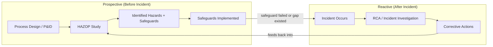

## Process Safety Management and HAZOP Relation

### Purpose and Scope

Process Safety Management (PSM) is a regulatory and organizational framework for preventing catastrophic releases of hazardous chemicals, fires, and explosions in industrial processes. HAZOP (Hazard and Operability Study) is one of the core hazard-identification techniques used *within* PSM, applied proactively before an incident occurs. Understanding their relationship matters for RCA because PSM defines *when and why* an RCA is triggered in process industries, while HAZOP defines a structurally similar analytical method used *before* the fact — the two are complementary halves of the same hazard-management lifecycle: HAZOP is prospective (prevents), RCA is retrospective (explains after prevention failed).

### PSM Regulatory Framework

In the U.S., PSM is codified under **OSHA 29 CFR 1910.119**, applicable to processes involving threshold quantities of specified highly hazardous chemicals or flammables above defined limits. It comprises 14 required elements:

| # | Element | Function |
| --- | --- | --- |
| 1 | Employee Participation | Formal involvement of workers in PSM development |
| 2 | Process Safety Information | Documented chemical, technology, and equipment data |
| 3 | Process Hazard Analysis (PHA) | Systematic hazard identification (HAZOP is one PHA method) |
| 4 | Operating Procedures | Written, current procedures for each operating phase |
| 5 | Training | Initial and refresher training for operators |
| 6 | Contractor Safety | Management of contractor personnel on-site |
| 7 | Pre-Startup Safety Review | Verification before introducing hazardous materials |
| 8 | Mechanical Integrity | Inspection/testing of critical equipment |
| 9 | Hot Work Permit | Control of ignition sources during maintenance |
| 10 | Management of Change (MOC) | Review of process/equipment/personnel changes |
| 11 | Incident Investigation | RCA of incidents and near misses |
| 12 | Emergency Planning and Response | Preparedness for releases |
| 13 | Compliance Audits | Periodic PSM system audits |
| 14 | Trade Secrets | Information access provisions |

Two elements are directly relevant to the RCA/HAZOP relationship: **Element 3 (Process Hazard Analysis)**, which mandates HAZOP or equivalent methods, and **Element 11 (Incident Investigation)**, which mandates RCA-style investigation after incidents.

### HAZOP Methodology

HAZOP is a structured, team-based technique that examines a process design (via P&IDs — Piping and Instrumentation Diagrams) node by node, applying **guide words** to each process parameter to systematically generate deviation scenarios.

**Standard Guide Words:**

| Guide Word | Meaning | Example Deviation |
| --- | --- | --- |
| No / Not | Complete negation of intent | No flow |
| More | Quantitative increase | More pressure |
| Less | Quantitative decrease | Less temperature |
| As Well As | Qualitative increase (additional component) | Contamination |
| Part Of | Qualitative decrease (missing component) | Wrong composition |
| Reverse | Logical opposite | Reverse flow |
| Other Than | Complete substitution | Wrong material charged |

For each node (a defined section of the process, e.g., "feed line from Tank 101 to Reactor 201"), the team applies each guide word to each relevant parameter (flow, pressure, temperature, level, composition) and documents:



```
Node: Feed line, Tank 101 → Reactor 201
Parameter: Flow
Guide Word: No
Deviation: No flow to reactor
Causes: Pump failure, valve closed, line blockage
Consequences: Reactor runs dry, potential overheating of empty vessel
Safeguards: Low-flow alarm, high-temperature interlock
Recommendations: Add redundant low-flow trip to independent SIS
```

This causal structure — Deviation → Causes → Consequences → Safeguards — is the prospective mirror of an RCA's Timeline → Causal Chain → Impact → Corrective Actions structure.

### Structural Relationship to RCA



The critical link: **when an RCA following a real incident is complete, its findings should be checked against the original HAZOP for that node.** Two outcomes are diagnostic:

1. **The HAZOP identified the causal scenario, but the recommended safeguard was never implemented, degraded, or bypassed** — this points to a management system failure (MOC, mechanical integrity, or audit gap), not an analytical blind spot.
2. **The HAZOP did not identify the scenario at all** — this points to a gap in the hazard identification method itself (e.g., a guide word combination not considered, a node boundary drawn incorrectly, or a hazard introduced by a later, unreviewed modification).

Distinguishing these two cases is a standard step in mature process-safety RCA programs, since the corrective action differs fundamentally: case 1 requires fixing execution/governance, case 2 requires re-scoping or re-running the HAZOP.

### Management of Change (MOC) as the Connective Tissue

MOC (PSM Element 10) is frequently the actual root cause surfaced in process-industry RCAs, because it governs whether a HAZOP is re-triggered when a process changes. A common causal pattern:



```
Why 1: Why did the reactor over-pressurize?
→ A relief valve was undersized for the new operating condition.

Why 2: Why was the relief valve undersized?
→ The process was modified to increase throughput without updating the PHA.

Why 3: Why wasn't the PHA updated?
→ The change was classified as "like-for-like" under MOC and did not
   trigger PHA/HAZOP re-review.

Why 4: Why was a throughput-affecting change classified as like-for-like?
→ The MOC classification criteria did not explicitly address
   changes to process rates, only equipment substitutions.

Root Cause: MOC procedure's change-classification criteria are incomplete
for rate/capacity changes, allowing hazard-relevant modifications to
bypass PHA re-review.
```

This pattern — an RCA tracing back through MOC to a gap in when HAZOP re-review is triggered — is one of the most frequently cited failure archetypes in major process safety incident reports (e.g., publicly available CSB — U.S. Chemical Safety Board — investigation reports document this pattern across multiple industrial explosions). [Inference — this is a documented recurring pattern across public incident investigations, not a claim about every incident]

### Key Points

- HAZOP is a **prospective, design-stage** hazard identification method; RCA is a **retrospective, post-incident** investigation method. They share a similar node/deviation/causal structure but operate at opposite points in the process lifecycle.
- PSM (OSHA 1910.119, or equivalent frameworks like the EU Seveso Directive) is the governance layer that mandates both: Element 3 requires HAZOP-class analysis; Element 11 requires RCA-class investigation.
- A structurally sound RCA program in process industries always includes a step that cross-references findings against the relevant HAZOP worksheet for that process node, to determine whether the failure was a safeguard-execution gap or a hazard-identification gap.
- HAZOP is typically revalidated on a fixed cycle (commonly every 5 years under PSM-equivalent frameworks) or triggered by MOC — an RCA finding that traces to "HAZOP was outdated" often further traces to a revalidation-cycle or MOC-triggering gap.
- Layer of Protection Analysis (LOPA) is often applied as a semi-quantitative follow-on to HAZOP for scenarios where safeguard adequacy needs numerical risk ranking — RCAs sometimes reference LOPA data to assess whether a failed safeguard's independent protection layer (IPL) credit was invalidated by an undocumented change.

### Related Topics

- Layer of Protection Analysis (LOPA) and independent protection layers (IPLs)
- Management of Change (MOC) procedure design and classification criteria
- Bowtie analysis as a visual bridge between prospective hazard analysis and RCA
- CSB (Chemical Safety Board) investigation report structure as an RCA case-study source
- Swiss Cheese Model applied to process safety barrier failures