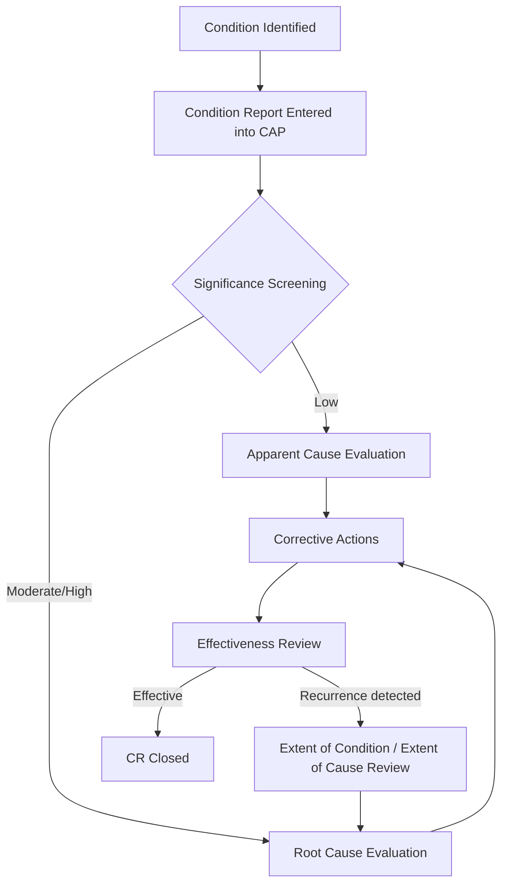

## Nuclear Industry Root Cause Practices

### Purpose and Scope

The nuclear power industry operates one of the most formalized and rigorous root cause analysis regimes of any sector, driven by defense-in-depth safety philosophy, high regulatory scrutiny, and the low tolerance for repeat events. Nuclear RCA practices are distinguished from general industrial RCA by their integration into a broader **Corrective Action Program (CAP)**, standardized causal factor taxonomies, and heavy reliance on techniques developed or formalized by the U.S. Department of Energy, INPO (Institute of Nuclear Power Operations), and the NRC (Nuclear Regulatory Commission).

### The Corrective Action Program (CAP) Structure

In the U.S. nuclear fleet, essentially every condition adverse to quality — from a minor procedural deviation to a reactor trip — enters a **Condition Report (CR)** system, which is the intake mechanism analogous to the incident reporting systems used in healthcare or aviation. The CR is triaged and assigned a significance level that determines the required depth of causal analysis.



**Significance-tiered analysis depth** is a defining feature: not every condition warrants a full RCA. Most nuclear CAPs use a two-tier (or three-tier) model:

| Tier | Analysis Type | Typical Trigger | Rigor |
| --- | --- | --- | --- |
| Low | Apparent Cause Evaluation (ACE) | Minor procedure deviation, low-safety-significance finding | Single analyst, days |
| Moderate | Root Cause Evaluation (RCE) | Repeat condition, moderate safety significance | Cross-functional team, weeks |
| High | Root Cause Evaluation with independent oversight | Reactor trip, safety system actuation, NRC-reportable event | Trained RCA facilitator, formal methodology, management review |

### Standardized Causal Analysis Techniques

Nuclear RCA practice does not rely on the 5 Whys as a standalone method for significant events; it uses a small set of formalized techniques, often in combination:

**Events and Causal Factors (ECF) Charting** — A graphical timeline technique (originated at DOE facilities, formalized in DOE-NE-STD-1004 style guidance) that plots events chronologically and identifies "causal factors" — conditions or actions that, absent, would have prevented the undesired outcome. Each causal factor is then traced to underlying root and contributing causes.



```
[Event: Operator closes wrong valve] 
|
   [Causal Factor: Valve labeling ambiguous]
|
   [Root Cause: Labeling standard doesn't require 
    unique tag verification during field walkdowns]
```

**Barrier Analysis** — Explicitly modeled on the defense-in-depth philosophy: identifies which physical, administrative, or procedural barriers should have prevented the event, and why each failed or was absent. Structurally similar to the Swiss Cheese Model but formalized with a standard worksheet (barrier, function, status: failed/absent/degraded).

**Change Analysis** — Compares the failed process/condition against a known-good baseline (either a prior successful instance or an equivalent unaffected unit) to isolate what changed. Frequently used when a plant has operated a procedure or component successfully for years before a failure — the RCA question becomes "what changed" rather than "what is wrong with this design."

**Causal Factor Tree / Fault Tree techniques** — Deductive, top-down decomposition from the undesired top event through intermediate causes to root causes, often combined with Boolean logic gates (AND/OR) when multiple factors must coincide.

### INPO Root Cause Taxonomy

INPO (an industry self-regulatory body distinct from the NRC) maintains a standardized **cause code taxonomy** used across the fleet to classify root causes, enabling industry-wide trending. Major categories typically include:

| Category | Examples |
| --- | --- |
| Equipment/Material Problem | Design deficiency, manufacturing defect, aging/wear-out |
| Human Performance | Procedure not used/followed, communication failure, inadequate training |
| Management/Organizational | Inadequate oversight, resource allocation, safety culture gap |
| External Phenomena | Weather, grid disturbance |

Because every plant in the fleet codes RCA findings against this shared taxonomy, INPO and the NRC can perform **cross-fleet trending** — identifying, for instance, that a specific valve actuator model is showing an elevated root-cause frequency across multiple unrelated plants, triggering an industry-wide operating experience (OE) notice before any single utility would detect the pattern from its own data alone.

### Extent of Condition and Extent of Cause

A distinguishing rigor in nuclear RCA is the mandatory follow-on analysis after root cause identification:

- **Extent of Condition (EOC)**: Are there other instances of the *same failed component or condition* elsewhere in the plant (or fleet) that haven't yet failed but share the same vulnerability?
- **Extent of Cause (EOC — cause version)**: Are there other processes or systems governed by the *same root cause* (e.g., the same inadequate procedure-review process) that could produce a *different* failure mode?

This two-part extent analysis is what separates nuclear RCA from lighter-weight industrial RCA: a single valve failure RCA is not considered complete until the plant has determined whether identical valves elsewhere are similarly vulnerable (extent of condition) and whether the procurement/QA process that allowed the deficient valve to be installed has other undetected downstream effects (extent of cause).

### Human Performance Tools and Root Cause Integration

Nuclear RCA places heavy emphasis on **human performance (HU) principles** as both a causal category and a set of preventive tools evaluated during RCA:

- Pre-job briefings, self-checking (STAR: Stop-Think-Act-Review), peer checking, and procedure use/adherence are all explicitly evaluated as barriers during Barrier Analysis.
- A common RCA finding pattern traces a human error not to the individual ("operator error") but to a **latent organizational condition** — this reflects the industry's formal adoption of the Just Culture / systems-thinking model, in which the RCA is explicitly required to look past the proximate human action to the conditions that made the error likely (procedure quality, workload, training currency, human-machine interface design).

### Key Points

- Nuclear RCA is embedded in a tiered **Corrective Action Program**, not a standalone investigative act — the CR system, significance screening, and effectiveness review are integral, not optional add-ons.
- Standardized techniques (ECF charting, Barrier Analysis, Change Analysis, Causal Factor Trees) are preferred over unstructured 5 Whys for significant events, because they produce auditable, cross-comparable documentation across a fleet of plants.
- **Extent of Condition** and **Extent of Cause** reviews are mandatory follow-ons distinguishing nuclear RCA rigor — the analysis is not complete at "corrective action assigned" but at "we have checked for this vulnerability elsewhere."
- INPO's shared cause-code taxonomy enables cross-fleet operating experience trending, a capability that depends entirely on RCA output being coded consistently across independently operated plants.
- Human performance findings are systematically traced to organizational/latent conditions rather than terminating at individual error, consistent with defense-in-depth and Just Culture principles.
- NRC reportability requirements (e.g., under 10 CFR 50.72/50.73 for licensee event reports) create a regulatory deadline structure analogous to, but generally more prescriptive than, other high-hazard industries' RCA timelines. [Unverified — specific reporting deadlines and thresholds are regulation-text-dependent and subject to revision; verify against current 10 CFR text for authoritative timing]

### Related Topics

- DOE root cause analysis guidance (DOE-NE-STD-1004 style ECF charting methodology)
- INPO Significant Event Evaluation and Information Network (SEE-IN) process
- Human Performance Improvement (HPI) tools in high-reliability organizations
- Defense-in-depth and the Swiss Cheese Model in nuclear safety design
- Licensee Event Report (LER) structure and NRC reportability criteria