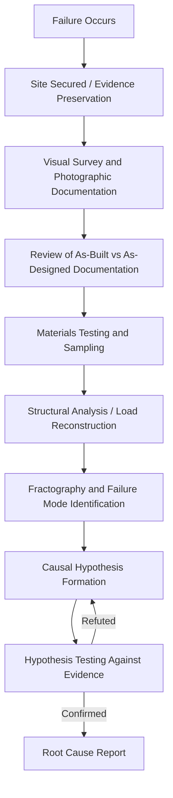

## Construction and Structural Failure Analysis


### Purpose and Scope

Structural failure analysis is the forensic engineering discipline applied to root cause analysis when a building, bridge, or other constructed structure fails to perform its intended load-bearing or safety function — ranging from serviceability issues (cracking, deflection) to catastrophic collapse. It combines physical evidence examination, materials science, structural mechanics, and construction-process review, and is distinguished from other RCA domains by its heavy reliance on **physical evidence that degrades or is altered by emergency response and cleanup**, making evidence preservation a first-order concern before any causal analysis begins.

### Failure Investigation Process



**Evidence preservation** is the critical first step and differs sharply from most other RCA domains: a collapsed structure is often under active public-safety pressure to be demolished or cleared, so investigators frequently work under legal/regulatory authority (e.g., NIST in the U.S. under the National Construction Safety Team Act) to secure debris fields, mark component locations before removal, and retain samples before evidence is lost.

### Distinguishing Design, Construction, and Material Causes

A defining analytical step in structural RCA is sorting the failure into one (or more) of three causal domains, because the corrective action and liability implications differ fundamentally:

| Domain | Description | Example |
| --- | --- | --- |
| Design Deficiency | The structure as designed could not carry the loads it was required to resist | Undersized connection detail; miscalculated load path |
| Construction Deficiency | The structure was not built as designed | Missing reinforcement, incorrect bolt torque, substituted material |
| Material Deficiency | The as-installed material did not meet specified properties | Concrete strength below specified $f'_c$, defective weld |
| Deterioration/Maintenance | The structure was adequate as built but degraded over its service life | Corrosion of reinforcement, fatigue cracking, undetected water intrusion |
| Overload/Change of Use | The structure was subjected to loads beyond its design basis | Occupancy change increasing live load without re-analysis |

Distinguishing these is analogous to distinguishing "safeguard not implemented" from "hazard not identified" in process safety RCA (see HAZOP/PSM relationship) — a design deficiency RCA finding implicates the engineering process and code compliance review, while a construction deficiency finding implicates inspection and quality control processes, even though the physical failure mode (e.g., a fractured connection) may look identical from photographs alone.

### Core Investigative Techniques

**Fractography** — Microscopic and macroscopic examination of fracture surfaces to determine failure mode: brittle fracture, ductile overload, fatigue (characterized by beach marks/striations), or stress corrosion cracking. Fractographic evidence is often the strongest physical indicator of *how* a member failed, feeding directly into the *why*.

**Load Path Reconstruction** — Structural analysis (often via finite element modeling) reconstructing the actual load path at time of failure, compared against the load path assumed in original design calculations. This identifies whether a load redistribution (e.g., following a local element failure) exceeded the capacity of adjacent members — the mechanism behind progressive/disproportionate collapse.

**As-Built vs. As-Designed Comparison** — Cross-referencing original structural drawings and specifications against field conditions (via surviving elements, photographs, or non-destructive testing) to detect deviations: missing reinforcement, undersized members, unauthorized modifications, or unauthorized load additions (e.g., added rooftop equipment not in original design load case).

**Materials Testing** — Compression testing of concrete cores, tensile testing of steel coupons, chemical composition analysis, and metallurgical examination (grain structure, weld penetration) to verify whether installed materials met specification.

**Timeline and Construction Sequence Review** — For failures occurring *during* construction (a distinct and statistically significant category), reconstruction of the construction sequence itself is central, since partially completed structures often lack the redundancy and lateral bracing present in the finished design — a large share of construction-phase collapses trace to temporary shoring, bracing, or formwork inadequacy rather than the permanent structural design.

### Example Causal Chain (5 Whys Applied to a Structural Failure)



```
Why 1: Why did the parking garage floor slab collapse?
→ A post-tensioned concrete beam failed in shear near a column support.

Why 2: Why did the beam fail in shear at that location?
→ Shear reinforcement (stirrups) at that location was significantly 
  fewer than specified on the structural drawings.

Why 3: Why was the shear reinforcement deficient?
→ Field placement did not match the drawings; the inspection that 
  should have caught this was not performed before the pour.

Why 4: Why was the pre-pour inspection not performed?
→ The special inspector's hold point was waived by the site 
  superintendent to maintain the pour schedule.

Why 5: Why was a mandatory inspection hold point able to be waived 
by site personnel?
→ The project's quality control plan did not clearly designate 
  special inspection hold points as non-waivable by construction 
  management, and lacked an independent verification step 
  before concrete placement.

Root Cause: The QC plan's inspection hold-point governance allowed
schedule pressure to override a code-mandated structural inspection,
with no independent check preventing the waiver.
```

This illustrates the common structural-RCA pattern where the proximate physical cause (insufficient shear reinforcement) is straightforward to determine via forensic examination, but the root cause requires tracing into project management and quality-control governance — structurally parallel to the MOC-classification root cause pattern seen in process safety RCA.

### Key Investigative Frameworks and Standards

- **NIST National Construction Safety Team (NCST) investigations** (U.S.) — federally authorized investigations of building failures involving significant loss of life, producing public technical reports with root cause findings and code-change recommendations (e.g., the WTC investigation, Champlain Towers South investigation).
- **ASCE/SEI forensic engineering guidance** — professional practice standards for structural failure investigation methodology.
- **Progressive collapse analysis frameworks** (e.g., GSA and DoD UFC guidelines) — used when a local failure's disproportionate spread to adjacent structure is itself part of the causal chain being analyzed.

### Key Points

- Evidence preservation is the first and most time-critical step; unlike software or clinical RCA, physical evidence in structural failures is actively at risk of destruction by demolition, cleanup, or weather before analysis can occur.
- The design/construction/material/deterioration/overload taxonomy is the primary sorting mechanism early in the investigation, because it determines which stakeholder's process is implicated and what documentation (drawings vs. inspection records vs. material certs vs. maintenance logs) is the relevant evidence trail.
- Fractography and materials testing establish the physical failure mode with high confidence; the organizational root cause (why the deficiency existed and went undetected) typically requires review of inspection, QC, and approval processes layered on top of the physical findings.
- Construction-phase failures (during erection, before the structure is complete) are a distinct investigative category, frequently rooted in temporary works (shoring, bracing, formwork) rather than the permanent design.
- Structural RCA findings frequently feed back into building code revisions, functioning as an industry-wide corrective action analogous to how aviation RCA findings feed airworthiness directives. [Inference — general pattern well-documented via post-failure code changes, e.g., post-Ronan Point progressive collapse provisions, but not true of every individual investigation]

### Related Topics

- Progressive/disproportionate collapse analysis and design provisions
- Forensic metallurgy and fractography techniques in detail
- Special inspection and quality control program design in construction
- NIST NCST investigation methodology and public report structure
- Post-failure building code evolution (case studies: Ronan Point, Hyatt Regency walkway, Champlain Towers South)