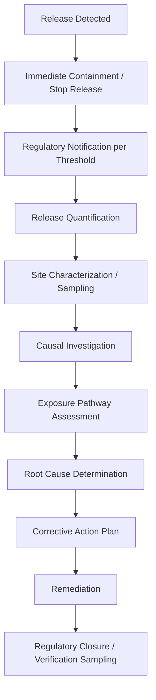

## Environmental Incident Investigation


### Purpose and Scope

Environmental incident investigation is the application of root cause analysis to unplanned releases of pollutants, contaminants, or hazardous substances into air, water, or soil — including chemical spills, wastewater discharge violations, air emission exceedances, and contamination events. It shares methodological DNA with process safety RCA (both frequently investigate the same physical events — a tank overflow is simultaneously a process safety incident and an environmental release) but is distinguished by its regulatory reporting structure, its emphasis on exposure pathway and receptor analysis, and its frequent requirement to quantify and remediate environmental harm as part of the corrective action, not just prevent recurrence.

### Regulatory Trigger Structure

Environmental RCA is heavily shaped by mandatory reporting thresholds, which differ from most other RCA domains in being triggered by *quantity released* rather than solely by harm severity:

| Regulatory Framework (US examples) | Trigger | Reporting Requirement |
| --- | --- | --- |
| CERCLA (Superfund) | Release of a hazardous substance above its Reportable Quantity (RQ) | Immediate notification to National Response Center |
| Clean Water Act (NPDES permits) | Discharge exceeding permitted effluent limits | Permit-specific reporting (often 24-hour + written follow-up) |
| Clean Air Act | Emission exceeding permit limits or an unplanned upset release | Excess emissions report to state/federal agency |
| RCRA | Hazardous waste release or mismanagement | Facility-specific reporting under waste permit |
| EPCRA Section 304 | Release of an Extremely Hazardous Substance above threshold | Immediate notification to LEPC/SERC |

Because reporting is quantity-triggered, environmental RCA intake often begins with a **release quantification** step even before causal investigation starts — how much of what substance, over what duration, into what medium — since this determines both the legal reporting obligation and the scope of required remediation, independent of whether the root cause is yet known.

### Investigation Process



**Site characterization** — Environmental sampling (soil, groundwater, air, surface water) to establish the extent of contamination, often continuing well after the causal investigation concludes, since environmental fate and transport (contaminant migration through soil or groundwater) can continue expanding the affected area for months after the release itself has stopped.

**Exposure pathway assessment** — A distinguishing analytical step not present in most other RCA domains: identifying the complete pathway from source to receptor (source → release mechanism → transport medium → exposure point → receptor, e.g., a nearby drinking water well or wetland). An environmental RCA is frequently incomplete without this pathway analysis, because the corrective action scope (containment vs. full remediation vs. monitoring only) depends on whether a complete exposure pathway to a sensitive receptor actually exists.

### Example Causal Chain



```
Why 1: Why did diesel fuel reach the storm drain?
→ Secondary containment berm around the above-ground storage tank
  overflowed during a fuel transfer.

Why 2: Why did the containment berm overflow?
→ The transfer was not attended continuously and continued after 
  the tank reached capacity.

Why 3: Why did the transfer continue unattended past capacity?
→ The high-level alarm on the tank was not functioning.

Why 4: Why was the high-level alarm not functioning?
→ It had failed six weeks earlier and was logged as a deficiency,
  but no compensating measure (continuous attendance, temporary
  gauge) was implemented while awaiting repair parts.

Why 5: Why was there no compensating measure required for a 
known-failed critical alarm?
→ The facility's mechanical integrity procedure does not require
  interim risk controls for safety-critical instrumentation 
  awaiting repair beyond a certain backlog age.

Root Cause: Mechanical integrity procedure lacks a mandatory
interim-control requirement for safety-critical alarms with 
extended repair backlogs.
```

This pattern parallels the MOC-classification root cause seen in process safety RCA (see PSM/HAZOP relation) — the proximate cause (overflow) is straightforward, but the root cause is a gap in a maintenance/mechanical-integrity governance procedure, illustrating how environmental incidents frequently share root causes with process safety events even when the regulatory reporting path differs entirely.

### Distinguishing Features from General Industrial RCA

**Key Points**

- **Quantity-based reporting triggers** mean the investigation's regulatory clock often starts before the root cause is known, unlike most RCA domains where investigation depth is severity-scored first.
- **Exposure pathway / receptor analysis** is a required analytical layer specific to environmental RCA — a spill fully contained on an impermeable pad with no pathway to soil, groundwater, or surface water has a fundamentally different remediation scope than an identical volume released to unlined ground near a wetland, even though the process-level root cause might be identical.
- **Remediation is often decoupled in timeline from root cause completion** — site cleanup, groundwater monitoring, and natural attenuation tracking frequently continue for months or years after the causal RCA report is finalized, whereas in most other RCA domains the corrective action and its verification close out on a comparable timescale to the investigation itself.
- **Multi-jurisdictional reporting** is common: a single release can simultaneously trigger federal (EPA), state environmental agency, and local (LEPC) notification obligations with different reporting formats and thresholds, requiring the RCA documentation to serve multiple regulatory audiences.
- Many environmental RCAs converge on the same underlying root-cause categories as process safety RCA (deferred maintenance, MOC gaps, inadequate alarm/instrumentation management) because the physical equipment (tanks, piping, containment systems) is frequently shared infrastructure — this is why mature process-safety-heavy industries (refining, chemical manufacturing) often run a single integrated incident investigation process covering both PSM Element 11 and environmental reporting obligations rather than maintaining two parallel RCA programs. [Inference — reflects common integrated-EHS program design in regulated industry, not a universal regulatory requirement]

### Corrective Action Considerations Specific to Environmental RCA

Unlike a typical CAPA table, environmental corrective actions often split into two distinct tracks that should be documented separately:

| Track | Purpose | Example |
| --- | --- | --- |
| Preventive (Recurrence) | Prevents the release mechanism from happening again | Repair/replace high-level alarm; revise mechanical integrity procedure |
| Remedial (Site) | Addresses contamination already present | Excavate contaminated soil; install groundwater monitoring wells; conduct natural attenuation study |

Regulatory closure of an environmental incident typically requires demonstrating both tracks are complete — a facility can implement excellent preventive corrective actions and still remain under a regulatory consent order until remedial verification sampling confirms contamination is below applicable cleanup standards.

### Related Topics

- CERCLA/Superfund reportable quantity determination and National Response Center notification process
- Fate and transport modeling for contaminant plume characterization
- Integrated EHS (Environment, Health, Safety) incident management program design
- Mechanical integrity programs and instrumentation criticality classification
- Relationship between environmental RCA and process safety RCA for shared infrastructure incidents