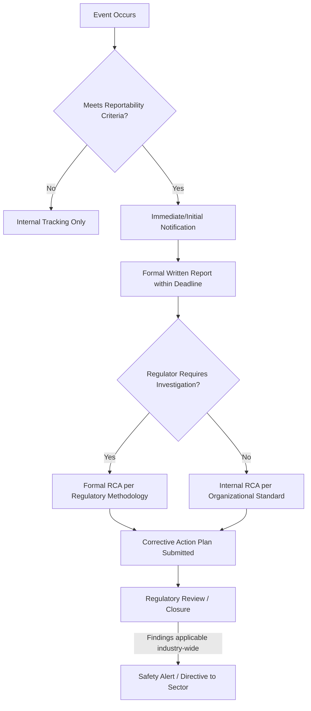

## Regulatory Reporting Requirements


### Purpose and Scope

Regulatory reporting requirements are the legally mandated obligations that determine when, how, and to whom an organization must disclose an incident, and they function as an upstream trigger for RCA across every high-hazard industry. Unlike internal quality or safety programs, regulatory reporting operates on statutory or regulatory deadlines with legal consequences for non-compliance, and often mandates not just notification but the format, timeline, and in some cases the methodology of the resulting investigation. Understanding this framework matters because it frequently determines RCA scope, urgency, and audience before any causal analysis begins.

### Common Structural Elements Across Regimes

Despite differing across industries and jurisdictions, regulatory reporting frameworks share a recurring structure:



**Reportability criteria** — Most frameworks define reportability by threshold: severity of harm, quantity released, dollar value of loss, or category of event (e.g., "any event involving loss of primary containment"). This threshold-based triggering is why regulatory reporting is often decoupled from an organization's own severity scoring — an event an internal safety program might classify as minor can still cross a regulatory reporting threshold.

**Notification timelines** — Nearly universally tiered: an immediate/emergency notification (often within hours, sometimes real-time for life-safety events) followed by a more detailed written report within a longer window (days to weeks), and in serious cases a final investigation report on an even longer timeline (often 30–90 days or more).

**Investigation methodology mandates** — Some regulators specify not just that an investigation occur, but its required rigor or format (e.g., PSM Element 11 in process safety, or NTSB-defined investigation authority in aviation), effectively standardizing RCA practice across an entire regulated industry.

### Representative Frameworks by Domain

| Domain | Framework | Trigger | Notification Window |
| --- | --- | --- | --- |
| Process Safety (US) | OSHA PSM (29 CFR 1910.119), EPA RMP | Incident meeting PSM Element 11 criteria; RMP-covered release | Internal investigation begins promptly; OSHA/EPA inspection-driven, not always time-bound at federal level |
| Environmental Release (US) | CERCLA, CWA, CAA, EPCRA | Release above Reportable Quantity or permit exceedance | Often immediate (e.g., as soon as practicable) + written follow-up |
| Aviation (US) | NTSB Part 830 | Accident or defined serious incident | Immediate notification; investigation authority assumed by NTSB |
| Nuclear (US) | 10 CFR 50.72 / 50.73 | Reactor trip, safety system actuation, other specified conditions | 1–8 hour notification depending on severity; Licensee Event Report (LER) within 60 days |
| Healthcare (US, accreditation) | Joint Commission Sentinel Event Policy | Sentinel event per definition | Root cause analysis expected within a defined window (historically ~45 days) of the organization becoming aware |
| Workplace Injury (US) | OSHA 29 CFR 1904 | Fatality, hospitalization, amputation, loss of eye | Fatality: 8 hours; in-patient hospitalization/amputation/eye loss: 24 hours |

Frameworks and specific timelines vary by jurisdiction and are subject to revision; the table above reflects commonly cited U.S. federal structures as reference points, not a substitute for checking current regulatory text applicable to a specific facility or event. [Unverified — verify current thresholds and deadlines against the governing regulation, as these are amended periodically]

### How Reporting Requirements Shape RCA Scope

**Key Points**

- **Reportability determines resourcing, not just disclosure.** A regulatory-reportable event typically receives a more rigorous investigation (dedicated team, formal methodology, management review) than an equivalent-severity event that falls below the reporting threshold, because the organization anticipates external scrutiny of the analysis itself.
- **Deadline pressure can conflict with investigative thoroughness.** Tight notification windows (hours to days) are appropriate for initial disclosure but can create pressure to finalize root cause findings prematurely; mature RCA programs explicitly separate the *initial notification* (what happened, immediate facts) from the *final investigation report* (root cause, corrective actions), allowing the causal analysis the time it needs without delaying required disclosure.
- **Some regulators mandate methodology, others mandate only outcome.** Nuclear (via NRC oversight of licensee CAP programs) and aviation (via NTSB's own direct investigative authority) exert more methodological control than, for example, general OSHA recordkeeping, which mandates *that* an investigation occurs implicitly through corrective action expectations but does not prescribe a specific causal analysis technique.
- **Regulatory findings frequently propagate beyond the reporting organization.** Aviation Airworthiness Directives, NRC Operating Experience (OE) notices, and OSHA Hazard Alerts are mechanisms by which one organization's RCA — once reported — becomes a corrective-action trigger for an entire industry, even for organizations that had no direct involvement in the original event.
- **Multi-jurisdictional overlap is common for complex incidents.** A single event (e.g., a chemical release causing a worker injury and an environmental discharge) can simultaneously trigger OSHA, EPA, and state-level reporting obligations with different forms, deadlines, and investigating authorities, requiring the RCA documentation to be structured so relevant sections can be extracted or adapted per regulator rather than requiring entirely separate investigations.

### Interaction with Internal RCA Programs

Organizations operating under one or more of these frameworks typically design their internal RCA/CAP intake process (see recurring RCA documentation templates) to route by regulatory applicability at the earliest triage step — often as a required field ("Regulatory Reporting Required: Y/N, Framework: ___, Deadline: ___") in the initial incident report, ensuring the notification clock and the causal investigation proceed in parallel rather than the latter blocking the former.



```
Intake Field Example:
  regulatory_flags:
    - framework: "OSHA 1904"
      reportable: true
      notification_deadline: "2026-09-25T08:00:00Z"
      status: "notified"
    - framework: "State Environmental Agency"
      reportable: true
      notification_deadline: "2026-09-24T20:00:00Z"
      status: "pending"
```

### Common Failure Modes

- **Missed reportability determination**: Treating an event as internal-only when it in fact crosses a regulatory threshold, often due to unclear internal ownership of the reportability screening step.
- **Notification/investigation conflation**: Delaying required immediate notification while waiting for root cause to be determined, when the two are independently timed obligations.
- **Methodology mismatch**: Using an internal RCA technique that doesn't produce the specific data elements a regulator requires (e.g., a regulator-specified causal taxonomy), requiring costly rework of an otherwise-complete investigation.
- **Cross-jurisdictional inconsistency**: Submitting differing causal narratives to different regulators for the same event due to uncoordinated report drafting, which can itself become a credibility issue during regulatory review.

### Related Topics

- Airworthiness Directives and how aviation RCA findings become industry-wide mandates
- INPO Operating Experience (OE) program as a nuclear-industry cross-fleet reporting mechanism
- OSHA recordkeeping (1904) vs. PSM (1910.119) reporting obligations compared
- Designing a regulatory-flag intake field for a unified incident/RCA management system
- Legal privilege considerations for RCA reports under frameworks like PSQIA (healthcare) or attorney-client work product