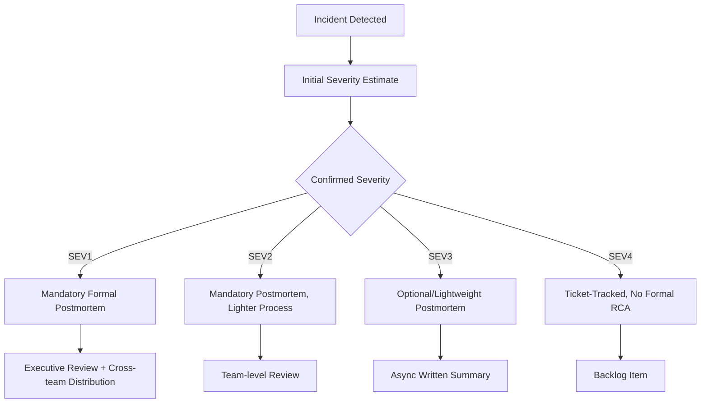

## Incident Severity Classification and Timelines

### Purpose and Scope

Incident severity classification is the triage mechanism that determines how much RCA rigor, response urgency, and stakeholder visibility a software/IT incident receives. It functions analogously to significance screening in nuclear CAP programs and harm-scale scoring in patient safety reporting — a structured mapping from observed impact to a required depth of investigation, ensuring that a minor degraded-performance blip and a full outage do not consume the same investigative resources, while still guaranteeing that severe incidents receive mandatory, timely, rigorous analysis.

### Severity Level Structure

Most SRE and IT organizations use a numbered SEV scale (commonly SEV1 through SEV4 or SEV5), though naming conventions vary (P0–P4, Critical/High/Medium/Low). A representative structure:

| Level | Typical Definition | Example | Response Posture |
| --- | --- | --- | --- |
| SEV1 | Complete outage or critical data loss/security breach affecting all or most users | Core API fully unavailable; payment processing down | All-hands, executive notification, war room |
| SEV2 | Significant degradation affecting a large subset of users or a critical feature | Checkout flow failing for 30% of users | On-call + relevant team, active incident channel |
| SEV3 | Limited impact, workaround available, or affecting a small user subset | Non-critical feature erroring for a specific browser | On-call engineer, standard priority |
| SEV4 | Minor issue, cosmetic, or internal-only impact | Logging delay with no user-facing effect | Backlog-tracked, no active incident response |

Severity is typically assigned at two points: an **initial estimate** at detection (often automated, based on alert thresholds or monitoring signal) and a **confirmed/final severity** after impact is fully understood, since initial signals (e.g., an elevated error rate) can both understate (a slow-burning data corruption issue) or overstate (a false alarm from a monitoring misconfiguration) true impact.

### Severity Determination Criteria

Mature classification schemes score severity along multiple axes rather than a single "how bad does this feel" judgment, to reduce inconsistency across on-call responders:

**Key Points**

- **User impact scope**: percentage of users affected, or whether impact is total vs. partial functionality loss.
- **Business impact**: revenue-generating paths (checkout, sign-up) frequently carry an automatic severity floor regardless of user-count percentage, because a small-percentage failure on a revenue-critical path can matter more than a larger-percentage failure on a non-critical one.
- **Data integrity**: any suspected data loss or corruption typically triggers a severity floor (often SEV1/SEV2 regardless of user count) because remediation options narrow sharply once data is lost versus merely unavailable.
- **Security implications**: suspected unauthorized access or data exposure is commonly treated as an automatic top-severity classification independent of other criteria, often triggering a parallel security incident response process alongside the standard severity-based one.
- **Duration and trend**: an issue that is worsening (error rate climbing) is frequently up-triaged relative to an equivalent-magnitude issue that is stable or already recovering.

### Severity-to-RCA-Rigor Mapping



This tiered mapping mirrors the apparent-cause-vs-root-cause-evaluation split used in nuclear CAP programs and the apparent-cause/formal-RCA distinction across most mature RCA-adjacent programs: not every incident warrants a full multi-person facilitated postmortem, but severity thresholds should be defined *before* an incident occurs, not negotiated case-by-case, to prevent under-investigation of embarrassing or organizationally inconvenient incidents.

### Timeline Requirements by Severity

Timelines in this context serve two distinct functions that are often conflated: **response timelines** (how fast must the team act during the incident) and **investigation timelines** (how fast must the RCA/postmortem be completed after resolution). Representative structure:

| Severity | Acknowledgment SLA | Resolution Target | Postmortem Due |
| --- | --- | --- | --- |
| SEV1 | Minutes (e.g., 5–15 min page response) | Hours, actively tracked | Within days (commonly 3–5 business days) |
| SEV2 | Tens of minutes | Same business day where feasible | Within a week |
| SEV3 | Hours | Days | Within sprint/two weeks, or optional |
| SEV4 | Best-effort | Backlog-prioritized | Not typically required |

Specific SLA numbers vary substantially by organization, industry, and contractual obligations (e.g., customer SLAs may impose external deadlines independent of internal postmortem timelines); the table reflects commonly seen patterns rather than a fixed standard. [Unverified — no universal standard exists across the software industry; organizations set these thresholds independently based on risk tolerance and contractual commitments]

### Timeline Documentation Within the Postmortem

Separate from the *response* timeline SLAs above, the postmortem document itself contains a **detection-to-resolution timeline** as a core RCA artifact (consistent with the general RCA documentation template structure), typically annotated with a sub-classification of each phase:



```
14:02  Detection    — Alert fired (automated)
14:05  Escalation   — Paged on-call engineer
14:09  Triage       — Severity confirmed as SEV1
14:18  Diagnosis    — Root service identified
14:35  Mitigation   — Rollback initiated
14:47  Resolution   — Error rate returned to baseline
16:00  Postmortem scheduling — Incident commander assigns owner
```

**Time-to-Detect (TTD)**, **Time-to-Acknowledge (TTA)**, **Time-to-Mitigate (TTM)**, and **Time-to-Resolve (TTR)** are commonly extracted as standard metrics from this timeline, enabling trend analysis across incidents (e.g., "TTD has increased 20% quarter-over-quarter," pointing toward a monitoring/alerting gap as a candidate systemic issue) — this is the software-RCA analog to the aggregate CAPA-closure-rate and recurrence-rate metrics used in mature RCA programs generally.

### Severity Reclassification and Its RCA Implications

A distinct governance question: what happens when confirmed severity differs from initial classification, or from post-incident review? Two directions matter for RCA process design:

- **Downgrade** (initially classified SEV1, later confirmed SEV3 impact) — some organizations still require the originally-scheduled rigorous postmortem to complete, on the reasoning that the detection/triage process that over-classified it is itself worth understanding, while others allow the postmortem to be downgraded to match confirmed impact.
- **Upgrade** (initially SEV3, escalated to SEV1 after broader impact discovered) — this pattern is itself frequently a root-cause-relevant finding: an upgrade path often indicates a **monitoring blind spot** (the initial signal understated true impact) that becomes a corrective action target in its own right, independent of the original incident's technical root cause.

### Key Points

- Severity classification exists primarily to allocate RCA rigor and urgency proportionally, mirroring the same triage function found in nuclear CAP significance screening and healthcare sentinel-event thresholds.
- Multi-axis scoring criteria (user impact, business impact, data integrity, security, trend direction) produce more consistent classification across different on-call responders than a single holistic severity judgment.
- Response timelines (detection, acknowledgment, mitigation) and investigation timelines (postmortem due date) are distinct governance mechanisms and should be tracked and reported separately.
- Severity reclassification events (especially upgrades) are frequently themselves diagnostic of a monitoring or alerting gap and warrant inclusion as a contributing factor in the resulting postmortem, not just a metadata correction.
- Standard timeline metrics (TTD, TTA, TTM, TTR) extracted consistently across incidents enable trend analysis that a single incident's RCA cannot surface alone — this is the software-RCA parallel to cross-fleet OE trending in nuclear and cross-institutional benchmarking in healthcare reporting systems.

### Related Topics

- Incident commander role and structured incident response protocols
- On-call escalation policy design and paging thresholds
- Blameless postmortem culture and its relationship to accurate severity self-reporting
- Error budgets and SLO-driven incident prioritization (SRE practice)
- Monitoring and alerting gap analysis as a recurring RCA corrective-action category