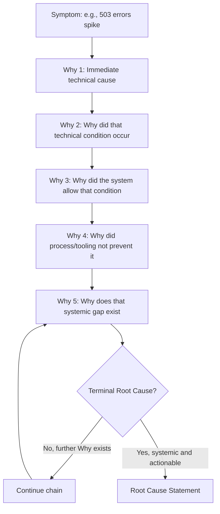

## Five Whys Applied to Production Incidents

### Purpose and Scope

The 5 Whys technique, when applied to software production incidents, provides a lightweight causal-chain method for tracing a symptom (an outage, error spike, or data issue) back through successive layers of causation to a systemic root cause. In an SRE/IT context, it is typically embedded within a blameless postmortem process and severity-scaled per the organization's incident classification scheme (a SEV1 incident's 5 Whys is usually facilitated and reviewed; a SEV4's, if performed at all, is often self-conducted by the resolving engineer).

### Method Structure Applied to Software Systems

Unlike physical-system domains (structural, process safety) where each "Why" often requires new physical evidence collection, software incidents have an advantage and a hazard specific to the domain: causal evidence (logs, metrics, traces, deploy history, config diffs) is usually already captured and queryable, but its *volume* creates a risk of cherry-picking a plausible-looking correlation rather than a verified causal link. Each Why in a software RCA should be paired with a specific evidence artifact, not asserted from memory or intuition.



### Worked Example: Full Chain with Evidence



```
Symptom: 15-minute spike in HTTP 500 errors on the checkout service,
affecting ~12% of checkout attempts.

Why 1: Why did checkout requests return 500?
→ The checkout service's database connection pool was exhausted.
   Evidence: connection-pool-saturation metric, Grafana panel 
   "checkout-db-pool", timestamps 14:02–14:17.

Why 2: Why was the connection pool exhausted?
→ A newly deployed feature flag enabled a code path that opened 
   a connection per request without releasing it on early return.
   Evidence: deploy log entry #4471; code diff PR #8823, lines 
   142–158 showing missing `finally` block.

Why 3: Why did that code path reach production without the 
connection-leak being caught?
→ The test suite covering this endpoint does not include a 
   load test or connection-pool assertion; only functional 
   correctness is tested for that endpoint.
   Evidence: test coverage report, checkout-service, endpoint 
   /v1/checkout — 0 load/soak tests present.

Why 4: Why does this endpoint's test suite lack load/pool 
assertions when other critical endpoints have them?
→ Load testing requirements were added to the team's testing 
  standard after this endpoint was originally built; the standard 
  was not retroactively applied to pre-existing endpoints.
  Evidence: testing-standard-v3.md, dated 8 months after 
  checkout-service's original implementation; no backfill 
  ticket exists in the tracker.

Why 5: Why is there no mechanism to retroactively apply updated 
testing standards to pre-existing services?
→ The testing standard's rollout process only mandates 
  compliance for new services and new endpoints; there is no 
  periodic audit or backlog process for existing services 
  against updated standards.

Root Cause: The organization's testing-standard rollout process 
has no mechanism to retroactively audit and backfill pre-existing 
services against newly introduced testing requirements, allowing 
standards drift between old and new code.
```

Note the evidence citation at each step — this is what distinguishes a defensible software RCA from a plausible-sounding narrative; each Why should be falsifiable against a specific log line, metric, diff, or document, not merely asserted as the most likely explanation.

### Common Failure Modes Specific to Software RCA

**Key Points**

- **Stopping at the first plausible technical cause.** The most common software 5 Whys failure is terminating at Why 1 or Why 2 — "the connection pool was exhausted because of a code bug" — which produces a corrective action of "fix the bug" without addressing why the bug reached production undetected. A software RCA that terminates before reaching a process, tooling, or testing-standard gap has usually stopped too early.
- **Single-cause bias in distributed systems.** Production incidents in microservice or distributed architectures frequently involve **multiple co-occurring conditions** (a traffic spike + a recently deployed change + a degraded dependency) rather than a single linear chain; forcing a strict single-path 5 Whys onto a multi-factor incident can produce an artificially narrow root cause. Many SRE teams use a **contributing factors** list alongside the primary Why chain (see blameless postmortem culture) specifically to avoid this distortion.
- **Blaming the deploy instead of the pipeline.** "Why did the bug reach production? Because it was deployed" is a non-answer that restates the symptom; the useful Why targets *why the deployment pipeline's safeguards (tests, canary, code review) did not catch it*, not the deploy event itself.
- **Confusing correlation with causation in metrics-heavy environments.** Because software observability tooling makes it easy to overlay dozens of metrics on a timeline, it's common to identify a coincidental anomaly (e.g., a garbage collection pause at the same timestamp) and mistake it for a causal link without verifying the mechanism connecting the two.
- **Skipping the "why wasn't this caught by monitoring/alerting sooner" branch.** A frequently underexplored Why in software RCA is not just why the fault occurred but why detection took as long as it did — this branch often surfaces a distinct, equally important root cause about observability coverage, separate from the fault-introduction root cause.

### When 5 Whys Is Insufficient for Software Incidents

The linear 5 Whys format is best suited to incidents with a genuinely linear causal chain. For more complex production incidents, software RCA practice commonly supplements or replaces it with:

- **Fishbone/Ishikawa diagrams** — when multiple independent contributing categories (code, infrastructure, process, people, monitoring) need to be surveyed before narrowing to a root cause, rather than assumed as a single chain from the start.
- **Fault tree analysis** — when an incident required multiple conditions to coincide (AND logic) rather than a single sequential path, common in cascading-failure or multi-service outages.
- **Contributing factors lists** — the SRE-standard approach (see blameless postmortem culture) of documenting several parallel factors rather than forcing a single linear chain, used when the incident's causal structure is genuinely multi-causal rather than sequential.

### Facilitation Considerations for Production Incident 5 Whys

- **Conduct after mitigation, not during.** Causal analysis competes for cognitive bandwidth with active incident response; the 5 Whys exercise is a postmortem-phase activity, not a during-incident activity, even though initial hypothesis-forming during triage often seeds the eventual chain.
- **Include people from adjacent teams, not just the resolving engineer.** A single engineer's 5 Whys risks anchoring on the part of the system they know best (frequently the proximate technical cause) rather than the process or organizational layers further up the chain, which may require input from testing, release engineering, or platform teams to identify accurately.
- **Timebox the exercise and allow "insufficient evidence" as a valid stopping point.** Not every incident's causal chain can be fully reconstructed from available logs and metrics; a mature RCA process distinguishes a confirmed root cause from a best-available hypothesis when evidence is incomplete, and may include a corrective action to improve observability specifically to make future incidents in that area more analyzable.

### Related Topics

- Blameless postmortem culture and contributing-factors documentation models
- Fishbone (Ishikawa) diagrams for multi-category production incident analysis
- Fault tree analysis for cascading/multi-service outage causation
- Observability and monitoring gap analysis as a recurring software RCA corrective-action category
- Incident severity classification and how it scales 5 Whys rigor and facilitation requirements