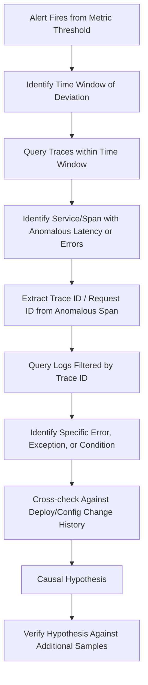

## Correlating Logs, Metrics, and Traces for Causation

### Purpose and Scope

Correlating logs, metrics, and traces is the observability-layer technique that underpins evidence-based root cause analysis in distributed software systems. Each telemetry type answers a different investigative question — metrics show *when and how much* something deviated, traces show *where in a request's path* time or errors accumulated, and logs show *what specifically happened* at a given point — and RCA in production systems depends on moving between all three to build a causal chain that is falsifiable, not merely plausible. This is the concrete evidentiary practice referenced generally in "Five Whys applied to production incidents": each Why in that technique should resolve to a specific artifact from one of these three telemetry sources.

### The Three Pillars and Their Causal Role

| Telemetry Type | Answers | Granularity | Typical Role in RCA |
| --- | --- | --- | --- |
| Metrics | When did behavior deviate, and by how much? | Aggregated, time-series | Detection and timeline anchoring |
| Traces | Where in a distributed request path did the problem occur? | Per-request, cross-service | Localization to a specific service/hop |
| Logs | What specifically happened at that point? | Per-event, high detail | Root-cause confirmation and evidence |

None of the three alone typically supports a defensible root cause: metrics alone show *that* p99 latency spiked but not *why*; traces alone show *where* time was spent but not the specific triggering condition; logs alone, without metrics or traces to narrow the search space, are often too voluminous to search effectively during an active incident.

### Correlation Workflow



**Step 1 — Metric-driven time window anchoring.** The investigation typically begins from an alert or dashboard anomaly (e.g., error rate, latency percentile, saturation metric crossing a threshold), which establishes the precise time boundary for subsequent trace and log queries — searching logs or traces without a narrow time window in a high-volume production system is rarely tractable.

**Step 2 — Trace-driven localization.** Within the anomalous window, distributed traces (built on span data propagated via a trace context, commonly following the W3C Trace Context standard or vendor-specific propagation headers) show which service, database call, or downstream dependency accounted for the anomalous latency or error within a multi-hop request. This step converts "the checkout service is slow" into "the checkout service's call to the inventory service's `/reserve` endpoint is slow."

**Step 3 — Log-driven confirmation.** Using the trace ID (or request ID) identified in the anomalous span, logs are filtered to the exact request(s) involved, surfacing the specific error message, stack trace, or state transition that traces alone cannot show — for example, a specific exception type, a retry exhaustion message, or a particular input value that triggered the fault.

**Step 4 — Cross-referencing change history.** The timestamp established in step 1, combined with the specific component identified in steps 2–3, is checked against deploy logs, feature flag change logs, and infrastructure/config change records for that component — this is frequently where the causal chain connects a technical symptom to a specific human or automated change (see the deploy/config-change pattern common in the 5 Whys examples for production incidents).

### Correlation Keys: What Ties the Three Together

Effective correlation depends on **shared identifiers** propagated consistently across all three telemetry types:

- **Trace ID / Span ID** — propagated through service-to-service calls (commonly via W3C Trace Context `traceparent` header or equivalent), allowing a single logical request to be reconstructed across service boundaries in both traces and, if logs are trace-ID-tagged, in logs as well.
- **Request ID / Correlation ID** — an application-level identifier, often generated at the edge (load balancer or API gateway) and propagated through logs even in systems without full distributed tracing instrumentation.
- **Deploy/Release ID or Git SHA** — tagging metrics and logs with the active deploy version enables a direct query of "show me error rate segmented by deploy version," often the fastest way to confirm or rule out a recent deploy as the causal trigger.
- **Host/Pod/Container identifiers** — useful for localizing infrastructure-level causes (a specific bad node, a resource-constrained pod) that wouldn't be visible from application-level trace/log correlation alone.

A system where logs are not trace-ID-tagged, or where trace propagation breaks at certain service boundaries (a common issue with async/queue-based communication, where trace context is not always propagated through message brokers by default), significantly degrades the ability to perform step 3 above — this is itself a common RCA-relevant systemic gap: an incident that "took too long to diagnose" frequently root-causes to a correlation-key propagation gap in the observability instrumentation, not to the underlying fault itself.

### Worked Example



```
Metric observation: p99 latency for /v1/checkout jumped from 
200ms to 4.2s at 14:02 UTC.

Trace query (14:00–14:05, service=checkout, p99 filter):
  → Anomalous span identified: checkout-service → 
    inventory-service gRPC call, span duration 3.9s 
    (baseline: 40ms)
  → trace_id: 7f3a9b2c-...

Log query (trace_id=7f3a9b2c-...):
  → inventory-service log: "WARN: connection pool wait 
    timeout after 3.9s, pool size=10, active=10, queued=47"

Cross-reference deploy history (14:00–14:05, service=inventory):
  → Deploy at 13:58: config change reducing inventory-service 
    connection pool size from 50 to 10 (PR #9012, 
    "right-sizing pool config")

Causal hypothesis: The 13:58 config deploy reduced 
inventory-service's DB connection pool size below the level 
needed for current traffic volume, causing request queuing 
and latency propagation to checkout-service.

Verification: Rollback of PR #9012 at 14:15 correlated with 
p99 latency return to baseline by 14:17 — confirms hypothesis 
via before/after comparison.
```

This example demonstrates all three telemetry types and the change-history cross-reference converging on a single, evidence-backed causal chain — each claim in the hypothesis traces to a specific artifact rather than to inference alone.

### Key Points

- **Metrics anchor the time window; traces localize the component; logs confirm the specific mechanism.** Treating this as a fixed sequence (rather than jumping straight to log search across an entire system) is what makes correlation tractable at production scale.
- **Correlation depends on propagated identifiers being consistently present across all telemetry types** — trace ID tagging in logs, and trace context propagation across async boundaries (queues, event buses), are common points of failure that, when absent, become their own RCA-relevant systemic finding.
- **Change-history cross-referencing (deploys, config, feature flags) is frequently the step that converts a technical symptom into an actionable root cause**, since the "what changed at this specific timestamp" question is often more diagnostic than deep analysis of the failure mechanism itself.
- **Verification via a before/after signal (e.g., rollback correlating with recovery) strengthens a causal hypothesis** beyond correlation alone, though it does not by itself constitute formal experimental proof — confounding factors (e.g., traffic naturally declining at the same time) should be considered and, where feasible, ruled out.
- **Sampling in high-volume tracing systems can create blind spots.** Many distributed tracing systems sample only a fraction of requests (head-based or tail-based sampling) to manage cost/volume; an RCA that fails to find a relevant trace should confirm whether the specific failing request class was actually sampled before concluding traces don't show the issue. [Unverified — sampling configuration is deployment-specific; behavior described here is a common architecture pattern, not universal to all tracing systems]

### Related Topics

- Distributed tracing standards (W3C Trace Context, OpenTelemetry propagation)
- Structured logging design and correlation-ID injection patterns
- Deploy/change-history tagging as an observability practice for RCA
- Sampling strategies in distributed tracing and their impact on incident investigability
- Five Whys applied to production incidents and its dependency on telemetry correlation