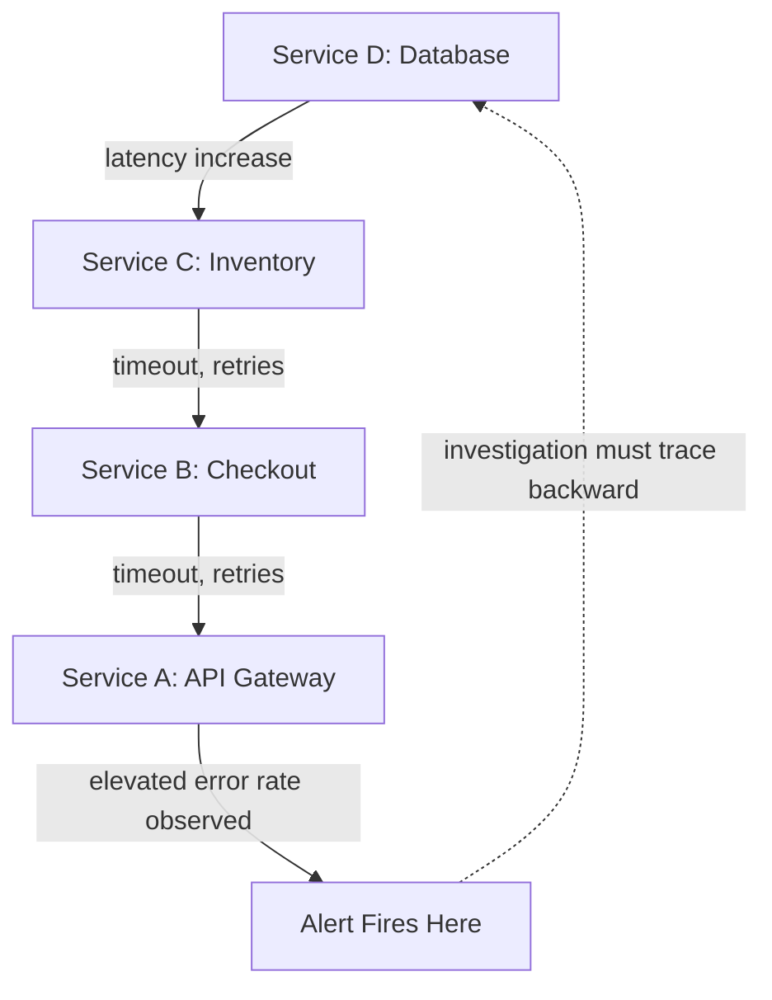

## Root Cause Analysis in Distributed and Microservice Systems


### Purpose and Scope

RCA in distributed and microservice architectures addresses a class of causal analysis problem distinct from monolithic systems: failures propagate across service boundaries, ownership of the causal chain is often split across multiple independent teams, and the same observable symptom can arise from combinatorially many possible upstream causes. This section builds on the correlation techniques covered in "Correlating logs, metrics, and traces for causation" and the linear chain method in "Five Whys applied to production incidents," addressing specifically what changes when the system under investigation is not one service but a graph of interdependent ones.

### Why Distributed Systems Complicate Causal Analysis

**Key Points**

- **Failure propagation obscures the origin.** A single root-cause failure in one service frequently manifests as symptoms in many unrelated-looking services downstream, so the service where an alert first fires is often not the service where the fault originated — this is the distributed-systems analog of the "don't stop at the first plausible cause" pattern from single-service 5 Whys.
- **Partial failure and degraded states are common, not exceptional.** Unlike a monolith that is typically either up or down, a microservice system can be in a state where 80% of services are healthy while a critical dependency is degraded, producing symptoms that are inconsistent across requests depending on which service instances or shards a given request touched — this variability itself is diagnostic information, not just noise.
- **Ownership fragmentation slows causal reconstruction.** No single team typically has full visibility into every service in a request's path; RCA facilitation in distributed systems frequently requires assembling participants from multiple teams specifically because the causal chain crosses ownership boundaries, unlike a single-team incident where one engineer may hold sufficient context alone.
- **Retries and timeouts can convert a small fault into a large one.** A common distributed-systems failure amplification pattern: a slow downstream dependency causes upstream timeouts, which trigger retries, which increase load on the already-struggling downstream service, worsening the original degradation — the root cause here is often not the initial slowness but the retry/backoff configuration that turned a contained slowdown into a cascading failure.

### Common Distributed Failure Archetypes

| Archetype | Mechanism | Typical Root Cause Category |
| --- | --- | --- |
| Cascading Failure | Failure in one service propagates and amplifies through retries/timeouts to dependent services | Retry storm, missing circuit breaker, inadequate backpressure |
| Thundering Herd | Many clients simultaneously retry or reconnect after a shared dependency recovers | Lack of jittered backoff, cache stampede on expiry |
| Split Brain | Nodes in a distributed system disagree on state due to a partition | Consensus protocol misconfiguration, network partition handling gap |
| Metastable Failure | System remains in a degraded state even after the original trigger is resolved, due to a self-sustaining feedback loop | Load-dependent feedback (e.g., retries, cache misses) that doesn't clear without intervention |
| Silent Partial Failure | A subset of requests fail while aggregate metrics appear healthy | Insufficient metric granularity (aggregation hides a per-shard or per-tenant issue) |

**Metastable failures** are a specific and frequently under-recognized archetype: the system does not recover automatically even after the triggering condition is removed, because a feedback loop (e.g., retry traffic, warmed-cache dependency, connection pool exhaustion) sustains the degraded state independently. RCA for metastable failures must identify both the *trigger* (what pushed the system into the degraded state) and the *sustaining mechanism* (what kept it there after the trigger cleared) as two distinct causal findings, since corrective actions differ: fixing the trigger prevents recurrence of the initial push, while fixing the sustaining mechanism prevents the same trigger class from causing prolonged outages in the future.

### Causal Graph Reconstruction



A defining structural task in distributed RCA is reconstructing the **causal graph** backward from the point of detection (often the edge or gateway layer, where user-facing symptoms surface) to the actual origin point, which may be several hops removed and owned by a different team than the one that received the initial page. This backward-tracing task is precisely what distributed tracing (see telemetry correlation) is designed to support — without consistent trace propagation across every hop, this reconstruction relies on manual cross-team log comparison, which is substantially slower and more error-prone during an active incident.

### Dependency and Blast-Radius Analysis

Beyond the immediate causal chain, distributed RCA frequently requires a **blast-radius** or **extent-of-condition**-style analysis (conceptually parallel to the Extent of Condition review mandated in nuclear RCA): given that Service X failed in this specific way, what other services depend on Service X, and were they also affected even if no alert fired for them? This is particularly important for shared infrastructure (a common database, a shared caching layer, an internal auth service) where a single root cause can have a much wider blast radius than the incident that happened to trigger the investigation.



```
Example blast-radius finding:
Root cause: shared auth-service connection pool exhaustion.
Direct symptom: checkout-service 503s (paged, investigated).
Additional affected (found via dependency graph review, 
not initially paged): 
  - notification-service: silently failed to send 8% of 
    emails during the window (no alert configured)
  - admin-dashboard: elevated login failures, dismissed by 
    users as unrelated, not reported
```

This pattern — where the paged incident is only the most visible symptom of a wider-reaching root cause — is common enough in distributed systems that mature RCA processes include an explicit "what else depends on the failed component" review step before closing the investigation, rather than considering the RCA complete once the originally paged symptom is explained.

### Corrective Action Patterns Specific to Distributed Systems

Beyond generic corrective actions (fix the bug, add a test), distributed-system RCAs frequently converge on architecture-level patterns as root-cause remediation:

- **Circuit breakers** — preventing a struggling downstream dependency from being hammered by continued upstream requests, addressing cascading-failure archetypes.
- **Bulkheads / resource isolation** — partitioning connection pools, thread pools, or capacity per-dependency so that one slow dependency cannot exhaust resources needed for calls to healthy dependencies.
- **Jittered exponential backoff** — addressing thundering-herd archetypes where synchronized retries amplify load on a recovering dependency.
- **Load shedding and backpressure** — allowing a service to explicitly reject excess load rather than degrading uniformly for all requests, often surfaced as a corrective action after a metastable-failure RCA.
- **Per-dependency and per-shard metric granularity** — addressing silent-partial-failure archetypes where aggregate dashboards masked a real, bounded-but-severe sub-population failure.

### Key Points

- The point where an alert fires is frequently not the point where the root cause originated; distributed RCA requires deliberate backward causal-graph reconstruction rather than assuming the paged service is the faulty one.
- Failure amplification mechanisms (retries, timeouts, thundering herd) can themselves be root causes independent of the original triggering fault — a well-designed distributed RCA distinguishes "what started this" from "what made this so much worse than it needed to be."
- Metastable failures require identifying both a trigger and a separate sustaining mechanism, since these two findings lead to different corrective actions.
- Blast-radius / extent-of-condition review — checking what else depended on the failed component, beyond what was paged — is a distinct investigative step that a single-service-focused 5 Whys will not surface on its own.
- Corrective actions in distributed RCA frequently target systemic resilience patterns (circuit breakers, bulkheads, backpressure) rather than single-service bug fixes, reflecting that the root cause is often the *absence of a resilience pattern* rather than a specific code defect.

### Related Topics

- Circuit breaker and bulkhead resilience patterns in detail
- Metastable failure theory and self-sustaining feedback loops in distributed systems
- Dependency graph mapping and service ownership documentation
- Chaos engineering as a proactive counterpart to reactive distributed RCA
- Correlating logs, metrics, and traces for causation (telemetry foundation for distributed causal-graph reconstruction)