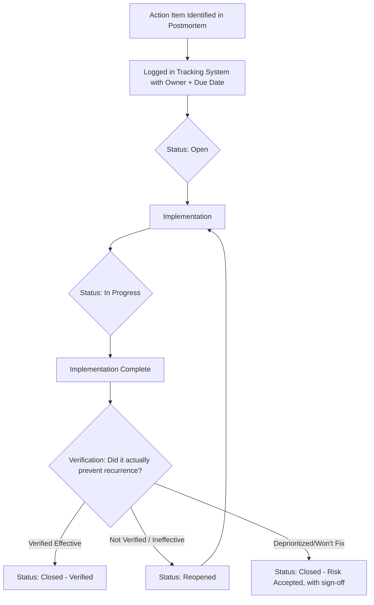

## Preventing Repeat Incidents Through Action Tracking

### Purpose and Scope

Action tracking is the closing phase of the RCA lifecycle that converts a completed root cause analysis into verified systemic change — without it, even a technically excellent postmortem produces no durable improvement, since the causal finding alone does not prevent recurrence; only the implemented and verified corrective action does. This section addresses the specific mechanics of tracking, verifying, and measuring the effectiveness of corrective actions in software/IT contexts, extending the CAPA tracking concept introduced in recurring RCA documentation templates and the writing-quality considerations in effective postmortem documents.

### The Action Tracking Lifecycle



The critical, frequently-skipped step in this lifecycle is **G — verification**. Many organizations track action items only through "implemented: yes/no" without a subsequent check that the implementation actually addresses the root cause it was meant to fix; an action item marked "done" because a PR merged is not equivalent to an action item confirmed to have closed the systemic gap the RCA identified.

### Distinguishing Action Item Types

| Type | Definition | Verification Method |
| --- | --- | --- |
| Remediation | Fixes the specific instance of the problem | Confirm the specific fault no longer occurs (e.g., bug fixed, test passing) |
| Corrective | Addresses the immediate root cause to prevent the same failure mode | Targeted test, chaos experiment, or monitored period without recurrence |
| Preventive | Addresses the broader systemic gap that allowed the root cause to exist undetected | Process audit, coverage metric, or organizational check (e.g., "testing standard now applies retroactively") |

This three-tier distinction (analogous to the corrective/preventive split used in environmental RCA and the CAPA structure in general RCA templates) matters because **preventive actions are the hardest to verify and the most commonly left unverified** — "fixed this specific bug" is trivially checkable; "our testing standards now apply to legacy code" requires an organizational or process-level check, not just a code check, and is often the action item that actually prevents the *next* incident rather than just closing out this one.

### Tracking System Design

**Key Points**

- **Action items belong in the same system as other engineering work, not a separate postmortem-only tracker.** Action items logged only within the postmortem document itself (rather than in the team's standard issue tracker, prioritized alongside other work) have a substantially higher rate of going stale, because they compete for attention outside the team's normal planning process. [Inference — widely observed pattern in SRE practice literature, presented as a common risk rather than a universal outcome]
- **Every action item needs a single accountable owner and a date, not a team.** "Platform team will address" without a named individual and deadline is a common pattern that correlates with items remaining open indefinitely; ownership diffusion is one of the most frequently cited reasons corrective actions stall.
- **Link the tracked item back to the specific postmortem and root cause it addresses.** This traceability (an explicit reference field, not just a shared ticket queue) is what enables later analysis of "which root causes are we systematically failing to remediate" — without the link, aggregate reporting on action-item effectiveness by root-cause category is not possible.
- **Distinguish "closed" from "verified effective."** A tracking system that only supports a binary open/closed state cannot represent the important intermediate finding that an action was implemented but did not actually prevent the recurrence it targeted — a three-state (or more) status model, as in the lifecycle diagram above, is necessary to capture this.
- **Explicit risk-acceptance sign-off for deprioritized items.** When an action item is deliberately not pursued (cost, complexity, or low residual risk after other mitigations), a documented sign-off from an accountable owner — rather than the item silently going stale — preserves the organizational decision-making trail and prevents the same risk-acceptance question from being re-litigated from scratch after a future recurrence.

### Aggregate Metrics for Action-Tracking Health

Beyond tracking individual items, mature RCA programs monitor action-tracking effectiveness in aggregate, paralleling the CAPA closure-rate and recurrence-rate metrics referenced in the general RCA documentation template and the TTD/TTA/TTM/TTR trend metrics used in incident severity tracking:

| Metric | What It Reveals |
| --- | --- |
| Action Item Closure Rate | What fraction of committed corrective actions are actually completed within their due date |
| Time-to-Close (from postmortem to verified-effective) | Whether corrective actions are timely enough to matter, or complete long after risk exposure |
| Recurrence Rate by Root Cause Category | Whether specific categories of root cause (e.g., "testing gap," "alerting gap," "MOC-equivalent process gap") keep reappearing despite prior corrective actions |
| Preventive-vs-Remediation Action Ratio | Whether the organization is systematically fixing instances (remediation) without addressing systemic gaps (preventive) — a low preventive ratio over time is a leading indicator of a program that documents root causes well but doesn't act on them |
| Stale Action Item Count / Age | Direct visibility into ownership diffusion or deprioritization patterns before they manifest as a repeat incident |

**Recurrence rate by root cause category** is arguably the single most direct measure of whether action tracking is actually working: if the same category of root cause (e.g., "connection pool exhaustion due to missing load testing," or more abstractly "testing standard applied inconsistently to legacy code") appears across multiple, otherwise-unrelated postmortems, this is strong evidence that either the corrective action for the first occurrence was not implemented, was implemented but ineffective, or was too narrowly scoped (fixed only the specific instance, not the systemic gap).

### Worked Example: Verification Gap



```
Postmortem A (March):
Root cause: Load testing standard not retroactively applied 
to legacy endpoints.
Action item: "Add load test to checkout-service /v1/checkout 
endpoint." — Status: Closed (test added, merged).

Postmortem B (July):
Root cause: Load testing standard not retroactively applied 
to legacy endpoints — this time affecting the /v1/refund 
endpoint.

Analysis: Action item from Postmortem A was correctly 
implemented (Remediation-tier: fixed the specific endpoint) 
but never addressed the Preventive-tier finding (no mechanism 
to retroactively audit *other* legacy endpoints against the 
current standard). The action item was marked "closed" 
because the narrow technical task was done, but the 
underlying systemic gap that produced Postmortem A was left 
open, producing a second, structurally identical incident 
four months later.

Corrective step: Reclassify Postmortem A's action item as 
Remediation-only; open a new Preventive-tier action item: 
"Establish quarterly audit of all pre-existing endpoints 
against current testing standards" with an explicit 
completion criterion (audit process documented and first 
audit cycle completed), not just "task done."
```

This pattern — a remediation action closed while the preventive action was never separately tracked — is one of the most common reasons organizations experience repeat incidents from the "same" root cause despite having conducted thorough individual postmortems each time.

### Related Topics

- Recurring RCA documentation templates and the corrective/preventive action distinction
- Writing effective postmortem documents and actionable, verifiable action-item phrasing
- Incident severity classification and how postmortem rigor scales action-tracking requirements
- Root cause taxonomy design for aggregate recurrence-rate trending
- Organizational risk acceptance and sign-off processes for deprioritized corrective actions