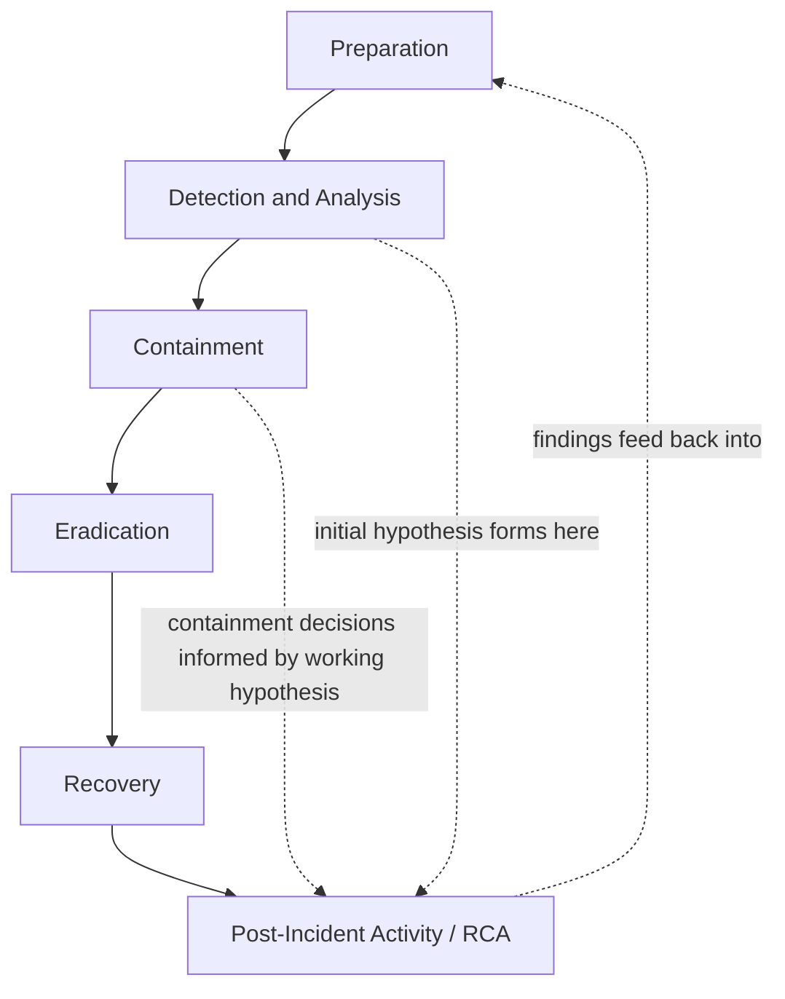

## Root Cause Analysis Within the Incident Response Lifecycle


### Purpose and Scope

Root cause analysis in cybersecurity incident response occupies a specific, deliberately sequenced position within the broader incident response (IR) lifecycle — it is not the first activity performed, and conducting it prematurely can actively undermine containment and evidence integrity. This section addresses where RCA fits relative to detection, containment, and eradication phases, and what distinguishes security-incident RCA from the software/IT production-incident RCA covered earlier in this material: namely, the presence of an adversary who may be actively responding to defender actions, and the parallel evidentiary/legal requirements that don't apply to a typical outage.

### The IR Lifecycle and RCA's Position Within It

The widely referenced structure (following frameworks such as NIST SP 800-61) divides incident response into phases; RCA activity is distributed across several of them rather than confined to a single discrete step:



**Detection and Analysis** — An initial causal hypothesis (how did the attacker get in, what is the scope) begins forming here, but this is explicitly provisional — security RCA differs from most other RCA domains in that the "timeline" is actively still being written by an adversary during this phase, unlike a software outage where the causal chain is typically static once the fault occurs.

**Containment** — Containment decisions (isolating hosts, disabling accounts, blocking network segments) are made using the *working* hypothesis from detection, often before the full causal chain is understood. This is a structural difference from other RCA domains: security response frequently must act on incomplete causal information because the cost of delay (continued attacker access) exceeds the cost of an imperfect initial containment decision.

**Eradication and Recovery** — Removing the attacker's foothold and restoring systems requires reasonably confident causal understanding of the *initial access vector* and *all persistence mechanisms* — an eradication based on an incomplete root cause (e.g., removing one backdoor while missing a second) is a well-documented failure mode that results in the attacker regaining access shortly after recovery, sometimes termed re-compromise.

**Post-Incident Activity** — The formal RCA-equivalent (often "lessons learned" or "post-incident review" in security terminology) occurs here, synthesizing the full evidentiary record into a final causal narrative, corrective actions, and (in regulated contexts) the regulatory reporting content referenced in regulatory reporting requirements.

### Why Security RCA Differs from Production-Incident RCA

**Key Points**

- **Evidence preservation and chain of custody take priority over speed of causal understanding.** Unlike a production outage where querying logs and rolling back a deploy carries little evidentiary risk, security investigation actions (rebooting a compromised host, for instance) can destroy volatile evidence (memory contents, active network connections) needed for causal reconstruction — this creates a structural tension between containment speed and evidence preservation that other RCA domains generally do not face to the same degree.
- **The "why" includes an adversarial actor, not just a systemic gap.** A software RCA's root cause is typically a passive condition (a missing test, a config error); a security RCA's causal chain includes both a systemic vulnerability (the passive condition that enabled access) *and* an active, adaptive adversary who may alter behavior in response to defensive actions — this is closer in structure to adversarial domains than to most other RCA contexts covered in this material.
- **Scoping (extent of compromise) is inseparable from root cause.** Analogous to Extent of Condition review in nuclear RCA and blast-radius analysis in distributed systems RCA, but with higher stakes: an incomplete scoping determination (assuming the compromise is limited to Host A when the attacker also has access to Host B) directly risks incomplete eradication and re-compromise, not merely an incomplete report.
- **The initial access vector and the full attack chain are usually documented separately from a single "root cause" statement**, because security incidents typically involve a chain of distinct techniques (initial access, privilege escalation, lateral movement, persistence, actions on objective) rather than a single linear causal path — frameworks like MITRE ATT&CK are commonly used to structure this chain rather than the 5 Whys format alone.
- **Timing of formal RCA relative to legal/regulatory involvement matters.** Where litigation, cyber insurance claims, or regulatory reporting (breach notification laws) are anticipated, the formal investigation and its documentation are sometimes conducted under attorney-client privilege or work-product protection, which can affect document structure, distribution, and even which findings are formally documented in the same artifact versus handled separately — this is a domain-specific consideration not generally present in production-incident postmortems.

### Structuring the Causal Chain: Attack Chain vs. Linear 5 Whys

Security RCA commonly documents causation as a **kill chain** or **attack chain** rather than (or in addition to) a single linear 5 Whys, because a security incident is more naturally described as a sequence of distinct adversary actions than a single deviation with upstream causes:



```
Initial Access:    Phishing email → credential harvested 
                   via fake login page
Execution:         Harvested credentials used to authenticate 
                   to VPN (no MFA enforced on this account class)
Privilege Escalation: Compromised account had local admin 
                   rights on jump host (excessive standing privilege)
Lateral Movement:  RDP to file server using cached admin 
                   credentials
Persistence:       Scheduled task created for periodic 
                   callback to C2 infrastructure
Actions on Objective: Data staged and exfiltrated via HTTPS 
                   to external host
```

Each stage in this chain can itself be subjected to a 5-Whys-style causal drill-down (e.g., "why did this account class lack MFA enforcement" — a policy/process root cause, structurally similar to the MOC-classification gaps seen in process-safety RCA), but the overall narrative structure is chain-of-technique rather than chain-of-deviation, reflecting how adversary behavior is naturally described and how detection/response teams reason about it operationally.

### RCA's Relationship to Other IR Deliverables

Security RCA output typically feeds multiple downstream artifacts distinct from a standard postmortem:

| Deliverable | Relationship to RCA |
| --- | --- |
| Indicators of Compromise (IOCs) | Extracted from the causal chain for detection/blocking use, independent of the narrative report |
| Detection gap analysis | "Why didn't existing monitoring catch this stage of the chain" — parallel to the observability-gap findings in production-incident RCA |
| Regulatory breach notification | Uses RCA scoping findings (what data, how many records, confirmed vs. suspected) to meet legal disclosure obligations |
| Threat intelligence sharing | Sanitized attack-chain and IOC data shared with industry ISACs or partners, distinct from the internal full RCA report |
| Corrective action / hardening plan | Structurally similar to standard CAPA tracking, but often prioritized by exploitability and residual risk rather than purely by root-cause category |

### Common Failure Modes Specific to Security RCA

- **Premature eradication before full scoping.** Acting on an incomplete causal understanding (removing one identified backdoor) while a parallel, undiscovered persistence mechanism remains, leading to re-compromise shortly after recovery is declared complete.
- **Evidence loss from uncoordinated response actions.** Well-intentioned but uncoordinated actions (a system administrator rebooting a suspicious host before forensic imaging) destroying volatile evidence needed to complete the causal chain.
- **Stopping at the technical vulnerability without the process root cause.** Similar to the general RCA anti-pattern of stopping too early: identifying "unpatched CVE-XXXX-XXXXX" as root cause without asking why the patch management process failed to apply an available patch within the organization's own SLA.
- **Treating the incident as closed once the immediate threat is removed, without the systemic hardening review.** Parallel to the remediation-vs-preventive gap discussed in software action tracking — patching the specific exploited vulnerability (remediation) without addressing the broader gap that allowed it to remain unpatched (preventive) risks a structurally similar future incident via a different specific vulnerability.

### Related Topics

- MITRE ATT&CK framework as a structuring tool for attack-chain documentation
- Digital forensics and evidence preservation / chain of custody procedures
- Breach notification law and regulatory reporting timelines for security incidents
- Detection engineering and gap analysis following an incident
- Threat intelligence sharing formats (STIX/TAXII) and sanitized IOC distribution