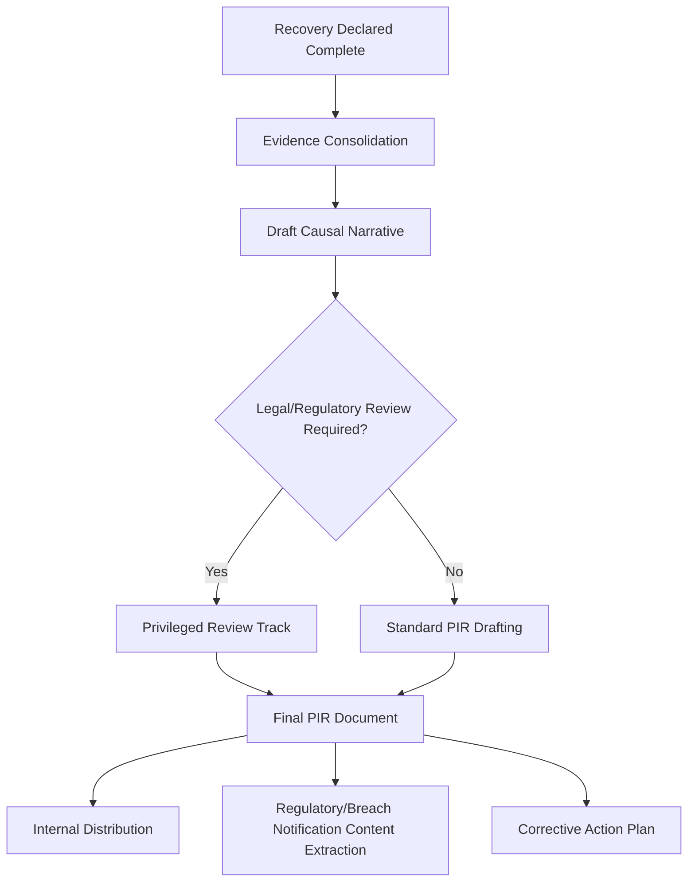

## Post Incident Reviews for Security Breaches

### Purpose and Scope

The post-incident review (PIR) is the formal synthesis phase of security incident response — occurring after containment, eradication, and recovery — where the full evidentiary record is converted into a final causal narrative, verified findings, and organizational corrective actions. It is the security-domain equivalent of the software postmortem (see writing effective postmortem documents) and the formal RCA/RCE step in other high-reliability domains, but with structural differences driven by legal exposure, regulatory reporting obligations, and the adversarial nature of the underlying event, building directly on the vector/root-cause/impact separation established in the prior section.

### Timing and Sequencing Within the IR Lifecycle

The PIR occurs deliberately *after* recovery is declared, not during active response, for reasons distinct from simple facilitation practicality (unlike software postmortems, which are primarily delayed to allow cognitive bandwidth for response first):

**Evidence consolidation** — Unlike software incidents where telemetry is queried live during drafting, security PIRs typically work from a preserved evidentiary record (forensic images, log exports, memory captures) collected during the earlier response phases specifically because live systems may have been rebuilt, patched, or otherwise altered during eradication and recovery, making the original evidence non-reproducible after the fact.

**Legal/regulatory review branching** — A structural step largely absent from production-incident postmortems: where litigation, insurance claims, or breach notification law are anticipated, some or all of the PIR drafting process may proceed under attorney-client privilege or attorney work-product protection, which can affect who participates in drafting, how findings are phrased, and which version of the document different audiences ultimately see.

### PIR Structure: What's Different from a Standard Postmortem

The PIR retains the core RCA elements common across domains (timeline, causal analysis, impact, corrective actions — see recurring RCA documentation templates) but adds or reweights several sections specific to security breaches:

**1. Scope and Confirmation Status** — Distinguishes *confirmed* compromised assets/data from *suspected but unconfirmed*, since these carry different legal disclosure obligations; unlike a software incident where impact is typically fully knowable from metrics, security impact often has an irreducible uncertainty band (e.g., "logs retained only 30 days, so full lateral movement history before that window cannot be confirmed").

**2. Attack Chain / Technique Mapping** — Structured per-stage as described in root cause analysis within the incident response lifecycle and distinguishing root cause from attack vector and impact, typically referencing a standard framework (e.g., MITRE ATT&CK) for consistency and to support cross-incident and industry-benchmarked comparison.

**3. Detection and Dwell Time Analysis** — How long between initial compromise and detection ("dwell time"), and why detection took that long — this is the security-domain analog of the TTD (time-to-detect) metric in software incident tracking, but often carries substantially more organizational weight, since extended dwell time directly correlates with increased scope of compromise and is frequently a headline finding in breach disclosures.

**4. Data/Asset Impact Assessment** — Quantified and categorized (record types, regulatory classification such as PII/PHI/PCI, confirmed vs. estimated volume) specifically to support the impact-amplification analysis and regulatory notification requirements described in the prior section and in regulatory reporting requirements.

**5. Response Effectiveness Review** — A security-specific variant of the "what went well" section: did detection tooling fire as expected, did the response plan/runbook match the actual incident, were communication and escalation timely — distinct from the causal-chain review because it evaluates the *organization's response*, not the *attacker's actions or the underlying vulnerability*.

### Balancing Blamelessness with Accountability in Security PIRs

**Key Points**

- **The blameless principle applies differently when human action is exploited rather than merely erroneous.** A user who clicked a well-crafted phishing link is analogous to the "assume reasonable action given information available" framing from blameless postmortem culture — the PIR should trace *why the phishing email reached the inbox and why the login page was convincing enough*, not terminate at "user error," structurally identical to the general RCA principle of not stopping at the first human action in the chain.
- **Insider threat and willful policy violation are a distinct track, not covered by blameless framing.** Unlike accidental human error, a security PIR involving suspected insider action or deliberate circumvention of controls follows a different (often HR- and legal-involved) process, mirroring the Just Culture distinction between good-faith error and willful misconduct referenced across other RCA domains — this determination is typically made early, as it changes who can appropriately participate in the PIR and what protections apply to the findings.
- **Vendor and third-party root causes require careful, factual framing.** Where a root cause traces to a third-party vendor's product or a supply-chain compromise, the PIR's causal statements carry contractual and potential litigation implications — findings should stay strictly evidence-based (what the log/forensic data shows) without editorializing about vendor negligence, a distinction more consequential here than in most internal-only RCA contexts.
- **Detection and response gaps deserve equal documentation weight to the initial vulnerability.** A PIR that documents the exploited vulnerability in detail but glosses over why internal detection tooling didn't catch the activity for weeks produces an incomplete corrective action set — the detection gap is often the more actionable and more preventive-tier finding of the two.

### Corrective Action Categories Specific to Security PIRs

Extending the general corrective/preventive/remediation taxonomy (see preventing repeat incidents through action tracking), security PIRs commonly organize actions into:

| Category | Focus | Example |
| --- | --- | --- |
| Vector-specific | Closes the specific exploited path | Patch the specific CVE; block the specific malicious domain |
| Root-cause | Addresses the systemic control gap | Close MFA policy exemptions; enforce patch SLA compliance |
| Detection | Closes the gap that allowed extended dwell time | New detection rule for the technique used; log retention extension |
| Impact-reduction | Limits blast radius of a future, differently-vectored compromise | Network segmentation; privileged access reduction; DLP implementation |

### Distribution and Confidentiality Considerations

Unlike most software postmortems (which are frequently distributed broadly within engineering, per the audience-calibration guidance in effective postmortem documents), security PIR distribution is typically more restricted, following a need-to-know model:

- **Full technical PIR** — restricted to security team, relevant engineering leads, and (where privilege applies) legal counsel.
- **Executive summary** — broader leadership distribution, focused on business risk, impact, and remediation status rather than full technical detail.
- **Regulatory disclosure content** — a distinct, separately drafted artifact extracting only the specific facts required by applicable breach notification law, reviewed by legal/compliance before external submission (see regulatory reporting requirements for the general reporting-obligation framework this feeds into).
- **Sanitized threat-intelligence sharing** — IOCs and technique-level (not organization-specific) findings, shared externally (e.g., via an ISAC) with identifying and impact-scope details removed.

### Key Points

- The PIR occurs after recovery, not during response, and typically works from a preserved evidentiary record rather than live system queries, since response actions themselves can alter or destroy evidence.
- Legal and regulatory considerations can affect PIR drafting process and distribution structurally, a consideration largely absent from standard software postmortems.
- Blameless framing applies to human actions exploited by an adversary in the same way it applies to human error elsewhere, but a separate track exists for suspected insider or willful-violation scenarios, mirroring Just Culture distinctions used across other RCA domains.
- Detection/dwell-time analysis deserves documentation weight comparable to the initial vulnerability finding, since extended dwell time is frequently the factor that most determines eventual impact scope.
- Distribution of the PIR is typically tiered and restricted by need-to-know, more so than in most other RCA domains, due to the combination of legal exposure and the sensitivity of unpatched-vulnerability or control-gap details.

### Related Topics

- Root cause analysis within the incident response lifecycle (phase sequencing this section builds on)
- Distinguishing root cause from attack vector and impact (analytical separation applied within the PIR)
- Breach notification law and regulatory disclosure content extraction
- Dwell time analysis and detection engineering gap remediation
- Insider threat investigation processes and their divergence from blameless PIR handling