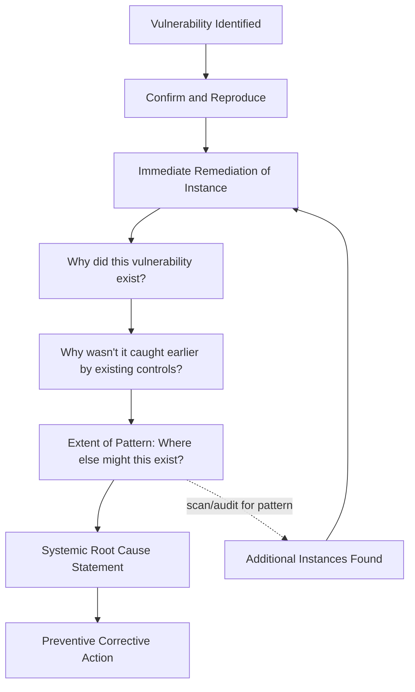

## Root Cause Analysis Applied to Vulnerability Findings

### Purpose and Scope

Applying RCA to vulnerability findings addresses a distinct scenario from breach post-incident review: analyzing *why a vulnerability existed and went undetected/unremediated* even when no confirmed exploitation occurred. This proactive application — triggered by penetration test findings, vulnerability scanner results, bug bounty submissions, or internal security review — parallels the prospective/retrospective distinction drawn between HAZOP and RCA in process safety: a vulnerability finding is closer to a near-miss report (see patient safety reporting systems' near-miss category) than a confirmed incident, but still warrants systemic causal analysis if the same class of gap could exist elsewhere or recur.

### Why Vulnerability Findings Warrant RCA, Not Just Remediation

**Key Points**

- **Patching the specific instance is remediation, not root cause resolution.** Applying a patch to the specific vulnerable system found in a scan addresses that one instance; it does not address why the vulnerability existed in the first place (a missed patch cycle, an insecure default configuration standard, a code pattern replicated across services) — this is the same remediation-vs-preventive distinction established in preventing repeat incidents through action tracking, applied to vulnerabilities rather than confirmed incidents.
- **A single vulnerability finding is frequently a symptom of a class of finding, not an isolated defect.** A SQL injection vulnerability found in one endpoint via a code pattern (unparameterized queries built via string concatenation) is highly likely to exist in other endpoints using the same pattern, even if not yet found by the scan or test — RCA for vulnerability findings should explicitly ask "where else does this pattern exist" as a required step, structurally identical to the blast-radius/extent-of-condition review used in distributed systems RCA and nuclear Extent of Condition analysis.
- **Detection latency is itself a root-cause-relevant finding, separate from the vulnerability's existence.** A vulnerability that existed in production for 18 months before a penetration test found it raises a distinct causal question — why didn't earlier scanning, code review, or dependency monitoring catch it — parallel to the dwell-time analysis emphasized in post-incident reviews for confirmed breaches, but here applied even absent confirmed exploitation.
- **Severity of the vulnerability and depth of RCA required are not always proportional in the way people assume.** A low-severity individual finding that reveals a systemic gap (e.g., a missing input validation pattern found across dozens of low-risk endpoints, suggesting an absent secure-coding standard) can warrant deeper RCA than a single high-severity finding that is genuinely an isolated one-off defect — severity scoring alone (e.g., CVSS score) measures the finding's individual risk, not its systemic significance.

### Causal Chain Structure for Vulnerability Findings



### Worked Example



```
Finding: Penetration test identifies a SQL injection 
vulnerability in the /v1/reports endpoint of the 
reporting-service, allowing arbitrary query execution.

Immediate remediation: Endpoint patched to use parameterized 
queries; verified via retest.

Why 1: Why did this endpoint use string-concatenated SQL 
instead of parameterized queries?
→ The endpoint was written by a contractor before the team's 
  current secure-coding standard was adopted.

Why 2: Why wasn't this caught by code review at the time, or 
by subsequent static analysis?
→ Static analysis (SAST) scanning was introduced to the CI 
  pipeline after this endpoint's code was last modified, and 
  the scanning tool is only run on changed files in a PR diff, 
  not on the full existing codebase.

Why 3: Why does the SAST tool only scan changed files rather 
than the full codebase periodically?
→ Full-codebase scans were deprioritized due to CI pipeline 
  duration concerns; no periodic (e.g., nightly/weekly) 
  full-scan job exists as a compensating control.

Extent-of-pattern check: A full-codebase SAST scan (run 
manually as part of this RCA) identifies 6 additional 
endpoints across 3 services using the same string-concatenation 
pattern, none previously flagged, none yet confirmed exploited.

Root Cause: The SAST scanning configuration only covers 
incrementally changed code, creating a blind spot for 
pre-existing code written before either the scanning tool 
or current secure-coding standards were adopted, with no 
periodic full-codebase scan as a compensating control.

Preventive Action: Implement a scheduled full-codebase SAST 
scan (weekly) in addition to the existing per-PR diff scan; 
remediate the 6 additional identified instances; track as a 
distinct corrective action from the original finding's 
instance-level patch.
```

This mirrors the software 5 Whys pattern (see five whys applied to production incidents) but with the critical addition of the **extent-of-pattern check**, which converts a single-instance finding into a systemic remediation program — without this step, the RCA would have concluded with "fixed the one endpoint" and left 6 additional, functionally identical vulnerabilities undiscovered.

### Distinguishing Vulnerability RCA from Breach PIR

| Dimension | Vulnerability RCA | Breach Post-Incident Review |
| --- | --- | --- |
| Trigger | Proactive finding (scan, pentest, bug bounty), no confirmed exploitation | Confirmed or suspected active compromise |
| Evidence base | Code, configuration, scan results | Forensic evidence, logs, potentially adversary artifacts |
| Urgency posture | Scheduled remediation per severity SLA | Active incident response, containment-first |
| Legal/regulatory exposure | Generally lower (no confirmed breach), though bug bounty disclosure terms may apply | Often significant (breach notification law, litigation risk) |
| Typical root cause category | Process gap (SDLC, scanning coverage, secure-coding standard adoption) | Broader mix: process gap, control gap, and adversary technique |

Despite these differences, vulnerability RCA and breach PIR frequently converge on structurally similar root causes (a missing scanning coverage pattern, a policy exemption, an inconsistently applied standard) — a mature security program often uses vulnerability RCA findings as a leading indicator, addressing systemic gaps before they are exploited rather than only after a confirmed breach forces the analysis (analogous to how near-miss aggregation in patient safety reporting systems surfaces systemic risk before a sentinel event occurs).

### Vulnerability Management Program Integration

RCA findings from vulnerability analysis typically feed into vulnerability management program metrics and processes distinct from breach-driven action tracking:

- **Mean Time to Remediate (MTTR) by severity** — tracked per standard vulnerability management practice; a root-cause finding that scanning coverage itself is incomplete (as in the worked example) is a distinct metric from remediation speed for already-known findings.
- **Recurring finding-class tracking** — analogous to the recurrence-rate-by-root-cause-category metric in software action tracking, tracking whether the same *class* of vulnerability (e.g., "injection via unparameterized query," "hardcoded credential," "missing authentication on internal endpoint") continues to appear across scans over time despite prior remediation of individual instances.
- **Scanning/testing coverage gap analysis** — explicitly measuring what fraction of the codebase, infrastructure, or asset inventory is actually covered by existing detection controls, since (as in the worked example) an apparently well-functioning scanning program can have systemic blind spots that only an RCA-driven extent-of-pattern check reveals.

### Key Points

- A vulnerability finding's remediation (patching the specific instance) and its root cause (why the vulnerability existed and wasn't caught earlier) are separate analytical steps, mirroring the remediation-vs-preventive distinction used throughout software and security RCA.
- An extent-of-pattern check — searching for the same vulnerability class elsewhere in the codebase or infrastructure — is a required step for vulnerability RCA, since the finding that triggered the analysis is frequently one instance of a broader, previously undetected pattern.
- Detection latency (how long a vulnerability existed before being found) is itself a root-cause-relevant finding even absent confirmed exploitation, analogous to dwell-time analysis in confirmed-breach reviews.
- CVSS or other individual-finding severity scores measure the risk of one instance, not the systemic significance of the pattern it may represent; a lower-severity but widely-replicated pattern can warrant deeper RCA than an isolated high-severity finding.
- Vulnerability RCA functions as a proactive, near-miss-equivalent input to a security program, allowing systemic gaps to be identified and addressed before they contribute to a confirmed breach.

### Related Topics

- Static analysis (SAST) and dynamic analysis (DAST) coverage design in CI/CD pipelines
- Secure coding standards adoption and legacy-code retroactive auditing
- Vulnerability management program metrics (MTTR, recurring finding-class tracking)
- Root cause analysis within the incident response lifecycle (contrast with proactive vulnerability RCA)
- Extent of Condition / extent-of-pattern review as a cross-domain RCA practice