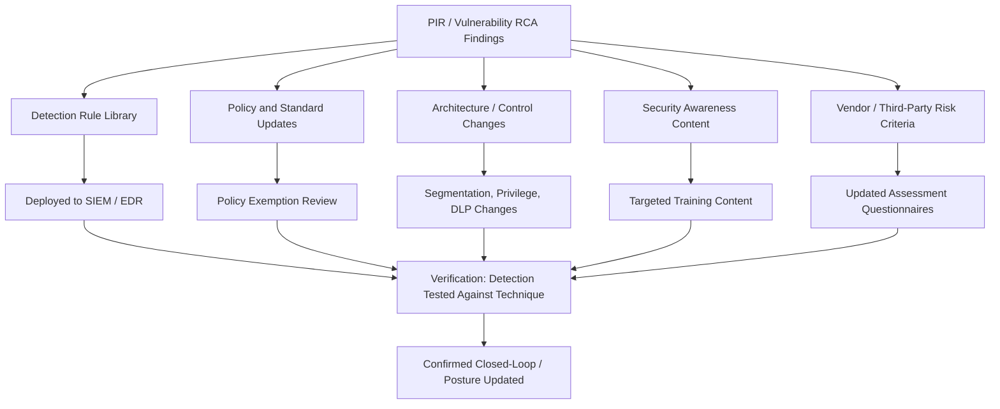

## Feeding Lessons Learned Back Into Security Posture

### Purpose and Scope

This section addresses the final, often weakest link in the security RCA chain: converting individual post-incident review and vulnerability RCA findings into durable, organization-wide improvements to security posture, rather than isolated fixes that leave the same systemic gaps available to the next attacker. It extends the action-tracking discipline established in preventing repeat incidents through action tracking into the security-specific mechanisms — detection engineering, control architecture, policy, and risk posture — through which lessons learned actually propagate, or fail to propagate, beyond the incident or finding that produced them.

### Why This Step Is Distinct from Standard Action Tracking

**Key Points**

- **Security lessons learned must reach architecture and policy layers, not just the specific system.** A software postmortem's corrective actions often terminate at the service level (add a test, fix a config); security lessons learned frequently need to reach organization-wide layers — identity and access policy, network architecture, detection rule libraries, vendor risk criteria — because the systemic gap (e.g., an MFA exemption policy, as in the distinguishing root cause from attack vector and impact example) is rarely scoped to a single service.
- **The feedback loop must close before the next similar incident, not just before the next audit cycle.** Unlike some other RCA domains where a periodic review cadence is acceptable, security posture updates compete directly against an active and adaptive adversary population; a lesson learned that sits in a backlog for two quarters represents an extended window during which a known, now-documented gap remains exploitable.
- **Detection engineering is a first-class feedback target, not an afterthought.** As emphasized in post incident reviews for security breaches, a detection gap (why existing monitoring didn't catch this) is frequently as significant a finding as the initial vulnerability — feeding lessons learned back into detection rule libraries (e.g., new SIEM correlation rules, EDR detection logic) closes a different gap than patching the specific exploited vulnerability, and is often the higher-leverage action since it improves detection of an entire technique class, not just this instance.
- **Threat intelligence integration turns internal lessons into external-facing detection.** Indicators of compromise (IOCs) and technique-level findings extracted from a PIR feed not only internal detection tooling but, where appropriate, external threat-intelligence sharing (see post incident reviews for security breaches), which can itself return value in the form of industry-shared indicators relevant to the organization's own environment.

### Feedback Loop Architecture



Each of the five target categories (detection, policy, architecture, awareness, vendor risk) represents a distinct propagation path, and a mature program tracks completion across all relevant paths for a given finding rather than considering the lesson "learned" once any single path is addressed — a finding that updates the detection rule library but never triggers the corresponding policy exemption review (as in the MFA example from the prior section) has only partially closed the loop.

### Detection Engineering as a Feedback Target

Converting a confirmed technique into a detection capability is one of the highest-leverage lessons-learned activities, because it improves defense against future, differently-sourced instances of the same technique rather than only the specific incident investigated:



```
Finding: Adversary used a scheduled task for persistence, 
created via a specific command pattern not previously 
alerted on.

Feedback action: New SIEM correlation rule for scheduled-task 
creation matching the observed command pattern, tuned against 
historical baseline to manage false-positive rate.

Verification: Detection rule tested against a simulated 
recreation of the technique (or, where available, a red-team/
purple-team exercise) to confirm it fires as intended before 
being considered closed.
```

The verification step — testing the new detection against a simulated recreation of the technique — mirrors the verification requirement emphasized in action tracking generally: an implemented but unverified detection rule (one that was written and deployed but never confirmed to actually fire against the technique it targets) risks providing false confidence rather than genuine improved coverage.

### Policy and Standard Updates

Findings that trace to a policy gap (an MFA exemption, an outdated patch SLA, an overly permissive default configuration standard) require a distinct propagation path from detection engineering, since the fix is organizational/procedural rather than technical:

- **Exemption and exception review** — Where a root cause traces to a policy exemption (as in the MFA exemption example from distinguishing root cause from attack vector and impact), the feedback action is reviewing all similar exemptions organization-wide, not just closing the one that was exploited — mirroring the extent-of-pattern check emphasized in vulnerability RCA.
- **Standard adoption for legacy systems** — Where a root cause traces to a standard that wasn't retroactively applied (a recurring pattern across the software and security RCA domains covered in this material), the feedback action is a scoped audit of existing systems against the current standard, with an explicit completion criterion rather than an open-ended aspiration.
- **Sunset/deprecation criteria** — Some lessons learned point toward retiring a legacy configuration or system entirely rather than continuing to maintain a policy exception for it indefinitely, particularly where the cost of exemption tracking begins to exceed the cost of remediation.

### Architecture and Control Changes

Impact-amplification findings (see distinguishing root cause from attack vector and impact) typically feed architecture-level changes distinct from either detection or policy updates:

| Finding Category | Typical Architecture Feedback |
| --- | --- |
| Excessive standing privilege | Just-in-time privilege elevation; reduced default group membership |
| Flat network segmentation | Microsegmentation; tiered network architecture |
| Insufficient data controls | DLP deployment; data classification and access review |
| Credential caching / reuse | Credential hygiene hardening (e.g., restricting cached credentials on bastion/jump hosts) |

These changes are typically the most resource-intensive and slowest to implement of the feedback categories, which creates a common organizational risk: architecture-level lessons learned are the most likely to be deprioritized relative to faster detection-rule or policy-document updates, even though they often address the deepest systemic root cause (impact amplification, not just initial access).

### Measuring Whether the Feedback Loop Is Actually Working

Extending the aggregate action-tracking metrics from preventing repeat incidents through action tracking to the security-specific context:

- **Technique recurrence rate** — Whether the same MITRE ATT&CK technique (or closely related sub-technique) appears across multiple, otherwise-unrelated incidents despite a prior PIR's detection/remediation actions — a direct signal of an incompletely closed feedback loop.
- **Detection coverage against known techniques** — Whether detection rules exist and are verified-firing for every technique documented in prior PIRs, trackable as an explicit coverage matrix (commonly mapped against a framework like MITRE ATT&CK) rather than assumed from rule deployment alone.
- **Policy exemption count and age** — Tracking outstanding policy exemptions (like the MFA exemption in the running example) as a standing risk register item, since an exemption that remains open long after the incident that exposed its risk is a leading indicator of an unclosed feedback loop, not a resolved one.
- **Time from finding to posture update** — Parallel to the time-to-close metric in general action tracking, but specifically measuring propagation to detection/policy/architecture layers rather than just remediation of the originally reported instance.

### Common Failure Modes

- **Closing the incident ticket while leaving the systemic feedback paths open.** The original PIR or vulnerability finding is marked resolved once the immediate instance is fixed, without separately tracking whether detection, policy, and architecture feedback actions were completed — mirroring the verification-gap pattern described in preventing repeat incidents through action tracking.
- **Detection rules written but never verified against the actual technique.** A rule deployed based on the written finding, without a test confirming it fires, can create false confidence in coverage that doesn't actually exist.
- **Architecture-level lessons deprioritized indefinitely in favor of faster, lower-impact fixes.** The highest-effort feedback category is also frequently the one addressing the deepest root cause, creating a structural risk that the most important lesson is the least likely to be fully implemented.
- **No organization-wide extent-of-pattern check for policy exemptions.** Fixing the one exploited exemption without reviewing all structurally similar exemptions leaves the same class of gap open elsewhere, exploitable by a differently-vectored future incident.

### Related Topics

- Detection engineering and MITRE ATT&CK-based coverage mapping
- Purple team exercises for verifying detection rule effectiveness
- Policy exemption and exception governance frameworks
- Zero trust architecture and privilege reduction as impact-amplification countermeasures
- Preventing repeat incidents through action tracking (general verification and metrics foundation this section extends)