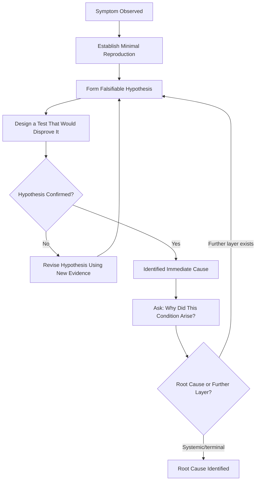

## Root Cause Thinking in Debugging and CTF Style Challenges

### Purpose and Scope

Root cause thinking in debugging and CTF (Capture The Flag) contexts applies the same causal-chain discipline covered throughout this material to a fundamentally different setting: a single practitioner, working alone or in a small team, against a bounded, artificially constructed problem with a definite solution and no ambiguity about "impact" or "regulatory obligation." This section addresses how the core RCA skill — systematically tracing a symptom back through causal layers rather than pattern-matching to a plausible-sounding explanation — transfers to debugging and CTF challenges, and where the transfer breaks down.

### What Transfers from Formal RCA to Debugging

**Key Points**

- **The discipline of forming a falsifiable hypothesis and testing it, rather than pattern-matching to a plausible story, is the core transferable skill.** The single most common debugging failure mode — changing code based on a guess and observing whether the symptom disappears, without understanding *why* — is structurally identical to the general RCA anti-pattern of stopping at the first plausible cause (see five whys applied to production incidents) without evidence backing each causal step.
- **Bisection is a debugging-specific instance of change analysis.** The nuclear RCA technique of Change Analysis (comparing a failed condition against a known-good baseline) maps directly onto binary search debugging: git bisect, commenting out code sections systematically, or narrowing an input space to isolate the minimal reproducing case — all are structured methods for finding *what changed* between working and non-working states, rather than guessing at *why* it's broken from first principles.
- **The "why" chain applies recursively to debugging just as it does to production incidents.** "Why did the function return null" → "why was the input empty" → "why did the upstream call not populate it" → "why did that upstream call fail silently" is the same recursive structure as the software 5 Whys, just applied at the scale of a single debugging session rather than a full incident.
- **Reproducibility is the debugging equivalent of evidence preservation.** Before investigating causally, establishing a reliable, minimal reproduction of the bug is analogous to evidence preservation in structural or security RCA — without it, causal hypotheses cannot be reliably tested, and time spent investigating a non-reproducible symptom risks the same evidence-quality problem as reasoning from incomplete forensic data.

### Structured Debugging as Micro-RCA



The critical discipline embedded in this loop — **design a test that would disprove the hypothesis**, not merely one that would confirm it — is the debugging-specific application of a principle found throughout this material's RCA methods: evidence should be sought that could falsify the working theory, not only evidence that supports it, since confirmation-seeking is what produces the correlation-mistaken-for-causation failure mode described in telemetry correlation for production incidents.

### CTF-Specific Application

CTF challenges (particularly in categories like reverse engineering, binary exploitation ("pwn"), and forensics) formalize root cause thinking into an explicit, scored skill, with some structural differences from general debugging:

**Reverse Engineering / Pwn Challenges** — The "symptom" is typically a program behaving unexpectedly (crashing, producing wrong output, exposing a flag under specific conditions) and root cause thinking here closely mirrors vulnerability RCA (see root cause analysis applied to vulnerability findings): the player must trace from an observed crash or behavior back to the specific code pattern (buffer overflow, format string vulnerability, integer overflow) that causes it, then further back to *why* that pattern is exploitable (missing bounds check, unsafe function usage) — structurally the same vector-vs-root-cause distinction covered in distinguishing root cause from attack vector and impact, compressed into a single-session exercise.

**Forensics Challenges** — Directly parallel structured incident investigation: given an artifact (a memory dump, a packet capture, a disk image), the player reconstructs a timeline and causal chain of what occurred, applying the same evidence-based, falsifiable-hypothesis discipline as a security PIR (see post incident reviews for security breaches), but compressed to a single artifact rather than a live, evolving incident.

**Crypto Challenges** — Root cause thinking here often means identifying *why* a cryptographic implementation is broken (a weak random number generator, a reused nonce, an incorrect padding scheme) rather than merely that it is broken — the "why" chain distinguishes "this cipher output looks wrong" (symptom) from "this specific implementation choice violates a security property the algorithm depends on" (root cause), which is what actually enables exploitation.

### Worked Example: Debugging Session as a Whys Chain



```
Symptom: Function returns incorrect total for a shopping cart 
calculation on some inputs but not others.

Why 1: Why is the total incorrect?
→ One line item's price is being read as 0 instead of its 
  actual value.
  Evidence: added print statement, confirmed price field is 0 
  for the specific failing item.

Why 2: Why is that item's price 0?
→ The price lookup function returns 0 as a default when the 
  item ID isn't found in the price table, rather than raising 
  an error.
  Evidence: traced the lookup function's return statement.

Why 3: Why wasn't the item ID found in the price table?
→ The item ID has a trailing whitespace character from the 
  input source that isn't present in the price table's keys.
  Evidence: byte-level comparison of the two ID strings 
  showed a length mismatch.

Why 4: Why does the item ID have trailing whitespace?
→ The CSV parser used for the input source doesn't strip 
  whitespace from fields by default, and this wasn't 
  configured.

Root Cause: CSV parsing configuration doesn't normalize 
whitespace, combined with a price-lookup function that fails 
silently (returns 0) rather than raising an error on a 
missing key — the silent-failure design choice is what let 
the upstream whitespace bug produce a wrong number instead of 
a visible error.
```

Note that this example surfaces **two contributing findings**, not one — the immediate trigger (unstripped whitespace) and a design choice that amplified its impact (silent failure on missing lookup) — mirroring the general RCA principle from action tracking that remediating only the specific trigger (strip the whitespace) without addressing the amplifying design choice (silent failure masking future lookup misses of any cause) leaves a structurally similar bug class exploitable by the next edge case.

### Where the Transfer Breaks Down

- **No organizational or process layer in most CTF contexts.** A CTF challenge's "root cause" typically terminates at a code-level or design-level finding, since there is no real organization, policy, or team process to trace further into — unlike production or security RCA, where the most valuable finding is often several layers past the technical trigger, in process or governance.
- **No verification/action-tracking phase.** Solving a CTF challenge or fixing a bug ends the causal inquiry for that instance; there is typically no equivalent to the extent-of-pattern check, corrective action tracking, or feedback-loop propagation emphasized throughout formal RCA practice, because there's no ongoing system or organization for those mechanisms to apply to.
- **Time pressure can reward pattern-matching over genuine causal understanding.** Competitive CTF formats sometimes reward recognizing a known vulnerability class quickly (pattern-matching to a memorized technique) over deriving the root cause from first principles — useful for speed, but distinct from, and not a full substitute for, the evidence-driven falsification discipline emphasized in formal RCA and in rigorous debugging. [Inference — a commonly discussed tension in CTF/security-training community discourse, not a claim about every challenge or competitor]

### Key Points

- The core transferable skill from formal RCA to debugging and CTF work is disciplined, falsifiable hypothesis testing against evidence, rather than confirmation-seeking or pattern-matching to a plausible story.
- Bisection and systematic input-narrowing are debugging-specific instances of the Change Analysis technique used in formal RCA (comparing a failed state against a known-good baseline).
- Minimal, reliable reproduction of a symptom functions as the debugging equivalent of evidence preservation — causal hypotheses can't be reliably tested without it.
- CTF categories map onto formal RCA domains covered elsewhere in this material: pwn/reverse engineering to vulnerability RCA, forensics challenges to security PIR-style investigation, compressed into single-session, single-artifact form.
- The organizational, process, and feedback-loop layers that make formal RCA valuable at scale (extent-of-pattern checks, corrective action tracking, posture feedback) are generally absent from CTF and individual debugging contexts, since there's no ongoing system for those mechanisms to act on — the transferable skill is the causal-reasoning discipline, not the full RCA program structure.

### Related Topics

- git bisect and systematic binary-search debugging techniques
- Reverse engineering and binary exploitation (pwn) methodology
- Digital forensics artifact analysis (memory, disk, network captures)
- Root cause analysis applied to vulnerability findings (formal-domain parallel to pwn/reverse-engineering root cause thinking)
- Change analysis as a root cause technique across domains