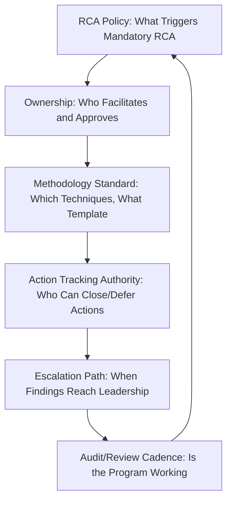

## Designing Organizational RCA Governance

### Purpose and Scope

RCA governance is the organizational layer that determines whether the domain-specific practices covered throughout this material — 5 Whys chains, postmortem documents, action tracking, feedback loops — operate consistently, sustainably, and with actual authority to drive change, or instead exist as isolated good practices that individual teams apply inconsistently and that leadership can override under pressure. This section addresses the governance structures, roles, and decision rights that make an RCA program durable across an organization rather than dependent on individual practitioner discipline.

### Core Governance Components

**RCA Policy (trigger definition)** — The foundational governance artifact defining what mandates a formal RCA versus a lighter-weight review, mirroring the severity-tiered triage structures seen throughout this material (nuclear's ACE/RCE split, software's SEV-level postmortem requirements, healthcare's sentinel-event threshold). Without an explicit, pre-agreed trigger policy, severity classification becomes negotiable case-by-case, which is a well-documented path toward under-investigating organizationally inconvenient or embarrassing incidents.

**Ownership** — Defines who has authority to facilitate RCAs, who approves the final root cause finding, and critically, who has authority to *contest* a proposed root cause if it appears superficial or scapegoating — this authority typically sits with a role structurally independent of the team whose work is under investigation, for the same reason a neutral facilitator is emphasized in blameless postmortem culture.

**Methodology standard** — Specifies which techniques are used for which severity/domain (5 Whys for straightforward chains, fault tree or fishbone for multi-causal incidents, ECF charting or barrier analysis for higher-consequence events), and mandates a common documentation template (see recurring RCA documentation templates) so that RCAs are comparable and aggregatable across the organization rather than each team inventing its own format.

**Action tracking authority** — Establishes who can mark a corrective action closed, who can defer or risk-accept an action, and what sign-off is required for deferral (see the risk-acceptance discussion in preventing repeat incidents through action tracking) — without explicit authority definition, deferral decisions tend to default to whoever is under the most schedule pressure, which is rarely the right decision-maker.

**Escalation path** — Defines when RCA findings must reach leadership beyond the immediate team: recurring root causes across multiple incidents, findings that implicate cross-team or organization-wide gaps, or findings where the responsible team lacks authority or budget to implement the needed corrective action.

**Audit/review cadence** — A periodic (not incident-triggered) review of whether the RCA program itself is functioning: are severity thresholds being applied consistently, are action items closing on time, are root causes trending toward genuine systemic findings or toward easy-to-blame proximate causes.

### Governance Structures by Organizational Maturity

| Maturity Level | Characteristics | Typical Failure Mode Without This Level |
| --- | --- | --- |
| Ad hoc | RCA conducted inconsistently, format varies by team/individual | No aggregation possible; recurring root causes go undetected |
| Standardized | Common template and trigger policy exist, applied inconsistently | Compliance is nominal; findings quality varies widely by facilitator |
| Enforced | Trigger policy is mandatory, action tracking has real authority and consequences for non-completion | Program exists but has limited organizational learning value |
| Integrated | RCA findings feed architecture/policy/training decisions systematically; metrics tracked and reviewed by leadership | Achieved — this is the target state most domains in this material describe as the goal |
| Adaptive | Governance itself is periodically reviewed and revised based on program performance data | Rare; requires sustained leadership attention beyond program launch |

Most organizations sit somewhere between Standardized and Enforced for a meaningful stretch, since reaching Integrated typically requires leadership to treat RCA program health metrics (closure rates, recurrence rates — see the aggregate metrics discussed in preventing repeat incidents through action tracking) as seriously as the metrics the RCA program itself is meant to improve.

### Independence and Authority: The Central Governance Tension

**Key Points**

- **The facilitator/approver of an RCA should not report to the person whose decisions are under scrutiny.** This mirrors the independent-oversight principle seen in nuclear RCA's higher-tier evaluations and the neutral-facilitator emphasis in blameless postmortem culture, but at a governance level: if the person approving a root cause finding is the direct manager of the person whose action is the proximate cause, there is a structural incentive (even unconscious) to terminate the causal chain at a comfortable, non-implicating point.
- **Action-tracking authority must have teeth, or it degrades into theater.** A governance structure that mandates action items but has no consequence for missed deadlines (no escalation, no visibility to leadership, no resourcing conversation) tends to converge toward the stale-action-item pattern described in action tracking, regardless of how well-designed the RCA process itself is.
- **Governance must explicitly protect against RCA quality varying by political sensitivity.** A recurring risk (discussed less formally throughout this material but structurally present in every domain) is that RCAs for embarrassing, high-visibility, or leadership-adjacent incidents receive softer treatment than equivalent-severity incidents elsewhere — explicit governance (a fixed trigger policy applied uniformly, an independent approval authority) is the primary structural defense against this drift, since informal norms alone tend to erode under real organizational pressure.
- **Governance should specify a minimum viable RCA even under resource constraint**, rather than allowing "we didn't have time for a full RCA" to become a de facto exemption — this is analogous to the tiered severity/rigor mapping used throughout (apparent cause vs. full root cause evaluation), giving teams an explicit lighter-weight option rather than an implicit license to skip causal analysis entirely under time pressure.

### Cross-Team and Cross-Domain Coordination

Organizations operating across multiple RCA-relevant domains covered in this material (software incidents, security incidents, and potentially physical/operational domains for organizations with a physical footprint) face a specific governance design choice: **unified versus federated RCA programs**.

- **Unified** — A single RCA policy, template, and tracking system spans all incident types, with domain-specific methodology variations (attack-chain documentation for security, ECF charting for higher-consequence physical events) layered on a common governance spine. This enables cross-domain trend analysis (e.g., recognizing that both a software incident and a security incident trace to the same underlying "legacy system, standard not retroactively applied" pattern) but requires broader organizational buy-in to establish.
- **Federated** — Each domain (software/SRE, security, physical operations if applicable) maintains its own RCA program with domain-appropriate governance, coordinated only at a high level (shared executive reporting, shared minimum-standard expectations). This is easier to establish per-domain but risks the same root-cause pattern going undetected across domains, since no shared taxonomy or tracking system surfaces the connection.

Neither structure is universally correct; the choice typically depends on organizational size, how much domains genuinely share root-cause categories in practice, and how much centralized capacity exists to run a unified system well. [Inference — this is a general organizational-design tradeoff observed across governance literature, not a claim that one structure is empirically superior]

### Metrics for Governance Health

Beyond the program-level metrics discussed in domain-specific sections (action closure rate, recurrence rate by root-cause category), governance-specific health indicators include:

- **Trigger-policy compliance rate** — What fraction of qualifying incidents actually received the mandated RCA depth, versus being informally downgraded.
- **Finding depth distribution** — Whether root cause statements across the organization trend toward systemic/process findings versus proximate/individual findings, as a proxy for whether facilitator independence and blameless framing are functioning as intended.
- **Cross-team escalation rate** — How often RCA findings require escalation beyond the originating team, and whether escalated items receive timely resourcing.
- **Time from finding to leadership visibility** — For findings that warrant it, how quickly they reach a decision-maker with authority to fund or mandate the corrective action.

### Related Topics

- Measuring RCA program effectiveness (metrics, benchmarking, maturity assessment)
- Blameless postmortem culture as a governance precondition, not just a document-writing practice
- Cross-domain root cause taxonomy design for unified trend analysis
- Executive reporting and RCA program sponsorship
- Preventing repeat incidents through action tracking (the operational layer this governance structure exists to support)