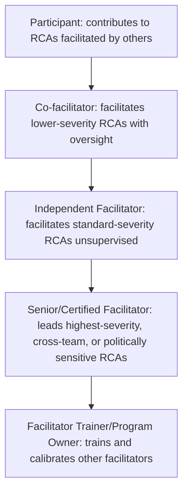

## Training Pathways and Facilitator Development

### Purpose and Scope

Training pathways and facilitator development address how an organization builds the human capability an RCA governance structure (see designing organizational RCA governance) depends on: without trained facilitators capable of running a rigorous, evidence-based, appropriately blameless investigation, even the best-designed policy, template, and action-tracking system will produce shallow or inconsistent findings. This section covers the skill progression from general participant to independent facilitator, the specific competencies that distinguish competent facilitation from merely following a template, and how organizations structure ongoing development rather than treating facilitator capability as a one-time training event.

### Why Facilitation Is a Distinct Skill from RCA Knowledge

**Key Points**

- **Knowing the 5 Whys format is not the same as being able to run one well.** A facilitator's job is not to already know the answer but to structure a process that reliably surfaces evidence-backed causal chains from participants who each hold partial context — this is closer to structured interviewing and group facilitation skill than to technical domain expertise, even though domain expertise helps a facilitator ask sharper questions.
- **The hardest facilitation skill is redirecting blame-oriented language without shutting down disclosure.** As discussed in blameless postmortem culture, a facilitator must reframe "X forgot to check the dashboard" toward systemic framing in real time, during a live discussion, without making the original speaker feel corrected or discouraging them from continuing to share detail — this is a practiced skill, not something that follows automatically from reading a blameless-culture policy document.
- **Recognizing when a stated root cause is actually a proximate cause requires calibrated judgment, not a checklist.** Distinguishing "the deploy caused the outage" (proximate) from "the deploy pipeline lacks a required review gate for this class of change" (systemic) — the kind of distinction emphasized throughout the software and security RCA sections of this material — is a pattern-recognition skill that develops through repeated practice and feedback, not from a single training session.
- **Facilitators must manage psychological dynamics specific to the incident's context** — a team that just experienced a stressful, high-visibility outage or breach is not in the same emotional state as a team reviewing a minor near-miss, and facilitation technique (pacing, when to take a break, how directly to probe) needs to adapt accordingly, paralleling the crisis-sensitivity considerations found in incident response more broadly.

### Facilitator Skill Progression

This progression mirrors the significance-tiered facilitation structure seen in nuclear RCA (where higher-tier Root Cause Evaluations require trained facilitators, distinct from lower-tier Apparent Cause Evaluations any qualified individual can conduct) — the key governance implication is that facilitator qualification level should be matched to incident severity/complexity, not treated as a binary trained/untrained distinction.

### Core Training Curriculum Components

**1. Causal Analysis Technique Training** — Grounding in the specific methods the organization's governance standard specifies (5 Whys, fishbone/Ishikawa, fault tree, ECF charting, barrier analysis, contributing-factors documentation — see the technique-selection guidance embedded throughout this material's domain sections), including *when* to use which technique, since forcing a linear 5 Whys onto a genuinely multi-causal incident is a common and correctable error (see the single-cause-bias failure mode discussed in five whys applied to production incidents).

**2. Blameless Facilitation Practice** — Structured practice (often via role-play or simulated postmortems using anonymized or fictional past incidents) specifically targeting the blame-language redirection skill — reading transcripts of both well-handled and poorly-handled facilitation moments is a common training technique, since seeing the concrete difference in real-time language choices is more instructive than abstract principle alone.

**3. Evidence Discipline Training** — Practice distinguishing a well-evidenced causal claim from an assumed or intuited one, directly addressing the correlation-vs-causation and evidence-per-Why discipline emphasized in telemetry correlation and throughout the software/security RCA sections — this is often trained through worked examples where trainees must identify which claims in a sample RCA lack adequate evidentiary support.

**4. Documentation and Writing Standards** — Training on producing the clear, well-structured written output covered in writing effective postmortem documents, since a facilitator who runs an excellent verbal investigation but produces an unclear document has not delivered the program's full value — the document is what persists and gets referenced long after the facilitated discussion ends.

**5. Domain-Specific Considerations** — For organizations spanning multiple RCA domains (software, security, and potentially physical/operational), facilitator training typically includes domain-specific modules: attack-chain structuring for security incidents (see root cause analysis within the incident response lifecycle), the vector/root-cause/impact separation specific to security findings, or extent-of-condition thinking for physical/operational domains.

### Calibration and Ongoing Development

**Key Points**

- **Shadowing and co-facilitation are more effective early-stage development than classroom training alone.** Facilitation is a practiced skill; most mature programs require new facilitators to observe several RCAs led by experienced facilitators, then co-facilitate with oversight, before facilitating independently — paralleling the general observation that skills requiring real-time judgment (redirecting blame language, recognizing an under-evidenced claim as it's spoken) develop through supervised repetition more reliably than through documentation review alone.
- **Calibration sessions across facilitators reduce inconsistent RCA quality.** Periodically reviewing completed RCAs across different facilitators (a governance-level audit activity, see designing organizational RCA governance) surfaces systematic differences — one facilitator's RCAs might consistently terminate at proximate causes while another's reliably reach systemic findings — allowing targeted coaching rather than assuming uniform quality across the facilitator pool.
- **Facilitators benefit from periodic exposure to their own past RCA output with fresh eyes**, since reviewing a self-facilitated RCA from six months prior often reveals evidentiary gaps or premature closure that weren't visible during the original time-pressured session — some programs build this into a structured self-review practice rather than leaving it to chance.
- **Facilitator development should include explicit training on recognizing when to escalate rather than facilitate alone.** Politically sensitive findings, findings implicating leadership decisions, or findings crossing multiple team boundaries with competing interests are scenarios where even a skilled facilitator benefits from either a co-facilitator or an escalation to a more senior facilitator — recognizing this need in the moment is itself a trained competency, not something that should be left to individual judgment under pressure alone. [Inference — this reflects a common design pattern in mature facilitator programs, not a universal requirement]

### Facilitator Independence and Conflict of Interest

Extending the independence principle from RCA governance to the individual level: facilitator assignment should account for whether a given facilitator has a reporting relationship, project stake, or personal involvement in the incident under investigation. A trained facilitator who is nonetheless the direct manager of the person whose action is the proximate cause faces the same structural bias risk discussed at the governance level — training programs should explicitly cover facilitator self-assessment for this conflict and establish a norm (and practical mechanism) for requesting a different facilitator when it exists, rather than assuming trained facilitators are immune to this bias by virtue of their training alone.

### Measuring Facilitator Program Effectiveness

Paralleling the RCA program health metrics discussed in governance design, facilitator-development-specific indicators include:

| Metric | What It Reveals |
| --- | --- |
| Facilitator finding-depth consistency | Whether root cause quality varies systematically by facilitator, indicating uneven training or calibration |
| Time-to-independent-facilitation | How long new facilitators take to progress through the skill pathway, useful for capacity planning |
| Facilitator retention/burnout indicators | Whether facilitator workload (especially for senior facilitators handling the most severe incidents) is sustainable |
| Post-RCA participant feedback | Whether participants report the process felt fair, blameless, and thorough — a direct signal of facilitation quality distinct from document quality alone |

### Common Pitfalls in Facilitator Development

- **Treating training as a one-time event rather than a progression.** A single workshop on 5 Whys technique does not produce a competent facilitator for higher-severity or politically sensitive incidents; skill develops through the shadowing/co-facilitation/independent progression described above.
- **Assuming domain expertise substitutes for facilitation skill.** A senior engineer with deep technical knowledge of the system under investigation may still lack the specific skills of blame-redirection and evidence-discipline facilitation — domain expertise and facilitation skill are correlated but distinct, and organizations that only select facilitators for technical seniority risk underdeveloped facilitation practice.
- **No calibration mechanism across facilitators.** Without periodic cross-facilitator review, inconsistent finding depth persists undetected, undermining the aggregability and trend-analysis value that a mature RCA program depends on (see the cross-fleet and cross-institutional trending examples referenced throughout nuclear, healthcare, and software RCA sections).
- **Under-resourcing senior facilitator capacity.** As an organization's incident volume grows, the pool of facilitators qualified for the highest-severity or most sensitive investigations can become a bottleneck if development pathways aren't actively managed to grow that pool proportionally.

### Related Topics

- Designing organizational RCA governance (the structural layer facilitator development supports)
- Blameless postmortem culture and the specific blame-redirection skill it requires in practice
- Writing effective postmortem documents as a distinct facilitator competency
- Calibration and quality-review processes for RCA program consistency
- Incident severity classification and its mapping to facilitator qualification tiers