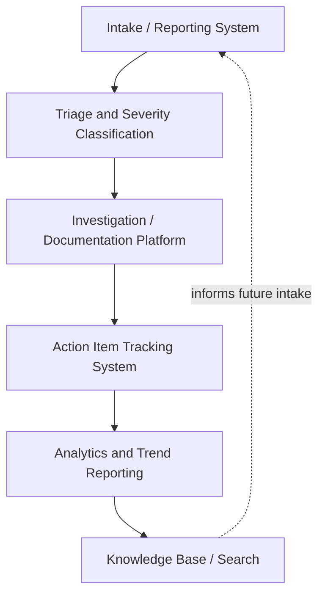

## RCA Software and Digital Tooling Landscape

### Purpose and Scope

The RCA tooling landscape spans the software systems that support intake, investigation, documentation, tracking, and analytics for root cause analysis programs. This section maps the functional categories of tooling relevant across the domains covered in this material — from general incident-report systems to domain-specific platforms for nuclear CAP, patient safety, and software incident management — and the integration and selection considerations that shape which combination of tools an organization actually needs.

### Functional Tooling Categories

**Intake/reporting tools** capture the initial event (condition report, incident ticket, adverse event report); **triage tools** apply severity scoring and route to appropriate investigation depth; **investigation/documentation platforms** house the actual RCA content (timeline, causal analysis, evidence); **action tracking systems** manage corrective action lifecycle and verification; **analytics tools** aggregate across RCAs for trend detection; and a **knowledge base layer** makes prior RCA findings searchable for future incident triage and pattern recognition.

Few single products cover this entire chain well for every domain — most organizations assemble a stack from general-purpose and domain-specific tools rather than adopting one monolithic platform, a pattern discussed further below.

### General-Purpose Incident and Issue Tracking Tools

For software/IT and general organizational incident management, RCA documentation is frequently built on top of general-purpose issue tracking and incident management platforms rather than dedicated RCA software:

- **Issue trackers** (e.g., Jira, Linear, GitHub Issues) — commonly used as the action-item tracking layer (see preventing repeat incidents through action tracking), since teams already work in these systems daily; postmortem action items are logged as standard tickets with the postmortem document linked for traceability.
- **Incident management platforms** (e.g., PagerDuty, Opsgenie, incident.io) — handle the response-timeline capture, on-call paging, and often generate a starting timeline skeleton that feeds directly into the postmortem document, reducing manual timeline reconstruction.
- **Wiki/documentation platforms** (e.g., Confluence, Notion, internal markdown-based systems) — frequently host the actual postmortem document using an organization's standard template (see recurring RCA documentation templates and writing effective postmortem documents), valued for searchability and cross-linking to related incidents.

The general pattern in mature software/SRE organizations is a **composed stack**: incident management tool for response and timeline capture → documentation platform for the postmortem write-up → issue tracker for action items, connected via links and IDs rather than a single unified product, reflecting that no one tool category excels at all three functions simultaneously. [Inference — reflects commonly observed patterns in SRE tooling practice, not a universal or prescribed architecture]

### Domain-Specific RCA Platforms

Several domains covered in this material rely on dedicated software distinct from general issue tracking:

| Domain | Tooling Pattern | Reference |
| --- | --- | --- |
| Nuclear | Corrective Action Program (CAP) software integrated with plant condition-reporting systems, supporting the tiered ACE/RCE workflow and INPO cause-code taxonomy | See nuclear industry root cause practices |
| Healthcare/Patient Safety | Incident reporting platforms (e.g., RL6:Risk, Datix, Verge) often integrated with the EHR, supporting NCC MERP severity scoring and PSO-compliant confidentiality | See patient safety reporting systems |
| Process Safety | PHA/HAZOP software (dedicated tools support guide-word worksheets and node-by-node documentation) often distinct from the incident-investigation tooling used for post-event RCA | See process safety management and HAZOP relation |
| Security/SOC | SIEM and SOAR platforms provide the evidentiary and workflow backbone for security PIRs, often with case-management modules distinct from general issue trackers | See post incident reviews for security breaches |

These domain-specific tools exist because the intake data model, regulatory reporting requirements, and workflow (e.g., PSO confidentiality protections in healthcare, INPO cause-code taxonomy in nuclear) are specialized enough that general-purpose issue trackers don't natively support them without significant customization.

### Root Cause Analysis-Specific Software Features

Beyond general issue tracking, software marketed specifically as "RCA software" or "quality management" platforms (spanning manufacturing, healthcare, and general enterprise quality contexts) typically offers:

- **Structured causal-chain builders** — guided 5 Whys or fishbone-diagram interfaces that enforce evidence-linking per causal step, rather than free-text causal narrative.
- **Template libraries** — pre-built templates aligned to standard methodologies (5 Whys, fishbone, fault tree) that enforce the metadata and structural completeness discussed in recurring RCA documentation templates.
- **CAPA (Corrective and Preventive Action) modules** — dedicated tracking distinguishing remediation, corrective, and preventive action types (see the taxonomy discussed in preventing repeat incidents through action tracking and process safety management and HAZOP relation), often with built-in verification/effectiveness-review workflow steps.
- **Cause taxonomy and tagging** — controlled vocabularies enabling the cross-RCA trend analysis emphasized throughout this material (the INPO cause-code model, AHRQ Common Formats, or organization-specific taxonomies).
- **Regulatory reporting export** — pre-formatted export or integration supporting frameworks discussed in regulatory reporting requirements (e.g., OSHA recordable formats, specific breach-notification data fields).

### Analytics and Trend Detection Tooling

The cross-RCA analytical capability referenced throughout this material — INPO's cross-fleet trending, AHRQ's cross-institutional benchmarking, software's recurrence-rate-by-root-cause-category metric — depends on tooling that can query structured RCA data in aggregate, not just retrieve individual documents:

- **Business intelligence / dashboarding layers** (e.g., built atop a structured RCA database, whether purpose-built or a general BI tool connected to exported RCA data) supporting the governance-level metrics discussed in designing organizational RCA governance: trigger-policy compliance, finding-depth distribution, action closure rate.
- **Natural language processing on free-text findings** — increasingly used to extract themes across RCAs where causal narrative is stored as prose rather than fully structured taxonomy fields, though this is a supplementary capability rather than a substitute for structured tagging at intake, since NLP-derived categorization is inherently less precise than deliberate taxonomy assignment. [Unverified — the maturity and reliability of NLP-based RCA theme extraction varies significantly by tool and is an active area of product development, not a settled capability]

### Selection and Integration Considerations

**Key Points**

- **Tool selection should follow governance design, not precede it.** Selecting a specific RCA software platform before the organization has defined its trigger policy, methodology standard, and ownership structure (see designing organizational RCA governance) risks the tool's built-in workflow assumptions silently becoming the de facto governance model, rather than the organization's actual intended process.
- **Integration between intake, documentation, and action-tracking layers matters more than any single tool's feature depth.** A feature-rich RCA platform that doesn't integrate with the team's existing issue tracker often sees action items logged in the RCA tool but never actually worked, because engineers work from their standard ticket queue — this mirrors the observation in action tracking that items tracked outside a team's normal workflow tend to go stale.
- **Domain-specific regulatory and confidentiality requirements can mandate specific tooling, not just influence preference.** Healthcare's PSO confidentiality protections under PSQIA, for instance, depend on specific handling of report data that general-purpose tools may not support — domain regulatory requirements should be checked before assuming a general tool is adequate, rather than discovered after adoption.
- **Traceability between the postmortem document and every downstream artifact should be explicit, not implicit.** Whether via shared IDs, hyperlinks, or a unified data model, the connection between an RCA finding and its corresponding action items, detection rules (in security contexts), or policy updates needs to be queryable later — a tooling stack where this traceability only exists in people's memory undermines the feedback-loop verification discussed in feeding lessons learned back into security posture and action tracking generally.
- **Knowledge-base search quality determines whether past RCAs actually inform future triage.** A large archive of well-written postmortems has limited value if a responder investigating a new incident can't efficiently search prior findings for similar patterns — tagging discipline (see the knowledge-base tagging guidance in recurring RCA documentation templates) and search tooling quality jointly determine this value, not document quality alone.

### Related Topics

- Designing organizational RCA governance (the structural layer tool selection should follow, not precede)
- Recurring RCA documentation templates and structured-data schema design for machine-readable RCA records
- Preventing repeat incidents through action tracking (the tracking-layer requirements tooling must support)
- Cross-domain root cause taxonomy design for unified analytics
- SIEM/SOAR platforms as the security-domain evidentiary tooling backbone