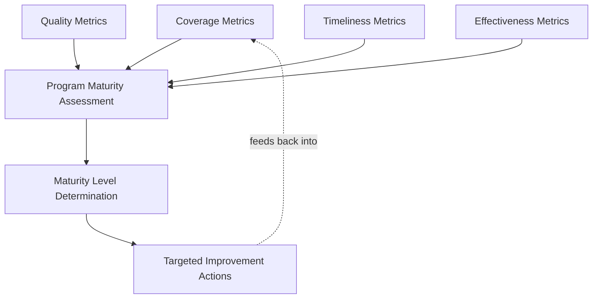

## Metrics for RCA Program Maturity

### Purpose and Scope

This section consolidates the measurement layer referenced across nearly every domain and structural topic in this material into a coherent maturity-assessment framework: how does an organization know whether its RCA program is actually working, not merely operating. Metrics for RCA program maturity differ from metrics tracked *within* a single RCA (timeline durations, severity levels) — they measure the health and effectiveness of the program as a whole, closing the loop between the governance design covered in designing organizational RCA governance and the facilitator capability covered in training pathways and facilitator development.

### Why Program-Level Metrics Are Distinct from Incident-Level Metrics

**Key Points**

- **A single well-executed RCA proves nothing about the program.** Even an immature, inconsistent RCA program can occasionally produce an excellent individual investigation; program maturity is a property of the aggregate — consistency, closure rates, recurrence trends across many RCAs over time — not any single instance, mirroring why nuclear RCA and healthcare RCA both depend on cross-incident and cross-institutional aggregation (see nuclear industry root cause practices and patient safety reporting systems) to detect patterns invisible at the single-event level.
- **Activity metrics are not the same as effectiveness metrics.** Counting how many RCAs were conducted, or how many action items were logged, measures activity volume, not whether those RCAs prevented recurrence or whether those action items closed the systemic gaps they targeted — the verification-gap pattern discussed in preventing repeat incidents through action tracking (an action marked "done" that didn't actually address the root cause) is precisely the failure mode that activity-only metrics fail to catch.
- **Metrics can be gamed by the behaviors they're meant to discourage**, so maturity assessment needs a portfolio of metrics that check each other rather than any single number in isolation — a high RCA closure rate achieved by facilitators consistently identifying easy, quickly-closeable proximate causes rather than harder systemic ones would look good on one metric while indicating a governance failure (see the finding-depth distribution metric introduced in governance design) on another.

### Core Maturity Metric Categories

**Coverage Metrics** — Whether the program is actually applied where it should be:

| Metric | What It Reveals |
| --- | --- |
| Trigger-policy compliance rate | What fraction of qualifying incidents received the mandated RCA depth (see designing organizational RCA governance) |
| RCA-to-incident ratio by severity tier | Whether higher-severity incidents are consistently receiving deeper investigation than lower-severity ones, as the tiered model intends |
| Facilitator qualification match rate | Whether incidents are facilitated by appropriately qualified personnel per the skill-progression tiers in training pathways and facilitator development |

**Quality Metrics** — Whether the RCAs conducted are actually good:

| Metric | What It Reveals |
| --- | --- |
| Finding-depth distribution | Whether root causes trend toward systemic/process findings versus proximate/individual ones (introduced in governance design as a proxy for facilitator independence and blameless framing) |
| Evidence-citation density | Whether causal claims are backed by specific evidence artifacts (logs, documents, test results) versus asserted from inference, extending the evidence-discipline principle from telemetry correlation and evidence-per-Why discipline across domains |
| Cross-facilitator calibration variance | Whether RCA quality is consistent across different facilitators, or concentrated in a few high performers (see the calibration discussion in facilitator development) |

**Timeliness Metrics** — Whether the program operates fast enough to matter:

| Metric | What It Reveals |
| --- | --- |
| Time from incident to RCA completion | Whether investigation timelines meet the organization's own or regulatory deadlines (see regulatory reporting requirements) |
| Time from finding to corrective action implementation | Whether the gap between identifying a systemic risk and closing it is short enough to matter against an active threat landscape (particularly relevant in security contexts, see feeding lessons learned back into security posture) |
| Time from finding to posture/architecture update | The security- and architecture-specific version of the above, tracking propagation to the slower feedback categories |

**Effectiveness Metrics** — Whether the program actually prevents recurrence, the ultimate test of program value:

| Metric | What It Reveals |
| --- | --- |
| Recurrence rate by root-cause category | Whether the same systemic gap keeps producing incidents despite prior corrective actions — the most direct signal of whether action tracking is actually working (see the worked verification-gap example in preventing repeat incidents through action tracking) |
| Action-item verified-effective rate | What fraction of closed action items were confirmed (not just implemented) to have addressed their target root cause, distinguishing "done" from "verified effective" as discussed in action tracking |
| Detection/technique recurrence rate (security-specific) | Whether the same attack technique or vulnerability class reappears across otherwise-unrelated incidents despite prior PIR-driven detection or remediation actions |

### A Maturity Model Synthesis

Drawing together the maturity-level structure introduced in governance design with the metric categories above:

| Level | Coverage | Quality | Timeliness | Effectiveness |
| --- | --- | --- | --- | --- |
| Ad hoc | Inconsistent, no tracked compliance rate | Highly variable, unmeasured | Untracked | Unmeasured; recurrence goes unnoticed |
| Standardized | Trigger policy exists; compliance not systematically tracked | Template used, but depth not assessed | Deadlines exist, adherence not tracked | Action items tracked; verification not distinguished from closure |
| Enforced | Compliance tracked and enforced | Finding-depth distribution monitored | Adherence tracked, with escalation for misses | Verified-effective rate tracked separately from closure rate |
| Integrated | Coverage metrics feed governance review | Cross-facilitator calibration active | Timeliness metrics inform resourcing decisions | Recurrence-rate trending drives architecture/policy investment |
| Adaptive | Governance itself revised based on coverage trend data | Facilitator development pathway adjusted based on quality trend data | Timeliness targets recalibrated based on historical performance | Program-wide investment prioritized by demonstrated recurrence patterns |

This mirrors the maturity structure introduced in governance design, but makes explicit that advancing from one level to the next is *evidenced by* the presence and use of the corresponding metrics, not merely by declaring a more mature process on paper — an organization claiming "Integrated" maturity without measurable finding-depth distribution or recurrence-rate trending data is, by this framework, not actually at that level regardless of how its RCA documents look individually.

### Benchmarking Considerations

**Key Points**

- **Cross-industry benchmarking has limited value; cross-institutional benchmarking within a domain has substantial value.** Comparing a software organization's recurrence rate against a nuclear plant's is not meaningful given entirely different risk profiles and incident base rates; but comparing across similar organizations within a domain — as INPO enables across the nuclear fleet, or as AHRQ Common Formats enable across healthcare institutions — surfaces genuinely actionable signal, since a shared taxonomy and comparable risk profile make the comparison valid.
- **Internal trend over time is often more actionable than any external benchmark.** Whether an organization's own recurrence rate, closure rate, or finding-depth distribution is improving or degrading quarter-over-quarter is directly actionable in a way that a cross-organizational comparison (where structural differences may explain the gap) often is not.
- **Metric targets should be set relative to baseline, not to an arbitrary external standard**, particularly for a newly maturing program — a program moving from Ad hoc to Standardized should expect initial metrics to look poor as visibility improves (more findings get surfaced and tracked that previously went unmeasured), and interpreting an initially worse-looking metric as program failure rather than improved visibility is a common and avoidable misreading. [Inference — a commonly observed pattern in organizational measurement programs generally, not unique to RCA]

### Common Pitfalls in Program Measurement

- **Optimizing for a single metric in isolation**, most commonly closure rate, which can be maximized by facilitators unconsciously gravitating toward quickly-closeable proximate causes — this is precisely why the metric portfolio above pairs coverage/quality/timeliness/effectiveness categories, so that gaming one dimension becomes visible in another.
- **Treating metric collection itself as the goal rather than the improvement action it should trigger.** A dashboard of well-tracked metrics that leadership doesn't act on (see the escalation-path and leadership-visibility discussion in governance design) provides no more organizational value than not measuring at all.
- **Measuring only what's easy to measure (activity counts) rather than what matters (effectiveness).** Coverage and timeliness metrics are typically far easier to instrument than effectiveness metrics (which require tracking recurrence over a meaningful time horizon after action closure) — programs should resist the temptation to report only the easy metrics while treating harder-to-measure effectiveness as out of scope.
- **Insufficient time horizon for effectiveness metrics.** Recurrence-rate tracking requires enough elapsed time after a corrective action's implementation to meaningfully assess whether recurrence actually stopped — declaring an action "effective" immediately upon implementation, without a monitored period, conflates implementation completion with verified effectiveness (the same distinction emphasized throughout action tracking).

### Related Topics

- Designing organizational RCA governance (the structural layer these metrics assess)
- Training pathways and facilitator development (facilitator-level metrics feed into program-level quality assessment)
- Preventing repeat incidents through action tracking (the operational data source for effectiveness metrics)
- RCA software and digital tooling landscape (the analytics/dashboarding tooling that supports this measurement layer)
- Cross-institutional benchmarking models (INPO fleet trending, AHRQ Common Formats) as domain-specific precedents