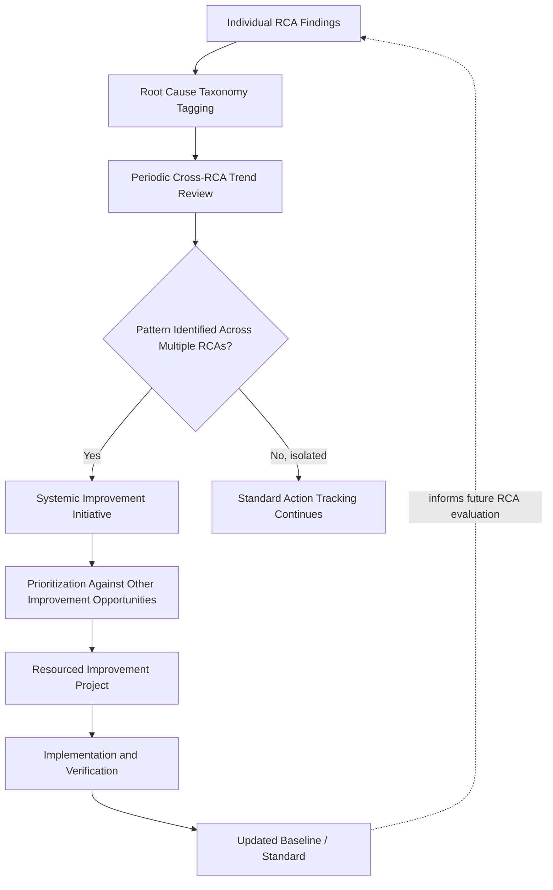

## Integrating RCA Into Continuous Improvement Cycles


### Purpose and Scope

This closing topic addresses how root cause analysis, as a reactive/investigative practice triggered by individual incidents, connects to continuous improvement — the proactive, cyclical organizational discipline of systematically identifying and acting on improvement opportunities regardless of whether a specific triggering incident occurred. Where the prior sections in this chapter established governance (designing organizational RCA governance), facilitator capability (training pathways and facilitator development), tooling (RCA software and digital tooling landscape), and measurement (metrics for RCA program maturity), this section addresses the final integration question: how does RCA output become an *input* to ongoing organizational learning, rather than a closed loop that terminates at each incident's corrective action.

### RCA as a Continuous Improvement Input, Not a Standalone Cycle

**Key Points**

- **An RCA program that only reacts to individual incidents caps its own value.** Every domain covered in this material eventually points toward the same structural insight: the highest-value corrective actions are usually the ones that address a pattern across multiple findings, not the specific instance that triggered any single investigation — nuclear's cross-fleet OE trending, software's recurrence-rate-by-root-cause-category tracking, and security's technique-recurrence monitoring (see nuclear industry root cause practices, preventing repeat incidents through action tracking, and feeding lessons learned back into security posture) are all instances of this same underlying principle: RCA data aggregated over time reveals systemic issues invisible in any single report.
- **Continuous improvement frameworks (Kaizen, PDCA, Six Sigma DMAIC) share RCA's causal-analysis core but differ in trigger and scope.** RCA is typically incident-triggered and narrowly scoped to the causal chain behind a specific event; continuous improvement cycles are typically schedule- or opportunity-triggered and scoped to a process or system generally, using similar causal techniques (fishbone diagrams, 5 Whys) but without a specific failure as the entry point — mature organizations treat these as complementary rather than competing practices, with RCA findings feeding continuous improvement backlogs alongside opportunities identified through other means (process audits, efficiency reviews).
- **The feedback loop from RCA to improvement action must be structurally similar across triggering pathways.** Whether a systemic gap is identified via a specific incident's RCA or via a scheduled process review, the resulting corrective/preventive action should flow through the same action-tracking, verification, and posture-update mechanisms discussed in preventing repeat incidents through action tracking and feeding lessons learned back into security posture — maintaining two entirely separate improvement-tracking systems (one incident-triggered, one proactive) tends to fragment organizational learning rather than consolidate it.

### The Aggregation-to-Action Pipeline



**Root cause taxonomy tagging** is the structural prerequisite for this entire pipeline — without consistent tagging (the INPO cause-code model, AHRQ Common Formats, or an organization's own taxonomy, as discussed in RCA software and digital tooling landscape), cross-RCA pattern detection depends on someone manually recalling or re-reading a large volume of individual documents, which does not scale and tends to miss patterns that individual memory alone cannot hold.

**Periodic cross-RCA trend review** is a scheduled (not incident-triggered) activity — distinct from any single RCA's facilitation — where a designated owner (often the same governance role responsible for program audit, see designing organizational RCA governance) reviews aggregated, tagged findings across a time window specifically looking for recurring categories, even where individual incidents appeared unrelated or were handled by different teams.

**Systemic improvement initiative** — when a pattern is identified, it typically graduates from "an action item on one RCA" to a resourced project in its own right, competing for prioritization against other organizational improvement opportunities rather than remaining scoped to the original incident's corrective action budget.

### Worked Example: From Isolated Finding to Systemic Initiative



```
RCA 1 (March, software): Root cause — testing standard not 
retroactively applied to legacy endpoint.

RCA 2 (May, security): Root cause — MFA policy exemption for 
pre-2024 accounts not retroactively closed when policy was 
updated.

RCA 3 (August, software): Root cause — logging retention 
policy change not applied to services provisioned before the 
policy update.

Trend review finding (quarterly review, September): 
Three RCAs across two domains, five months apart, share the 
same underlying pattern: policy and standard updates at this 
organization are applied prospectively to new systems/accounts 
but have no defined mechanism for retroactive application to 
existing ones.

Systemic improvement initiative: Establish an organization-wide 
"policy update retroactive-application" process — whenever any 
standard, policy, or requirement changes, an explicit decision 
(apply retroactively with a timeline, or formally risk-accept 
the exemption with sign-off and an expiration date) is required, 
rather than defaulting to silent exemption for pre-existing 
systems.
```

This pattern — three structurally identical root causes surfacing across unrelated incidents in different domains — is precisely the kind of finding that no single RCA's action tracking would catch on its own, since each individual corrective action ("backfill this endpoint's tests," "close this MFA exemption," "apply retention policy to this service") correctly addresses its own instance without ever surfacing the shared underlying organizational gap. Only the aggregated, cross-domain trend review reveals it — illustrating why the unified-versus-federated governance choice discussed in designing organizational RCA governance has real consequences: a federated program without shared taxonomy across domains would likely miss this pattern entirely.

### Continuous Improvement Frameworks as Structural Complements

| Framework | Core Cycle | How RCA Findings Feed It |
| --- | --- | --- |
| PDCA (Plan-Do-Check-Act) | Iterative cycle of planned change, execution, evaluation, adjustment | RCA findings enter the "Plan" phase as identified improvement opportunities alongside other sources |
| Kaizen | Continuous, often smaller-scale, incremental improvement, frequently team-driven | Individual RCA action items themselves often function as Kaizen-scale improvements; systemic patterns feed larger initiatives |
| Six Sigma DMAIC (Define-Measure-Analyze-Improve-Control) | Structured, often larger-scale process improvement with statistical rigor | Aggregated RCA data can serve as the "Measure" and "Analyze" phase input for a DMAIC initiative targeting a systemic root-cause pattern |
| Lean waste elimination | Identifying and removing non-value-adding activity or waste in a process | Less directly RCA-fed, but shares the causal-analysis toolkit (5 Whys originated in this tradition, via Toyota Production System) |

The historical origin point is worth noting for context: the 5 Whys technique itself originated within Toyota's continuous improvement tradition (predating its adoption across the software, healthcare, and process-safety domains covered throughout this material), meaning the connection between RCA and continuous improvement is not merely a modern integration convenience but reflects the technique's original methodological home.

### Governance Implications for This Integration

**Key Points**

- **The periodic trend-review role should have explicit standing and authority, not be an informal, occasional activity.** Extending the governance-role discussion from designing organizational RCA governance, cross-RCA pattern detection depends on someone being accountable for actually conducting this review on a schedule — without an assigned owner and cadence, it tends to happen only reactively, after a pattern has already caused enough visible repeat harm to prompt someone to notice informally.
- **Systemic improvement initiatives identified this way need their own prioritization mechanism, separate from individual incident action-item tracking.** Because a systemic initiative competes for resourcing against other organizational priorities (not just against other action items from the same RCA), it typically needs to enter a different planning process — often the organization's standard project/roadmap prioritization — rather than remaining tracked solely within the RCA program's own action-tracking system.
- **This integration is the practical realization of the "Integrated" maturity level** described in metrics for RCA program maturity: an organization where RCA findings systematically inform architecture, policy, and process decisions beyond the originating incident's immediate corrective action is, by definition, operating at this maturity tier — the aggregation-to-action pipeline described here is the mechanism, not merely the description, of that maturity level.

### Related Topics

- Designing organizational RCA governance (the governance role and authority this integration depends on)
- Metrics for RCA program maturity (the "Integrated" maturity level this pipeline operationalizes)
- RCA software and digital tooling landscape (taxonomy tagging and trend-review tooling requirements)
- Root cause taxonomy design across cross-industry examples (INPO, AHRQ Common Formats)
- History and origin of the 5 Whys technique within the Toyota Production System