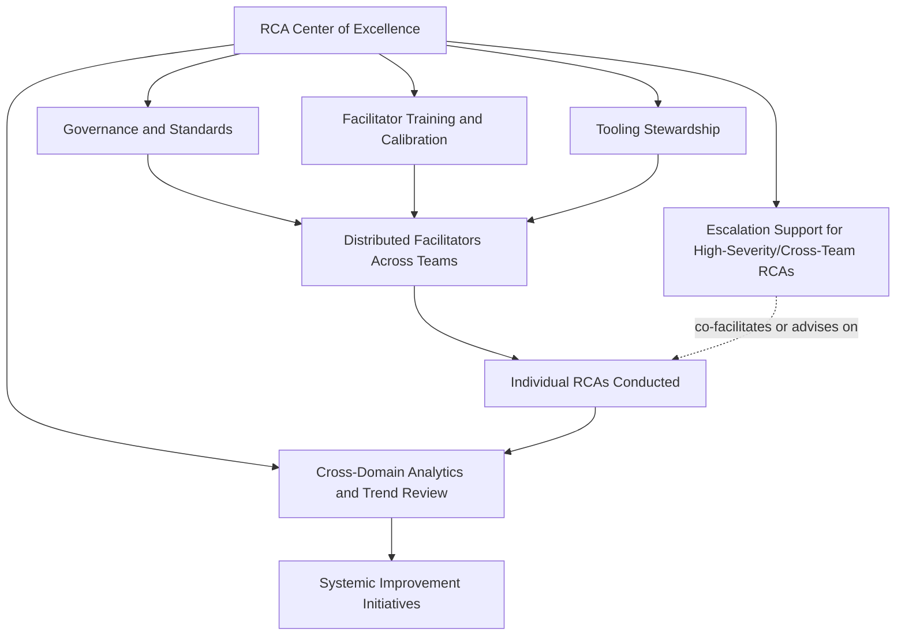

## Building an Internal Center of Excellence

### Purpose and Scope

An internal RCA Center of Excellence (CoE) is the organizational unit that consolidates the governance (designing organizational RCA governance), facilitator development (training pathways and facilitator development), tooling stewardship (RCA software and digital tooling landscape), measurement (metrics for RCA program maturity), and cross-domain trend integration (integrating RCA into continuous improvement cycles) covered throughout this chapter into a single accountable function, rather than leaving each of these responsibilities distributed informally across individual teams. This closing topic addresses when a CoE model is warranted, how it's structured, and the specific risks that come with centralizing a practice that also depends on distributed facilitator capability and team-level ownership.

### What a CoE Does That Distributed Ownership Cannot

**Key Points**

- **Cross-domain pattern detection requires a function with visibility across all domains.** The worked example in integrating RCA into continuous improvement cycles — three structurally identical root causes surfacing across software and security RCAs five months apart — was only detectable because something reviewed both domains' findings together; without a centralized function performing this cross-domain trend review, that pattern-detection responsibility has no natural owner and tends not to happen.
- **Facilitator calibration requires a function with visibility across all facilitators.** The cross-facilitator calibration activity discussed in training pathways and facilitator development (identifying that one facilitator's RCAs consistently terminate at proximate causes while another's reach systemic findings) requires someone reviewing output across the full facilitator pool, which individual team leads reviewing only their own team's RCAs cannot do.
- **Methodology and template stewardship benefits from a single accountable owner.** Without a CoE-equivalent function, methodology and documentation templates (see recurring RCA documentation templates) tend to drift as individual teams make local modifications, eroding the aggregability that makes cross-organizational metrics and trend analysis possible in the first place (see metrics for RCA program maturity).
- **A CoE is not the same as centralizing facilitation itself.** A common and consequential design error is conflating "we need a CoE" with "the CoE should facilitate every RCA" — the CoE model that scales well typically centralizes standards, training, tooling, and analytics while facilitation remains distributed to trained facilitators embedded in or close to the teams experiencing incidents, since local context and availability (particularly for lower-severity incidents needing fast turnaround) often argue against a small central team facilitating every investigation across a large organization.

### CoE Functional Structure

**Governance and standards** — owns the trigger policy, methodology standard, and template design discussed in designing organizational RCA governance, ensuring consistency without necessarily dictating every local process detail.

**Facilitator training and calibration** — owns the skill-progression pathway and cross-facilitator review discussed in facilitator development, functioning as the "facilitator trainer/program owner" tier of that progression at an organizational rather than team level.

**Tooling stewardship** — owns the selection, integration, and maintenance of the tooling stack discussed in RCA software and digital tooling landscape, ensuring the intake/documentation/tracking/analytics chain remains connected rather than fragmenting as individual teams adopt disconnected point solutions.

**Cross-domain analytics and trend review** — performs the periodic aggregation-to-action pipeline activity described in continuous improvement integration, requiring the taxonomy-tagged data access that only a centrally positioned function can practically maintain across domains.

**Escalation support** — provides senior facilitation capacity or advisory support for the highest-severity, cross-team, or politically sensitive investigations referenced in the facilitator skill progression, without being the default facilitator for routine incidents.

### When a CoE Model Is (and Isn't) Warranted

A CoE is a structural investment, and smaller organizations or those with a narrow incident domain (e.g., software-only, no cross-domain complexity) may reasonably operate a mature RCA program without a dedicated centralized unit — the governance, training, and analytics functions described above can be owned by a single senior individual or a rotating responsibility within an existing team, provided the functions themselves are actually performed consistently.

| Organizational Signal | CoE Model More Warranted | Distributed/Lightweight Model Sufficient |
| --- | --- | --- |
| Number of distinct RCA domains (software, security, physical, etc.) | Multiple domains with distinct methodologies | Single domain |
| Incident volume | High enough that facilitator calibration and cross-RCA trend detection have real signal to work with | Low enough that pattern detection can happen informally |
| Organizational size | Large enough that distributed ownership tends to drift without central stewardship | Small enough that informal coordination remains effective |
| Regulatory complexity | Multiple regulatory reporting obligations (see regulatory reporting requirements) requiring specialized handling | Single, well-understood reporting framework |
| Prior evidence of missed cross-team patterns | Repeat incidents traced to the same root cause across different teams, previously undetected | No such history yet observed |

The decision is not binary — many organizations operate a partial CoE model (e.g., centralized governance and tooling, but facilitator training delegated to domain-specific senior facilitators) as an intermediate structure, particularly during the transition from Standardized to Enforced maturity described in the maturity model in metrics for RCA program maturity.

### Risks Specific to Centralization

**Key Points**

- **A CoE can become a bottleneck if facilitation is over-centralized.** As noted above, if the CoE's staff become the default facilitators for all or most RCAs rather than a training/standards/escalation function, incident investigation throughput becomes constrained by CoE headcount rather than scaling with the organization's actual incident volume — this directly undermines the timeliness metrics discussed in program maturity measurement.
- **Centralized ownership can create distance from domain-specific nuance.** A CoE with strong general RCA methodology expertise may lack the deep domain context (the specific attack-chain considerations in security RCA, the exposure-pathway analysis in environmental RCA, the extent-of-condition rigor in nuclear RCA) needed to facilitate or review findings well in every domain the organization spans — this argues for a CoE staffing model that includes domain-experienced facilitators or advisors, not solely generalist process experts.
- **A CoE without genuine authority becomes advisory theater.** Mirroring the governance-authority discussion in designing organizational RCA governance, a CoE that can recommend standards and training but cannot actually enforce trigger-policy compliance, escalate stalled action items, or influence resourcing decisions tends to see its standards followed inconsistently — the CoE's functional scope needs to be paired with the governance-level authority discussed earlier in this chapter, not layered on top of a governance vacuum.
- **Over-standardization can suppress legitimate domain-specific methodology needs.** A CoE pushing a single template or technique (e.g., insisting on linear 5 Whys) across domains where a different technique is genuinely more appropriate (fault tree for multi-causal distributed-systems incidents, ECF charting for higher-consequence physical events) trades consistency for analytical quality — the CoE's standards should specify *when* to use which technique, as discussed in facilitator training curriculum, rather than mandating uniformity for its own sake.

### Maturity Trajectory: From Distributed to CoE and Back to Distributed-with-Standards

A useful way to synthesize this chapter's arc: organizations often move from **fully distributed** (each team runs RCA its own way) → **CoE-centralized** (standards, training, and analytics consolidate, sometimes with over-centralized facilitation as an initial overcorrection) → **distributed-with-standards** (facilitation returns to being distributed across trained, calibrated facilitators embedded near incidents, while governance, training, tooling, and analytics remain centrally stewarded). This final state is functionally what the "Integrated" and "Adaptive" maturity levels in metrics for RCA program maturity describe: a program where the CoE's functions operate continuously in the background, informing and calibrating a distributed facilitator practice, rather than a CoE performing the investigative work itself.

### Related Topics

- Designing organizational RCA governance (the authority structure a CoE's functional scope depends on)
- Training pathways and facilitator development (the calibration function a CoE typically owns)
- Metrics for RCA program maturity (the maturity levels a CoE's existence and function should be evaluated against)
- Integrating RCA into continuous improvement cycles (the cross-domain analytics function a CoE is structurally positioned to perform)
- RCA software and digital tooling landscape (the tooling stewardship responsibility within a CoE's scope)