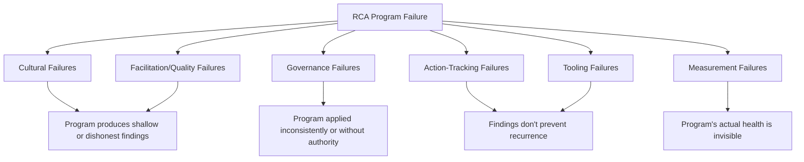

## Common Reasons RCA Programs Fail

### Purpose and Scope

This closing topic synthesizes the failure modes scattered throughout this material — noted individually in nearly every prior section as a "common anti-pattern" or "common failure mode" — into a consolidated diagnostic reference. Rather than introducing new concepts, this section organizes the accumulated failure patterns from across governance, culture, facilitation, tooling, and measurement into a coherent taxonomy, so that an organization assessing its own program (or troubleshooting a program that has stalled) can identify which failure category applies and trace back to the specific chapter section addressing it.

### Failure Taxonomy

### Cultural Failures: Blame Persists Despite Blameless Policy

**Key Points**

- **"Blameless" in name only is the single most cited failure across domains.** As discussed in blameless postmortem culture, a stated blameless policy that isn't matched by consistent behavior elsewhere in the organization (postmortems referenced in performance reviews, leadership naming individuals in incident summaries) erodes trust in the policy regardless of how well-designed the template or facilitation training is — this single failure mode undermines nearly every downstream capability this chapter describes, since accurate root cause data depends on participants believing disclosure is actually safe.
- **RCA quality varies by political sensitivity.** Referenced in designing organizational RCA governance: incidents that are embarrassing, high-visibility, or leadership-adjacent tend to receive softer investigative treatment than equivalent-severity incidents elsewhere, absent explicit structural protection (independent approval authority, uniformly applied trigger policy).
- **Facilitator independence is compromised.** When a facilitator reports to, or is otherwise organizationally close to, the person whose decisions are under investigation, findings tend to terminate at comfortable, non-implicating points — the same structural bias discussed at both the governance level and the individual facilitator level in facilitator development.

### Governance Failures: Inconsistent Application and Missing Authority

- **No explicit trigger policy, or one that's inconsistently applied.** Without a pre-agreed definition of what mandates a formal RCA (see the severity-tiered triage discussion in governance design), severity classification becomes negotiable case-by-case — a well-documented path toward under-investigating inconvenient incidents.
- **Action-tracking authority without consequences.** A governance structure that mandates action items but has no escalation mechanism, visibility to leadership, or resourcing conversation for missed deadlines degrades into what governance design terms "theater" — action items exist on paper without functioning as genuine organizational commitments.
- **No minimum-viable RCA option under resource constraint.** Absent an explicit lighter-weight tier, "we didn't have time" becomes a de facto exemption from causal analysis entirely, rather than triggering a scaled-down but still-genuine investigation.
- **Federated domains with no shared taxonomy.** As discussed in continuous improvement integration, organizations spanning multiple RCA domains (software, security, physical operations) without a common cause taxonomy miss cross-domain patterns entirely — the worked example of three structurally identical root causes appearing across software and security RCAs five months apart depended on aggregation that a fragmented, federated structure would not have supported.

### Facilitation and Quality Failures: Findings Don't Reach Root Cause

- **Stopping at the first plausible cause.** The most frequently repeated single failure mode across this entire material — appearing explicitly in five whys applied to production incidents, root cause analysis applied to vulnerability findings, and construction and structural failure analysis, among others — is terminating the causal chain at a proximate, often human, action rather than tracing to the systemic condition that allowed it.
- **Single-cause bias applied to genuinely multi-causal incidents.** Forcing a linear 5 Whys onto an incident that actually involved multiple co-occurring conditions (common in distributed systems, see root cause analysis in distributed and microservice systems) produces an artificially narrow finding that misses contributing factors a fishbone or fault-tree approach would have surfaced.
- **Unverified evidentiary claims.** Causal steps asserted from plausibility or intuition rather than backed by a specific evidence artifact — the correlation-mistaken-for-causation risk emphasized in correlating logs, metrics, and traces for causation — produces findings that are internally consistent but not actually verified.
- **No extent-of-pattern or blast-radius check.** Concluding an investigation at the single instance that triggered it, without checking whether the same vulnerability, misconfiguration, or root cause exists elsewhere (the extent-of-condition discipline emphasized in nuclear practice, distributed systems blast-radius analysis, and vulnerability RCA) leaves structurally identical risk unaddressed and undiscovered.
- **No facilitator calibration.** Without periodic cross-facilitator review (see facilitator development), inconsistent finding depth across facilitators persists undetected, undermining the aggregability the entire program depends on.

### Action-Tracking Failures: Findings Don't Prevent Recurrence

- **Closed does not mean verified effective.** The verification-gap pattern worked through in detail in preventing repeat incidents through action tracking: an action item marked "done" because a narrow technical task was completed, while the broader systemic gap that produced the incident remains open — producing a structurally identical repeat incident later.
- **Action items tracked outside the team's normal workflow.** Items logged only in a postmortem document or dedicated RCA tool, rather than the team's standard issue tracker, have a materially higher rate of going stale, as discussed in both action tracking and tooling landscape.
- **No distinction between remediation, corrective, and preventive actions.** Treating all corrective actions as equivalent obscures that remediation (fixing this instance) is nearly always completed while preventive actions (addressing the broader systemic gap) are disproportionately left open or under-resourced — a pattern repeated across software, security, and process-safety domains throughout this material.
- **No accountable owner or date on action items.** Diffuse ownership ("the platform team will address") correlates strongly with items remaining open indefinitely.

### Measurement Failures: Program Health Is Invisible

- **Activity metrics mistaken for effectiveness metrics.** Counting RCAs conducted or action items logged, as discussed in metrics for RCA program maturity, measures volume, not whether recurrence actually stopped — the harder-to-measure effectiveness metrics (recurrence rate by root-cause category, verified-effective rate) are frequently the ones organizations skip precisely because they're harder to instrument.
- **Optimizing a single metric in isolation.** A high closure rate achieved by facilitators gravitating toward easily-closeable proximate causes looks good on one dimension while indicating a governance and quality failure on another — the reason the maturity framework insists on a metric portfolio rather than any single number.
- **Metrics collected but not acted upon.** A dashboard that leadership doesn't review or act on provides no more organizational value than not measuring at all — measurement without an attached escalation and resourcing mechanism is inert.
- **Insufficient time horizon for effectiveness assessment.** Declaring an action "effective" immediately upon implementation, without a monitored period long enough to observe whether recurrence actually stopped, conflates implementation completion with verified effectiveness.

### Tooling Failures: Infrastructure Undermines Process

- **Tool selection preceding governance design.** As discussed in tooling landscape, adopting a specific RCA platform before defining trigger policy, methodology standard, and ownership risks the tool's built-in assumptions silently becoming the de facto governance model.
- **Fragmented, non-integrated tooling stack.** Action items logged in a dedicated RCA tool that doesn't connect to the team's actual working issue tracker tend to be worked less reliably than items in the team's normal workflow — integration matters more than any single tool's feature depth.
- **No taxonomy tagging at intake.** Without consistent cause-code tagging, cross-RCA pattern detection depends on someone manually recalling or re-reading a large document archive, which does not scale and misses patterns that only aggregate analysis would reveal.

### Diagnostic Use: Matching Symptoms to Failure Category

| Observed Symptom | Likely Failure Category | Reference Section |
| --- | --- | --- |
| Reporting volume declining over time | Cultural | Blameless postmortem culture |
| Same root cause recurring across unrelated incidents | Action-tracking or Governance | Preventing repeat incidents through action tracking |
| RCA quality wildly inconsistent across teams | Facilitation/Quality | Training pathways and facilitator development |
| Leadership surprised by a "known" risk during a new incident | Measurement or Governance | Designing organizational RCA governance |
| Action items open for months with no visible owner | Action-tracking | Preventing repeat incidents through action tracking |
| Embarrassing incidents get lighter investigation than routine ones | Cultural/Governance | Designing organizational RCA governance |
| No one can say whether the program is improving | Measurement | Metrics for RCA program maturity |

### Related Topics

- Blameless postmortem culture (root of the most cited cultural failure mode)
- Designing organizational RCA governance (authority and consistency failures)
- Preventing repeat incidents through action tracking (the verification-gap failure pattern in depth)
- Metrics for RCA program maturity (the measurement discipline that makes failure detectable before it compounds)
- Building an internal center of excellence (a structural response to several of the governance and calibration failures listed here)