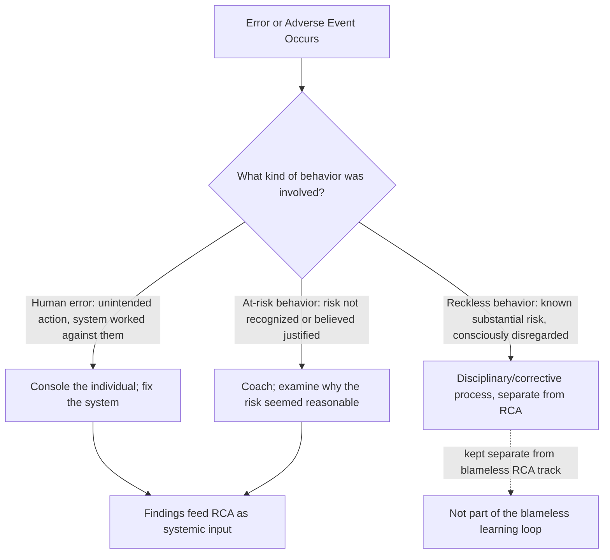

## Building a Blameless, Learning Oriented Culture

### Purpose and Scope

This topic addresses the cultural foundation underneath every RCA practice covered in this material — the organization-wide disposition toward error, disclosure, and systemic thinking that determines whether the governance structures, facilitation techniques, and tooling described throughout this chapter and the domain chapters actually function as intended, or degrade into the "blameless in name only" failure pattern identified as the single most cited failure mode in common reasons RCA programs fail. Where blameless postmortem culture addressed the software/SRE-specific instantiation of this practice, this section addresses the broader organizational culture-building work that makes blamelessness genuinely durable across an entire organization and across every RCA domain covered in this material.

### Distinguishing Culture from Policy

**Key Points**

- **A blameless policy document is necessary but not sufficient.** Every domain in this material that touches human performance — nuclear's latent-organizational-condition tracing, healthcare's Just Culture model, software's blameless postmortems, security's distinction between exploited human error and willful misconduct — depends on the same underlying cultural substrate: people believing, based on actual lived experience of how the organization behaves, that honest disclosure will not be punished. A written policy states the intent; culture is what people actually experience when they test that intent by disclosing something risky.
- **Culture is demonstrated through consequences, not stated through values.** The clearest cultural signal an organization sends is not its stated values but what observably happens to the first few people who disclose a significant error under the new policy — if those disclosures are met with genuine systemic curiosity rather than informal consequence, the policy becomes credible; if not, no amount of subsequent messaging repairs the damage quickly.
- **Leadership behavior sets the ceiling for organizational behavior.** A team can maintain excellent blameless facilitation practice internally, but if leadership publicly names individuals in incident summaries, references postmortem involvement in performance conversations, or visibly reacts punitively to a disclosed error even once, the credibility of blamelessness across the entire organization is affected, not just within that specific interaction — this asymmetry (slow to build, fast to damage) is a defining property of trust-based cultural change generally, not unique to RCA culture specifically. [Inference — this asymmetric trust-building pattern is widely discussed in organizational psychology and safety-culture literature, presented as a general pattern rather than a certainty in every case]

### The Just Culture Model as Structural Foundation

The Just Culture framework — referenced throughout this material in healthcare (patient safety reporting systems), nuclear (nuclear industry root cause practices), security (post incident reviews for security breaches), and software (blameless postmortem culture) — provides the structural logic that makes blamelessness compatible with genuine accountability, rather than an excuse for it:

This three-way distinction is what allows an organization to be simultaneously blameless *and* accountable: the overwhelming majority of incidents in a well-functioning organization trace to human error or at-risk behavior, both of which the Just Culture model treats as system-focused learning opportunities rather than individual failures — but the model does not extend blameless treatment to willful, knowing disregard of a recognized substantial risk, preserving a distinct and appropriate track for that much rarer category. An organization that fails to make this distinction clear tends toward one of two failure poles: either treating every error uniformly punitively (suppressing disclosure, the classic blame-culture failure), or treating every error uniformly without consequence regardless of category (which can itself undermine trust if colleagues perceive that genuinely reckless behavior goes unaddressed).

### Building Blocks of a Learning-Oriented Culture

**Key Points**

- **Psychological safety must be established before it's tested by a significant incident, not during one.** Waiting until a major incident to demonstrate blameless treatment means the first real test of the policy happens under maximum stakes and visibility — organizations that build psychological safety through lower-stakes practice (near-miss reporting, lightweight postmortems for minor incidents, openly discussing "what almost went wrong") create a track record before a high-severity incident puts the policy under real pressure.
- **Near-miss and unsafe-condition reporting volume is a leading cultural health indicator.** As discussed in patient safety reporting systems, reporting volume for events that caused no harm is one of the most direct behavioral signals of psychological safety, since near-miss disclosure has no external forcing function (unlike a visible outage, which gets reported regardless of culture) — a declining or stagnant near-miss reporting rate, tracked over time, is an earlier warning sign of cultural erosion than any RCA-quality metric.
- **Leaders modeling their own error disclosure has outsized cultural effect.** A leader who visibly and genuinely participates in a blameless postmortem about their own decision — not merely presiding over others' postmortems — demonstrates the behavior the culture asks of everyone else, and this kind of visible reciprocity is frequently cited as more influential on broader disclosure behavior than any written policy or training program.
- **Cross-team and cross-level participation in RCA reduces the "us vs. them" dynamic.** Structuring investigations to include people from adjacent teams, different seniority levels, and (where appropriate) leadership as genuine participants — not merely reviewers receiving a summary — reinforces that the process is organization-wide learning rather than a mechanism applied to one team by another.
- **Language matters at the sentence level, consistently, not just in official documents.** The blame-redirection facilitation skill discussed in training pathways and facilitator development (reframing "X forgot to check the dashboard" toward systemic framing) needs to be a norm practiced in everyday conversation — Slack threads, hallway conversations, status updates — not confined to the formal postmortem document, since inconsistent application (blameless in the document, blame-oriented in casual conversation) is precisely the "blameless in name only" pattern that undermines trust.

### Cultural Signals That Indicate Erosion

Extending the "blameless in name only" failure discussed in blameless postmortem culture and common reasons RCA programs fail, specific observable signals that blameless culture is degrading (even while formal policy remains unchanged) include:

| Signal | What It Indicates |
| --- | --- |
| Declining near-miss/unsafe-condition reporting volume | Reduced psychological safety, often preceding a visible increase in more severe incidents |
| Postmortem participants becoming notably more guarded or terse over time | Erosion of trust that disclosure is genuinely safe |
| Informal "who was responsible" conversations persisting alongside formal blameless documentation | Blameless framing not actually internalized, only performed in the official artifact |
| Postmortem attendance becoming reluctant or minimal beyond required participants | Perceived low value or discomfort with the process |
| Root cause findings consistently trending toward the same few "usual suspect" teams or individuals | Possible facilitator bias, insufficient independence, or genuine systemic issue concentrated there — requires investigation to distinguish |

### Relationship to This Material's Broader RCA Practice

This cultural foundation is what makes every technique covered elsewhere in this material actually work as intended: the evidence-discipline expected in telemetry correlation and evidence-per-Why practice depends on people being willing to share the full, sometimes unflattering, evidentiary record; the extent-of-pattern and blast-radius checks emphasized throughout depend on people volunteering "this might also affect X" rather than narrowly answering only what's asked; and the action-tracking verification discipline depends on people being honest about whether a fix actually worked rather than reporting convenient but unverified success. A technically excellent RCA methodology layered on top of a blame-oriented culture will systematically produce less accurate, less complete findings than a modest methodology operating within genuine psychological safety — culture is not one input among many to RCA quality; it is the precondition that determines whether the other inputs can function at all.

### Related Topics

- Blameless postmortem culture (the software/SRE-specific document and facilitation practice this broader culture supports)
- Just Culture algorithm and its distinction between human error, at-risk behavior, and recklessness
- Patient safety reporting systems and near-miss reporting as a cultural health indicator
- Training pathways and facilitator development (the blame-redirection skill this culture depends on being practiced consistently)
- Common reasons RCA programs fail (the "blameless in name only" failure this topic addresses the prevention of)