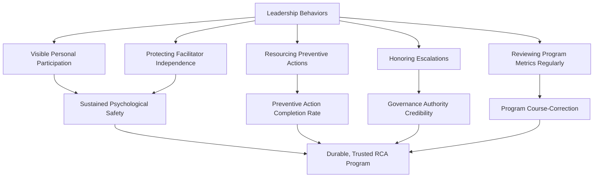

## Leadership's Role in Sustaining RCA Practice

### Purpose and Scope

This topic isolates leadership's specific contribution to RCA program durability from the broader cultural and structural themes addressed elsewhere in this material. Where building a blameless, learning oriented culture addressed the organization-wide cultural substrate and designing organizational RCA governance addressed formal structures, this section addresses what leaders — specifically people with authority over resourcing, promotion, and organizational priority — must do differently from individual contributors and facilitators to keep an RCA program functioning years after its initial launch, when the founding energy and executive attention that established it has naturally diffused elsewhere.

### Why Leadership Involvement Is Structurally Different from Practitioner Involvement

**Key Points**

- **Leaders control the resourcing decisions that determine whether preventive action is possible.** The remediation-vs-preventive distinction emphasized throughout this material (preventing repeat incidents through action tracking, process safety management and HAZOP relation, root cause analysis applied to vulnerability findings) repeatedly shows that preventive actions — the ones addressing systemic gaps rather than single instances — are disproportionately the ones left unresourced. This is not primarily a facilitation or documentation failure; it is a resourcing-priority decision that only someone with budget and roadmap authority can make, meaning leadership engagement is a structural precondition for preventive action completion, not merely a nice-to-have.
- **Leaders set the ceiling for psychological safety through their own visible behavior.** As established in building a blameless, learning oriented culture, a leader's visible reaction to a disclosed error — especially their own — has outsized influence on organization-wide disclosure behavior compared to any policy document or training program; this makes leadership behavior a distinct causal lever from facilitator training or documentation quality, one that cannot be delegated to the RCA program's operational staff.
- **Leaders determine whether governance authority is real or nominal.** The governance-authority discussion in designing organizational RCA governance repeatedly notes that action-tracking authority, escalation paths, and independent facilitator approval "have teeth" only when leadership actually honors escalations and resourcing requests that flow through them — a governance structure with well-designed authority on paper but no leadership follow-through degrades into the "theater" pattern identified in common reasons RCA programs fail.
- **Leaders are the primary audience for program-level metrics, and their engagement with those metrics determines whether measurement drives improvement.** As noted in metrics for RCA program maturity, "a dashboard that leadership doesn't act on provides no more organizational value than not measuring at all" — the metrics themselves are inert without a leader who reviews them regularly and asks what they imply for resourcing and priority.

### Specific Leadership Behaviors That Sustain RCA Practice

**Visible personal participation** — Leaders participating genuinely in postmortems and RCAs of their own decisions, not merely as reviewers of others' findings, was identified in building a blameless, learning oriented culture as one of the highest-leverage single behaviors for sustaining broader disclosure culture — this needs to recur periodically, not occur once as a symbolic launch gesture.

**Resourcing preventive actions** — Deliberately reviewing the preventive-tier action items surfaced by RCA (distinct from remediation-tier items, which typically get resourced as a matter of course since they're small and locally scoped) and ensuring they compete meaningfully for roadmap or budget priority, rather than defaulting to indefinite deferral because they lack a specific, visible triggering urgency the way an active incident does.

**Honoring escalations** — When a governance structure's escalation path surfaces a finding requiring leadership decision (cross-team resourcing conflict, recurring root cause needing organization-wide policy change, as in the aggregation-to-action pipeline described in integrating RCA into continuous improvement cycles), leadership responding promptly and substantively — rather than allowing escalated items to stall silently — is what gives the escalation path its practical meaning.

**Reviewing program metrics regularly** — Treating the coverage, quality, timeliness, and effectiveness metrics discussed in program maturity measurement as a standing agenda item (analogous to how leadership reviews other operational health metrics), rather than only encountering RCA program data reactively when a specific incident forces attention.

**Protecting facilitator independence** — Actively defending the structural independence discussed in facilitator development and governance design — ensuring facilitators are not pressured, formally or informally, to soften findings that implicate leadership-adjacent decisions, which requires leadership to explicitly and repeatedly signal (through action, not just statement) that they want accurate findings even when those findings are uncomfortable.

### The Founder/Launch Energy Problem

A specific and commonly observed failure trajectory: an RCA program launches with strong executive sponsorship (often following a significant incident that created organizational urgency), performs well initially while that sponsorship remains visible and active, and then degrades as leadership attention naturally redistributes toward other priorities once the triggering incident recedes from immediate memory. This is distinct from the cultural erosion discussed in building a blameless, learning oriented culture — it is specifically about *sustained leadership engagement* rather than *sustained psychological safety*, though the two compound each other over time.

**Key Points**

- **A program's early success under strong sponsorship can mask structural fragility.** If a program's coverage, quality, and action-completion metrics look healthy primarily because a highly engaged executive sponsor is personally driving compliance, those metrics may not reflect durable organizational capability — a useful diagnostic question is whether the program would continue functioning at the same level if that specific sponsor changed roles or left.
- **Institutionalizing leadership engagement reduces dependency on any single sponsor.** Building the metric-review cadence, escalation-honoring practice, and resourcing-review process into standing organizational rhythms (recurring calendar commitments, explicit inclusion in planning cycles) rather than leaving them to an individual leader's personal initiative and memory makes the program more resilient to leadership turnover.
- **Successor leaders need explicit onboarding into the program's expectations, not just inherited artifacts.** A new leader inheriting oversight of an RCA program (through role change, reorganization, or turnover) benefits from explicit briefing on what engagement the program depends on from them specifically — the metric review cadence, the escalation-honoring norm, the resourcing-priority expectation — rather than assuming they will independently discover and continue the previous leader's informal practices. [Inference — this reflects a general pattern in sustaining leadership-dependent organizational practices through transitions, not a claim specific to any particular organization's experience]

### Distinguishing Genuine Engagement from Performative Sponsorship

Not all visible leadership activity around RCA indicates genuine sustaining engagement. Some patterns that look like leadership support but don't function as such:

| Performative Pattern | Why It Doesn't Sustain the Program |
| --- | --- |
| Attending a postmortem but only as a passive observer | Doesn't model the vulnerability of genuine participation described in building a blameless, learning oriented culture |
| Citing the RCA program favorably in external communications without engaging with its internal metrics | Signals external reputation value without the internal engagement that drives actual improvement |
| Approving the initial governance policy but never revisiting escalations or resourcing requests | Provides launch-phase sponsorship without the sustained engagement this section addresses |
| Requesting RCA summaries only after a significant incident, rather than reviewing program health metrics on a standing cadence | Reactive rather than the proactive, standing engagement that catches degradation before it produces a repeat incident |

The distinguishing test across these examples is whether the leadership behavior is **triggered by an external event** (a specific incident, an external audit, a reputational concern) or **standing and self-initiated** (a recurring metric review, a default expectation of personal participation, an ongoing resourcing conversation) — only the latter pattern provides the sustained engagement that prevents the founder/launch energy problem described above.

### Related Topics

- Building a blameless, learning oriented culture (the cultural foundation leadership behavior most directly shapes)
- Designing organizational RCA governance (the authority structures leadership engagement makes credible)
- Metrics for RCA program maturity (the standing review leadership engagement should include)
- Preventing repeat incidents through action tracking (the preventive-action resourcing leadership decisions most directly affect)
- Common reasons RCA programs fail (several failure modes this section addresses the leadership-side prevention of)