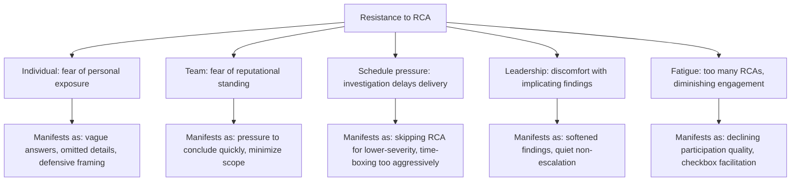

## Overcoming Resistance to Root Cause Investigations

### Purpose and Scope

This topic addresses the specific, practical resistance patterns — from individuals, teams, and organizational structures — that RCA practitioners and program sponsors encounter, and structured approaches to addressing each. Where building a blameless, learning oriented culture addressed the cultural foundation and leadership's role in sustaining RCA practice addressed sustained leadership engagement, this section addresses resistance as an active, ongoing force that a mature program must continually work against rather than a problem solved once at program launch.

### Why Resistance Persists Even in Mature Programs

**Key Points**

- **Resistance is rational from the perspective of the person experiencing it, even when it's organizationally costly.** An individual who has experienced (or heard secondhand about) a colleague facing informal consequence after a disclosed error is behaving rationally by resisting future disclosure, even in an organization with a genuinely improved blameless policy — resistance frequently lags actual cultural improvement because trust rebuilds slower than policy changes, a dynamic also noted in the asymmetric trust-building discussion in building a blameless, learning oriented culture.
- **Schedule and delivery pressure creates a structural, recurring incentive against thorough investigation.** This is not a one-time obstacle to overcome but a continuous tension: every RCA competes for time against active delivery work, and this tension resets with every new incident rather than being permanently resolved by a single successful investigation.
- **Resistance often targets the investigation's depth, not its existence.** Teams rarely resist RCA outright (particularly once a program is established); resistance more commonly manifests as pressure to conclude at a proximate cause rather than continue to a systemic one — "we found the bug, can we close this" — which is harder to identify and address than outright refusal to participate.
- **Different resistance sources require different responses.** Resistance from an individual contributor worried about personal exposure, resistance from a manager worried about their team's standing, and resistance from an executive worried about external disclosure implications are distinct problems requiring distinct approaches, even though they can present similarly as "pushback on the investigation."

### Common Resistance Patterns and Sources

### Addressing Individual Fear of Exposure

- **Demonstrated consistency over time, not reassurance in the moment.** Verbal reassurance ("this is blameless, you won't be blamed") offered during the investigation itself carries limited weight compared to the person's accumulated experience of how the organization has actually behaved in prior disclosures — this reinforces why building a blameless, learning oriented culture emphasizes lower-stakes practice (near-miss reporting) as the mechanism for building this track record before a high-stakes incident tests it.
- **Facilitator technique matters directly here.** The blame-redirection skill discussed in training pathways and facilitator development — reframing individual action toward systemic conditions in real time — directly reduces the felt exposure risk during the investigation itself, independent of the organization's broader track record.
- **Explicit, structural protection from performance-review linkage.** As noted in blameless postmortem culture, explicitly stating (and, more importantly, actually maintaining) that postmortem participation and findings will not feed performance evaluation is a structural safeguard that reduces the rational basis for individual resistance, though it depends on genuine enforcement, not just the stated policy.

### Addressing Team-Level Reputational Resistance

- **Framing findings as shared organizational learning, not team-specific fault.** Since root causes frequently trace past a single team's control (a shared policy, a legacy standard not retroactively applied, an organization-wide tooling gap — patterns repeated throughout this material), accurately attributing systemic findings to their actual organizational scope, rather than allowing them to be read as specific to the investigated team, reduces the reputational stake that drives resistance.
- **Consistent trigger-policy application across teams reduces perceived targeting.** If RCA depth and scrutiny visibly varies by team (whether due to inconsistent governance or genuine favoritism), resistance concentrates in teams that perceive themselves as disproportionately scrutinized — the uniform trigger-policy application discussed in designing organizational RCA governance directly addresses this resistance source, not merely a general quality concern.
- **Highlighting "what went well" sections consistently.** The balanced documentation practice discussed in writing effective postmortem documents serves a resistance-reduction function beyond its cultural-signaling purpose: teams that see their effective response actions documented alongside systemic gaps experience the process as fairer than one that only catalogs what went wrong.

### Addressing Schedule and Delivery Pressure

- **A minimum-viable RCA tier removes the false choice between "full investigation" and "no investigation."** As discussed in common reasons RCA programs fail, the absence of an explicit lighter-weight option under resource constraint tends to produce a de facto exemption from causal analysis entirely — providing a legitimate, faster tier (apparent-cause-style, mirroring the nuclear ACE/RCE distinction) gives time-pressured teams a genuine option rather than forcing a binary choice that resistance will usually resolve toward skipping the process altogether.
- **Timeboxing the causal-chain depth, not the investigation's existence.** Rather than allowing schedule pressure to eliminate RCA outright, structuring investigations with an explicit, bounded time allocation (per the severity-tiered depth discussed in incident severity classification and timelines) channels the pressure toward efficient facilitation rather than toward skipping causal analysis.
- **Demonstrating downstream time savings from thorough investigation.** Where an organization can show (via the recurrence-rate metrics discussed in metrics for RCA program maturity) that investigations reaching genuine systemic root causes reduce future incident volume, this provides a concrete counter-argument to the "this is slowing us down" resistance framing — though this argument depends on having the effectiveness data to actually make it, which itself requires the measurement discipline discussed throughout the prior chapter.

### Addressing Leadership Discomfort with Implicating Findings

- **Distinguishing internal learning from external disclosure early in the process.** Some leadership resistance to thorough investigation stems from conflating the internal causal analysis with what eventually becomes externally visible (in regulatory reporting, customer communication, or public disclosure) — clarifying early that the internal RCA can and should pursue full depth regardless of what subset of findings later gets externally communicated (a distinction also relevant to the security-domain legal-review branching discussed in post incident reviews for security breaches) can reduce this specific resistance source.
- **Leadership modeling, revisited.** As emphasized in leadership's role in sustaining RCA practice, a leader who has previously participated genuinely in an RCA implicating their own decision provides a credible signal that reduces resistance to future findings implicating leadership-adjacent decisions — this is a compounding effect: each instance of genuine leadership participation reduces resistance to the next.
- **Protecting facilitator independence explicitly in cases involving leadership-adjacent findings.** Where a finding is likely to implicate a leadership decision, the independence protections discussed in governance design and facilitator development become particularly load-bearing — this is precisely the scenario those structural protections exist for, not an edge case they merely happen to also cover.

### Addressing RCA Fatigue

- **Right-sizing investigation frequency and depth to actual severity, not defaulting to maximum rigor for everything.** The severity-tiered rigor mapping emphasized throughout this material (nuclear's ACE/RCE split, software's SEV-scaled postmortem requirements) exists partly for this reason: applying full-depth investigation to every incident regardless of severity produces fatigue that degrades engagement quality even for the incidents that genuinely warrant deep investigation.
- **Rotating facilitation and participation load.** Concentrating investigation burden on a small group of frequent participants (whether facilitators or subject-matter experts repeatedly pulled into RCAs) accelerates fatigue-driven resistance in that group specifically — distributing this load, supported by the facilitator development pathway discussed elsewhere in this material, mitigates this.
- **Closing the loop visibly so participation feels consequential.** Participants who see their prior RCA contributions translate into actual implemented and verified change (the feedback-loop propagation discussed in integrating RCA into continuous improvement cycles) are more likely to engage genuinely in future investigations than participants who perceive their prior contributions as having disappeared into an unresponsive process — visible follow-through is itself a resistance-reduction mechanism, not merely a program-effectiveness one.

### Related Topics

- Building a blameless, learning oriented culture (the cultural foundation individual and team-level resistance responses depend on)
- Leadership's role in sustaining RCA practice (leadership-specific resistance and the modeling behavior that reduces it)
- Incident severity classification and timelines (the tiered-rigor structure that addresses schedule-pressure resistance)
- Training pathways and facilitator development (the blame-redirection skill directly relevant to individual exposure resistance)
- Common reasons RCA programs fail (several resistance patterns' downstream consequences if left unaddressed)