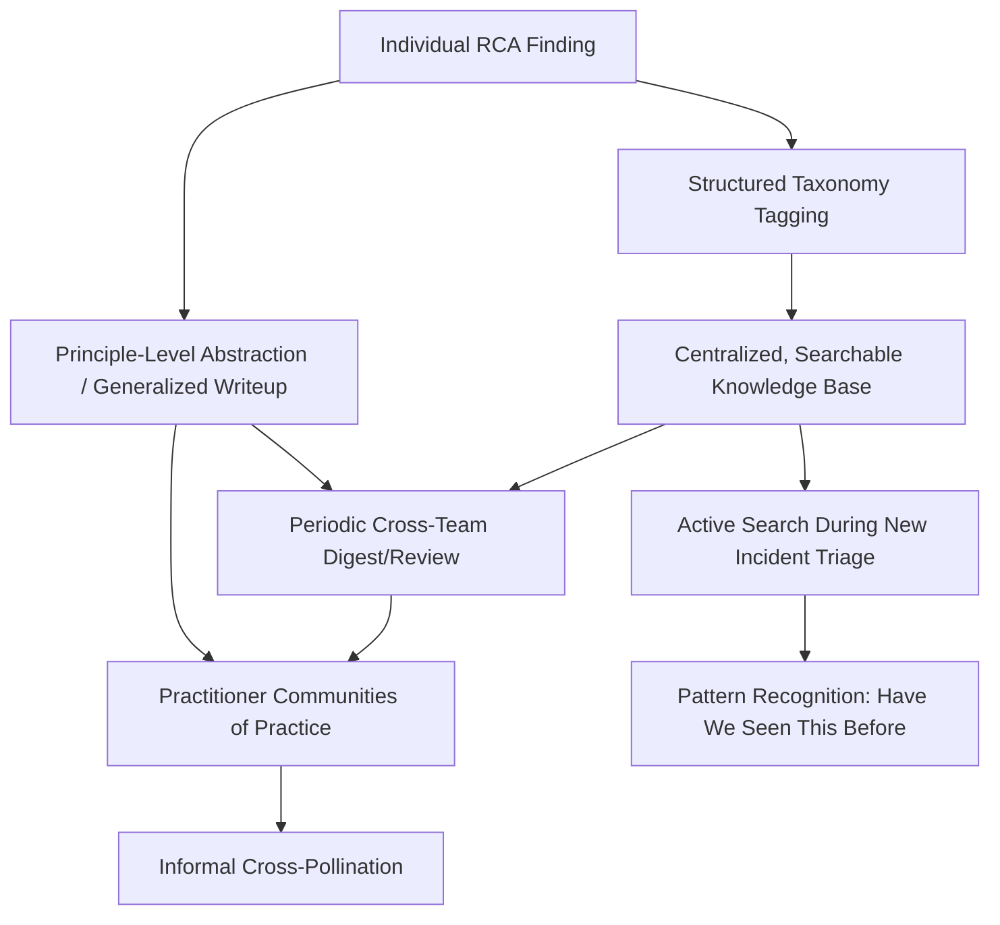

## Knowledge Sharing Across Teams and Departments


### Purpose and Scope

This topic addresses the mechanisms by which RCA findings move beyond the team or department that originated them to inform practice elsewhere in the organization — the practical infrastructure and social practice underlying several concepts referenced throughout this material (cross-fleet trending in nuclear industry root cause practices, cross-institutional benchmarking in patient safety reporting systems, and cross-domain pattern detection in integrating RCA into continuous improvement cycles) but not yet addressed directly as its own discipline. Where those sections established *why* cross-boundary knowledge transfer matters, this section addresses *how* organizations actually build the channels, incentives, and formats that make it happen reliably rather than depending on chance encounters or individual initiative.

### Why Findings Stay Siloed Without Deliberate Mechanisms

**Key Points**

- **Default organizational information flow follows reporting lines, not causal relevance.** An RCA finding naturally reaches the team that experienced the incident and their direct management chain; it has no automatic path to a structurally similar team elsewhere in the organization unless a deliberate mechanism creates one — this is distinct from a cultural or willingness problem; it is a structural information-routing gap that persists even in organizations with strong blameless culture and full leadership support.
- **Taxonomy and terminology differences between teams obscure genuine similarity.** Two teams experiencing structurally identical root causes (as in the retroactive-policy-application pattern worked through in continuous improvement integration) may describe them using entirely different internal vocabulary, meaning even a searchable knowledge base (see the tagging discussion in recurring RCA documentation templates and tooling landscape) can fail to surface the connection unless taxonomy is normalized across teams, not just within each team's own documentation.
- **"Not my domain" filtering discards relevant findings prematurely.** A security team encountering a software team's postmortem about credential caching hardening might reasonably (but incorrectly) file it as "not applicable to us" without recognizing the underlying access-control principle applies to their own domain — findings framed narrowly around their originating domain's specific terminology and context are harder for adjacent domains to recognize as relevant than findings that explicitly surface the transferable principle.
- **Incentive structures rarely reward cross-team knowledge-sharing effort explicitly.** Absent specific recognition or expectation, the effort required to translate a team-specific finding into a broadly shareable form, or to actively scan other teams' findings for relevance to one's own work, competes against locally-scoped work that has clearer, more immediate credit — this mirrors the preventive-action resourcing problem discussed in leadership's role in sustaining RCA practice, applied to knowledge-sharing effort rather than corrective-action implementation.

### Mechanisms for Cross-Boundary Knowledge Transfer



**Structured taxonomy tagging** — the foundational requirement discussed throughout this material (RCA software and digital tooling landscape, integrating RCA into continuous improvement cycles): consistent cause-code categorization is what allows a finding to be discovered by someone outside the originating team's normal information flow, converting tacit, team-local knowledge into something a search or review process can surface.

**Centralized, searchable knowledge base** — the tooling foundation (discussed in RCA software and digital tooling landscape) that makes historical findings discoverable — its value depends directly on tagging discipline and on being the place practitioners actually check during new incident triage, not merely an archive that exists but goes unused.

**Periodic cross-team digest or review** — a scheduled (not incident-triggered) activity, structurally similar to the cross-domain trend review discussed in continuous improvement integration, but focused specifically on surfacing individual findings worth broader attention rather than only aggregate patterns — this can take the form of a regular newsletter, a recurring review meeting with representation across teams, or a curated "notable findings" summary.

**Active search during new incident triage** — embedding a step in the facilitation process (see training pathways and facilitator development) where a new investigation explicitly checks the knowledge base for structurally similar prior findings before concluding its own causal chain — this both accelerates the current investigation and reinforces the value of well-tagged historical documentation, creating a positive feedback loop for documentation quality.

**Communities of practice** — informal or semi-formal groups (practitioners with shared technical or domain interest, cutting across formal team boundaries) that provide a social channel for cross-pollination distinct from and complementary to formal documentation review, often surfacing relevance connections that automated search or scheduled review might miss.

**Principle-level abstraction** — the specific writing practice of extracting a finding's transferable principle from its team-specific instance, distinct from writing effective postmortem documents' general clarity guidance: a finding written as "our checkout endpoint had a testing gap" transfers poorly; a finding written as "testing standards introduced after initial service implementation are not automatically retroactively applied" transfers to any team, in any domain, facing an analogous legacy-standard gap.

### Worked Example: Principle Extraction for Transfer



```
Team-specific framing (as originally written):
"The checkout-service endpoint lacked load testing because 
it predates our current testing standard."

Principle-level abstraction (added for cross-team sharing):
"General pattern: policy and standard updates in this 
organization are applied prospectively to new systems but 
have no defined mechanism for retroactive application to 
pre-existing ones. This pattern may apply wherever a standard, 
policy, or requirement has been updated since a system's 
original implementation — worth checking for security 
policies, compliance requirements, and infrastructure 
standards, not just testing coverage."
```

This is the same underlying pattern surfaced through aggregate cross-domain trend review in the worked example from integrating RCA into continuous improvement cycles, but achieved here through a different mechanism: explicit principle-level writing at the time of the original finding, rather than requiring a separate aggregate review process to notice the pattern later. The two mechanisms are complementary — principle-level writing increases the odds that a reader elsewhere in the organization self-identifies relevance, while aggregate trend review catches patterns even when individual findings weren't written with transfer in mind.

### Cross-Domain Knowledge Sharing Specifically

Given this material's coverage of software, security, healthcare, nuclear, process safety, environmental, and construction/structural RCA domains, a specific and higher-value form of knowledge sharing is **cross-domain** transfer — recognizing that a governance pattern, causal archetype, or corrective-action category from one domain applies in another, even though the domains share no operational overlap:

| Cross-Domain Transfer Example | Source Domain | Applicable Elsewhere |
| --- | --- | --- |
| Extent of Condition / blast-radius review | Nuclear industry root cause practices | Distributed systems (see distributed and microservice RCA), vulnerability RCA, structural failure analysis |
| Remediation vs. preventive action distinction | Environmental incident investigation, process safety | Software action tracking, security PIR corrective actions |
| Just Culture human-error/at-risk/reckless distinction | Patient safety reporting systems, nuclear practices | Software blameless postmortems, security insider-threat handling |
| MOC-style retroactive-standard-application gap | Process safety management and HAZOP relation | Software testing standards, security policy exemptions (worked example above) |

This cross-domain transfer is largely what this material's own structure has attempted to make explicit throughout — repeatedly noting where a technique or failure pattern from one domain parallels another — precisely because cross-domain transfer is the least likely to happen organically without deliberate structural encouragement, given that practitioners in different domains rarely share reporting lines, tooling, or even vocabulary.

### Related Topics

- Integrating RCA into continuous improvement cycles (the aggregate cross-domain trend-review mechanism this section complements)
- RCA software and digital tooling landscape (the searchable knowledge-base infrastructure this depends on)
- Writing effective postmortem documents (general clarity practice, distinct from but complementary to principle-level abstraction)
- Building an internal center of excellence (a structural owner for cross-team knowledge-sharing mechanisms)
- Root cause taxonomy design for cross-institutional and cross-domain benchmarking