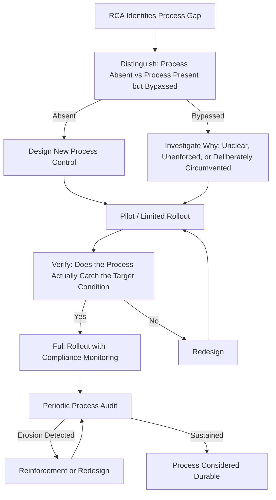

## Feedback Loops Between Findings and Process Design


### Purpose and Scope

This topic addresses the specific mechanism by which RCA findings reshape the processes that produced the incidents in the first place — the organizational-design counterpart to the technical and security-specific feedback loops covered in feeding lessons learned back into security posture and the aggregation-to-action pipeline covered in integrating RCA into continuous improvement cycles. Where those sections addressed detection engineering, architecture, and cross-domain pattern aggregation, this section addresses the narrower and more foundational question: how does a single RCA finding actually change the *process* (the SDLC, the deployment pipeline, the change-management workflow, the review gate) that allowed the incident to occur, and what makes that change durable rather than reverting once the specific incident's memory fades.

### Why Process Change Is a Distinct Feedback Target

**Key Points**

- **Process design is upstream of most other corrective-action categories.** A detection rule (see feeding lessons learned back into security posture) catches a technique after it occurs; an architecture change (circuit breakers, segmentation) limits blast radius after a fault begins; a process change — a new review gate, a revised MOC classification criterion, an updated testing-standard rollout mechanism — is intended to prevent the triggering condition from arising in the first place, making it structurally the most preventive of the corrective-action categories discussed throughout this material.
- **Process changes are also the most likely to erode silently over time.** Unlike a deployed detection rule or an architecture change, which persists as a technical artifact until deliberately removed, a process change (a new required review step, a revised checklist) depends on continued human compliance — it can be gradually skipped under schedule pressure without any single visible decision to remove it, making it more fragile than technical corrective actions even when equally well-designed at the time of implementation.
- **The MOC-classification pattern seen throughout this material is fundamentally a process-design feedback problem.** The recurring pattern identified across process safety management and HAZOP relation, environmental incident investigation, and the testing-standard example in five whys applied to production incidents — a process was working as designed for the cases it was built to handle, but a new category of change didn't trigger the review it should have — is precisely what deliberate process-design feedback is meant to catch and correct, by updating the classification criteria itself, not just handling the specific missed instance.

### The Process-Feedback Loop Structure



**Distinguishing absent versus bypassed process** is the critical branch point often skipped in practice: a finding that "the review gate didn't catch this" could mean no such gate existed (a genuine design gap) or that a gate existed but was skipped, misapplied, or its criteria didn't cover this case (an enforcement or scoping gap) — these require entirely different corrective responses, and conflating them (assuming a new gate is needed when the real issue is that an existing gate's classification criteria were too narrow, as in the MOC pattern) produces a redundant or mismatched fix.

**Verification that the new process actually catches the target condition** extends the general verification discipline from preventing repeat incidents through action tracking to process design specifically — a newly designed review gate or checklist item should be tested against the specific scenario that prompted it (and ideally against adjacent scenarios) before being considered complete, rather than assumed effective based on its design intent alone.

**Periodic process audit** addresses the erosion risk specific to process (as opposed to technical) corrective actions — since compliance can degrade gradually without a discrete triggering event, a scheduled check (distinct from and complementary to the incident-triggered RCA cycle) is necessary to detect drift before it produces a repeat incident.

### Worked Example: From Finding to Durable Process Change



```
Finding (from an RCA): A database schema migration dropped an 
index that a production query depended on, causing a severe 
performance incident. Root cause: the migration review process 
requires review of schema changes but does not require review 
of query execution plans affected by those changes.

Process gap type: Present but insufficiently scoped — a 
migration review process exists, but its checklist doesn't 
include a step for checking dependent query performance.

New process control designed: Add a required step to the 
migration review checklist: "For any index or schema change, 
attach EXPLAIN plan output for the top N queries against the 
affected table, before and after the proposed change."

Verification: The new checklist item is tested by applying it 
retroactively to the migration that caused this incident — 
confirming that following the new step would have surfaced the 
query plan regression before deployment.

Pilot rollout: Applied to the next 5 migrations across 2 teams, 
with the reviewing engineer confirming the step was both 
followable and actually caught a comparable issue in one of 
the 5 (a secondary validation that the new control has real 
detection power, not just theoretical design soundness).

Periodic audit: Migration review checklist compliance sampled 
quarterly; compliance rate tracked as a leading indicator, 
distinct from and in addition to the lagging indicator of 
whether a similar incident recurs.
```

The pilot-then-audit structure in this example reflects a general principle: a process change derived from a single RCA finding should be validated against real subsequent use before being trusted as durable, and then monitored on an ongoing basis, rather than considered complete once the checklist itself is updated — this mirrors the "closed does not mean verified effective" distinction emphasized throughout preventing repeat incidents through action tracking, applied specifically to process (rather than code or configuration) corrective actions.

### Compliance Monitoring as the Ongoing Half of the Loop

**Key Points**

- **Process compliance metrics are a leading indicator; recurrence rate is a lagging one.** Tracking whether the new migration-review checklist item is actually being followed (a leading indicator, observable immediately and continuously) provides earlier warning of erosion than waiting to observe whether a structurally similar incident recurs (a lagging indicator that, by definition, only confirms failure after the process has already broken down) — mature process-feedback design tracks both, following the same leading/lagging distinction implicit in the coverage-versus-effectiveness metric categories discussed in metrics for RCA program maturity.
- **Compliance erosion is rarely a single decision; it is death by a thousand schedule-pressure exceptions.** Each individual skip of a new process step often seems locally reasonable ("this migration is trivial, doesn't need the full review") — the aggregate erosion only becomes visible through systematic compliance tracking, not through any single moment where someone consciously decided to abandon the process, which is precisely why periodic audit (rather than relying on someone noticing informally) is structurally necessary.
- **Process changes should specify their own review/sunset criteria at creation.** A well-designed process feedback loop includes, at the point the new control is created, an explicit expectation for when it will be reviewed for continued relevance or effectiveness — without this, process controls tend to accumulate indefinitely (each new RCA adding another checklist item) without corresponding removal of controls that have proven low-value or been superseded, producing process bloat that itself becomes a source of the schedule-pressure resistance discussed in overcoming resistance to root cause investigations.

### Relationship to Governance and Continuous Improvement

This section's process-feedback loop operates at a finer grain than the cross-RCA aggregation pipeline described in integrating RCA into continuous improvement cycles — a single RCA's process-design feedback (updating one team's migration checklist) doesn't necessarily require the cross-domain trend-review mechanism that pipeline describes, though the two connect: if the same category of process gap (an insufficiently scoped review checklist, a classification criterion that doesn't anticipate a new change category) recurs across multiple RCAs in different areas, that recurrence is precisely the kind of pattern the aggregate trend-review process is designed to surface, at which point the response escalates from a single team's process fix to an organization-wide process-design standard, governed by the mechanisms discussed in designing organizational RCA governance.

### Related Topics

- Preventing repeat incidents through action tracking (the verification discipline this section extends to process-specific corrective actions)
- Integrating RCA into continuous improvement cycles (the aggregate-level counterpart when process gaps recur across multiple RCAs)
- Process safety management and HAZOP relation (the MOC-classification pattern this section's worked example structurally mirrors)
- Feeding lessons learned back into security posture (the parallel feedback-loop discipline for detection and architecture, distinct from process design)
- Overcoming resistance to root cause investigations (the schedule-pressure dynamic that drives process-compliance erosion)