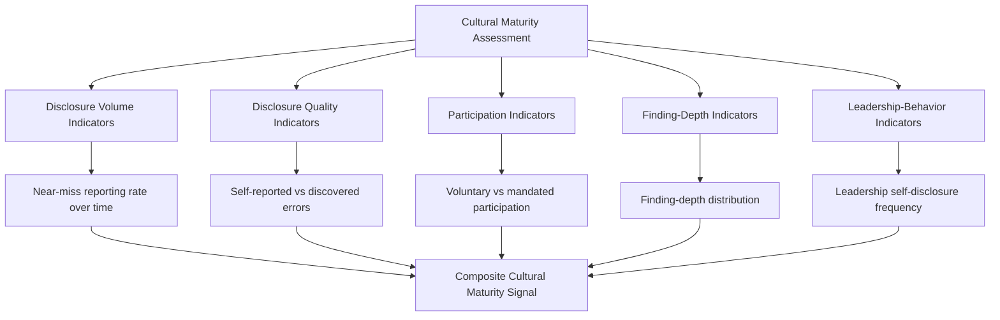

## Measuring Cultural Maturity Around Failure

### Purpose and Scope

This closing topic addresses how to measure the cultural substrate discussed in building a blameless, learning oriented culture — rather than assessing culture through impression or anecdote, this section provides a structured approach to assessing organizational cultural maturity around failure using observable, trackable signals. It extends the program-level measurement discipline established in metrics for RCA program maturity into the specifically cultural dimension that program-level metrics alone can miss, since (as noted throughout this material) a technically well-functioning RCA process can coexist with an underlying culture that is only superficially blameless.

### Why Cultural Maturity Requires Its Own Measurement Layer

**Key Points**

- **Process metrics can look healthy while culture is eroding.** An organization can maintain a strong action-item closure rate, consistent trigger-policy compliance, and well-attended postmortems (all metrics discussed in metrics for RCA program maturity) while participants are, underneath, increasingly guarded, selectively disclosing, or omitting the details most likely to reflect poorly on them — the "blameless in name only" failure pattern identified in common reasons RCA programs fail is specifically a failure that process-level metrics are poorly positioned to detect on their own.
- **Cultural maturity is inferred from behavioral proxies, not stated directly.** Unlike process compliance (directly observable: was the RCA conducted, was the action item closed), cultural health is measured through indirect but observable behavioral signals — disclosure volume, disclosure completeness, participation quality — that correlate with psychological safety without directly asking people to self-report how safe they feel, since self-reported safety is itself subject to the same disclosure hesitancy the measurement is trying to detect.
- **Leading cultural indicators provide earlier warning than lagging incident-severity trends.** Waiting to observe whether major incident frequency or severity worsens is a lagging signal of cultural erosion — by the time it's visible in incident outcomes, the underlying cultural degradation (declining trust, declining disclosure) has typically been building for some time; the leading indicators discussed below are intended to surface earlier.

### Core Cultural Maturity Indicators

**Disclosure volume indicators** — As established in building a blameless, learning oriented culture, near-miss and unsafe-condition reporting rate (referencing the reporting taxonomy from patient safety reporting systems) is one of the most direct behavioral proxies for psychological safety, since disclosure of an event that caused no harm has no external forcing function and depends entirely on the reporter's belief that disclosure carries no personal cost.

**Disclosure quality indicators** — The ratio of self-reported errors (someone voluntarily disclosing their own mistake) to discovered errors (someone else's error found through monitoring, audit, or a downstream consequence) — a high proportion of discovered-rather-than-disclosed errors, tracked over time, suggests people are not volunteering information they hold, a pattern consistent with reduced psychological safety even if overall error rates remain stable.

**Participation indicators** — Whether RCA and postmortem attendance and contribution reflects genuine engagement (proactive questions, volunteered context, offers to help investigate further) versus minimal mandated compliance (attending only because required, terse or guarded contribution) — this connects directly to the RCA-fatigue and resistance patterns discussed in overcoming resistance to root cause investigations, since fatigue-driven and fear-driven disengagement can present similarly and require distinguishing through direct observation or structured feedback.

**Finding-depth indicators** — The finding-depth distribution metric introduced in designing organizational RCA governance (whether root causes trend toward systemic/process findings versus proximate/individual ones) serves double duty as both a facilitation-quality metric and a cultural-health metric, since a culture where blame is genuinely absent produces more willingness to trace findings into uncomfortable systemic territory than a culture where investigations implicitly stop at a safe, individually-attributable stopping point.

**Leadership-behavior indicators** — The frequency and genuineness of leadership self-disclosure and participation (discussed in leadership's role in sustaining RCA practice) can itself be tracked as a cultural-health signal, not merely as a leadership-accountability measure — a declining rate of leadership participation in postmortems implicating their own decisions is an early indicator worth monitoring in its own right.

### A Structured Cultural Maturity Model

Paralleling the RCA program maturity model in metrics for RCA program maturity, cultural maturity can be assessed along a comparable progression:

| Level | Disclosure Pattern | Participation | Finding Depth | Leadership Behavior |
| --- | --- | --- | --- | --- |
| Fear-based | Errors surface mainly through discovery, not disclosure; near-miss reporting minimal | Attendance mandated, contribution minimal and guarded | Findings consistently terminate at individual/proximate cause | Leadership absent from RCA participation; findings about leadership decisions rare or softened |
| Compliance-based | Disclosure occurs when procedurally required; near-miss reporting inconsistent | Attendance consistent; contribution present but formulaic | Findings mix systemic and proximate; depends heavily on facilitator | Leadership attends but as passive reviewer, not genuine participant |
| Trust-building | Voluntary disclosure increasing; near-miss reporting trending upward | Genuine engagement in most sessions; some remaining reticence in politically sensitive cases | Findings predominantly systemic; proximate-cause termination is the exception | Leadership occasionally participates genuinely, including in findings implicating their own decisions |
| Embedded | Disclosure, including of one's own significant errors, is unremarkable and routine; near-miss reporting sustained at a stable, healthy baseline | Full, proactive engagement is the norm across seniority levels | Findings consistently reach systemic root causes; extent-of-pattern checks are volunteered, not prompted | Leadership genuine participation and self-disclosure is routine and expected, not exceptional |

Movement between these levels is generally slow and non-linear — a single high-visibility event (a leader visibly and genuinely disclosing a significant personal error, or conversely a single instance of informal consequence following disclosure) can shift the trajectory of trust more than months of steady, unremarkable process compliance, consistent with the asymmetric trust-building dynamic noted in building a blameless, learning oriented culture. [Inference — the specific progression structure here is a synthesized framework for this material's purposes, not a directly cited external model; the underlying asymmetric-trust dynamic it reflects is more broadly supported in organizational psychology literature]

### Measurement Methods

Beyond the behavioral-proxy metrics above, structured measurement approaches include:

- **Anonymous pulse surveys** — Periodic, brief surveys asking specifically about perceived psychological safety in the RCA/incident-disclosure context ("I feel safe disclosing my own mistakes," "I have seen colleagues face informal consequences for honest disclosure") — valuable as a direct signal but subject to the same disclosure hesitancy the measurement targets, meaning results should be triangulated against the behavioral proxies above rather than trusted in isolation.
- **Longitudinal tracking rather than point-in-time assessment.** Given the slow-moving nature of cultural change, single-point measurement is less informative than trend tracking over a meaningful time horizon (quarters to years) — a single survey result or single quarter's near-miss reporting rate carries limited signal compared to the trajectory across several measurement periods.
- **Triangulation across multiple indicator categories.** No single indicator (disclosure volume, finding depth, leadership behavior) should be treated as a definitive cultural-maturity signal in isolation, since each can be influenced by factors unrelated to culture (a near-miss reporting rate can shift due to a change in what counts as reportable, not just due to psychological safety) — genuine cultural signal is most credible when multiple independent indicator categories move together in the same direction.

### Relationship to the Broader RCA Program

Cultural maturity measurement is the layer that validates whether the process-level maturity discussed in metrics for RCA program maturity is built on genuine foundation or is, in the terms used throughout this material, "blameless in name only." A program that appears mature by process metrics (high closure rates, consistent trigger-policy compliance) but shows declining or stagnant cultural indicators warrants specific attention to the cultural interventions discussed in building a blameless, learning oriented culture and leadership's role in sustaining RCA practice, since process metrics alone will not reveal — and may actively mask — this specific and consequential gap.

### Related Topics

- Building a blameless, learning oriented culture (the cultural foundation this measurement layer assesses)
- Leadership's role in sustaining RCA practice (leadership-behavior indicators as both cause and measurable signal)
- Metrics for RCA program maturity (the process-level measurement layer this section complements)
- Overcoming resistance to root cause investigations (resistance patterns that manifest in several of the indicators discussed here)
- Common reasons RCA programs fail (the "blameless in name only" failure this measurement layer is designed to detect early)