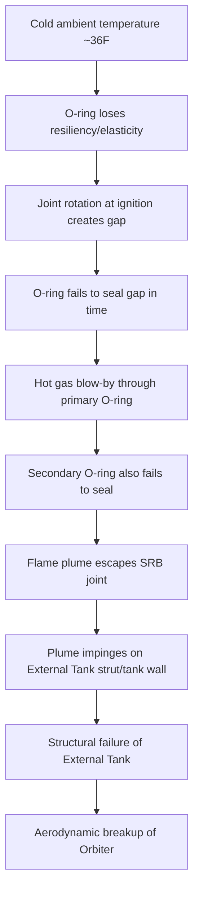
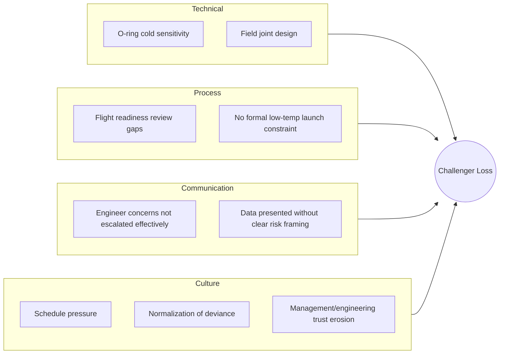

## Space Shuttle Challenger Disaster Investigation

### Overview

The Space Shuttle *Challenger* (mission STS-51-L) broke apart 73 seconds after launch on January 28, 1986, killing all seven crew members. The subsequent investigation—conducted primarily by the Rogers Commission—is one of the most widely studied case studies in root cause analysis (RCA), engineering ethics, and organizational failure. It is frequently used to teach the difference between a **proximate cause** (the immediate physical failure) and **root/systemic causes** (the organizational and decision-making failures that allowed the physical failure to occur and go unaddressed).

### Incident Summary

- **Date/Time**: January 28, 1986, 11:38 EST, Kennedy Space Center, Florida
- **Vehicle**: Space Shuttle *Challenger*, mission STS-51-L
- **Outcome**: Vehicle disintegration 73 seconds after liftoff; loss of all 7 crew members
- **Immediate trigger**: Failure of an O-ring seal in the right Solid Rocket Booster (SRB)

### Proximate (Physical) Cause

The failure originated in a field joint of the right SRB.

**Key Points**

- SRBs are assembled from cylindrical segments joined at "field joints," sealed by two synthetic rubber O-rings (primary and secondary)
- The O-rings are designed to seal hot combustion gases (>2,800°C) inside the booster
- O-ring resiliency—its ability to re-seat and maintain a seal after joint rotation during ignition pressure transients—is highly temperature-dependent
- Launch morning ambient temperature was approximately 36°F (2°C), the coldest of any shuttle launch, with O-ring temperature estimated near 28°F (−2°C)
- At low temperatures, the O-ring material becomes less elastic and responds too slowly to seal the joint during the pressure spike at ignition
- Hot gas blew past the primary and then secondary O-ring, creating a plume that breached the joint, impinged on the external fuel tank, and triggered structural failure of the tank and subsequent aerodynamic breakup of the vehicle

**Sequence of Physical Events**

### The Rogers Commission Investigation

**Key Points**

- Formed by Presidential order (Executive Order 12546) days after the accident
- Chaired by former Secretary of State William P. Rogers
- Notable members included physicist Richard Feynman, astronaut Sally Ride, and test pilot Chuck Yeager
- Combined physical forensics (O-ring analysis, telemetry, photographic/film review) with organizational and managerial investigation
- Feynman's independent, informal testing—famously demonstrating O-ring stiffness in ice water during a televised hearing—became emblematic of direct, first-principles verification over reliance on institutional assurances

### Root Cause Analysis: Peeling the Layers

This case is a textbook example of applying the **5 Whys** technique across both technical and organizational layers, illustrating why RCA must not stop at the first physical explanation.

**5 Whys Applied**

1. **Why did the Challenger break apart?**

   Because hot gas breached the right SRB field joint and burned through the External Tank structure.
2. **Why did hot gas breach the joint?**

   Because the primary and secondary O-rings failed to seal the joint during ignition.
3. **Why did the O-rings fail to seal?**

   Because cold temperatures (~36°F) reduced O-ring resiliency below the threshold needed to seal the joint gap in time.
4. **Why was the shuttle launched despite the cold temperature risk?**

   Because engineers' concerns about O-ring performance in cold weather were overridden in the launch decision process the night before, under schedule and management pressure. [Inference: characterization of "pressure" reflects the Commission's interpretive conclusion, not a directly measurable fact, though it is well-documented in Commission testimony and findings.]
5. **Why were engineering concerns overridden?**

   Because NASA's organizational culture and decision-making structure suppressed or normalized dissenting technical risk data, a pattern the Commission and later sociological analysis (notably Diane Vaughan's *The Challenger Launch Decision*) termed the **normalization of deviance**—the incremental acceptance of anomalies as "acceptable risk" because prior flights had not failed despite the same warning signs.

This progression demonstrates the core RCA principle: the **proximate cause** (O-ring failure) explains *what* happened physically, while the **root cause** (organizational/communication failure) explains *why the hazard was allowed to persist and be launched into*.

### Known Prior Warning Signs (Normalization of Deviance)

**Key Points**

- O-ring erosion and blow-by had been observed on multiple prior shuttle flights, including flights in colder conditions, but were reclassified over time as an "acceptable risk" rather than triggering a design fix or launch constraint
- Morton Thiokol (the SRB contractor) engineers, notably Roger Boisjoly, had raised specific written concerns about O-ring performance at low temperatures months before the disaster
- On the eve of launch, Thiokol engineers recommended against launching below 53°F (the lowest temperature of any previous successful launch), citing insufficient data on O-ring behavior below that threshold
- Under questioning from NASA management, Thiokol managers reversed their engineering team's no-launch recommendation and approved the launch—a decision point the Commission identified as a critical failure in risk communication
- This reversal is frequently cited in RCA and engineering ethics training as an example of a **silent-safety-program failure**: risk data existed but did not effectively reach or influence the final decision-making authority

### Organizational/Root Causes Identified by the Commission

| Category | Finding |
| --- | --- |
| Technical Design | O-ring joint design was flawed and sensitive to temperature and joint rotation |
| Decision Process | Flight readiness review process failed to elevate known O-ring anomalies as a launch constraint |
| Communication | Critical engineering risk data did not reach senior NASA decision-makers in an actionable form |
| Culture | Schedule pressure (public commitments, prior delays, political visibility of the "Teacher in Space" mission) contributed to an environment discouraging launch postponement |
| Risk Assessment | NASA management's probabilistic risk estimates for catastrophic SRB failure were significantly more optimistic than those of its own engineers |

[Inference: the degree to which schedule/political pressure causally drove the specific decision reversal remains a matter of some historical interpretation, though it is a widely supported conclusion across the Commission report and subsequent independent analyses.]

### Contributing Factor Diagram (Fishbone-Style Summary)

### Recommendations and Outcomes

**Key Points**

- Redesign of the SRB field joint, including a third O-ring and joint heaters to maintain seal temperature
- Establishment of an independent NASA Office of Safety, Reliability, and Quality Assurance reporting directly to the NASA Administrator, reducing the risk of safety concerns being filtered by program management
- Revisions to flight readiness review procedures to formally capture and elevate dissenting engineering opinions
- Shuttle program was grounded for approximately 32 months (until STS-26 in September 1988) while redesign and process changes were implemented
- The case directly informed later NASA safety culture reforms and was revisited after the 2003 *Columbia* disaster, where the Columbia Accident Investigation Board (CAIB) explicitly noted that similar organizational patterns—normalization of deviance and schedule pressure—had recurred

### Why This Case Is Foundational to RCA Methodology

**Key Points**

- Demonstrates that RCA must examine **systemic and organizational layers**, not just the immediate engineering failure
- Illustrates the danger of treating a **known, recurring anomaly** (O-ring erosion) as validated-safe simply because it had not yet caused catastrophic failure ("absence of failure" mistaken for "absence of risk")
- Shows the importance of **preserving and escalating dissenting technical opinions** in formal decision processes
- Reinforces that a single 5 Whys pass is often insufficient; multiple causal chains (technical, procedural, cultural) frequently intersect and must each be traced to their own root
- Highlights the value of independent, first-principles verification (e.g., Feynman's ice-water test) as a complement to institutional risk assessments

### Related Topics

- The Space Shuttle Columbia disaster and CAIB investigation (comparative RCA case)
- Diane Vaughan's concept of "normalization of deviance"
- Fishbone (Ishikawa) diagrams for multi-causal RCA
- Root cause vs. proximate cause vs. contributing factor (taxonomy)
- Organizational safety culture models (e.g., Just Culture, High Reliability Organizations)
- Flight readiness review and formal risk escalation processes
- Bhopal disaster and Chernobyl disaster as comparative industrial RCA case studies
- Swiss Cheese Model of accident causation (James Reason)