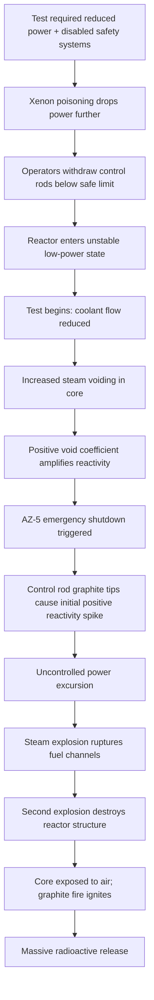
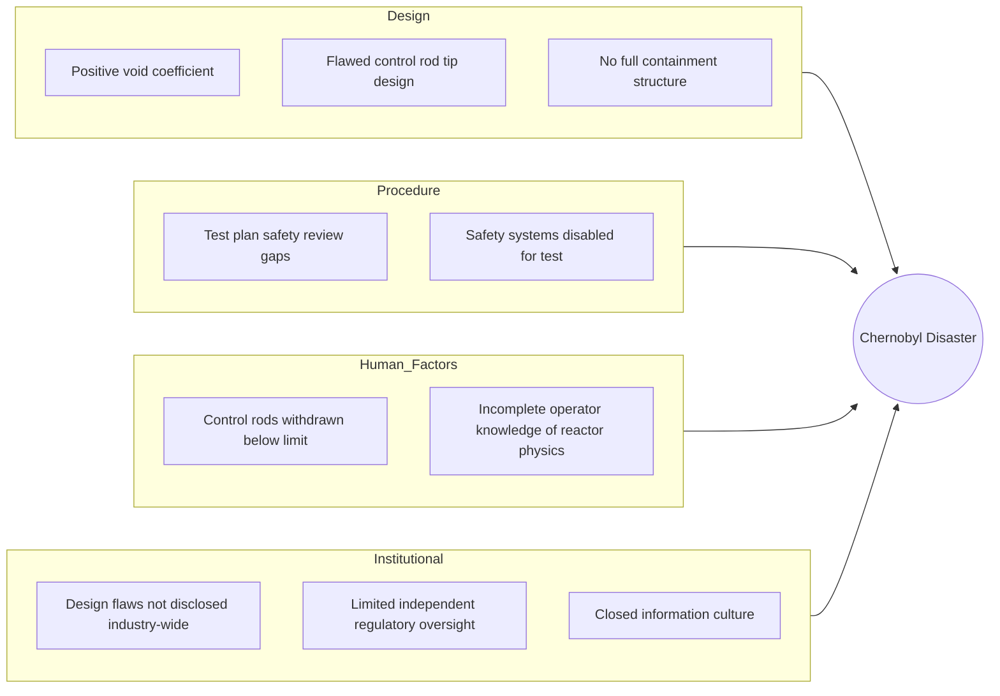

## Chernobyl Nuclear Accident Causal Analysis

### Overview

The Chernobyl disaster occurred on April 26, 1986, at Reactor No. 4 of the Chernobyl Nuclear Power Plant near Pripyat, Ukrainian SSR (then USSR). A sudden power excursion during a safety test led to steam explosions, reactor core destruction, and a fire that released massive quantities of radioactive material into the atmosphere. It remains one of only two nuclear accidents rated Level 7 (the maximum) on the International Nuclear Event Scale, alongside Fukushima Daiichi. As an RCA case study, Chernobyl is notable for demonstrating how **design flaws, procedural violations, and institutional/cultural failures** can compound to produce catastrophic outcomes, and for how the causal narrative itself evolved over decades of re-investigation.

### Incident Summary

- **Date/Time**: April 26, 1986, 01:23 local time
- **Location**: Reactor Unit 4, Chernobyl Nuclear Power Plant, Ukrainian SSR
- **Reactor type**: RBMK-1000 (Reaktor Bolshoy Moshchnosti Kanalnyy — High Power Channel-type Reactor)
- **Trigger event**: A low-power turbine coastdown safety test
- **Outcome**: Steam explosion, core disruption, graphite fire burning for ~9 days, large-scale radioactive release across the USSR and Europe

### Proximate (Technical) Cause

**Key Points**

- The test was designed to verify whether a coasting turbine generator could supply enough electrical power to run emergency core cooling pumps during the gap between an external power loss and diesel generator startup
- To conduct the test, operators had to reduce reactor power to a low, unstable operating regime and disable several automatic safety systems, including parts of the emergency core cooling system, to prevent the test from being aborted
- At low power, the RBMK reactor became difficult to control due to xenon-135 poisoning (a neutron-absorbing fission byproduct that suppresses reactivity), causing power to drop further than intended
- Operators withdrew most control rods from the core to compensate and restore power, leaving far fewer control rods inserted than the plant's operating limits allowed
- The RBMK design exhibited a **positive void coefficient** at low power: as coolant water turned to steam (voids), reactivity increased rather than decreased, creating a self-reinforcing power surge
- When the test began and pumps were throttled, reduced coolant flow led to increased steam voiding, triggering an uncontrolled positive feedback loop of rising reactivity
- An emergency shutdown (AZ-5) was initiated, but the specific control rod design had a flaw: the rods' graphite displacer tips initially *increased* reactivity in the lower core region as they entered the water-filled channels before the neutron-absorbing boron sections could take effect (the "positive scram effect")
- This caused a rapid, uncontrolled power spike—estimated at many times the reactor's rated capacity within seconds—rupturing fuel channels and triggering a steam explosion, followed by a second explosion (widely attributed to hydrogen or further steam/fuel interaction), which blew off the reactor's heavy upper structure and exposed the core to air, igniting the graphite moderator

**Causal Chain Diagram**

### Root Cause Analysis: Multiple Contributing Layers

Chernobyl is often used in RCA training precisely because early official narratives placed blame almost entirely on **operator error**, while later technical reviews (notably by the IAEA's International Nuclear Safety Advisory Group, INSAG) substantially revised this toward **design deficiency and systemic/institutional failure**. This evolution itself is a valuable lesson in avoiding premature root-cause closure.

**5 Whys Applied**

1. **Why did the reactor explode?**

   Because an uncontrolled power excursion ruptured fuel channels, causing steam/pressure explosions that destroyed the reactor core structure.
2. **Why did the power excursion occur?**

   Because the reactor entered a state where reducing coolant flow *increased* reactivity (positive void coefficient), and the emergency shutdown itself briefly added reactivity before reducing it.
3. **Why was the reactor in a state where this design flaw could be triggered?**

   Because operators, in the course of running a safety test, brought the reactor to a low-power, unstable operating regime with most control rods withdrawn, violating operating procedure limits.
4. **Why were operators able to bring the reactor into such a hazardous configuration?**

   Because the plant's control and safety systems did not enforce hard interlocks preventing operation with an unsafe control rod configuration, and operators lacked full documentation of the void coefficient and control-rod "positive scram" behavior—information that had not been adequately communicated to plant staff. [Inference: the degree to which this was a deliberate information/design transparency failure versus an unrecognized design characteristic is addressed differently across INSAG-1 (1986) and the later INSAG-7 (1992) reports.]
5. **Why did these design flaws and information gaps exist and persist?**

   Because of systemic issues in the Soviet nuclear program: RBMK reactor design prioritized cost, dual-use plutonium production capability, and construction simplicity over defense-in-depth safety principles common in Western reactor designs (e.g., no full containment structure), combined with a closed institutional culture that limited disclosure of prior safety incidents and design weaknesses even within the nuclear engineering community.

This shift—from "operators violated procedure" (proximate/human layer) to "the reactor design permitted a procedural violation to become catastrophic, and institutional secrecy prevented operators from understanding the risk" (root/systemic layer)—is the central RCA lesson of this case.

### Key Root Causes (INSAG-7 Synthesis)

| Category | Root Cause |
| --- | --- |
| Reactor Design | Positive void coefficient at low power; unstable in the operating regime encountered |
| Control Rod Design | Graphite-tipped rods caused a brief positive reactivity insertion on shutdown |
| Containment | RBMK design lacked a full pressure-containment structure typical of Western PWR/BWR designs |
| Procedure | Test plan inadequately reviewed for safety implications; conducted without full coordination with safety authorities |
| Operator Knowledge | Plant staff were not fully informed of the void coefficient risk or the control rod design flaw |
| Institutional Culture | Soviet-era information compartmentalization limited safety knowledge transfer across the nuclear industry |
| Regulatory Oversight | Insufficient independent regulatory authority over reactor design safety margins |

### Contributing Factor Diagram (Fishbone-Style Summary)

### Investigation Timeline and Evolving Attribution

**Key Points**

- **1986 (INSAG-1)**: Initial Soviet and IAEA reporting emphasized operator errors and procedural violations as the primary cause
- **1991 (Soviet State Commission review)**: A subsequent USSR State Commission investigation began emphasizing design flaws more heavily
- **1992 (INSAG-7)**: The IAEA's revised, more comprehensive report rebalanced the causal narrative to give substantially greater weight to reactor design deficiencies and systemic institutional factors, while still acknowledging procedural violations occurred
- This progression illustrates a recurring RCA pitfall: **early attribution to "human error" can obscure deeper design and systemic causes**, and a root cause analysis should be revisited as more technical evidence becomes available

### Consequences and Response

**Key Points**

- Immediate area evacuation (Pripyat, population ~49,000) began roughly 36 hours after the accident
- A 30 km exclusion zone was established around the plant
- The damaged reactor was enclosed first in the original "Sarcophagus" structure (1986) and later the New Safe Confinement structure (completed 2016) to contain long-term radioactive material
- All remaining RBMK reactors of similar design underwent safety modifications, including redesigned control rods and additional neutron absorbers, to eliminate the positive void coefficient and positive scram effect
- Health and environmental effects remain a subject of ongoing scientific study and some disagreement regarding long-term population health impact estimates [Unverified: precise long-term mortality/morbidity attribution figures vary significantly across studies and organizations and are not settled with the same precision as the immediate technical causal chain]

### Why This Case Is Significant for RCA Methodology

**Key Points**

- Demonstrates the risk of **anchoring on the first available explanation** (operator error) rather than continuing causal investigation into design and systemic layers
- Shows how **latent design defects** can remain dormant and undiscovered until a specific, unusual operating sequence exposes them
- Illustrates that root cause analysis in complex sociotechnical systems often requires **revisiting conclusions** as new evidence emerges, rather than treating an initial investigation as final
- Reinforces the value of **defense-in-depth** design principles (e.g., containment structures) as mitigations against the compounding of upstream causal failures
- Parallels the Challenger case in showing how institutional information flow and organizational culture are frequently root causes, even when the triggering event appears purely technical

### Related Topics

- Space Shuttle Challenger disaster investigation (comparative organizational RCA case)
- Fukushima Daiichi nuclear accident causal analysis
- INSAG safety reports and IAEA accident classification (INES scale)
- Positive void coefficient and reactor physics fundamentals
- Defense-in-depth design principles in safety-critical systems
- Swiss Cheese Model of accident causation (James Reason)
- Normal Accident Theory (Charles Perrow) vs. High Reliability Organization Theory
- Human factors and procedural violation analysis in RCA