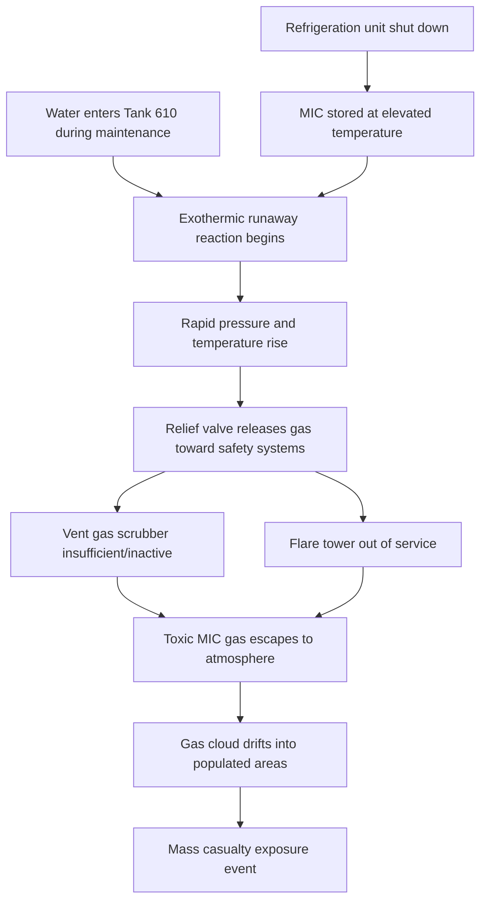
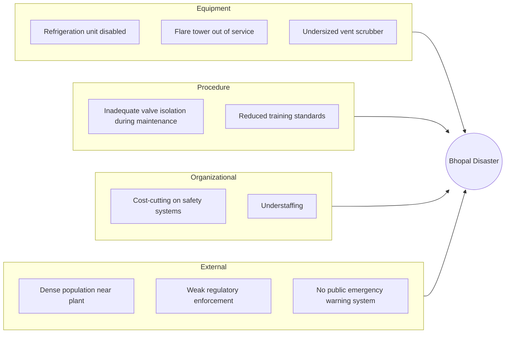

## Bhopal Gas Tragedy Root Cause Findings

### Overview

The Bhopal gas tragedy occurred on the night of December 2–3, 1984, at the Union Carbide India Limited (UCIL) pesticide plant in Bhopal, Madhya Pradesh, India. A runaway chemical reaction released approximately 30–40 tons of methyl isocyanate (MIC) gas and related toxic compounds into the densely populated surrounding area. It is widely regarded as the world's worst industrial disaster and is a foundational case in RCA, process safety engineering, and industrial risk management, illustrating how equipment failure, maintenance neglect, procedural shortcuts, and safety-system degradation can compound across an organization until a catastrophic release becomes almost inevitable.

### Incident Summary

- **Date/Time**: Night of December 2–3, 1984
- **Location**: Union Carbide India Limited pesticide plant, Bhopal, India
- **Substance released**: Methyl isocyanate (MIC), a highly toxic, volatile intermediate chemical used in pesticide (Sevin) manufacturing
- **Immediate trigger**: Water entry into MIC storage Tank 610, triggering an exothermic runaway reaction
- **Outcome**: Immediate deaths estimated in the thousands (estimates vary substantially across sources), with long-term deaths and injuries affecting several hundred thousand people [Unverified: precise casualty figures remain disputed across governmental, NGO, and academic sources]

### Proximate (Technical) Cause

**Key Points**

- MIC is highly reactive with water, producing an exothermic reaction that generates heat, carbon dioxide, and further decomposition products, rapidly increasing tank pressure and temperature
- Water entered Tank 610, one of three underground MIC storage tanks, through a connected pipe—most likely during a water-washing maintenance operation on nearby pipework, where isolation valves and slip-blinds (physical disconnection plates) that should have prevented backflow were not properly in place [Inference: the exact water-entry mechanism was contested between Union Carbide's internal investigation, which suggested deliberate sabotage, and independent/government investigations, which concluded it resulted from routine maintenance/process deficiencies; this remains a point of historical dispute]
- The reaction rapidly raised tank temperature and pressure far beyond design limits, releasing the safety relief valve and venting a large volume of toxic gas through the plant's vent gas scrubber and flare tower systems
- Critical safety systems designed to contain or neutralize such a release were non-functional or inadequate at the time:
  - The **vent gas scrubber** (designed to neutralize escaping MIC with caustic soda) was not operating at a capacity sufficient to handle the volume and pressure of the release
  - The **flare tower** (designed to burn off escaping gas) was out of service, reportedly due to a corroded connecting pipe under repair
  - The tank's **refrigeration unit**, intended to keep MIC at low temperature to reduce reaction risk, had been shut down/drained months earlier as a cost-saving measure, meaning MIC was stored at higher-than-recommended temperature, reducing the safety margin before runaway reaction
- The combination of an initiating event (water ingress) and multiple simultaneously disabled or degraded safety barriers allowed the toxic gas cloud to escape largely uncontrolled into the atmosphere and drift into surrounding residential areas

**Causal Chain Diagram**

### Root Cause Analysis: Multiple Contributing Layers

Bhopal is frequently used in RCA training to illustrate that a catastrophic release is rarely caused by a single failure, but by the **simultaneous degradation of multiple independent safety barriers**—a precursor to what is now formalized in process safety as the "Swiss Cheese" or layered-defense model.

**5 Whys Applied**

1. **Why did toxic gas reach the surrounding population?**

   Because a large volume of MIC gas escaped the plant without being neutralized or contained by the plant's safety systems.
2. **Why weren't the safety systems able to contain the release?**

   Because the vent gas scrubber was not operating at sufficient capacity and the flare tower was out of service at the time of the incident.
3. **Why were these critical safety systems non-functional or inadequate?**

   Because of a pattern of deferred maintenance, cost-cutting, and reduced operational readiness at the plant in the years leading up to the incident, reportedly linked to declining profitability of the Bhopal facility. [Inference: the causal link between broader cost-cutting pressures and the specific state of the scrubber/flare tower is drawn from multiple independent investigative and journalistic sources; UCIL and Union Carbide's own positions on this point differed.]
4. **Why did a water-reactive runaway reaction occur in the first place?**

   Because water entered a MIC storage tank whose refrigeration safeguard had also been disabled, removing a key layer of protection that would have slowed the reaction rate even if water ingress occurred.
5. **Why were multiple independent safety layers simultaneously degraded or disabled?**

   Because of systemic organizational and regulatory failures: understaffing and reduced training standards, inadequate hazard communication to surrounding communities and emergency responders, insufficient independent regulatory inspection and enforcement of process safety standards, and organizational incentive structures that prioritized cost reduction over maintaining full safety-system readiness at a facility handling extremely hazardous materials.

This progression moves from "a valve/maintenance failure let water into a tank" (proximate) to "the plant's overall safety management system had eroded to the point where a routine maintenance error could cascade into catastrophe" (root/systemic cause)—a hallmark distinction in industrial RCA.

### Key Root Causes (Synthesized from Indian Government, Union Carbide, and Independent Investigations)

| Category | Root Cause |
| --- | --- |
| Equipment/Maintenance | Refrigeration unit for MIC storage shut down; flare tower out of service |
| Safety System Capacity | Vent gas scrubber undersized/inadequate for the volume of the release |
| Process Safety Management | Inadequate isolation procedures (valves/slip-blinds) during maintenance operations |
| Organizational | Cost-cutting pressures reduced staffing, training, and maintenance investment |
| Siting/Land Use | Plant located near densely populated areas without adequate buffer zones |
| Emergency Preparedness | No effective public warning system or community emergency response plan in place |
| Regulatory Oversight | Insufficient independent inspection and enforcement of hazardous process safety standards |

### Contributing Factor Diagram (Fishbone-Style Summary)

### Investigative and Legal Aftermath

**Key Points**

- Indian government and Union Carbide investigations reached differing conclusions on the precise mechanism of water entry, with Union Carbide's internal review attributing it to sabotage by a disgruntled employee, a conclusion disputed by Indian investigators and many independent experts [Unverified/disputed: no definitive, universally accepted resolution of this specific causal detail exists across all investigating parties]
- Regardless of the disputed initiating mechanism, investigators broadly agreed that the severity of the outcome was driven by the simultaneous unavailability of multiple safety systems that should have contained or mitigated any release
- Union Carbide Corporation reached a civil settlement with the Indian government in 1989
- Warren Anderson, UCC's then-CEO, and several Indian UCIL officials faced criminal proceedings in India; outcomes and enforcement of these proceedings remain a subject of ongoing legal and political discussion [Unverified: legal outcomes and their perceived adequacy remain contested and are not a matter of settled technical fact]
- The disaster directly influenced the development of modern process safety regulation, including the U.S. Emergency Planning and Community Right-to-Know Act (EPCRA, 1986) and significant strengthening of process hazard analysis (PHA) requirements in chemical industry safety standards worldwide (e.g., OSHA Process Safety Management standard)

### Why This Case Is Significant for RCA Methodology

**Key Points**

- Demonstrates that catastrophic industrial accidents typically require the **simultaneous failure of multiple independent safety barriers**, not a single point of failure—reinforcing the value of defense-in-depth analysis in RCA
- Illustrates how **incremental cost-driven degradation** of safety systems over time (deferred maintenance, disabled equipment) can silently erode a facility's actual safety margin far below its design intent, a pattern comparable to the "normalization of deviance" identified in the Challenger case
- Highlights the importance of **process safety management (PSM)** frameworks that formally track and require justification for any temporary or permanent disabling of safety-critical equipment
- Shows the necessity of extending RCA scope beyond the immediate facility to include **siting, community emergency preparedness, and regulatory oversight** as contributing systemic factors
- Underscores that disputed or unresolved elements of a causal chain (e.g., sabotage vs. maintenance error) should be explicitly flagged as such in RCA reporting, rather than presented with false certainty

### Related Topics

- Space Shuttle Challenger disaster investigation (comparative organizational RCA case)
- Chernobyl nuclear accident causal analysis (comparative industrial/design RCA case)
- Process Safety Management (PSM) and Process Hazard Analysis (PHA) frameworks
- Swiss Cheese Model of accident causation (James Reason)
- Layers of Protection Analysis (LOPA) in chemical process safety
- Emergency Planning and Community Right-to-Know Act (EPCRA) origins
- Safety Integrity Level (SIL) and safety instrumented systems
- Normalization of deviance in industrial safety culture