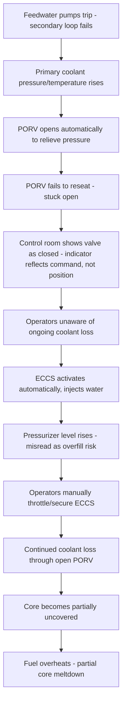
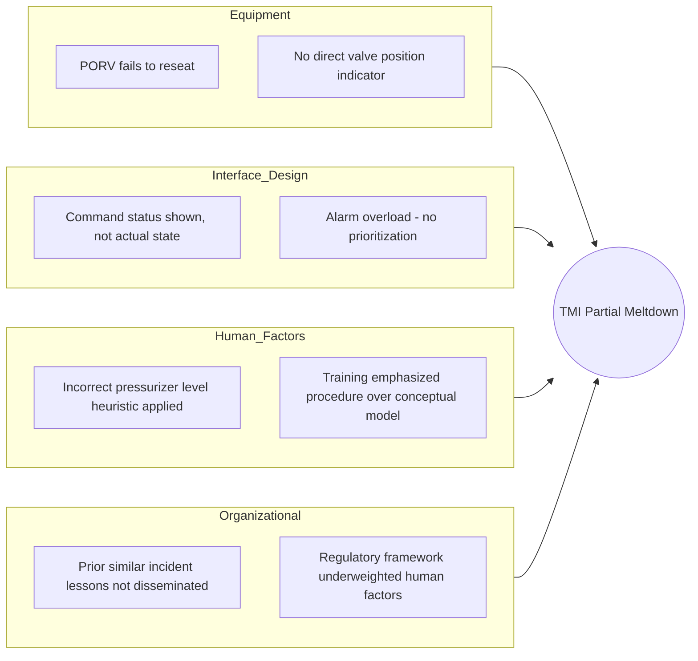

## Three Mile Island Accident Investigation

### Overview

The Three Mile Island (TMI) accident occurred on March 28, 1979, at the TMI Unit 2 nuclear power plant near Harrisburg, Pennsylvania. A combination of equipment malfunction, design deficiencies, and operator misinterpretation of plant conditions led to a partial meltdown of the reactor core—the most serious commercial nuclear accident in U.S. history. Unlike Chernobyl, TMI resulted in no direct fatalities and minimal offsite radiological release, largely due to the reactor's containment structure functioning as designed. As an RCA case study, TMI is especially valuable for illustrating how **ambiguous instrumentation, poor human-machine interface design, and operator misdiagnosis** can compound a manageable equipment fault into a severe core-damage event, and how the investigation reshaped human factors engineering across the nuclear industry.

### Incident Summary

- **Date/Time**: March 28, 1979, beginning approximately 04:00 EST
- **Location**: Three Mile Island Nuclear Generating Station, Unit 2, near Harrisburg, Pennsylvania
- **Reactor type**: Pressurized Water Reactor (PWR), Babcock & Wilcox design
- **Trigger event**: Loss of feedwater to the steam generators, followed by a stuck-open relief valve
- **Outcome**: Partial core meltdown (~45% of the core melted); limited radioactive release largely contained by the reactor building; no direct deaths attributed to radiation exposure

### Proximate (Technical) Cause

**Key Points**

- The initiating event was a malfunction in the secondary (non-nuclear) cooling system: feedwater pumps supplying the steam generators tripped, likely due to a maintenance-related blockage or valve misconfiguration, interrupting the normal heat-removal path from the primary coolant loop
- With feedwater lost, steam generators could not remove heat from the primary coolant loop, causing primary system pressure and temperature to rise
- A **pilot-operated relief valve (PORV)** atop the pressurizer opened automatically as designed to relieve excess pressure—but then failed to reseat/close when pressure returned to normal, sticking open
- Critically, the control room instrumentation showed only the *electrical signal commanding the valve to close*, not the valve's actual physical position—so operators believed the PORV was shut when it remained open, continuously venting primary coolant (a **loss-of-coolant accident**, LOCA) for approximately two hours before being diagnosed
- As coolant drained through the stuck-open valve, the Emergency Core Cooling System (ECCS) activated automatically and correctly, injecting makeup water
- However, operators—interpreting rising pressurizer water level as a sign the system had too much water (a plausible but incorrect read of a PWR-specific phenomenon) and unaware the PORV was open—**manually throttled back and later secured the ECCS pumps**, believing they were preventing the pressurizer from "going solid" (filling completely with liquid, a condition operators had been trained to avoid)
- This manual reduction of emergency cooling, combined with continued coolant loss through the open PORV, allowed the reactor core to become partially uncovered, leading to fuel overheating, cladding damage, and partial core melting

**Causal Chain Diagram**

### Root Cause Analysis: Multiple Contributing Layers

TMI is a central case in human factors engineering and RCA because the physical equipment fault (a stuck relief valve) was, by itself, a recoverable and relatively minor malfunction. The severity of the outcome came almost entirely from **information and interface failures** that led trained operators to take actions that worsened the accident.

**5 Whys Applied**

1. **Why did the reactor core partially melt?**

   Because the core lost adequate cooling for an extended period, allowing fuel to overheat and become damaged.
2. **Why did the core lose adequate cooling?**

   Because primary coolant continuously drained through a stuck-open relief valve while operators, believing the system had excess water, manually reduced emergency cooling injection.
3. **Why did operators reduce emergency cooling instead of increasing it?**

   Because control room instrumentation did not directly indicate the PORV's actual open position, and rising pressurizer level (caused by the ongoing coolant loss and boiling) was misinterpreted using standard PWR operating heuristics as a sign of over-filling rather than a symptom of coolant loss.
4. **Why did the control room lack clear indication of the valve's true state and the true nature of the emergency?**

   Because the plant's instrumentation and control room design reflected an inadequate application of human factors engineering: it displayed component *commands* rather than *actual physical states*, presented an overwhelming and poorly prioritized array of alarms (over 100 alarms activated in the early minutes of the event), and had not been designed around how operators would need to diagnose an unfamiliar, multi-system, ambiguous failure in real time.
5. **Why did the industry's reactor design and training standards permit such an inadequate control room and instrumentation design to exist?**

   Because, prior to TMI, nuclear plant design and operator training emphasized single-failure equipment scenarios and procedural compliance rather than human-centered interface design, operator cognitive workload, or training for ambiguous, multi-symptom, cascading events; regulatory (NRC) oversight at the time similarly under-weighted human factors and control room ergonomics as a formal safety discipline.

This progression moves from "a valve stuck open" (proximate, easily fixable) to "the overall human-machine system made it nearly impossible for well-trained operators to correctly diagnose what was actually happening" (root/systemic cause)—making TMI one of the clearest illustrations in RCA literature of how **interface and information design**, not just equipment reliability, must be treated as a primary root-cause category.

### Key Root Causes (Kemeny Commission and NRC Synthesis)

| Category | Root Cause |
| --- | --- |
| Equipment | PORV failed to reseat after opening; no direct position indicator installed |
| Instrumentation/HMI | Control room design showed valve commands, not actual valve position |
| Alarm Management | Alarm system overwhelmed operators with over 100 simultaneous/rapid alarms, no prioritization |
| Operator Training | Training emphasized procedural rules over conceptual understanding of reactor thermal-hydraulics under ambiguous conditions |
| Human Decision-Making | Operators applied a plausible but incorrect heuristic (avoid pressurizer "going solid") that led to reducing emergency cooling |
| Regulatory/Industry | Pre-accident regulatory framework underweighted human factors engineering and control room ergonomics |
| Organizational Learning | A similar PORV-sticking incident had occurred at another plant (Davis-Besse) roughly a year earlier but lessons were not effectively disseminated industry-wide |

### Contributing Factor Diagram (Fishbone-Style Summary)

### Investigation and Findings

**Key Points**

- The **Kemeny Commission** (President's Commission on the Accident at Three Mile Island), chaired by John Kemeny, conducted the primary federal investigation, concluding that the fundamental problems were more institutional and human-factors-related than purely technical
- The commission specifically identified inadequate control room design, poor emergency procedures, insufficient operator training for ambiguous scenarios, and weak NRC regulatory attention to human factors as central findings, rather than framing the accident as a simple equipment failure or purely an "operator error"
- The **Nuclear Regulatory Commission (NRC)** conducted parallel technical investigations and used findings to drive sweeping regulatory reform

### Outcomes and Industry Reform

**Key Points**

- Formation of the **Institute of Nuclear Power Operations (INPO)**, an industry body focused on operational excellence and peer review across U.S. nuclear plants
- Major overhaul of NRC requirements for control room instrumentation, including mandatory direct indication of critical valve positions rather than command-signal indication only
- Comprehensive redesign of operator training programs to emphasize understanding of underlying reactor thermal-hydraulic behavior, not just procedural checklists
- Formal introduction of **symptom-based emergency operating procedures**, allowing operators to respond to observed plant symptoms even when the precise cause is not yet diagnosed, rather than requiring a specific fault to be identified before acting
- Significant expansion of human factors engineering as a formal discipline within nuclear plant control room design
- No new commercial nuclear reactor construction was initiated in the U.S. for several decades afterward, a trend attributed to a combination of TMI, economic factors, and public perception [Inference: the relative weight of TMI versus economic/market factors in this multi-decade construction slowdown is debated among energy historians and is not a matter of precise, single-cause attribution]

### Why This Case Is Significant for RCA Methodology

**Key Points**

- Demonstrates that a **minor, individually recoverable equipment fault** can escalate into a severe accident when compounded by poor information design—reinforcing that RCA must examine the human-machine interface as a distinct causal category, not merely "operator error"
- Illustrates the danger of **instrumentation that reports commanded state rather than actual state**, a general engineering principle applicable well beyond nuclear power (e.g., software systems, industrial control systems)
- Shows how **plausible but incorrect mental models**, reinforced by training, can lead skilled operators to take actions that actively worsen a developing incident—underscoring the need for training that builds conceptual understanding, not just procedural compliance
- Highlights the importance of **organizational learning and information-sharing** across an industry, since a similar precursor incident at another facility had occurred but its lessons were not propagated
- Provides a direct contrast with Chernobyl: TMI's physical containment structure functioned as a final layer of defense-in-depth and prevented a comparably severe radiological release, illustrating the practical value of that architectural safety layer even after multiple upstream causal failures had already occurred

### Related Topics

- Chernobyl nuclear accident causal analysis (comparative reactor safety RCA case)
- Space Shuttle Challenger disaster investigation (comparative organizational RCA case)
- Human factors engineering and control room/HMI design principles
- Symptom-based vs. event-based emergency operating procedures
- Defense-in-depth design principles in safety-critical systems
- Swiss Cheese Model of accident causation (James Reason)
- Alarm management and alarm rationalization in process control
- Institute of Nuclear Power Operations (INPO) and industry peer-review safety models