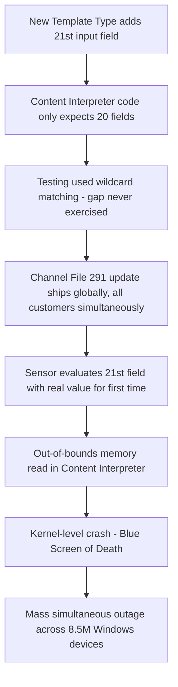
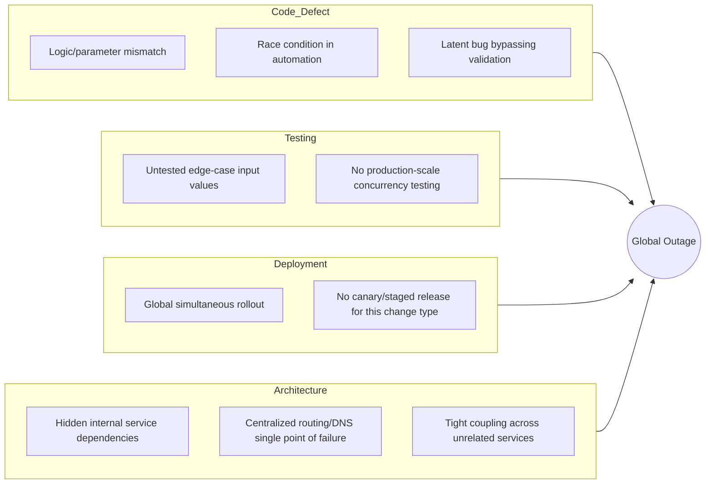

## Major Public Cloud and Software Outage Postmortems

### Overview

Major cloud provider and software vendor outages—AWS, Microsoft Azure, CrowdStrike, and similar hyperscale incidents—represent a distinct and modern category of RCA case study. Unlike single-facility industrial accidents (Bhopal, Chernobyl), these incidents typically involve **cascading distributed-systems failures**, where a small, localized fault (a race condition, a bad configuration push, a memory-safety bug) propagates through interdependent services to produce global, multi-industry impact within minutes. This case category is particularly valuable for RCA training because postmortems are frequently published as structured, semi-standardized public documents, making the causal chains, contributing factors, and remediation commitments directly comparable across incidents.

### Common Anatomy of a Cloud/Software Outage Postmortem

**Key Points**

- **Trigger event**: The specific technical action that initiated the incident (a deployment, a configuration change, a hardware fault, a traffic spike)
- **Fault**: The underlying defect that the trigger exposed (a race condition, an unvalidated input, a missing test case)
- **Propagation mechanism**: How the fault spread beyond its origin (shared control-plane dependencies, DNS, global configuration distribution systems)
- **Blast radius amplifiers**: Architectural factors that widened impact (lack of staged/canary rollout, tight coupling between unrelated services, single points of failure in supposedly redundant systems)
- **Detection and response timeline**: Time to detect, time to identify root cause, time to mitigate, time to full recovery
- **Root cause and contributing factors**: Distinguished explicitly in mature postmortems (e.g., Google/AWS-style formats separate "what broke" from "why our safeguards didn't catch it")
- **Remediation items**: Concrete engineering and process changes committed to, often with timelines

### Case Study: CrowdStrike Falcon Sensor Outage (July 19, 2024)

**Key Points**

- On July 19, 2024, CrowdStrike released a content configuration update ("Channel File 291") for its Falcon sensor on Windows, intended to improve detection of malicious use of Windows named pipes for command-and-control communication
- The update triggered a logic error that caused mass operating system crashes (Blue Screen of Death) on Windows machines running the Falcon sensor, affecting an estimated 8.5 million Windows devices worldwide, disrupting airlines, hospitals, banks, and government systems [habr](https://habr.com/en/articles/830064)
- Systems running Linux or macOS were unaffected, since Channel File 291 was specific to the Windows sensor [startupdefense](https://www.startupdefense.io/blog/understanding-the-crowdstrike-outage-detailed-analysis)

**Root Cause (per CrowdStrike's published RCA)**

- The proximate technical defect was a **parameter count mismatch**: the new content update introduced an IPC Template Type with 21 input fields, but the sensor's Content Interpreter code had been built to expect only 20 input fields [thehackernews](https://thehackernews.com/2024/08/crowdstrike-reveals-root-cause-of.html?m=1)
- This mismatch produced an out-of-bounds memory read when the Content Interpreter attempted to access the 21st value, which crashed the sensor and, because it ran with kernel-level privileges, crashed the operating system itself [samoanewshub](https://samoanewshub.com/2024/08/08/crowdstrike-outage-technical-analysis/)
- The defect existed **latently for months**: the mismatch was not caught during earlier testing because prior template instances (deployed March–April 2024) used wildcard matching for that 21st field, which never exercised the faulty code path; the July 19 update was the first to use a non-wildcard value in that field [thehackernews](https://thehackernews.com/2024/08/crowdstrike-reveals-root-cause-of.html?m=1)
- CrowdStrike characterized the failure as a "confluence" of several shortcomings rather than a single isolated bug, explicitly framing it as a systemic validation and testing-coverage gap rather than an isolated coding error [thehackernews](https://thehackernews.com/2024/08/crowdstrike-reveals-root-cause-of.html?m=1)

**5 Whys Applied**

1. **Why did millions of Windows machines crash?**

   Because the CrowdStrike Falcon kernel-level sensor encountered an out-of-bounds memory read and crashed the operating system.
2. **Why did the sensor read out of bounds?**

   Because the new content file specified 21 input values while the interpreter code was only built to handle 20.
3. **Why wasn't this mismatch caught before release?**

   Because no test case exercised a non-wildcard value in the 21st field; all prior validation used wildcard matching that bypassed the faulty logic path.
4. **Why did the deployment and testing process allow an unvalidated code path to ship to production globally?**

   Because content updates of this type were deployed as global, simultaneous "Rapid Response Content" pushes rather than through staged/canary rollout with production-representative test coverage for all possible field values.
5. **Why was the deployment architecture not designed with staged rollout and stronger runtime validation as default safeguards for kernel-level content?**

   Because the update pathway had been treated as low-risk "content" (signature/detection data) rather than code requiring the same staged-deployment rigor as software releases, despite running with the same blast-radius potential as a kernel driver update.

**Causal Chain Diagram**

### Case Study: AWS US-EAST-1 Outage (October 20, 2025)

**Key Points**

- On October 20, 2025, AWS's US-EAST-1 region—one of its largest and most heavily depended-upon regions—suffered a major outage originating in an internal subsystem monitoring the health of network load balancers within EC2 [Hamilton-barnes](https://www.hamilton-barnes.com/resources/blog/when-the-cloud-provider-falters--the-technical-fallout-from-the-aws-and-azure-outages/)
- This fault triggered a surge of DNS resolution errors for the DynamoDB API, meaning dependent applications could not locate or connect to their databases [Hamilton-barnes](https://www.hamilton-barnes.com/resources/blog/when-the-cloud-provider-falters--the-technical-fallout-from-the-aws-and-azure-outages/)
- The underlying trigger was identified as a DNS automation bug inside DynamoDB, more specifically described elsewhere as a race condition in DynamoDB's DNS management [CloudZero](https://www.cloudzero.com/blog/aws-and-azure-outages/)[The IncidentHub Blog](https://blog.incidenthub.cloud/major-cloud-outages-2025)
- Impact cascaded broadly because many AWS services depend on DynamoDB internally, and US-EAST-1 hosts many of AWS's global control plane services, so failures rippled into other regions even for services not directly hosted in US-EAST-1 [The IncidentHub Blog](https://blog.incidenthub.cloud/major-cloud-outages-2025)[Medium](https://medium.com/@livewyer/global-cloud-outages-lessons-from-aws-azure-and-cloudflares-failures-0e531eabe383)

**Root Cause Pattern**

- The core systemic issue is **hidden/implicit service dependency**: a component (DynamoDB) intended to be one database service among many became a de facto single point of failure for a large portion of the platform because other internal AWS services silently depended on it
- A **race condition in an automation system** (DNS record management) is a class of defect that is inherently difficult to catch in standard testing because it depends on timing and load conditions that may not reliably reproduce outside production-scale traffic

**5 Whys Applied**

1. **Why did applications across AWS fail?**

   Because they could not resolve DNS for the DynamoDB API and lost database connectivity.
2. **Why did DynamoDB DNS resolution fail?**

   Because a race condition in the DNS automation subsystem produced incorrect or missing DNS state.
3. **Why did this race condition affect so many unrelated-seeming services?**

   Because numerous AWS internal services have hidden dependencies on DynamoDB and on shared US-EAST-1 control plane components.
4. **Why weren't these hidden dependencies isolated or made resilient to a single component's failure?**

   Because the platform's internal architecture had accumulated tight coupling between control-plane components over time, and this dependency graph was not fully visible or defended against as a systemic risk.
5. **Why did the automation subsystem contain an unresolved race condition in the first place?**

   Because concurrency-related defects in large-scale distributed automation systems are notoriously difficult to fully validate pre-production, and (per industry-wide analysis) a recurring pattern across major 2024–2025 cloud outages points to insufficient change-management processes and validation rigor before deployment, rather than an inherent technology limitation. [Inference: this fifth-why attribution reflects a synthesis from third-party industry analysis rather than AWS's own published RCA language, which was not fully available in public detail at the time of writing.] [Wepoint](https://www.wepoint.com/en/our-insights/the-aws-and-azure-outages-of-october-2025-analysis-lessons-and-resilience-strategies/)

### Case Study: Azure Front Door Outage (October 29, 2025)

**Key Points**

- Days after the AWS incident, Azure experienced a global connectivity failure where edge nodes refused incoming connections, caused by a latent bug that bypassed all safety validation mechanisms, lasting 8 hours and 24 minutes [Medium](https://medium.com/@livewyer/global-cloud-outages-lessons-from-aws-azure-and-cloudflares-failures-0e531eabe383)
- The proximate cause was a misconfiguration in Azure Front Door, Azure's global routing and CDN layer [CloudZero](https://www.cloudzero.com/blog/aws-and-azure-outages/)
- Impact was severe and broad because Front Door functions as a shared global entry point; affected services included Azure Portal, Teams, Outlook, Xbox Live, and Azure AD [Medium](https://medium.com/@livewyer/global-cloud-outages-lessons-from-aws-azure-and-cloudflares-failures-0e531eabe383)
- This incident is grouped with the July 2024 Azure Front Door DDoS-related outage and the January 2023 WAN outage as one of Azure's three incidents that reached global scope with impact lasting about eight hours or more [Medhacloud](https://medhacloud.com/blog/azure-outage-history)

**Root Cause Pattern**

- A **configuration change that bypassed intended safety validation** is functionally analogous to the CrowdStrike case: a change-management/validation gap, not a hardware failure, was the systemic root cause
- **Centralization risk**: analysts have specifically flagged that centralized control systems like Azure Front Door or AWS's DNS infrastructure remain potential single points of failure even within architectures marketed as highly redundant [Wepoint](https://www.wepoint.com/en/our-insights/the-aws-and-azure-outages-of-october-2025-analysis-lessons-and-resilience-strategies/)

### Cross-Case Root Cause Synthesis

A comparative pattern emerges across these and related incidents (e.g., the July 2024 Azure Central US networking misconfiguration described as a misconfigured network device causing cascading failure in the network's routing tables): [habr](https://habr.com/en/articles/830064)

| Category | Recurring Root Cause Pattern |
| --- | --- |
| Change Management | Global or near-simultaneous rollout of changes without adequate staged/canary deployment |
| Testing Coverage | Test suites that do not exercise rare code paths, edge-case inputs, or true production-scale concurrency |
| Hidden Dependencies | Internal services silently depend on a shared component (DNS, a specific database, a routing layer), creating undocumented single points of failure |
| Validation Bypass | Safety checks exist but can be bypassed by certain change types (as in the Azure Front Door case) |
| Blast Radius Design | Insufficient isolation between regions, zones, or unrelated services, allowing a localized fault to become global |
| Organizational | Industry-wide pattern where vulnerability is described as organizational rather than purely technical, driven by change-management and validation gaps |

### Contributing Factor Diagram (Fishbone-Style Summary)

### Common Remediation Patterns Across Postmortems

**Key Points**

- **Staged/canary rollouts**: Committing to progressive deployment (small percentage of fleet first) rather than global simultaneous pushes, even for "content" or configuration updates previously considered low-risk
- **Enhanced input/schema validation**: Adding runtime bounds-checking and schema validation as defense-in-depth, not relying solely on pre-deployment testing
- **Dependency mapping and isolation**: Explicitly identifying and reducing hidden internal dependencies on shared components like DNS or specific databases
- **Improved rollback mechanisms**: Ensuring faster, more automated ability to revert a bad change once detected
- **Third-party validation**: CrowdStrike specifically committed to engaging two independent software security vendors to conduct further research into the Falcon platform's sensor code for both security and quality assurance [gigazine](https://gigazine.net/gsc_news/en/20240809-crowdstrike-root-cause-analysis)
- **Transparency variance**: Postmortem publication practices differ significantly across providers—GCP publishes the most postmortems annually with the fastest and deepest transparency, Azure is fastest to issue preliminary reports (within about 3 days) with video retrospectives, while AWS has historically been the sparsest, publishing detailed public RCAs comparatively rarely [Erwood Group](https://www.erwoodgroup.com/blog/cloud-outage-analysis-aws-vs-azure-vs-gcp-for-it-pros/)

### Why This Case Category Is Significant for RCA Methodology

**Key Points**

- Demonstrates RCA principles in **distributed, tightly-coupled systems**, where the proximate cause is often trivially small (a parameter mismatch, a race condition) but the propagation architecture, not the initial defect, determines the severity of the outcome
- Reinforces that **testing gaps** are frequently not "we didn't test" but "we tested the wrong scenario"—as in the CrowdStrike case, where wildcard matching in testing masked a defect that only manifested with real production values
- Illustrates that industry-wide analysis increasingly frames these events as **organizational and process failures** (change management, validation rigor) rather than purely technical ones, directly paralleling the causal patterns seen in Challenger, Chernobyl, and Bhopal
- Highlights **transparency and postmortem quality itself** as a factor practitioners should evaluate when assessing vendor risk, since inconsistent public disclosure limits the industry's collective ability to learn from recurring failure patterns
- Shows how **single points of failure can persist unrecognized** inside systems explicitly designed for redundancy, since redundancy at one architectural layer (e.g., multi-AZ compute) does not guarantee redundancy at another (e.g., a shared DNS or routing control plane)

### Related Topics

- Space Shuttle Challenger disaster investigation (comparative organizational RCA case)
- Chernobyl nuclear accident causal analysis (comparative systemic design RCA case)
- Site Reliability Engineering (SRE) postmortem culture and blameless postmortems
- Canary deployments and progressive delivery strategies
- Chaos engineering and fault injection testing
- Distributed systems failure modes: race conditions, cascading failures, thundering herd
- Change management and deployment pipeline safety gates
- Single point of failure (SPOF) analysis in cloud architecture