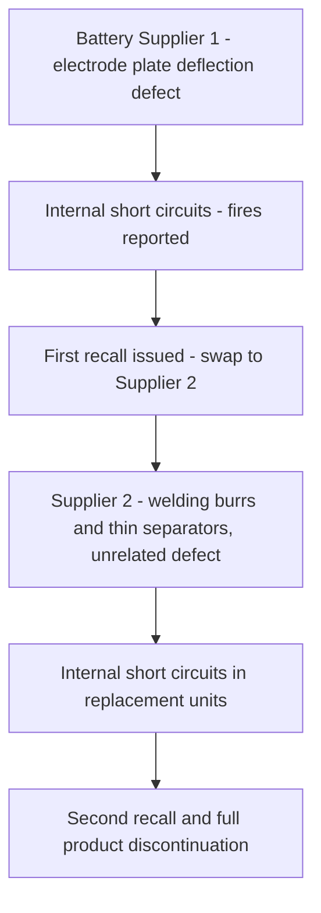
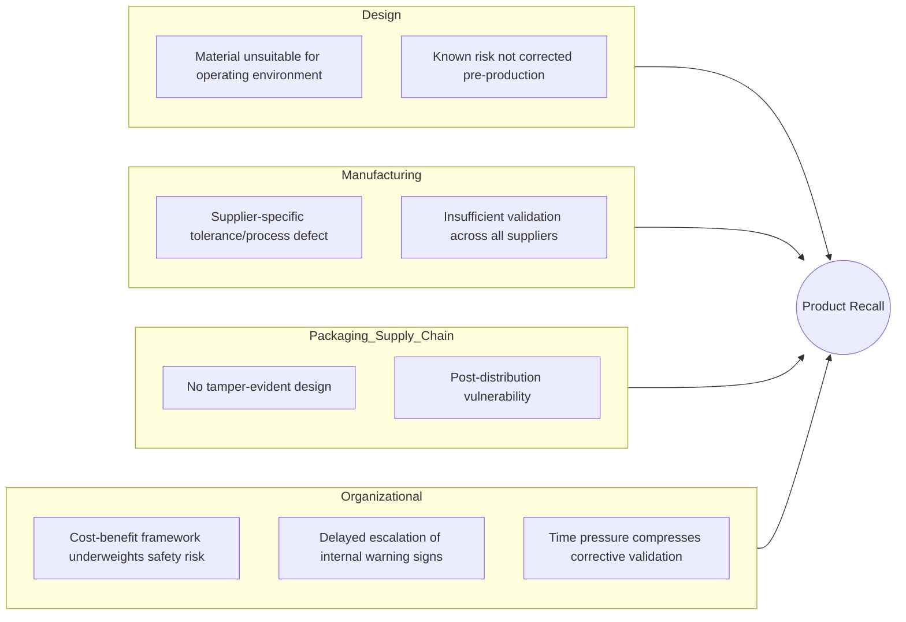

## Notable Product Recall Root Causes

### Overview

Product recalls occur when a manufacturer or regulator determines that a product in the market poses a safety, quality, or compliance risk requiring correction, replacement, or removal. As an RCA case category, product recalls are especially instructive because they span the full range of root cause types seen elsewhere in this chapter—design flaws (Challenger, Chernobyl), manufacturing/process deviations (Bhopal), and organizational/decision-making failures (all four)—but applied specifically to consumer and industrial products, where the causal chain must also account for supply chain, quality assurance, and regulatory reporting failures.

### Common Anatomy of a Product Recall RCA

**Key Points**

- **Trigger event**: The failure mode that becomes visible (injury reports, field failures, internal test discovery, regulatory inspection)
- **Failure mode**: The specific mechanism of the defect (mechanical, chemical, electrical, software, contamination)
- **Origin point**: Where in the lifecycle the root cause was introduced (design, materials sourcing, manufacturing process, assembly, packaging, or in-field degradation)
- **Detection gap**: Why internal quality assurance or testing did not catch the defect before release
- **Escalation/reporting timeline**: Time between first internal awareness and public recall, often a focus of regulatory scrutiny in its own right
- **Systemic/organizational factors**: Cost pressures, supplier oversight gaps, or internal risk-communication failures that allowed the defect to reach market or persist after early warning signs

### Case Study: Takata Airbag Inflator Recall

**Key Points**

- One of the largest automotive recalls in history, ultimately affecting tens of millions of vehicles across numerous manufacturers worldwide
- The failure mode: airbag inflators could rupture during deployment, sending metal shrapnel into the vehicle cabin, causing injuries and deaths
- Root cause traced to the use of **ammonium nitrate** as the propellant in the inflator, a chemical compound highly sensitive to temperature and humidity fluctuations over time
- Prolonged exposure to heat and moisture cycling caused the propellant to degrade structurally, leading to unpredictable, overly aggressive combustion during deployment that could rupture the inflator's metal housing
- Investigations found Takata had internal knowledge of test data irregularities for years before the defect was fully disclosed to regulators, contributing to a significantly delayed recall response [Inference: characterizations of "internal knowledge" and delayed disclosure reflect findings from U.S. NHTSA and Department of Justice investigations; the precise internal decision-making timeline involves some disputed detail across parties]

**5 Whys Applied**

1. **Why did airbags injure occupants instead of protecting them?**

   Because inflators ruptured during deployment, expelling metal fragments.
2. **Why did inflators rupture?**

   Because the ammonium nitrate propellant degraded over time due to heat and humidity exposure, causing unpredictable overly aggressive combustion.
3. **Why was a moisture/temperature-sensitive propellant used in a component expected to function reliably for the vehicle's operational lifetime?**

   Because ammonium nitrate was selected for cost and performance characteristics without sufficiently accounting for long-term environmental degradation across the full range of climates and vehicle ages in the field.
4. **Why wasn't this degradation risk identified before widespread deployment?**

   Because internal testing and quality assurance processes did not adequately validate long-term propellant stability under real-world environmental cycling, and subsequent investigations found evidence that anomalous test results were not appropriately escalated.
5. **Why did the organization not escalate and act on early warning signs?**

   Because of organizational incentives and internal culture that prioritized cost and production continuity, delaying full risk disclosure to regulators and manufacturers—a systemic root cause pattern (early warning signs suppressed or normalized) directly analogous to the "normalization of deviance" seen in the Challenger case.

### Case Study: Ford Pinto Fuel Tank Recall

**Key Points**

- The Ford Pinto (1970s) had a fuel tank design positioned in a way that made it vulnerable to rupture and fire in rear-end collisions, due to insufficient structural buffer between the tank and the rear bumper/axle assembly
- The case became a landmark example in engineering ethics because internal Ford cost-benefit analysis reportedly weighed the cost of a design fix against estimated costs of anticipated injury/fatality litigation, a comparison that became central to public and legal criticism of the decision-making process [Inference: the precise interpretation and internal use of this analysis has been debated by historians and legal scholars; the existence of the analysis itself is well documented, but characterizations of intent vary]
- Root cause synthesis: a known design vulnerability was identified prior to widespread production, but organizational cost-benefit decision processes did not weight safety risk in a manner that triggered a design change before significant units were sold
- This case remains a foundational example in engineering ethics curricula for illustrating how a purely proximate technical cause (fuel tank placement) sits atop a deeper root cause in organizational risk-decision frameworks

### Case Study: Samsung Galaxy Note 7 Battery Recall

**Key Points**

- In 2016, Samsung recalled the Galaxy Note 7 smartphone globally after numerous reports of batteries overheating, catching fire, or exploding
- Samsung's own investigation identified **two independent battery defects** from two different suppliers used across the production run
- The first-supplier battery had a design flaw causing the negative electrode plate to be deflected, leading to a short circuit
- After the initial recall and battery swap to a second supplier, a *second, unrelated* manufacturing defect (welding burrs and thin separators causing internal short circuits) caused continued fires in replacement units, forcing a second, complete recall and discontinuation of the product line
- Root cause synthesis: This case is notable in RCA training for illustrating the danger of **assuming a single root cause fully explains a failure pattern**—the initial corrective action (supplier swap) addressed only the first identified defect, while an independent second defect in the replacement supply chain was not caught before re-release, prolonging and compounding the recall
- Samsung's response included establishing an 8-point battery safety check process and third-party battery advisory group as remediation

**5 Whys Applied (First Defect)**

1. **Why did the phones catch fire?**

   Because batteries experienced internal short circuits.
2. **Why did short circuits occur?**

   Because the negative electrode plate in the first-supplier battery was deflected due to a design/manufacturing tolerance issue, contacting other components.
3. **Why wasn't this caught before release?**

   Because pre-release quality testing did not detect the tolerance issue under real-world charge/discharge and physical stress conditions.
4. **Why did the corrective action (supplier swap) not fully resolve the problem?**

   Because the root cause investigation focused on the specific first-supplier defect rather than validating the entire battery supply chain and manufacturing process across all suppliers with equivalent rigor.
5. **Why was validation not equally rigorous across the replacement supply chain?**

   Because of time pressure to resolve the recall and resume production quickly, which compressed the validation cycle for the second supplier's batteries. [Inference: this specific causal link between recall time pressure and reduced second-supplier validation rigor is a reasonable synthesis consistent with the sequence of events and industry commentary, though not necessarily stated in those exact terms in Samsung's own public root cause summary.]

**Causal Chain Diagram**

### Case Study: Johnson & Johnson Tylenol Tampering Incident (1982)

**Key Points**

- Distinct from a design or manufacturing defect: this case involved external, malicious tampering—cyanide-laced capsules inserted into bottles after retail distribution—rather than a fault originating within the manufacturing process
- Included here because it is a foundational case in recall response RCA and crisis management, illustrating root cause analysis applied to **supply chain and packaging vulnerability** rather than product defect
- Root cause: the packaging design at the time provided no tamper-evident feature, meaning a bottle could be opened, adulterated, and resealed without any visible indication to a consumer or retailer
- Johnson & Johnson's response—a full nationwide recall (approximately 31 million bottles) despite the tampering being geographically isolated, followed by rapid development and industry-wide adoption of tamper-evident and tamper-resistant packaging—is frequently cited as a model corrective action, addressing the systemic root cause (lack of tamper-evidence) rather than only the immediate incident

### Cross-Case Root Cause Synthesis

| Category | Example Case | Root Cause Pattern |
| --- | --- | --- |
| Material/Chemical Degradation | Takata airbags | Component material unsuitable for long-term environmental exposure |
| Design Trade-off Under Cost Pressure | Ford Pinto | Known design risk not corrected due to cost-benefit decision framework |
| Multi-Source Manufacturing Defect | Samsung Note 7 | Independent defects across different suppliers; corrective action addressed only first-identified cause |
| Packaging/Supply Chain Vulnerability | Tylenol tampering | No tamper-evidence in packaging design, enabling post-distribution adulteration |
| Detection/Escalation Delay | Takata, and common across many recalls | Internal awareness of anomalies not escalated or acted upon promptly |

### Contributing Factor Diagram (Fishbone-Style Summary)

### Common Remediation Patterns Across Recall Postmortems

**Key Points**

- **Root-and-branch supply chain validation**: extending corrective action investigation across all suppliers/components of a similar type, not only the specifically implicated one (a direct lesson from the Samsung case)
- **Environmental/lifecycle stress testing**: validating components under long-term, real-world environmental cycling rather than only initial-condition testing (a direct lesson from the Takata case)
- **Tamper-evident and fail-safe packaging/design standards**: adopted industry-wide following the Tylenol case
- **Formal internal escalation protocols**: ensuring anomalous test or field data is escalated to a level with authority to trigger a recall, independent of production schedule or cost pressure
- **Third-party or independent safety review boards**: instituted by multiple companies (e.g., Samsung's post-Note 7 battery advisory group) to reduce reliance on internal-only risk assessment

### Why This Case Category Is Significant for RCA Methodology

**Key Points**

- Demonstrates that **corrective actions must be validated against the full causal scope of a defect**, not just the specific instance first identified—the Samsung case is a clear warning against premature RCA closure
- Reinforces the recurring cross-case theme from this chapter: **cost-benefit and schedule pressure repeatedly appear as a root-level systemic cause**, whether in aerospace (Challenger), industrial chemical plants (Bhopal), or consumer products (Pinto, Takata)
- Illustrates that root cause analysis must sometimes address **non-defect vulnerabilities** (the Tylenol case), where the "root cause" is an absence of a protective design feature rather than a positive engineering error
- Shows the importance of **escalation culture and internal whistleblowing pathways**, since in multiple major recalls, internal data suggesting a problem existed before the defect became public
- Highlights those recalls as a domain where RCA intersects directly with **regulatory reporting obligations**, since delayed escalation is often independently investigated and penalized as its own systemic failure, separate from the original technical defect

### Related Topics

- Space Shuttle Challenger disaster investigation (comparative organizational RCA case)
- Bhopal gas tragedy root cause findings (comparative industrial/manufacturing RCA case)
- Major public cloud and software outage postmortems (comparative modern systemic RCA case)
- Failure Mode and Effects Analysis (FMEA) in product design
- Supply chain quality assurance and supplier auditing frameworks
- Engineering ethics and cost-benefit analysis in safety decisions
- Crisis management and corrective action communication strategies
- Regulatory recall reporting requirements (e.g., NHTSA, CPSC frameworks)